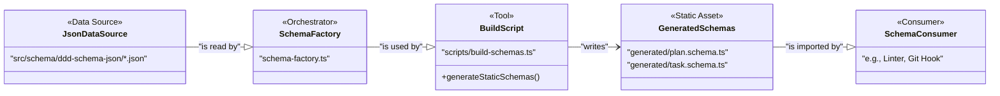
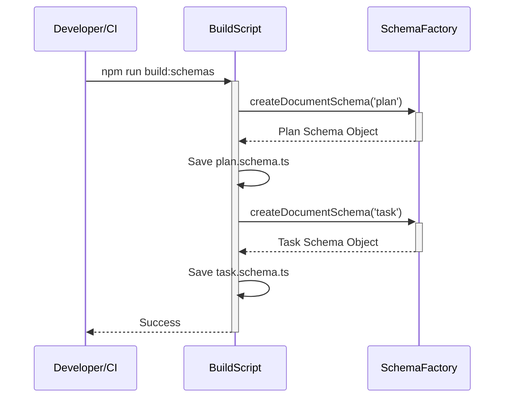
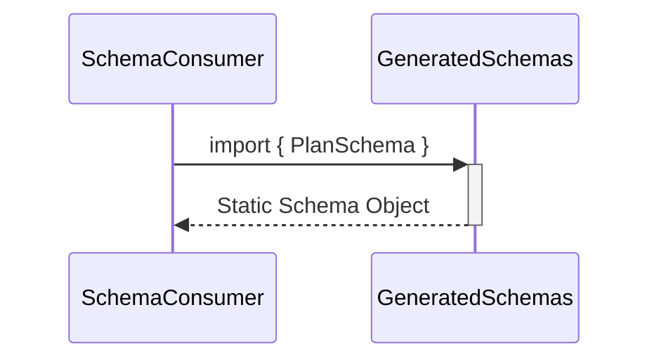

# T33: Statically Generate Composed Schemas for Performance

## 1 Meta & Governance

### 1.2 Status

- **Current State:** 💡 Not Started
- **Priority:** 🟧 Medium
- **Progress:** 0%
- **Planning Estimate:** 5
- **Est. Variance (pts):** 0
- **Created:** 2025-08-05 08:30
- **Implementation Started:**
- **Completed:**
- **Last Updated:** 2025-08-05 08:30

### 1.3 Priority Drivers

- [TEC-Dev_Productivity_Enhancement](../ddd-2.md#tec-dev_productivity_enhancement)
- [PERF-01](./p1-p6.t32-define-section-content-schemas.task.md#4.4.1-performance)

---

## 2 Business & Scope

### 2.1 Overview

- **Core Function**: This task is to implement a build-time schema generation process to improve the performance of schema validation.
- **Key Capability**: It will create a script (`npm run build:schemas`) that uses the existing `SchemaFactory` to generate static `plan.schema.ts` and `task.schema.ts` files. Consumers will import these static files instead of generating them at runtime.
- **Business Value**: Drastically improves the startup performance of tools that consume the validation schemas (e.g., linters, git-hooks), providing a faster developer experience without sacrificing the correctness of the schemas.

### 2.4 Definition of Done

| ID    | Criterion                                                                                                                              |
| :---- | :------------------------------------------------------------------------------------------------------------------------------------- |
| DoD-1 | An `npm run build:schemas` script exists and correctly generates `plan.schema.ts` and `task.schema.ts` to a `generated` directory.     |
| DoD-2 | A "watch" mode is implemented that automatically re-runs the build script when `ddd-schema-json` files are changed.                    |
| DoD-3 | A CI check is in place that fails the build if the generated schemas are not up-to-date with the latest `ddd-schema-json` definitions. |
| DoD-4 | All consumers of the schemas (linters, tests, etc.) are updated to import the statically generated files.                              |

---

## 3 Planning & Decomposition

### 3.3 Dependencies

| ID  | Dependency On                                                                             | Type     | Status         | Notes                                                              |
| :-- | :---------------------------------------------------------------------------------------- | :------- | :------------- | :----------------------------------------------------------------- |
| D-1 | [T32: Define Section Content Schemas](./p1-p6.t32-define-section-content-schemas.task.md) | Internal | ⏳ In Progress | This task depends on the completion of the dynamic schema factory. |

---

## 4 High-Level Design

### 4.2 Target Architecture

#### 4.2.2 Components

This task introduces a build process around the existing schema factory.

#### 4.2.4 Control Flow

The control flow is split between a manual/CI build step and a runtime import.

**Build-Time Flow**

**Run-Time Flow**

---

## 6 Implementation Guidance

### 6.1 Implementation Log / Steps

- [ ] Create a new script `scripts/build-schemas.ts`.
- [ ] The script should import the `createPlanSchema` and `createTaskSchema` functions from the `SchemaFactory`.
- [ ] It should call these functions and serialize the resulting Zod schema objects into TypeScript files (`generated/plan.schema.ts` and `generated/task.schema.ts`).
- [ ] Add a new `build:schemas` script to `package.json`.
- [ ] Implement a "watch" mode (e.g., using `chokidar`) that re-runs the build script on changes to `src/schema/ddd-schema-json/`.
- [ ] Add a CI step to run the build script and check for uncommitted changes.
- [ ] Update all internal consumers to import from the new `generated/` directory.
