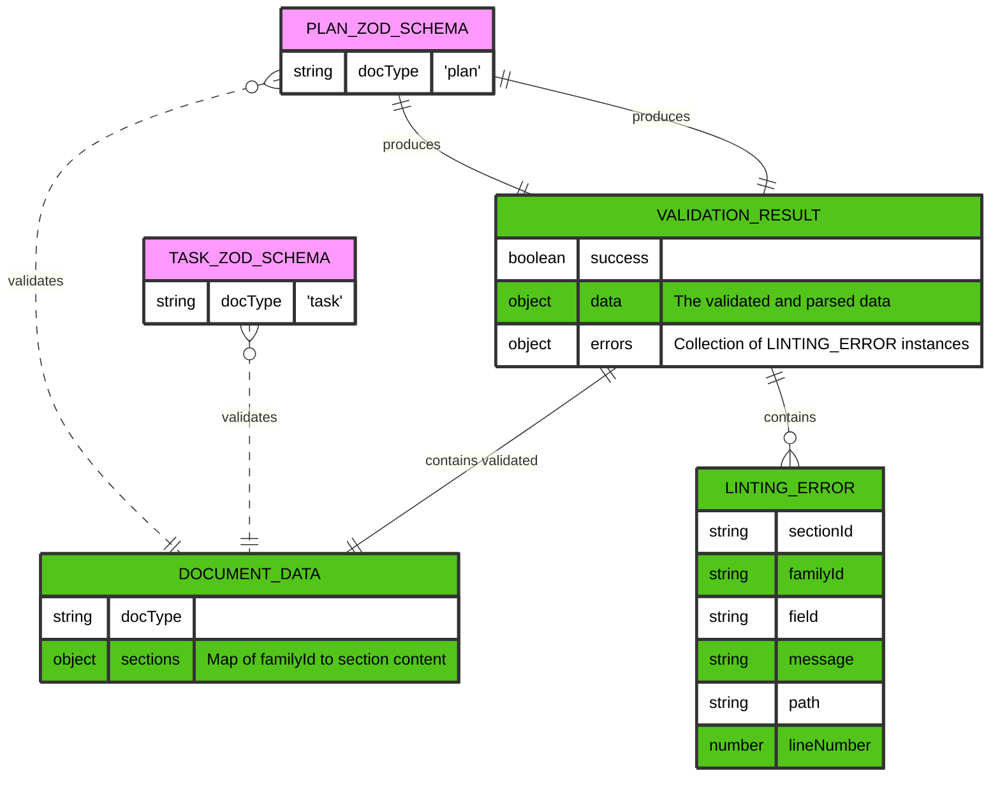
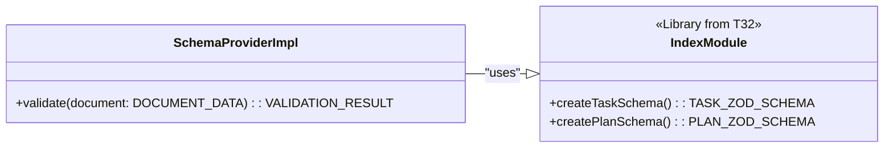
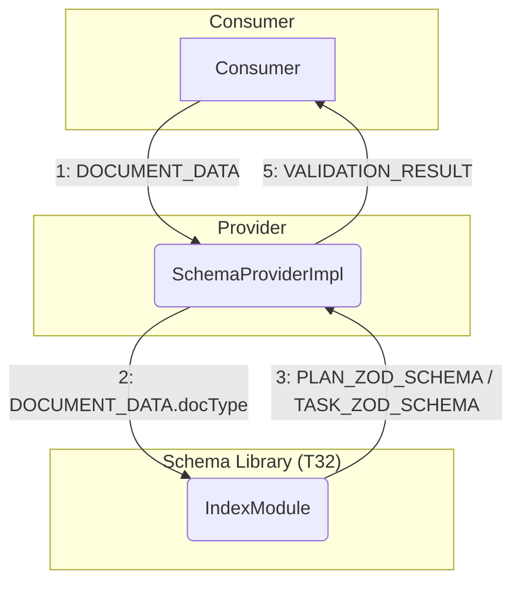
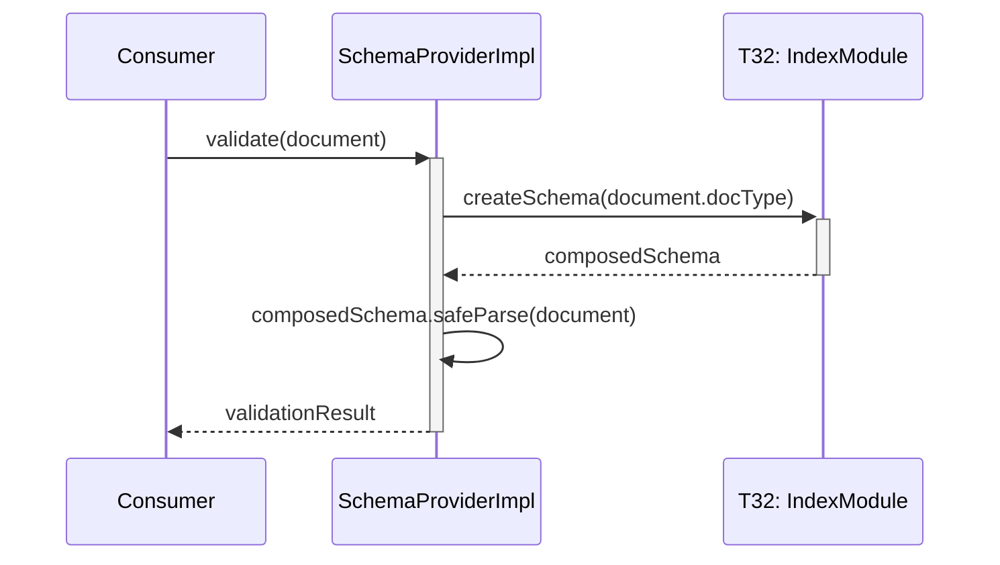

# T34: Schema Provider Implementation

## 1 Meta & Governance

### 1.2 Status

- **Current State:** 💡 Not Started
- **Priority:** 🟥 High
- **Progress:** 0%
- **Planning Estimate:** 10
- **Est. Variance (pts):** 0
- **Created:** 2025-08-09 10:00
- **Implementation Started:**
- **Completed:**
- **Last Updated:** 2025-08-09 10:00

### 1.3 Priority Drivers

- [TEC-Prod_Stability_Blocker](../ddd-2.md#tec-prod_stability_blocker)
- [TEC-Dev_Productivity_Enhancement](../ddd-2.md#tec-dev_productivity_enhancement)

---

## 2 Business & Scope

### 2.1 Overview

- **Core Function**: A single service that checks whether Plan/Task documents follow the agreed documentation rules.
- **Key Capability**: Takes a document's sections and tells whether they are valid. If not, it clearly lists what is wrong and where to fix it.
- **Business Value**: Prevents malformed documentation from slipping through reviews or CI, reduces rework, and ensures downstream tools can rely on consistent, well-structured documents.

### 2.4 Definition of Done

| ID    | Criterion                                                                                                           |
| :---- | :------------------------------------------------------------------------------------------------------------------ |
| DoD-1 | A single validation service is available to check whether any Plan/Task document follows the documentation rules.   |
| DoD-2 | For a correct document, the service confirms validity without errors.                                               |
| DoD-3 | For an incorrect document, the service returns a clear, actionable list of issues indicating what and where to fix. |
| DoD-4 | The service works for both document types (Plans and Tasks).                                                        |
| DoD-5 | The service’s results are easy to consume in tools and CI (simple pass/fail plus human-readable messages).          |
| DoD-6 | The service operates safely and avoids exposing sensitive content in its messages by default.                       |

---

## 3 Planning & Decomposition

### 3.3 Dependencies

| ID  | Dependency On                                                                             | Type     | Status         | Notes                                                         |
| :-- | :---------------------------------------------------------------------------------------- | :------- | :------------- | :------------------------------------------------------------ |
| D-1 | [T32: Define Section Content Schemas](./p1-p6.t32-define-section-content-schemas.task.md) | Internal | ⏳ In Progress | Provider composes the family/section schemas produced by T32. |

---

## 4 High-Level Design

### 4.2 Target Architecture

#### 4.2.1 Data Models

This task focuses on the `SchemaProvider`'s role. The provider receives parsed document content, transforms it into a structured `DOCUMENT_DATA` object, and then validates this object against the appropriate schema (`PLAN_ZOD_SCHEMA` or `TASK_ZOD_SCHEMA`) to produce a `VALIDATION_RESULT`.



#### 4.2.2 Components

The `SchemaProviderImpl` acts as a facade, simplifying the process of schema validation. It consumes the schema factory functions exposed by the `IndexModule` (from T32) to get the correct validator for a given document type.



#### 4.2.3 Data Flow

The consumer provides `DOCUMENT_DATA` to the `SchemaProvider`. The provider uses the `docType` to request the appropriate schema (`PLAN_ZOD_SCHEMA` or `TASK_ZOD_SCHEMA`) from the `IndexModule`. It then uses this schema to validate the data and returns a `VALIDATION_RESULT`.



#### 4.2.4 Control Flow

The consumer initiates validation by passing the document data to the `SchemaProvider`. The provider then calls the appropriate factory function on the `IndexModule` to get the composed schema, performs the validation, and returns the result.



### 4.3 Tech Stack & Deployment

- **Language**: TypeScript
- **Schema Validation**: Zod
- **Testing**: Vitest
- **Deployment**: Part of `@livelifelively/ddd-tools` internal package under `src/doc-parser/validation/`.

### 4.4 Non-Functional Requirements

#### 4.4.1 Performance

| ID      | Requirement                                                                        | Priority  |
| :------ | :--------------------------------------------------------------------------------- | :-------- |
| PERF-01 | Provider validation must process a typical DOCUMENT_DATA payload in < 50ms.        | 🟧 Medium |
| PERF-02 | DOCUMENT_SCHEMA composition from SectionContentZodSchemas must complete in < 10ms. | 🟨 Low    |

#### 4.4.2 Security

| ID     | Requirement                                                                                    | Priority  |
| :----- | :--------------------------------------------------------------------------------------------- | :-------- |
| SEC-01 | Provider must not execute any untrusted user code while processing DOCUMENT_DATA.              | 🟥 High   |
| SEC-02 | LINTING_ERROR messages must avoid leaking sensitive raw content from DOCUMENT_DATA by default. | 🟧 Medium |

#### 4.4.3 Reliability

| ID     | Requirement                                                                   | Priority |
| :----- | :---------------------------------------------------------------------------- | :------- |
| REL-01 | Provider output strictly adheres to the VALIDATION_RESULT contract.           | 🟥 High  |
| REL-02 | DOCUMENT_SCHEMA composition must be deterministic for the same docType input. | 🟥 High  |

---

## 5 Maintenance and Monitoring

### 5.2 Target Maintenance and Monitoring

#### 5.2.1 Error Handling

| Error Type                      | Trigger                                               | Action                                      | Consumer Feedback                                       |
| :------------------------------ | :---------------------------------------------------- | :------------------------------------------ | :------------------------------------------------------ |
| **DOCUMENT_SCHEMA Composition** | SectionContentZodSchemas fails to compose for docType | Return VALIDATION_RESULT with success=false | LINTING_ERROR with clear missing schema family details  |
| **DOCUMENT_DATA Validation**    | DOCUMENT_SCHEMA.safeParse() fails on DOCUMENT_DATA    | Map ZodIssue to LINTING_ERROR[]             | VALIDATION_RESULT with structured LINTING_ERROR details |
| **Schema Provider Contract**    | Invalid input parameters (null/undefined sections)    | Return VALIDATION_RESULT with success=false | LINTING_ERROR with parameter validation message         |

#### 5.2.2 Logging & Monitoring

- Not applicable (library). Consumers handle logging/monitoring.

---

## 6 Implementation Guidance

### 6.1 Implementation Log / Steps

- [ ] Implement `createSchemaProvider()` in `src/doc-parser/validation/`.
- [ ] Define `ValidationResult` and `ValidationContext` types colocated with provider.
- [ ] Compose schemas via existing family factories from T32.
- [ ] Implement mapping from Zod issues to `LintingError[]` with section paths.
- [ ] Add unit tests for provider API (success/failure).
- [ ] Add integration test validating a realistic `Section[]` payload.

---

## 7 Quality & Operations

### 7.1 Testing Strategy / Requirements

| AC ID | DoD Link | Scenario                                                           | Test Type   | Test File                                       |
| :---- | :------- | :----------------------------------------------------------------- | :---------- | :---------------------------------------------- |
| AC-1  | DoD-1    | Provider exposes `getDocumentSchema` and `validate`                | Unit        | `__tests__/schema-provider.test.ts`             |
| AC-2  | DoD-3    | Valid task Section[] validates successfully via provider           | Integration | `__tests__/schema-provider.integration.test.ts` |
| AC-3  | DoD-4    | Invalid fields map to `LintingError[]` with correct paths/messages | Unit        | `__tests__/schema-provider.test.ts`             |
| AC-4  | DoD-6    | No tight coupling to parser internals (types-only)                 | Unit        | `__tests__/schema-provider.test.ts`             |

### 7.2 Configuration

- None. Provider is a pure library component.

### 7.3 Alerting & Response

- Not applicable.

### 7.5 Local Test Commands

```bash
npm test -- src/doc-parser/validation/__tests__/
```

---

## 8 Reference

### 8.1 Appendices/Glossary

- **Schema Provider**: A thin layer that composes Zod schemas and exposes a validation API returning standardized results.
