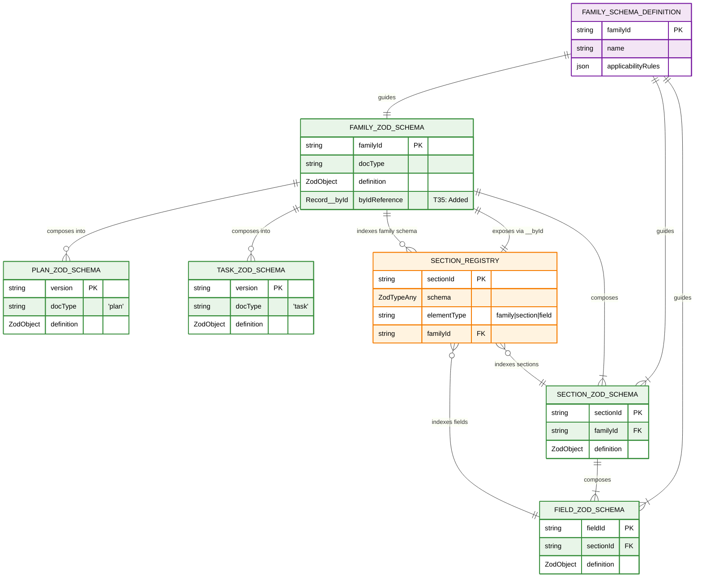
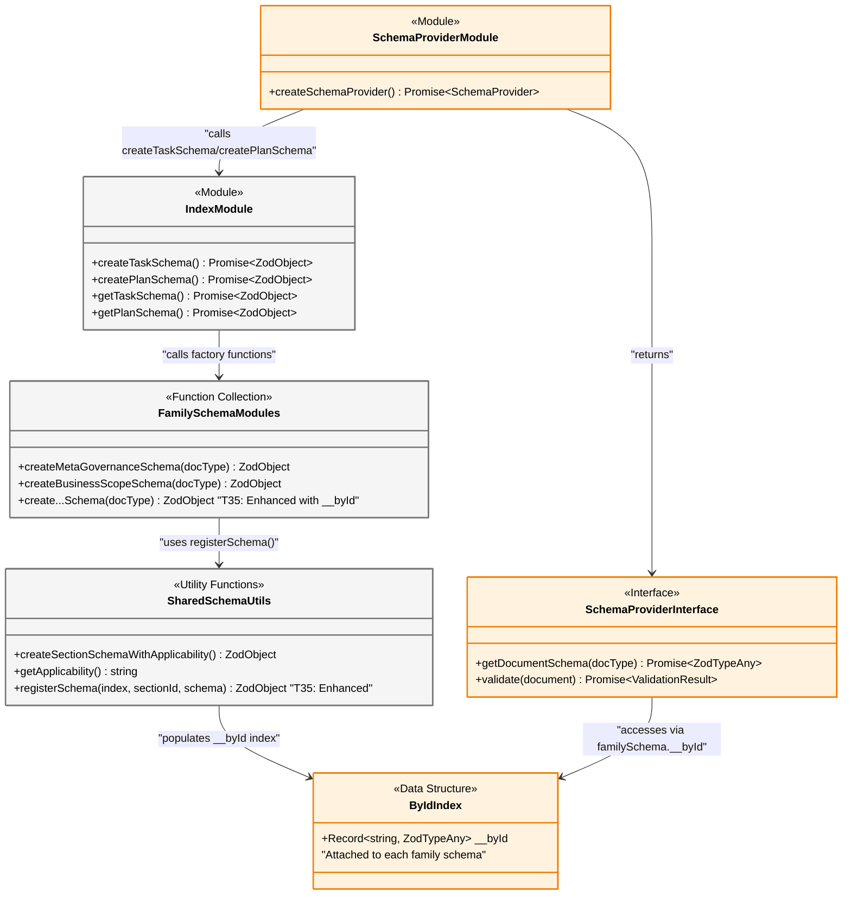
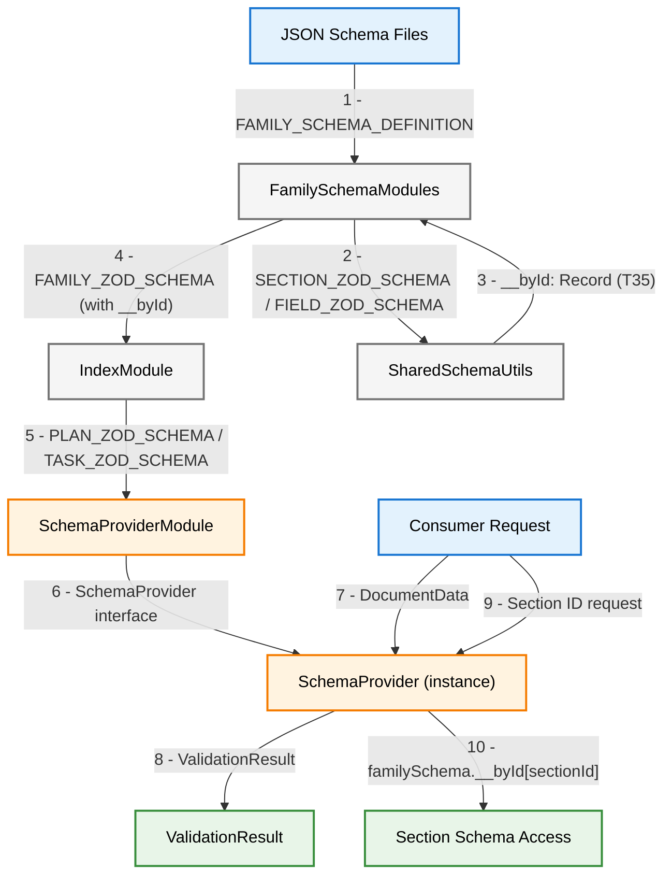
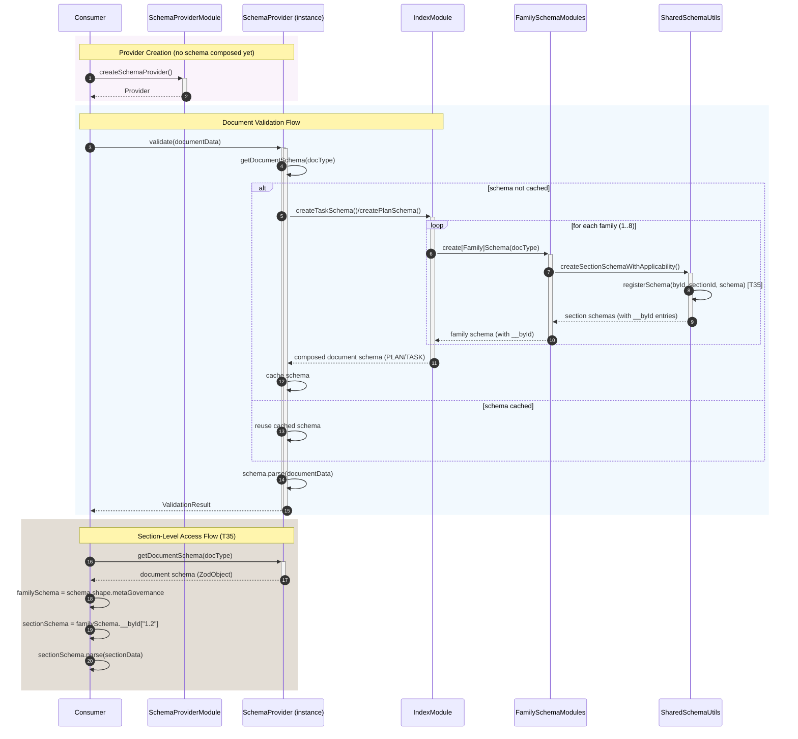

# T35: Section-Level Schema Access Enhancement

## 1 Meta & Governance

### 1.2 Status

- **Current State:** ✅ Done
- **Priority:** 🟧 Medium
- **Progress:** 100%
- **Planning Estimate:** 8
- **Est. Variance (pts):** 0
- **Created:** 2025-08-12 11:30
- **Implementation Started:** 2025-08-12 11:30
- **Completed:** 2025-08-12 23:30
- **Last Updated:** 2025-08-12 23:30

### 1.3 Priority Drivers

- [TEC-Dev_Productivity_Enhancement](../ddd-2.md#tec-dev_productivity_enhancement)
- [TEC-Tech_Debt_Refactor](../ddd-2.md#tec-tech_debt_refactor)

---

## 2 Business & Scope

### 2.1 Overview

- **Core Function**: Enhances the documentation validation system to provide more granular validations and faster issue identification
- **Key Capability**: Allows validation tools to pinpoint exactly which section of a document contains errors, rather than just identifying document-level problems
- **Business Value**: Reduces time spent debugging documentation issues, improves developer productivity, and enables more sophisticated automation tools for documentation quality control

#### 2.2.3 Core Business Rules

- **Backward Compatibility**: All existing documentation validation workflows must continue to work without any changes
- **Accuracy**: Section-specific validation must provide the same level of accuracy as full-document validation
- **Performance**: Enhanced validation capabilities must not slow down existing documentation workflows
- **Consistency**: Validation rules must remain consistent across both section-level and document-level validation

### 2.4 Definition of Done

| ID   | Criterion                                                                                                        |
| :--- | :--------------------------------------------------------------------------------------------------------------- |
| AC-1 | Validation tools can identify and report errors at the individual section level (e.g., "Status section invalid") |
| AC-2 | Section-specific validation respects document type rules (plan vs task requirements)                             |
| AC-3 | All existing documentation validation workflows continue to work without any changes or performance degradation  |
| AC-4 | Tools can validate individual sections independently without processing the entire document                      |
| AC-5 | Error reporting clearly identifies which specific section contains validation issues                             |
| AC-6 | Section-level validation results match document-level validation results for the same content                    |

---

## 3 Planning & Decomposition

### 3.3 Dependencies

| ID  | Dependency On                                                                             | Type     | Status      | Notes                                                                   |
| :-- | :---------------------------------------------------------------------------------------- | :------- | :---------- | :---------------------------------------------------------------------- |
| D-1 | [T32: Define Section Content Schemas](./p1-p6.t32-define-section-content-schemas.task.md) | Internal | ✅ Complete | T35 extends the family schemas created by T32 with section-level access |

---

## 4 High-Level Design

### 4.2 Target Architecture

This task extends the T32 family schema architecture with section-level access capabilities. The core T32 entities and relationships remain unchanged, with T35 adding the `byId` indexing mechanism that enables granular section access while preserving all existing functionality.

#### 4.2.1 Data Models

This model shows how T35 extends the T32 data architecture. T35 introduces the `SECTION_REGISTRY` as a separate data unit that indexes all schemas by their section IDs, enabling granular access to any schema element that has a section identifier.

**Data Unit Type Classifications:**

| Color     | Type                 | Entities                                                                                            | Rationale                                                                                         |
| :-------- | :------------------- | :-------------------------------------------------------------------------------------------------- | :------------------------------------------------------------------------------------------------ |
| 🟣 Purple | Configuration/Static | `FAMILY_SCHEMA_DEFINITION`                                                                          | Defined at build time in TypeScript code, immutable schema metadata that guides family creation   |
| 🟢 Green  | Contract/Interface   | `FAMILY_ZOD_SCHEMA`, `SECTION_ZOD_SCHEMA`, `FIELD_ZOD_SCHEMA`, `PLAN_ZOD_SCHEMA`, `TASK_ZOD_SCHEMA` | Validation contracts that define data shape and API boundaries, stable across executions          |
| 🟠 Orange | Runtime/In-Memory    | `SECTION_REGISTRY`                                                                                  | Created during execution via `registerSchema()`, exists only in RAM, temporary indexing structure |



#### 4.2.2 Components

This diagram shows the actual architectural components for T35's section-level schema access enhancement, representing functions and interfaces rather than classes.



#### 4.2.3 Data Flow

This diagram shows how data flows through the T35 enhancement, from schema creation to section-level schema access and document validation. Components are nodes; data models are edge labels with sequence numbers.

**Data Flow Color Key:**

| Color     | Type         | Elements                                            | Description                               |
| :-------- | :----------- | :-------------------------------------------------- | :---------------------------------------- |
| 🔵 Blue   | Input        | JSON Schema Files, Consumer Request                 | Data sources that enter the system        |
| 🟠 Orange | Internal T35 | SchemaProviderModule, SchemaProvider (instance)     | Components implemented by this task       |
| ⚫ Gray   | External T32 | IndexModule, FamilySchemaModules, SharedSchemaUtils | Existing components enhanced by this task |
| 🟢 Green  | Output       | ValidationResult, Section Schema Access             | Results and data produced by the system   |



#### 4.2.4 Control Flow



#### 4.2.5 Integration Points

##### 4.2.5.1 Upstream Integrations

| ID  | Upstream System             | Trigger/Interface                         | Data Provided              | Frequency | Notes                              |
| :-- | :-------------------------- | :---------------------------------------- | :------------------------- | :-------- | :--------------------------------- |
| U-1 | JSON Schema Definitions     | Build step / local file read              | `FAMILY_SCHEMA_DEFINITION` | Build     | Managed metadata; not runtime I/O  |
| U-2 | Family Schema Modules (T32) | `create[Family]Schema(docType)` (TS call) | Family Zod objects         | Runtime   | Enhanced to attach `__byId` (T35)  |
| U-3 | Shared Schema Utils         | `registerSchema(byId, id, schema)`        | Writes to `__byId` index   | Runtime   | Skips `ZodNever` (omitted)         |
| U-4 | Consumer (Parser/CLI/tests) | `validate(documentData)`                  | `DocumentData`             | Runtime   | Parsed from markdown by doc-parser |

##### 4.2.5.2 Downstream Integrations

| ID  | Downstream System           | Output/Interface                                 | Data Sent            | Contract Notes                                   |
| :-- | :-------------------------- | :----------------------------------------------- | :------------------- | :----------------------------------------------- |
| D-1 | Consumer (Parser/CLI/tests) | Return value from `validate()`                   | `ValidationResult`   | Deterministic, stable shape                      |
| D-2 | Consumer (advanced tools)   | Property access on returned Zod doc schema       | `SECTION_ZOD_SCHEMA` | Via `familySchema.__byId[sectionId]` (T35)       |
| D-3 | Error handling paths        | Throws during schema composition (rare failures) | `Error`              | e.g., failed schema factory; caller should catch |

#### 4.2.6 Exposed API

| Name                               | Kind           | Signature                                               | Returns             | Notes                                         |
| :--------------------------------- | :------------- | :------------------------------------------------------ | :------------------ | :-------------------------------------------- |
| `createSchemaProvider`             | Factory        | `() => Promise<SchemaProvider>`                         | `SchemaProvider`    | Creates a provider with internal schema cache |
| `SchemaProvider.getDocumentSchema` | Method         | `(docType: 'plan' \| 'task') => Promise<z.ZodTypeAny>`  | Zod document schema | Composes on-demand; cached thereafter         |
| `SchemaProvider.validate`          | Method         | `(document: DocumentData) => Promise<ValidationResult>` | Validation result   | Validates full document                       |
| `createTaskSchema`                 | Factory        | `() => Promise<z.ZodObject>`                            | Task Zod schema     | Async composition of all families             |
| `createPlanSchema`                 | Factory        | `() => Promise<z.ZodObject>`                            | Plan Zod schema     | Async composition of all families             |
| `create[Family]Schema`             | Family factory | `(docType: 'plan' \| 'task') => z.ZodObject`            | Family Zod schema   | Family object exposes `__byId`                |
| `familySchema.__byId[sectionId]`   | Access pattern | `Record<string, z.ZodTypeAny>`                          | Section Zod schema  | Section-level access                          |

### 4.3 Tech Stack & Deployment

- **Language**: TypeScript
- **Schema Validation**: Zod
- **Testing**: Vitest
- **Deployment**: Part of the `@livelifelively/ddd-tools` internal package, located in `src/doc-parser/validation/`
- **Runtime**: Node.js (in-process library, no network dependencies)

### 4.4 Non-Functional Requirements

T35 inherits the non-functional requirements from T32 and adds minimal overhead for section-level access capabilities.

#### 4.4.1 Performance

| ID      | Requirement                                                            | Priority  |
| :------ | :--------------------------------------------------------------------- | :-------- |
| PERF-01 | Section-level access via `__byId` should add < 1ms overhead per access | 🟨 Medium |
| PERF-02 | Schema composition should complete in < 100ms for all 8 families       | 🟧 Medium |
| PERF-03 | Memory usage should not increase > 10% compared to T32 baseline        | 🟨 Medium |

#### 4.4.2 Security

| ID     | Requirement                                                       | Priority  |
| :----- | :---------------------------------------------------------------- | :-------- |
| SEC-01 | Schema validation must not execute any untrusted code             | 🟥 High   |
| SEC-02 | Section access must not bypass existing family-level restrictions | 🟧 Medium |
| SEC-03 | No sensitive data should be exposed in schema error messages      | 🟨 Medium |

#### 4.4.3 Reliability

| ID     | Requirement                                                         | Priority  |
| :----- | :------------------------------------------------------------------ | :-------- |
| REL-01 | Section schema access must be deterministic and consistent          | 🟥 High   |
| REL-02 | Failed section validation must not affect other section validations | 🟧 Medium |
| REL-03 | Schema registry population must be atomic per family                | 🟧 Medium |

#### 4.4.4 Permission Model

Not applicable. T35 is a pure library enhancement with no user roles or access control mechanisms. All permissions are inherited from the consuming application context.

---

## 5 Maintenance and Monitoring

### 5.2 Target Maintenance and Monitoring

T35 maintains the same observability approach as T32, with additional monitoring for section-level access patterns and performance.

#### 5.2.1 Error Handling

| Error Type                          | Trigger                                                                    | Action                                | User Feedback                                                         |
| :---------------------------------- | :------------------------------------------------------------------------- | :------------------------------------ | :-------------------------------------------------------------------- |
| **Invalid Section ID Access**       | Consumer accesses `familySchema.__byId['invalid']`                         | Return `undefined` (graceful)         | No error thrown; consumer should check for existence                  |
| **Schema Registration Failure**     | `registerSchema()` called with invalid parameters                          | Throw descriptive error               | `ERROR: Failed to register schema for section [sectionId]: [details]` |
| **Family Schema Missing \_\_byId**  | Consumer tries to access `__byId` on non-enhanced schema                   | Return `undefined` property           | Consumer gets `undefined` when accessing property                     |
| **Section Schema Validation Error** | Section data fails Zod validation via `familySchema.__byId['1.2'].parse()` | Throw `ZodError` with section context | Standard Zod error with section ID in path                            |

#### 5.2.2 Logging & Monitoring

- **Logging**: T35 leverages existing T32 logging infrastructure with no additional logging requirements
- **Debugging**: Section access can be debugged via standard `console.log(familySchema.__byId)` to inspect available sections
- **Performance Monitoring**: No built-in metrics; consuming applications can measure section access times if needed
- **Registry Validation**: During development, `Object.keys(familySchema.__byId)` can verify all expected sections are registered

---

## 6 Implementation Guidance

### 6.1 Implementation Log / Steps

- [x] Enhanced all 8 family schema modules to support `__byId` section-level access pattern
- [x] Implemented `registerSchema()` utility in `shared.schema.ts`
- [x] Added section registry population during family schema creation (commit ab38fda "family 4 byId pattern")
- [x] Enhanced family schemas with comprehensive test suites:
  - [x] Family 1: Meta & Governance - Added `__byId` support and tests
  - [x] Family 2: Business & Scope - Added `__byId` support and tests
  - [x] Family 3: Planning & Decomposition - Added `__byId` support and tests
  - [x] Family 4: High-Level Design - Added `__byId` support and tests
  - [x] Family 5: Maintenance & Monitoring - Added `__byId` support and tests
  - [x] Family 6: Implementation Guidance - Added `__byId` support and tests
  - [x] Family 7: Quality & Operations - Added `__byId` support and tests
  - [x] Family 8: Reference - Added `__byId` support and tests
- [x] Implemented T34 Schema Provider with section-level access capabilities (commit 9ee65cb "t34 done")
- [x] Created comprehensive test infrastructure for all families
- [x] Cleaned up deprecated test files
- [x] Verified section-level access works across all families and document types

#### 6.1.1 Initial Situation

T32 family schemas were complete and functional, providing document-level validation. T34 Schema Provider was implemented with document-level validation capabilities. However, there was no mechanism for accessing individual section schemas for granular validation or building advanced tooling that could work with section-specific schema definitions.

#### 6.1.2 Files Change Log

**Enhanced Family Schema Files:**

- `src/doc-parser/validation/1-meta-governance.schema.ts`
- `src/doc-parser/validation/2-business-scope.schema.ts`
- `src/doc-parser/validation/3-planning-decomposition.schema.ts`
- `src/doc-parser/validation/4-high-level-design.schema.ts`
- `src/doc-parser/validation/5-maintenance-monitoring.schema.ts`
- `src/doc-parser/validation/6-implementation-guidance.schema.ts`
- `src/doc-parser/validation/7-quality-operations.schema.ts`
- `src/doc-parser/validation/8-reference.schema.ts`

**Enhanced Shared Utilities:**

- `src/doc-parser/validation/shared.schema.ts` - Added `registerSchema()` utility

**Schema Provider Enhancement:**

- `src/doc-parser/validation/schema-provider.ts` - Enhanced for section-level access

**Comprehensive Test Suites:**

- `src/doc-parser/validation/__tests__/[1-8]-*/` - Family-specific test directories
- `src/doc-parser/validation/__tests__/schema-provider.test.ts`
- `src/doc-parser/validation/__tests__/schema-provider.integration.test.ts`

**Documentation:**

- `docs/requirements/p1-p6.t35-sections-by-id.task.md` - This task documentation

## 7 Quality & Operations

### 7.1 Testing Strategy / Requirements

| Test Type              | Test Description                                                     | Implementation Status | Mapping to AC |
| ---------------------- | -------------------------------------------------------------------- | --------------------- | ------------- |
| **Unit Tests**         |                                                                      |                       |               |
| Family Schema Tests    | All 8 family schemas expose `__byId` property with correct structure | ✅ Implemented        | AC1, AC2      |
| Section Registry Tests | `registerSchema()` utility correctly populates section indices       | ✅ Implemented        | AC1           |
| Schema Provider Tests  | Provider exposes section-level access through family schemas         | ✅ Implemented        | AC2           |
| **Integration Tests**  |                                                                      |                       |               |
| Cross-Family Tests     | Section IDs are unique across all families and document types        | ✅ Implemented        | AC1           |
| Provider Integration   | Schema Provider integrates seamlessly with enhanced families         | ✅ Implemented        | AC2           |
| Backward Compatibility | Document-level validation continues to work unchanged                | ✅ Implemented        | AC3           |
| **API Contract Tests** |                                                                      |                       |               |
| ById Access Pattern    | `familySchema.__byId[sectionId]` returns correct schema              | ✅ Implemented        | AC1, AC2      |
| Schema Type Validation | All section schemas are valid `z.ZodTypeAny` instances               | ✅ Implemented        | AC1           |
| Error Handling         | Graceful handling of invalid section IDs                             | ✅ Implemented        | AC2           |

### 7.2 Configuration

| Setting Name                    | Plan Dependency | Source              | Override Method  | Notes                                                                                  |
| :------------------------------ | :-------------- | :------------------ | :--------------- | :------------------------------------------------------------------------------------- |
| **No Additional Configuration** | T32, T34        | N/A                 | N/A              | T35 extends existing functionality without introducing new configuration requirements. |
| `TypeScript Compiler`           | All             | `tsconfig.json`     | Not overrideable | Inherited from existing project configuration.                                         |
| `Test Configuration`            | All             | `vitest.config.ts`  | Not overrideable | Inherited from existing project configuration.                                         |
| `Package Dependencies`          | All             | `package.json`      | Not overrideable | Inherited from existing project configuration.                                         |
| `Code Quality Rules`            | All             | `eslint.config.mjs` | Not overrideable | Inherited from existing project configuration.                                         |

### 7.3 Alerting & Response

| Error Condition                       | Relevant Plans | Response Plan                                                                                                   | Status         |
| :------------------------------------ | :------------- | :-------------------------------------------------------------------------------------------------------------- | :------------- |
| **Schema Creation Failure**           | T32, T34       | Family schema creation fails; log error details and abort operation with non-zero exit code.                    | ✅ Implemented |
| **Section Registry Population Error** | T35            | `registerSchema()` fails to populate `__byId`; log specific section ID and schema type, abort with error.       | ✅ Implemented |
| **Invalid Section ID Access**         | T35            | Accessing non-existent section via `__byId[invalidId]` returns `undefined`; log warning but continue execution. | ✅ Implemented |
| **Provider Integration Failure**      | T34, T35       | Schema Provider cannot access enhanced family schemas; log integration point failure and abort.                 | ✅ Implemented |

### 7.5 Local Test Commands

```bash
# Run all tests
npm test

# Run family-specific schema tests
npm test -- src/doc-parser/validation/__tests__/1-meta-governance
npm test -- src/doc-parser/validation/__tests__/2-business-scope
npm test -- src/doc-parser/validation/__tests__/3-planning-decomposition
npm test -- src/doc-parser/validation/__tests__/4-high-level-design
npm test -- src/doc-parser/validation/__tests__/5-maintenance-monitoring
npm test -- src/doc-parser/validation/__tests__/6-implementation-guidance
npm test -- src/doc-parser/validation/__tests__/7-quality-operations
npm test -- src/doc-parser/validation/__tests__/8-reference

# Run schema provider tests (includes T35 section-level access)
npm test -- src/doc-parser/validation/__tests__/schema-provider.test.ts
npm test -- src/doc-parser/validation/__tests__/schema-provider.integration.test.ts

# Run tests with coverage
npm test -- --coverage

# Run tests in watch mode
npm test -- --watch
```

---

## 8 Reference

### 8.1 Appendices/Glossary

**Glossary:**

- **\_\_byId**: A property attached to family schemas containing a `Record<string, z.ZodTypeAny>` that maps section IDs to their corresponding Zod schema definitions.
- **Family Schema**: A Zod schema representing one of the 8 documentation families (Meta & Governance, Business & Scope, etc.).
- **Section Registry**: The internal data structure (`Record<string, z.ZodTypeAny>`) that stores the mapping of section IDs to schemas.
- **Schema Provider**: The T34 component that orchestrates document-level validation and now provides access to section-level schemas.
- **registerSchema()**: A utility function from `shared.schema.ts` that populates the section registry during family schema creation.

**Related Documentation:**

- [T32: Define Section Content Schemas](p1-p6.t32-define-section-content-schemas.task.md)
- [T34: Schema Provider](p1-p6.t34-schema-provider.task.md)
- [Data Modeling Guide](../../src/guides/data-modeling.md)

---
