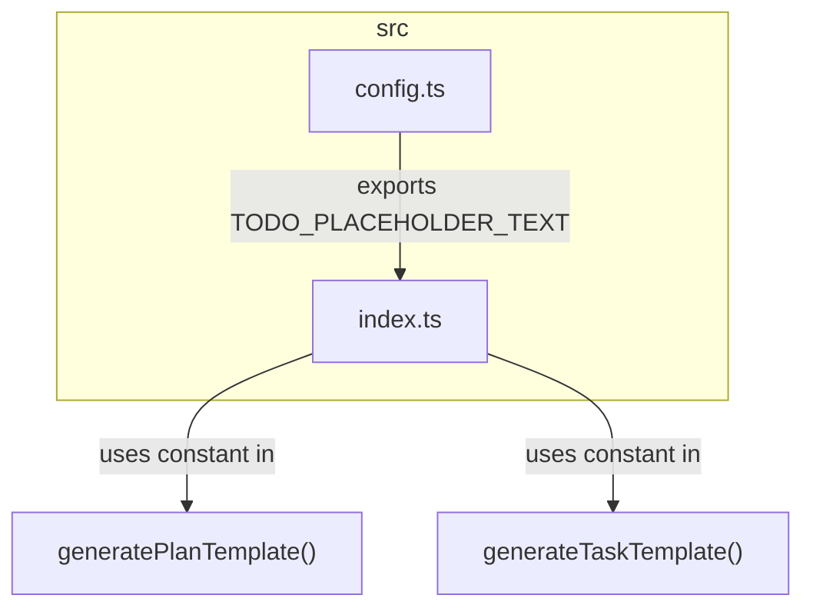

# Task: Refactor Placeholder Text to a Constant

## 1 Meta & Governance

### 1.2 Status

- **Current State:** ✅ Done
- **Priority:** 🟧 Medium
- **Progress:** 100%
- **Planning Estimate:** 1
- **Est. Variance (pts):** 0
- **Created:** 2025-07-20 16:55
- **Implementation Started:** 2025-07-20 17:15
- **Completed:** 2025-07-20 17:23
- **Last Updated:** 2025-07-20 16:55

### 1.3 Priority Drivers

- TEC-Tech_Debt_Refactor
- TEC-Dev_Productivity_Enhancement

---

## 2 Business & Scope

### 2.1 Overview

- **Core Function**: Replace the hardcoded placeholder text in template generators with a centralized constant.
- **Key Capability**: Establishes a single source of truth for the placeholder text, making it easily identifiable for parsers and simple to update in the future.
- **Business Value**: Improves the maintainability and machine-readability of the documentation templates, reducing technical debt and supporting future automation efforts.

#### 2.2.3 Core Business Rules

- A single, exported constant must be used for the placeholder text.
- The constant must be used in both the `generatePlanTemplate` and `generateTaskTemplate` functions.
- The placeholder text must be an easily identifiable string, such as `TODO__ADD_CONTENT_HERE`.

### 2.4 Acceptance Criteria

| ID   | Criterion                                                                                        | Test Reference      |
| :--- | :----------------------------------------------------------------------------------------------- | :------------------ |
| AC-1 | A `src/config.ts` file is created and contains an exported `TODO_PLACEHOLDER_TEXT` constant.     | `src/config.ts`     |
| AC-2 | `src/index.ts` imports the `TODO_PLACEHOLDER_TEXT` constant from `src/config.ts`.                | `src/index.ts`      |
| AC-3 | The `generatePlanTemplate` function in `src/index.ts` uses the `TODO_PLACEHOLDER_TEXT` constant. | `src/index.ts`      |
| AC-4 | The `generateTaskTemplate` function in `src/index.ts` uses the `TODO_PLACEHOLDER_TEXT` constant. | `src/index.ts`      |
| AC-5 | Running the template generation produces files with the new placeholder text.                    | Manual Verification |

---

## 3 Planning & Decomposition

### 3.3 Dependencies

| ID  | Dependency On  | Type     | Status      | Affected Plans/Tasks | Notes                                                               |
| :-- | :------------- | :------- | :---------- | :------------------- | :------------------------------------------------------------------ |
| D-1 | `src/index.ts` | Internal | ✅ Complete | This task            | The file containing the template generation logic to be refactored. |

---

## 4 High-Level Design

### 4.2 Target Architecture

The target architecture introduces a dedicated `src/config.ts` file to store shared constants. The existing `src/index.ts` will be refactored to import the placeholder constant from this new configuration file, decoupling configuration from implementation logic.

#### 4.2.1 Data Models



#### 4.2.2 Components

<!-- A diagram illustrating the main components and their relationships. The term "component" is used broadly and does not necessarily map to a class; it represents a logical block of functionality. -->

<!--
EXAMPLE:
```mermaid
classDiagram
direction LR

    class LogPayload {
        <<type>>
        +LogLevel level
        +string message
        +string timeISO8601
        +string stack
        +string componentStack
        +Record<string,any> context
    }

    class ClientLogger {
        <<interface>>
        +log(payload: LogPayload): Promise<void>
    }

    class ConsoleTransport {
        +log(payload: LogPayload): Promise<void>
    }

    class HttpTransport {
        +string endpoint
        +log(payload: LogPayload): Promise<void>
    }

    class CompositeLogger {
        +ClientLogger[] delegates
        +log(payload: LogPayload): Promise<void>
    }

    class LoggerConfig {
        +LogLevel minLevel
        +TransportConfig[] transports
    }

    class TransportConfig {
        +string name
        +string endpoint
    }

    class LoggerFactory {
        +create(config: LoggerConfig): ClientLogger
    }

    class BuildLogPayload {
        <<function>>
    }

    class SingleCallGuard {
        <<function>>
    }

    class AppErrorBoundary {
        +ClientLogger logger
        +componentDidCatch(error, info): void
    }

    %% Inheritance / Implementation
    ClientLogger <|.. ConsoleTransport
    ClientLogger <|.. HttpTransport
    ClientLogger <|.. CompositeLogger

    %% Associations / Composition
    CompositeLogger o-- ClientLogger : delegates
    LoggerFactory --> LoggerConfig

    LoggerFactory --> ClientLogger : returns
    LoggerFactory --> TransportConfig
    AppErrorBoundary --> ClientLogger : uses
    AppErrorBoundary --> SingleCallGuard : guards
    BuildLogPayload --> LogPayload : returns
    AppErrorBoundary ..> BuildLogPayload : builds

````
-->

[TODO: Add content for this section]

#### 4.2.3 Data Flow

<!-- A diagram showing how data moves between components, with numbered steps to indicate the sequence of actions. -->

<!--
EXAMPLE:
```mermaid
graph
TD
    subgraph "Input"
        A[Component A]
    end

    subgraph "System"
        B(Component B)
        C(Component C)
    end

    subgraph "External Resource"
        D[Database]
    end

    subgraph "Output"
        E[Component D]
    end

    A -- "1 - Invoke with" --> B
    B -- "2 - Process" --> C
    C -- "3 - Write to" --> D
    C -- "4 - Return" --> E
````

-->

[TODO: Add content for this section]

#### 4.2.4 Control Flow

<!-- A diagram showing the sequence of interactions between components. -->

<!--
EXAMPLE:
```mermaid
sequenceDiagram
participant User
    participant API
    participant AuthSvc
    User->>API: POST /login
    API->>AuthSvc: ValidateCredentials(user, pass)
    AuthSvc-->>API: JWT

    API-->>User: { token: "..." }

````
-->

[TODO: Add content for this section]

#### 4.2.5 Integration Points

<!-- A container for defining all systems, services, or APIs that this component interacts with, broken down into `Upstream` and `Downstream` sections. -->

[TODO: Add content for this section]

##### 4.2.5.1 Upstream Integrations

<!-- Defines how this artefact is triggered and what data it receives from other systems. -->

<!--
EXAMPLE:
- **Trigger**: User action via UI button click.
- **Input Data**: Receives `documentId` and `userId` from the client.
-->

[TODO: Add content for this section]

##### 4.2.5.2 Downstream Integrations

<!-- Defines what happens when this artefact completes its work and what data it sends to other systems. -->

<!--
EXAMPLE:
- **Completion Trigger**: Emits a `DOCUMENT_PROCESSED` event to the message queue.
- **Output Data**: The event payload includes `documentId` and `status: 'COMPLETED'`.
-->

[TODO: Add content for this section]

#### 4.2.6 Exposed API

<!-- The API surface this component exposes to consumers. -->

<!--
EXAMPLE:
```yaml
paths:
  /users/{userId}:
    get:
      summary: Get user by ID
      parameters:
        - name: userId
          in: path
          required: true
          schema:
            type: string
````

-->

[TODO: Add content for this section]

### 4.3 Tech Stack & Deployment

- **Language**: TypeScript
- **Runtime**: Node.js

### 4.4 Non-Functional Requirements

<!-- A container for the high-level, non-functional requirements (NFRs) or quality attributes that the system must meet. This section defines what the requirements are, while the `7. Quality & Operations` family describes how they will be tested and monitored. -->

[TODO: Add content for this section]

#### 4.4.1 Performance

<!-- Defines the performance-related NFRs, such as response times, throughput, and resource utilization, in a prioritized table. -->

<!--
EXAMPLE:
| ID | Requirement | Priority |
| :--- | :--- | :--- |
| PERF-01 | API endpoints must respond in < 200ms (95th percentile). | 🟥 High |
| PERF-02 | The system must support 100 concurrent users without degradation. | 🟧 Medium |
-->

[TODO: Add content for this section]

#### 4.4.2 Security

<!-- Defines the security-related NFRs, such as data encryption, access control, and vulnerability standards, in a prioritized table. -->

<!--
EXAMPLE:
| ID | Requirement | Priority |
| :--- | :--- | :--- |
| SEC-01 | All sensitive user data must be encrypted at rest using AES-256. | 🟥 High |
| SEC-02 | Access to admin endpoints must be restricted to users with 'Admin' role. | 🟥 High |
-->

[TODO: Add content for this section]

#### 4.4.3 Reliability

<!-- Defines the reliability-related NFRs, such as uptime, data integrity, and disaster recovery, in a prioritized table. -->

<!--
EXAMPLE:
| ID | Requirement | Priority |
| :--- | :--- | :--- |
| REL-01 | The service must maintain 99.9% uptime, measured monthly. | 🟥 High |
| REL-02 | All database transactions must be atomic and durable. | 🟥 High |
-->

[TODO: Add content for this section]

#### 4.4.4 Permission Model

<!-- Defines the access control rules, user roles, and permissions for the system. This section should clearly outline who can access what and perform which actions. The mechanism for assigning these roles in each environment should be detailed in the `7.2 Configuration` section. -->

<!--
EXAMPLE:
| Role | Permissions | Notes |
| :--- | :--- | :--- |
| **Admin** | - Full CRUD access to all documents<br>- Can assign roles | For system administrators only. |
| **Analyst** | - Read/Write access to assigned documents<br>- Cannot delete | The primary user role. |
| **Viewer** | - Read-only access to completed documents | For stakeholders or external users. |
-->

[TODO: Add content for this section]

---

## 5 Maintenance and Monitoring

### 5.2 Target Maintenance and Monitoring

[TODO: Add content for this section]

#### 5.2.1 Error Handling

<!-- The strategy for managing and communicating errors, often best represented as a table detailing the condition, trigger, action, and feedback. -->

<!--
EXAMPLE:
| Error Type | Trigger | Action | User Feedback |
| :--- | :--- | :--- | :--- |
| **File System Error** | Cannot read a required file or directory. | Abort with exit code 1. | `ERROR: Cannot access [path]. Please check permissions.` |
| **Schema Validation Error** | A document violates the canonical schema. | Abort with exit code 1. | `ERROR: Schema validation failed in [file]: [validation_details].` |
| **API/Network Error** | External API is unreachable or returns > 299. | Abort with exit code 1. | `ERROR: Failed to transmit status to [endpoint]: [HTTP_status_or_error].` |
-->

[TODO: Add content for this section]

#### 5.2.2 Logging & Monitoring

<!-- The strategy for system observability. -->

<!--
EXAMPLE:
- **Metrics**: Prometheus endpoint `/metrics` will be exposed.
- **Logs**: Structured JSON logs sent to stdout for collection by Fluentd.
- **Tracing**: OpenTelemetry SDK will be used for distributed tracing.
-->

[TODO: Add content for this section]

---

## 6 Implementation Guidance

### 6.1 Implementation Plan

<!-- A detailed, step-by-step log of the implementation process for a Task. -->

[TODO: Add content for this section]

### 6.1 Implementation Log / Steps

- [x] Add and export the `TODO_PLACEHOLDER_TEXT` constant in the existing `src/config.ts` file.
- [x] Import the new constant into `src/index.ts`.
- [x] Replace the two hardcoded placeholder strings in `src/index.ts` with the imported constant.
- [x] Run `npm run generate-templates` to verify the changes are correctly applied to the output files.

#### 6.1.1 Initial Situation

The project already contains a `src/config.ts` file that exports configuration variables. The placeholder text `[TODO: Add content for this section]` is currently hardcoded in two places within `src/index.ts`.

#### 6.1.2 Files Change Log

[TODO: Add content for this section]

### 6.2 Prompts (LLM reuse)

<!-- A collection of prompts that can be used with an LLM to assist in the implementation. -->

<!--
EXAMPLE:
Generate a Jest test for this function:
```md
export const add = (a: number, b: number): number => a + b;
```
-->

[TODO: Add content for this section]

---

## 7 Quality & Operations

### 7.1 Testing Strategy / Requirements

| AC   | Scenario                                                  | Test Type | Tools / Runner               | Notes                                         |
| :--- | :-------------------------------------------------------- | :-------- | :--------------------------- | :-------------------------------------------- |
| AC-5 | Generated templates contain the correct placeholder text. | Manual    | `npm run generate-templates` | Inspect the output files in `docs/templates`. |

### 7.2 Configuration

<!-- How the system is configured in different environments (e.g., production, development). -->

<!--
EXAMPLE:
| Setting Name | Plan Dependency | Source | Override Method | Notes |
| :--- | :--- | :--- | :--- | :--- |
| `analyzerApiEndpoint` | `p1-analyzer` | `ddd.config.json` | `DDD_ANALYZER_API_ENDPOINT` (Environment Var) | (Required) The URL of the external service for status reporting. |
| `logLevel` | (All) | `ddd.config.json` | `DDD_LOG_LEVEL` (Environment Variable) | `info` (default), `debug`, `warn`, `error`. Controls logging verbosity. |
| `NODE_ENV` | (All) | Environment Variable | Not overrideable | `development` or `production`. Determines the operational mode. |
-->

[TODO: Add content for this section]

### 7.3 Alerting & Response

<!-- How to respond to alerts and operational logs, especially errors, and how they are integrated with alerting systems. -->

<!--
EXAMPLE:
| Error Condition | Relevant Plans | Response Plan | Status |
| :--- | :--- | :--- | :--- |
| **Internal Script Failure** | All | Abort the `git commit` with a non-zero exit code. Print the error stack trace directly to the console. | 💡 Not Started |
| **External API Non-2xx Response** | `p1-analyzer` | Abort the `git commit` with a non-zero exit code. Log the API's error response to the console. | 💡 Not Started |
| **CI/CD Pipeline Failure** | All | Fail the corresponding pipeline step. The tool's non-zero exit code will be surfaced in the CI/CD interface. | 💡 Not Started |
-->

[TODO: Add content for this section]

### 7.5 Local Test Commands

```bash
# After changes are made, run the generation script
npm run generate-templates

# Manually inspect the output files in docs/templates/
cat docs/templates/plan.template.md
cat docs/templates/task.template.md
```

---

## 8 Reference

### 8.1 Appendices/Glossary

**Glossary:**

- **Constant**: A value that cannot be altered by the program during normal execution.
- **Refactoring**: The process of restructuring existing computer code without changing its external behavior.

---
