# Plan: DDD CLI Tools & Basic Operations

---

## 1 Meta & Governance

### 1.2 Status

- **Created:** 2025-07-20 01:58
- **Last Updated:** 2025-07-20 01:58

### 1.3 Priority Drivers

- [TEC-Dev_Productivity_Enhancement](../ddd-2.md#tec-dev_productivity_enhancement)
- [TEC-Dev_Productivity_Blocker](../ddd-2.md#tec-dev_productivity_blocker)
- [UX-Noticeable_Friction](../ddd-2.md#ux-noticeable_friction)

---

## 2 Business & Scope

### 2.1 Overview

- **Core Function**: Provides command-line interface tools that wrap and extend the existing schema system to enable efficient DDD project creation, validation, and maintenance.
- **Key Capability**: Transforms the powerful but script-based schema system into accessible CLI commands that developers can use directly in their workflow for template generation, project initialization, and document validation.
- **Business Value**: Eliminates friction in DDD adoption by providing intuitive command-line tools that make schema-compliant documentation creation as simple as running a command.

### 2.2 Business Context

The existing schema system (P1) provides powerful generation capabilities but requires developers to run npm scripts and manually organize files. This creates adoption friction and limits the system's usability for day-to-day development work.

This plan establishes a CLI wrapper around the proven schema foundation, making DDD tools accessible through standard command-line patterns that integrate naturally with developer workflows. By building on P1's solid foundation rather than recreating functionality, we can deliver immediate value while setting up the architecture for advanced features.

#### 2.2.1 User Journeys

##### 2.2.1.1 Journey: Developer Starts New DDD Project

A developer needs to create a new project or component using DDD methodology.


##### 2.2.1.2 Journey: Developer Creates Plan Documentation

A developer working on an existing project needs to add a new plan.


##### 2.2.1.3 Journey: Developer Creates Task Documentation

A developer working on an existing project needs to add a new task.


##### 2.2.1.4 Journey: Developer Validates Documentation

A developer wants to ensure their documentation follows DDD schema requirements.


#### 2.2.2 User Personas

| Persona               | Goal                                                                                           |
| :-------------------- | :--------------------------------------------------------------------------------------------- |
| **Project Developer** | Create and maintain DDD-compliant documentation efficiently using familiar command-line tools. |
| **Team Lead**         | Ensure team documentation follows standards and can be validated automatically in CI/CD.       |
| **Platform Engineer** | Provide teams with easy-to-use tools that encourage DDD adoption without learning overhead.    |

#### 2.2.3 Core Business Rules

- **CLI Commands Must Leverage P1**: All functionality must build on existing schema system capabilities rather than reimplementing logic.
- **Naming Convention Enforcement**: CLI must enforce and assist with proper DDD-2 naming conventions for hierarchical documents.
- **Schema Compliance**: All generated documents must validate against the canonical schema without manual adjustment.
- **Developer Experience Priority**: Commands must follow familiar CLI patterns and provide clear, actionable feedback.
- **Idempotent Initialization**: The `init` command must be idempotent and should not re-initialize an existing DDD project (identified by `ddd.config.json`).

#### 2.2.4 User Stories

- As a **Project Developer**, I want to run `ddd init` so that I can create a `ddd.config.json` and scaffold a new DDD project, and be prevented from re-initializing an existing project.
- As a **Project Developer**, I want to run `ddd template plan <name> --parent <parent-doc-name>` so that I can create properly named plan documents with correct examples.
- As a **Team Lead**, I want to run `ddd lint` in CI/CD so that documentation compliance is enforced automatically.
- As a **Platform Engineer**, I want CLI commands that wrap existing schema functions so that teams get powerful capabilities without complexity.

### 2.3 Success Criteria

- **Template Generation**: CLI can generate plan and task templates with proper naming conventions and schema compliance.
- **Project Initialization**: CLI can scaffold new DDD projects with appropriate directory structure and initial documentation.
- **Validation Integration**: CLI can validate existing documentation against schema and provide actionable feedback.
- **Developer Adoption**: Commands follow standard CLI patterns and integrate smoothly with existing development workflows.

### 2.5 Boundaries & Scope

#### 2.5.1 In Scope

- **CLI Command Interface**: User-friendly commands that wrap P1 schema system functionality
- **Template Generation Commands**: Generate plan and task templates with intelligent naming and examples
- **Project Initialization**: Basic project scaffolding with proper DDD structure
- **Document Validation**: Schema compliance checking for existing documentation
- **Documentation Generation**: CLI access to human and machine-readable schema documentation
- **Basic Schema Synchronization**: Version checking and template updating capabilities

#### 2.5.2 Out of Scope

- **Integration with External Tools**: Jira, Slack, GitHub integrations (separate future initiative)
- **Multi-Language Schema Support**: Support for languages other than TypeScript (not currently needed)
- **Advanced IDE Integrations**: VSCode extensions or editor plugins (separate future initiative)
- **Custom Schema Modifications**: User-defined schema extensions (outside current requirements)

### 2.6 Core Business Processes

#### 2.6.1 Process: CLI-Driven Document Creation

- **Participants**: Developer, CLI Tools, Schema System
- **Goal**: Create new DDD-compliant documentation efficiently through command-line interface
- **Workflow**:
  1. Developer identifies need for new plan or task documentation
  2. Developer runs appropriate CLI command with naming parameters
  3. CLI validates naming convention and hierarchy requirements
  4. CLI generates template using P1 schema system
  5. CLI writes properly named file with schema-compliant structure
  6. Developer edits generated template with actual content

#### 2.6.2 Process: Automated Documentation Validation

- **Participants**: Developer, CLI Tools, CI/CD System
- **Goal**: Ensure documentation compliance through automated validation
- **Workflow**:
  1. Developer commits documentation changes to version control
  2. CI/CD system runs `ddd lint` command on changed files
  3. CLI parses documentation and validates against schema
  4. CLI reports validation results with specific compliance issues
  5. Build passes/fails based on validation results
  6. Developer fixes issues if validation fails and re-commits

#### 2.6.3 Process: Adding DDD to a Project

- **Participants**: Developer, CLI Tools
- **Goal**: Initialize DDD methodology in a project directory.
- **Workflow**:
  1. Developer navigates to the root of a project.
  2. Developer runs `ddd init`.
  3. CLI checks for the existence of `ddd.config.json`.
  4. If not found, CLI creates `ddd.config.json` and a default `project.plan.md`.
  5. If found, CLI reports that the project is already initialized.

---

## 3 Planning & Decomposition

### 3.1 Roadmap (In-Focus Items)

| ID  | Child Plan/Task                                                                               | Priority  | Priority Drivers                                                                    | Status         | Depends On | Summary                                                      |
| :-- | :-------------------------------------------------------------------------------------------- | :-------- | :---------------------------------------------------------------------------------- | :------------- | :--------- | :----------------------------------------------------------- |
| P3  | [Integrate Git](./p1-p2.p3-integrate-git.plan.md)                                             | 🟧 Medium | [TEC-Dev_Productivity_Enhancement](/docs/ddd-2.md#tec-dev_productivity_enhancement) | 💡 Not Started | T1         | Plan for integrating git operations into the CLI.            |
| T1  | [CLI Framework Setup](./p1-p2.t1-cli-framework.task.md)                                       | 🟥 High   | [TEC-Dev_Productivity_Enhancement](/docs/ddd-2.md#tec-dev_productivity_enhancement) | ✅ Complete    | —          | Set up CLI framework and basic command structure.            |
| T2  | [Config System](./p1-p2.t2-config-system.task.md)                                             | 🟥 High   | [TEC-Dev_Productivity_Enhancement](/docs/ddd-2.md#tec-dev_productivity_enhancement) | ✅ Complete    | T1         | Implement the configuration management system.               |
| T3  | [Template Generation Commands](./p1-p2.t3-template-commands.task.md)                          | 🟥 High   | [TEC-Dev_Productivity_Enhancement](/docs/ddd-2.md#tec-dev_productivity_enhancement) | ✅ Complete    | T1, T2     | Implement ddd template plan/task commands.                   |
| T4  | [Project Initialization Commands](./p1-p2.t4-init-commands.task.md)                           | 🟥 High   | [UX-Noticeable_Friction](/docs/ddd-2.md#ux-noticeable_friction)                     | ✅ Complete    | T1, T2, T3 | Implement ddd init project scaffolding.                      |
| T23 | [Dynamic Docs README Generation](./p1-p2.t23-readme-generation.task.md)                       | 🟧 Medium | [TEC-Dev_Productivity_Enhancement](/docs/ddd-2.md#tec-dev_productivity_enhancement) | 💡 Not Started | P5         | Generate a docs/README.md from the root README.md.           |
| T24 | [Integrate README Generation into Init Command](./p1-p2.t24-init-readme-integration.task.md)  | 🟧 Medium | [TEC-Dev_Productivity_Enhancement](/docs/ddd-2.md#tec-dev_productivity_enhancement) | 💡 Not Started | T4, T23    | Integrates README generation into the init command.          |
| T25 | [Dynamic Example Generation for Init Command](./p1-p2.t25-dynamic-example-generation.task.md) | 🟨 Low    | [TEC-Tech_Debt_Refactor](/docs/ddd-2.md#tec-tech_debt_refactor)                     | 💡 Not Started | T4         | Refactors the init command to generate examples dynamically. |

### 3.2 Backlog / Icebox

- **File Watching & Caching System**: Real-time document monitoring with structured cache for performance optimization
- **Advanced Analytics & Progress Tracking**: Velocity metrics, project health dashboards, and progress visualization tools
- **Real-time Validation**: Continuous linting with immediate feedback during document editing sessions
- **Rich Operations & Queries**: Complex document relationship analysis, dependency tracking, and blocker detection
- **External Integrations**: Webhooks, API endpoints, and integrations with project management tools
- **Advanced Init Templates**: Smart project templates with auto-detection of patterns and developer preferences
- **Schema Evolution Tools**: Migration utilities for updating documentation when schema versions change

### 3.3 Dependencies

| ID  | Dependency On                                                              | Type     | Status         | Affected Plans/Tasks | Notes                                                        |
| :-- | :------------------------------------------------------------------------- | :------- | :------------- | :------------------- | :----------------------------------------------------------- |
| D-1 | [p1-ddd-tools-schema-system.plan.md](./p1-ddd-tools-schema-system.plan.md) | Internal | ✅ Complete    | All tasks            | Foundation schema system with proven generation capabilities |
| D-2 | CLI Framework (yargs/commander)                                            | External | ✅ Complete    | T1, All CLI tasks    | yargs has been selected and integrated.                      |
| D-3 | Markdown Parser Library                                                    | External | 💡 Not Started | (Future) T5          | Required for document validation functionality               |
| D-4 | [P6: Doc Content Validator](./p1.p6-doc-content-validator.plan.md)         | Internal | 💡 Not Started | (Future) Validation  | Provides validation capabilities for CLI commands            |
| D-5 | File System Operations                                                     | External | ✅ Complete    | All tasks            | Node.js fs module capabilities (already used in P1)          |

### 3.4 Decomposition Graph

```mermaid
graph TD
    subgraph "Plan: CLI Tools"
        P3["P3: Integrate Git"]
        T1["T1: CLI Framework Setup"]
        T2["T2: Config System"]
        T3["T3: Template Commands"]
        T4["T4: Init Commands"]
        T23["T23: README Generation"]
        T24["T24: Init README Integration"]
    end

    subgraph "External Dependencies"
        P1["P1: Schema System ✅"]
        P5["P5: Doc Parser"]
        P6["P6: Doc Content Validator"]
        CLI_LIB["CLI Framework ✅"]
    end

    P1 --> T3
    P1 --> T4

    T1 --> P3
    T1 --> T2
    T2 --> T3
    T3 --> T4

    CLI_LIB --> T1

    P5 --> T23
    T4 --> T24
    T23 --> T24
```



---

## 4 High-Level Design

### 4.0 Guiding Principles

- **Build on P1 Foundation**: Leverage existing schema system capabilities rather than reimplementing functionality
- **CLI-First Design**: Commands should follow standard CLI patterns and conventions for intuitive developer experience
- **Schema Compliance**: All generated content must validate against established schema without manual adjustment
- **Incremental Architecture**: Design CLI layer to support future advanced features without major refactoring
- **Developer Experience**: Prioritize clear feedback, helpful error messages, and efficient workflows

### 4.1 Current Architecture

The current system is a collection of Node.js scripts that are executed via `npm run` commands. There is no formal CLI application. Developers interact with the system by manually running scripts and managing files, which creates friction and lacks the usability of a dedicated command-line tool. The architecture is functional but not exposed in a developer-friendly way.

### 4.2 Target Architecture

#### 4.2.1 Data Models

**CLI Command Structure:**

```typescript
interface CLICommand {
  name: string;
  description: string;
  options: CLIOption[];
  handler: (args: any) => Promise<void>;
}

interface CLIOption {
  name: string;
  alias?: string;
  type: 'string' | 'boolean' | 'number';
  required?: boolean;
  description: string;
}

interface TemplateOptions {
  parent?: string;
  id: string;
  name: string;
  type: 'plan' | 'task';
}

interface InitOptions {
  name: string;
  path?: string;
  type: 'project' | 'plan' | 'task';
}
```

**Integration with P1 Schema:**


#### 4.2.2 Components


#### 4.2.3 Data Flow


#### 4.2.4 Control Flow


##### Control Flow: `ddd init`

```mermaid
sequenceDiagram
    participant User as Developer
    participant CLI as CLI Application
    participant FS as File System

    User->>CLI: ddd init
    CLI->>FS: check for ddd.config.json
    alt Project already initialized
        FS-->>CLI: ddd.config.json exists
        CLI-->>User: Error: Project already initialized
    else Project not initialized
        FS-->>CLI: ddd.config.json not found
        CLI->>FS: create ddd.config.json
        CLI->>FS: create project.plan.md
        FS-->>CLI: files created successfully
        CLI-->>User: ✅ Project initialized successfully
    end
```



#### 4.2.5 Integration Points

##### 4.2.5.1 Upstream Integrations

- **P1 Schema System**: Direct function calls to existing template and documentation generators
- **Node.js File System**: Standard fs operations for reading/writing files and directories
- **Command Line Arguments**: Standard argv parsing for user input and options

##### 4.2.5.2 Downstream Integrations

- **Generated Documentation Files**: Creates schema-compliant markdown files in project directory structure
- **Development Workflow**: Integrates with git, CI/CD, and standard development tools
- **Validation Feedback**: Provides structured output suitable for CI/CD integration and developer feedback

### 4.3 Tech Stack & Deployment

- **Language**: TypeScript (consistent with P1 foundation)
- **Runtime**: Node.js ≥ 18 (same as P1 requirements)
- **CLI Framework**: yargs or commander (to be selected in T1)
- **Markdown Parser**: remark or marked (for validation functionality)
- **Package Distribution**: npm package with CLI binaries
- **Installation**: Global npm install for CLI access

### 4.4 Non-Functional Requirements

#### 4.4.1 Performance

| ID      | Requirement                                                | Priority  |
| :------ | :--------------------------------------------------------- | :-------- |
| PERF-01 | Template generation commands must complete in < 2 seconds  | 🟥 High   |
| PERF-02 | Project initialization must complete in < 5 seconds        | 🟧 Medium |
| PERF-03 | Document validation must process 50+ files in < 10 seconds | 🟨 Low    |

#### 4.4.2 Security

| ID     | Requirement                                                 | Priority |
| :----- | :---------------------------------------------------------- | :------- |
| SEC-01 | CLI must validate file paths to prevent directory traversal | 🟥 High  |
| SEC-02 | Commands must not execute arbitrary user input              | 🟥 High  |

#### 4.4.3 Reliability

| ID     | Requirement                                                          | Priority  |
| :----- | :------------------------------------------------------------------- | :-------- |
| REL-01 | CLI commands must provide clear error messages for all failure modes | 🟥 High   |
| REL-02 | Generated files must always validate against schema                  | 🟥 High   |
| REL-03 | Commands must be idempotent where possible                           | 🟧 Medium |

---

## 5 Maintenance and Monitoring

### 5.1 Current Maintenance and Monitoring

Maintenance and monitoring for the existing script-based system is manual. Developers rely on reading console output from `npm run` commands to identify errors. There is no centralized logging, monitoring, or formal error handling strategy beyond what is outputted to the terminal during script execution.

### 5.2 Target Maintenance and Monitoring

#### 5.2.1 Error Handling

| Error Type                      | Trigger                                                        | Action                                 | User Feedback                                                                 |
| :------------------------------ | :------------------------------------------------------------- | :------------------------------------- | :---------------------------------------------------------------------------- |
| **Invalid Command Arguments**   | User provides incorrect options or missing required parameters | Display usage help and specific error  | `ERROR: Missing required option --name. See 'ddd template --help' for usage.` |
| **File System Permissions**     | Cannot write to target directory                               | Exit with code 1 and clear message     | `ERROR: Cannot write to ./docs/. Please check directory permissions.`         |
| **Naming Convention Violation** | User provides invalid naming pattern                           | Reject with explanation and suggestion | `ERROR: Invalid naming pattern. Use format: p1-p2-name (parent-id-name)`      |
| **Schema Generation Failure**   | P1 system functions fail                                       | Propagate P1 error with context        | `ERROR: Template generation failed: [P1 error details]`                       |

#### 5.2.2 Logging & Monitoring

- **Command Usage Logging**: Track which commands are used most frequently for UX optimization
- **Error Rate Monitoring**: Monitor command failure rates to identify common issues
- **Performance Tracking**: Log command execution times to ensure performance requirements are met
- **Success Confirmation**: Clear success messages with specific actions taken

---

## 6 Implementation Guidance

### 6.1 Implementation Plan

| Phase                               | Scope / Deliverables                             | Key Artifacts                                 | Exit Criteria                            |
| :---------------------------------- | :----------------------------------------------- | :-------------------------------------------- | :--------------------------------------- |
| **Phase 1: CLI Foundation**         | Set up CLI framework and basic command structure | CLI application shell, command registration   | Commands parse correctly and show help   |
| **Phase 2: Template Commands**      | Implement template generation commands           | `ddd template` command with plan/task options | Can generate properly named templates    |
| **Phase 3: Project Init**           | Implement project initialization                 | `ddd init` command with project scaffolding   | Can create complete project structure    |
| **Phase 4: Documentation Commands** | Implement docs generation commands               | `ddd docs` command with mode options          | Can generate human/machine documentation |
| **Phase 5: Basic Validation**       | Implement structure validation                   | `ddd lint` command with basic checking        | Can validate documents against schema    |

### 6.2 Prompts (LLM reuse)

**For implementing CLI commands:**

```markdown
Create a CLI command that wraps the existing P1 function [FUNCTION_NAME] with the following options:

- Required: [LIST_REQUIRED_OPTIONS]
- Optional: [LIST_OPTIONAL_OPTIONS]
- Validation: [VALIDATION_RULES]
- Error handling: [ERROR_SCENARIOS]

Follow the established CLI pattern and provide clear user feedback.
```

**For testing CLI functionality:**

```markdown
Write tests for the CLI command [COMMAND_NAME] that verify:

- Argument parsing works correctly
- P1 integration functions as expected
- File output is generated properly
- Error cases are handled appropriately

Use Vitest and mock P1 functions to isolate CLI logic.
```

---

## 7 Quality & Operations

### 7.1 Testing Strategy / Requirements

| Scenario                                             | Test Type   | Tools / Runner                  | Notes                                       |
| :--------------------------------------------------- | :---------- | :------------------------------ | :------------------------------------------ |
| **CLI argument parsing works correctly**             | Unit        | Vitest + CLI testing utilities  | Mock P1 functions to isolate CLI logic      |
| **Template commands generate proper files**          | Integration | Vitest + temp directories       | Verify P1 integration and file output       |
| **Project initialization creates correct structure** | Integration | Vitest + filesystem mocking     | Test complete project scaffolding           |
| **Validation commands detect schema violations**     | Unit        | Vitest + sample documents       | Test validation logic with known violations |
| **Error handling provides clear messages**           | Unit        | Vitest + error scenario testing | Verify user-friendly error messages         |
| **CLI help and usage information**                   | Integration | Vitest + CLI output testing     | Ensure help text is accurate and useful     |

### 7.2 Configuration

| Setting Name                     | Source            | Override Method      | Notes                                                         |
| :------------------------------- | :---------------- | :------------------- | :------------------------------------------------------------ |
| `documentation.requirementsPath` | `ddd.config.json` | `--output-dir <dir>` | Path to the directory where documentation files are stored.   |
| _(schema-version)_               | CLI default       | `--schema-version`   | _Future_: Specify which schema version to use for generation. |
| _(template-mode)_                | CLI default       | `--mode`             | _Future_: Human vs machine readable templates.                |
| _(validation-strictness)_        | CLI default       | `--strict`           | _Future_: How strict validation should be.                    |

### 7.3 Alerting & Response

| Error Condition                   | Response Plan                                                               | Status         |
| :-------------------------------- | :-------------------------------------------------------------------------- | :------------- |
| **CLI Command Failure**           | Exit with non-zero code and clear error message showing exactly what failed | 💡 Not Started |
| **P1 Integration Failure**        | Wrap P1 errors with CLI context and suggest troubleshooting steps           | 💡 Not Started |
| **File System Operation Failure** | Provide specific error with path and permission requirements                | 💡 Not Started |

### 7.4 Deployment Steps

**For development:**

1. Run `npm run build` to compile TypeScript CLI code
2. Run `npm link` to create global CLI commands for testing
3. Test CLI commands against sample projects
4. Run test suite: `npm test`

**For release:**

1. Compile and package CLI with P1 dependencies
2. Test installation and CLI functionality on clean environment
3. Publish to npm registry with appropriate version
4. Update documentation with CLI usage examples

---

## 8 Reference

### 8.1 Appendices/Glossary

**Glossary:**

- **CLI**: Command Line Interface - the primary way developers interact with DDD tools
- **P1 Integration**: Using functions and capabilities from the existing schema system
- **Template Generation**: Creating new documentation files with proper structure and examples
- **Schema Compliance**: Documentation that follows the established DDD schema requirements
- **Naming Convention**: The hierarchical naming pattern for DDD documents (p1-p2-name format)

**Command Reference:**

```bash
# Template generation
# Generate a new plan template (ID is assigned automatically)
ddd template plan <name> [--parent <parent-filename>] [--output-dir <dir>]

# Generate a new task template (parent is required)
ddd template task <name> --parent <parent-filename> [--output-dir <dir>]

# Examples:
# Creates docs/requirements/p1-user-management.plan.md
ddd template plan user-management

# Creates docs/requirements/p2-another-plan.plan.md (assuming p1 exists)
ddd template plan another-plan

# Creates docs/requirements/p1.t1-user-authentication.task.md
ddd template task user-authentication --parent p1-user-management.plan.md

# Creates a nested plan
# Creates docs/requirements/p1.p2-api-endpoints.plan.md
ddd template plan api-endpoints --parent p1-user-management.plan.md
```

**Project initialization**

```bash
# Initializes a new DDD project in the current directory.
# Creates ddd.config.json and a top-level project.plan.md.
# Will not run if a ddd.config.json file already exists.
ddd init
```

**Basic validation**

```bash
ddd lint docs/**/*.md --strict
```

**Key Dependencies:**

- [P1 Schema System](./p1.plan.md) - Foundation for all CLI functionality
- [DDD-2 Methodology](/docs/ddd-2.md) - Naming conventions and document structure
- [Plan Template Structure](/docs/templates/plan.template.md) - Reference for generated templates

---
