# Plan: NPM Package Publication

---

## 1 Meta & Governance

### 1.2 Status

- **Created:** 2025-07-24 10:45
- **Last Updated:** 2025-07-24 10:50

### 1.3 Priority Drivers

- [MKT-Launch_Critical](/docs/ddd-2.md#mkt-launch_critical)
- [TEC-Dev_Productivity_Enhancement](/docs/ddd-2.md#tec-dev_productivity_enhancement)

---

## 2 Business & Scope

### 2.1 Overview

- **Core Function**: To define and execute the strategy for publishing and maintaining the `ddd-tools` package on the NPM registry.
- **Key Capability**: This plan ensures the project is properly configured, versioned, and automatically published, making it easily installable and usable for the wider development community.
- **Business Value**: Publishing to NPM establishes the project's legitimacy, simplifies distribution and version management, and significantly lowers the barrier to adoption for new users, which is a primary goal of the project.

### 2.2 Business Context

While the `ddd-tools` provide significant value, their distribution is currently limited to cloning the source repository. To achieve wider adoption and simplify usage, the tool must be made available on a standard, public package registry. NPM is the de-facto standard for the Node.js ecosystem. This plan covers the technical and procedural steps required to prepare, publish, and maintain the package on NPM, turning it from an internal tool into a publicly available open-source project.

#### 2.2.1 User Journeys

##### 2.2.1.1 Journey: New User Installs the Tool

A developer discovers the `ddd-tools` and wants to use them in their project.

```mermaid
sequenceDiagram
    participant User
    participant Terminal
    participant NPM

    User->>Terminal: npm install -g ddd-tools
    Terminal->>NPM: Fetch package
    NPM-->>Terminal: Download and install
    Terminal-->>User: ✅ Package installed
    User->>Terminal: ddd --help
    Terminal-->>User: Displays help text
```

##### 2.2.1.2 Journey: Maintainer Publishes a New Version

A maintainer needs to release a new version with bug fixes or features.

```mermaid
sequenceDiagram
    participant Maintainer
    participant Git
    participant GitHubActions as CI/CD
    participant NPM

    Maintainer->>Git: git tag v1.1.0
    Maintainer->>Git: git push origin v1.1.0
    Git->>GitHubActions: Trigger "on tag" workflow
    GitHubActions->>GitHubActions: Run build and test
    GitHubActions->>NPM: npm publish
    NPM-->>GitHubActions: ✅ Published v1.1.0
```

#### 2.2.2 User Personas

| Persona             | Goal                                                               |
| :------------------ | :----------------------------------------------------------------- |
| **End User**        | To easily install and use the `ddd` CLI tool in my projects.       |
| **New Contributor** | To understand how the project is packaged and released.            |
| **Maintainer**      | To have a reliable, automated process for publishing new versions. |

#### 2.2.3 Core Business Rules

- The package published to NPM must be self-contained and not require users to clone the source code.
- The versioning of the package must follow Semantic Versioning (SemVer) standards.
- The publishing process should be automated to minimize human error.

### 2.3 Success Criteria

- The package is successfully published to the NPM registry under the name `ddd-tools`.
- A user can run `npm install -g ddd-tools` and have the `ddd` command become available in their system's PATH.
- The installed `ddd` command is executable and displays help text when run with `ddd --help`.
- The installed package includes the `README.md` and `LICENSE` files.
- The CI/CD pipeline automatically publishes a new version to NPM when a new version tag is pushed to the repository.

### 2.5 Boundaries & Scope

#### 2.5.1 In Scope

- Configuration of `package.json` for publication.
- Creation of a `LICENSE` file.
- Configuration of the `bin` field to create the `ddd` executable.
- Adding a shebang (`#!/usr/bin/env node`) to the main CLI entry point.
- Creation of a GitHub Actions workflow for automated testing and publishing.

#### 2.5.2 Out of Scope

- Publishing to other package registries (e.g., Yarn, pnpm).
- Creating a complex interactive release script; the focus is on CI/CD automation.
- Setting up paid or private NPM packages.

---

## 3 Planning & Decomposition

### 3.1 Roadmap (In-Focus Items)

| ID  | Child Plan/Task                                                          | Priority  | Priority Drivers                 | Status         | Depends On | Summary                                                               |
| :-- | :----------------------------------------------------------------------- | :-------- | :------------------------------- | :------------- | :--------- | :-------------------------------------------------------------------- |
| t12 | [README Maintenance](./p1-p4.t12-readme-maintenance.task.md)             | 🟥 High   | MKT-Brand_Risk                   | 💡 Not Started | —          | Create a comprehensive README file.                                   |
| t13 | [NPM Package Prep](./p1-p4.t13-npm-package-prep.task.md)                 | 🟥 High   | MKT-Launch_Critical              | 💡 Not Started | t12        | Configure `package.json` with necessary metadata.                     |
| t15 | [NPM Executable Config](./p1-p4.t15-npm-executable-config.task.md)       | 🟥 High   | MKT-Launch_Critical              | 💡 Not Started | t13        | Configure the `bin` field and add shebang to make the CLI executable. |
| t16 | [Automated NPM Publish CI](./p1-p4.t16-automated-npm-publish-ci.task.md) | 🟧 Medium | TEC-Dev_Productivity_Enhancement | 💡 Not Started | t15        | Create a GitHub Actions workflow to automate publishing.              |
| t17 | [Create Automated Release Script](./p1-p4.t17-release-script.task.md)    | 🟧 Medium | TEC-Dev_Productivity_Enhancement | 💡 Not Started | t16        | Create a script to automate versioning and tagging.                   |

### 3.2 Backlog / Icebox

- **Publish to other registries**: Support for Yarn, pnpm, or other package managers.
- **Source Maps**: Include source maps in the published package for easier debugging by consumers.

### 3.3 Dependencies

| ID  | Dependency On      | Type     | Status         | Notes                                                                                     |
| :-- | :----------------- | :------- | :------------- | :---------------------------------------------------------------------------------------- |
| D-1 | NPM Account Access | External | 💡 Not Started | An NPM account with permissions to publish the `ddd-tools` package is required.           |
| D-2 | GitHub Secrets     | External | 💡 Not Started | An `NPM_TOKEN` secret must be configured in the GitHub repository for the CI/CD workflow. |

### 3.4 Decomposition Graph

---

## 4 High-Level Design

### 4.0 Guiding Principles

- **Automate Everything**: The release process should be as automated as possible to ensure consistency and reduce manual effort.
- **Convention over Configuration**: Rely on standard NPM and CI/CD conventions where possible.
- **Secure by Default**: Ensure that secrets like the NPM token are handled securely and never exposed.

### 4.2 Target Architecture

The architecture involves changes to the project's package configuration and the introduction of a new CI/CD workflow file.

#### 4.2.1 Data Models

This diagram shows the key files and their relationships in the publication process.

#### 4.2.2 Components

The main components are the package manifest (`package.json`) which defines the package, and the CI workflow which consumes it.

#### 4.2.3 Data Flow

This shows the flow from a developer pushing a tag to the package being available on NPM.

#### 4.2.4 Control Flow

This sequence diagram details the steps within the CI/CD job.

#### 4.2.5 Integration Points

- **Upstream**: The process is triggered by `git push --tags` to the GitHub repository.
- **Downstream**: The final artifact is published to the public NPM registry.

#### 4.2.6 Exposed API

The "API" exposed by this plan is the final, installable `ddd` command-line tool itself, made available to the public via the NPM registry.

### 4.3 Tech Stack & Deployment

- **Package Registry**: NPM (npmjs.com)
- **CI/CD Platform**: GitHub Actions
- **Deployment Trigger**: A new version tag (e.g., `v1.0.1`) being pushed to the `master` branch.

### 4.4 Non-Functional Requirements

| ID      | Requirement                                                    | Priority  | Notes                                |
| :------ | :------------------------------------------------------------- | :-------- | :----------------------------------- |
| PERF-01 | CI/CD publish job should complete in < 5 minutes.              | 🟧 Medium | Ensures quick releases.              |
| REL-01  | The automated publish workflow must fail safely if tests fail. | 🟥 High   | Prevents publishing broken versions. |

---

## 5 Maintenance and Monitoring

### 5.2 Target Maintenance and Monitoring

#### 5.2.1 Error Handling

| Error Condition        | Trigger                                                 | Action                                  | Notification                                                                           |
| :--------------------- | :------------------------------------------------------ | :-------------------------------------- | :------------------------------------------------------------------------------------- |
| **Publish Failure**    | The `npm publish` step fails in the CI/CD pipeline.     | Fail the workflow.                      | GitHub Actions will send an email notification to the user who triggered the workflow. |
| **Build/Test Failure** | The `build` or `test` step fails in the CI/CD pipeline. | Fail the workflow and block publishing. | GitHub Actions will show the failed step in the PR or commit status.                   |

---

## 6 Implementation Guidance

### 6.1 Implementation Plan

The implementation will be done in phases, following the tasks in the roadmap.

1.  **Documentation Phase**: Create the `README.md` file.
2.  **Preparation Phase**: Configure `package.json` with all metadata except the `bin` field. Create the `LICENSE` file.
3.  **Executable Phase**: Add the `bin` field to `package.json` and the shebang to `src/cli/index.ts`.
4.  **Automation Phase**: Create the GitHub Actions workflow for automated publishing.

---

## 7 Quality & Operations

### 7.1 Testing Strategy / Requirements

| Scenario                 | Test Type   | Tools / Runner     | Notes                                                               |
| :----------------------- | :---------- | :----------------- | :------------------------------------------------------------------ |
| **Package Installation** | Manual E2E  | `npm install -g .` | Test installing the package from the local directory.               |
| **Command Execution**    | Manual E2E  | `ddd --help`       | Verify the command is executable after local installation.          |
| **CI/CD Workflow**       | Integration | GitHub Actions     | Test the workflow on a test branch or by publishing a beta version. |

### 7.2 Configuration

| Setting Name | Source         | Notes                                                                        |
| :----------- | :------------- | :--------------------------------------------------------------------------- |
| `NPM_TOKEN`  | GitHub Secrets | An access token for the NPM registry with permission to publish the package. |

### 7.4 Deployment Steps

**First Manual Release:**

1.  Complete the first three tasks (README, Prep, Executable Config).
2.  Run `npm login` and authenticate with NPM.
3.  Run `npm version patch` (or minor/major) to bump the version.
4.  Run `npm publish`.
5.  Run `git push && git push --tags`.

**Automated Releases (after CI task):**

1.  Create and push a new version tag: `git tag vX.Y.Z && git push origin vX.Y.Z`.
2.  The GitHub Actions workflow will handle the rest.

---

## 8 Reference

### 8.1 Appendices/Glossary

- **Shebang**: The character sequence `#!` at the beginning of a script, which tells the system what interpreter to use to run the script.
- **NPM Token**: An authentication token used to publish packages to the NPM registry without needing a username and password.
