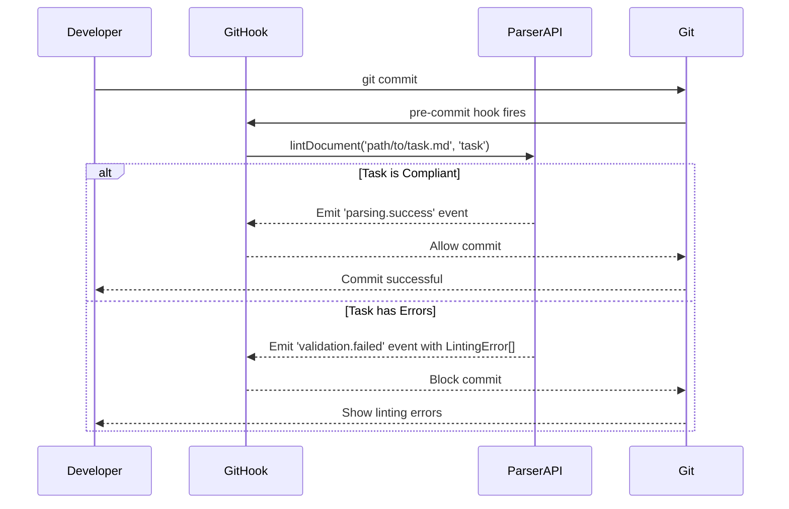
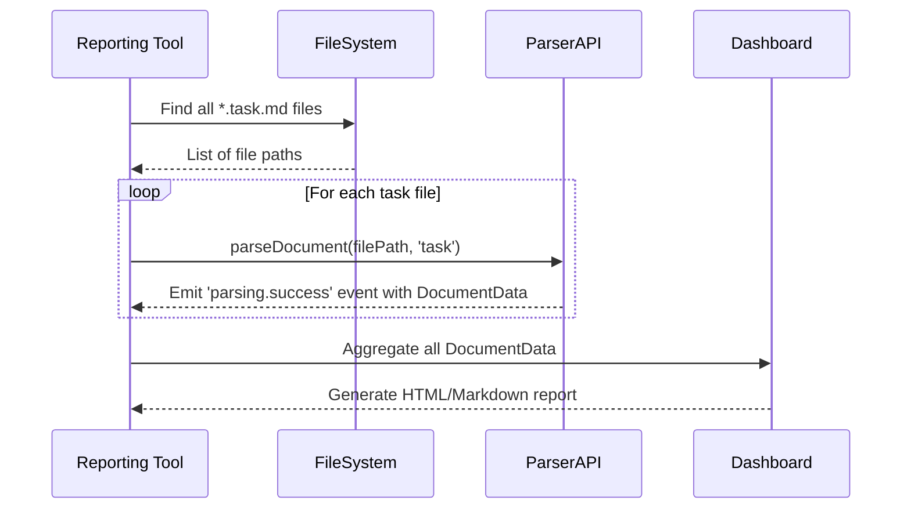
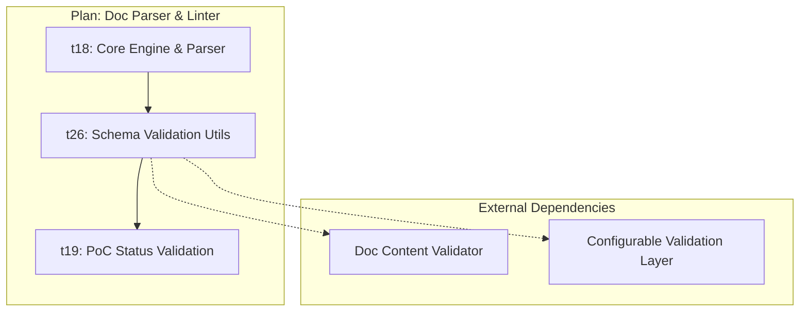
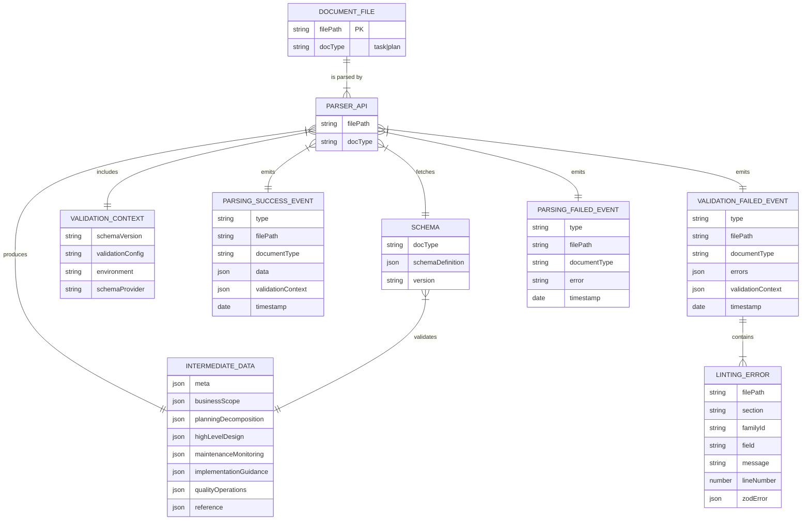
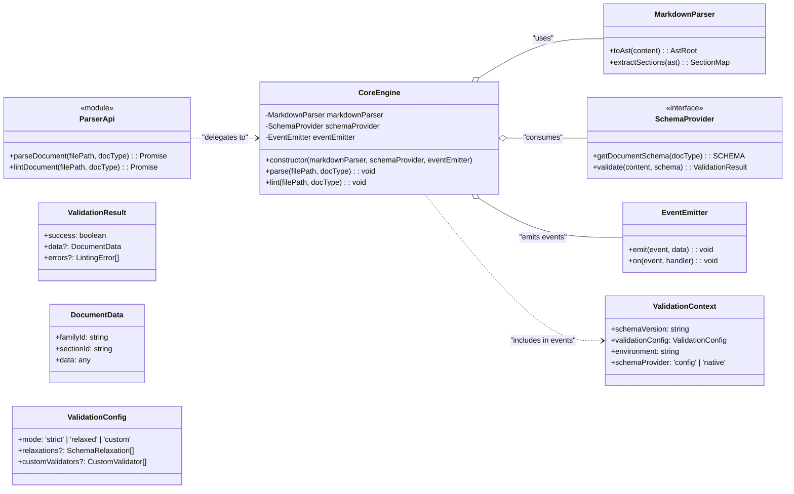
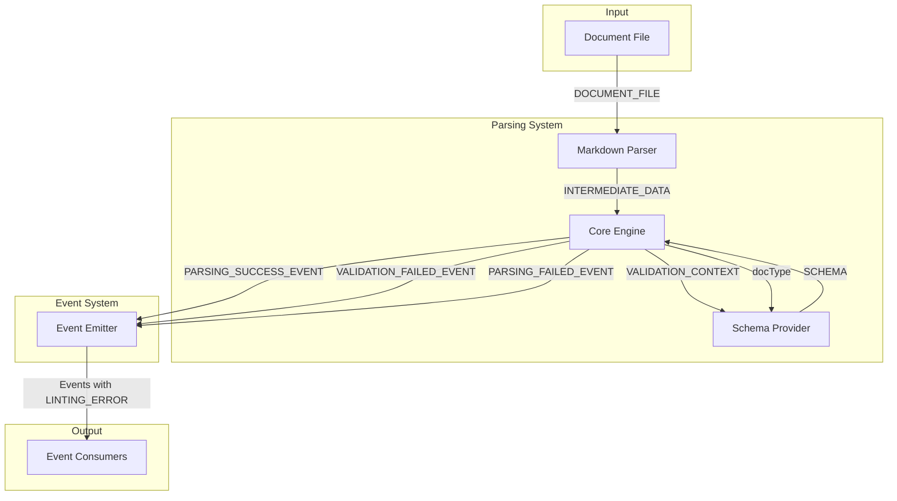
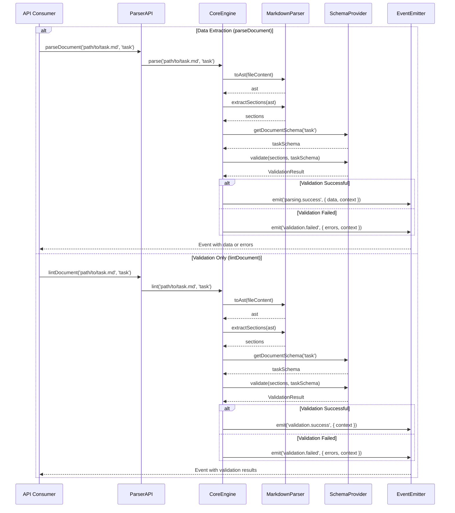

# Documentation Parser & Linter

## 1 Meta & Governance

### 1.2 Status

- **Created:** 2025-07-24 16:20
- **Last Updated:** 2025-08-07 22:30

### 1.3 Priority Drivers

- [TEC-Dev_Productivity_Enhancement](../ddd-2.md#tec-dev_productivity_enhancement)
- [TEC-Prod_Stability_Blocker](../ddd-2.md#tec-prod_stability_blocker)

---

## 2 Business & Scope

### 2.1 Overview

- **Core Function**: A modular, event-driven parser that provides a reliable API for **parsing, linting, and extracting structured data** from `*.task.md` and `*.plan.md` files.
- **Key Capability**: Transforms markdown documentation into predictable JSON objects, validates content using schemas from the SchemaProvider interface, and emits events with comprehensive context for downstream tools.
- **Business Value**: Provides the foundational, trustworthy data layer for all documentation-native automation, including status tracking, reporting, and CI/CD integration.

### 2.2 Business Context

To achieve true Documentation-Native Project Management, we need to trust our documentation as a reliable data source. This plan implements a comprehensive three-part process: parsing markdown into structured data, linting content using the validation schemas from the documentation validation system, and extracting reliable data for downstream tools. The validation system provides the validation rules and schemas through its SchemaProvider interface, while the parser implements the parsing engine that applies those rules to ensure data quality and provide trustworthy extracted data.

#### 2.2.1 User Journeys

##### 2.2.1.1 Journey: Developer Commits a Task

A developer attempts to commit changes related to a task.



##### 2.2.1.2 Journey: Reporting Tool Builds a Status Dashboard

An automated reporting tool runs on a schedule to generate a project status dashboard.



#### 2.2.2 User Personas

| Persona             | Goal                                                                                   |
| :------------------ | :------------------------------------------------------------------------------------- |
| **Developer**       | Ensure their documentation is schema-compliant without tedious manual checks.          |
| **Project Manager** | Get an accurate, real-time view of project status based on the single source of truth. |
| **Tool Author**     | Build new tools on a stable, predictable data foundation from the documentation.       |
| **Git Hook Script** | Programmatically enforce documentation quality at the point of contribution.           |

#### 2.2.3 Core Business Rules

- **Three-Part Process**: Parsing (markdown → structured data), Linting (validate using schemas from SchemaProvider), and Event Emission (provide reliable data through events).
- **API First**: The core logic must be exposed as a reusable, programmatic API. The CLI is a consumer of this API.
- **Fail Fast**: The parser must fail gracefully when structural issues prevent reliable data extraction.
- **Schema-Driven**: All parsing, linting, and extraction logic is guided by schemas from SchemaProvider to ensure data quality and consistency.
- **Document-Type Aware**: The system must handle both `*.task.md` and `*.plan.md` files with appropriate schema validation.

#### 2.2.4 User Stories

- As a **Developer**, I want to **receive structured data events** from my task and plan documents, so that I can build automation tools on top of reliable data.
- As a **Project Manager**, I want to **receive events** with status and estimates from all tasks via a stable API, so that I can generate an accurate, real-time project status report.
- As a **Tool Author**, I want a reliable **event-driven API** to parse any `*.task.md` or `*.plan.md` file, so I can build tools on top of the DDD ecosystem.
- As a **Reporting System**, I want to **receive events** from documentation files, so I can aggregate and analyze project information programmatically.

### 2.3 Success Criteria

- Reliable structured data can be received through events from compliant task and plan documentation files.
- Content validation errors are clearly identified and reported through linting using schemas from SchemaProvider.
- A proof-of-concept demonstrates successful parsing, linting, and validation of the `1.2 Status` section.
- Events are emitted with comprehensive context including validation metadata for all parsing and validation operations.
- The system can process and validate all documentation files within the project scope.
- Security boundaries prevent processing files outside the intended scope.
- The system correctly handles document-type-specific schema validation (task vs plan).

### 2.5 Boundaries & Scope

#### 2.5.1 In Scope

- A core parsing engine that converts markdown to an AST and extracts sections.
- An event-driven architecture that emits parsing and validation events.
- A programmatic API for linting and emitting events (`lintDocument`, `parseDocument`).
- A proof-of-concept implementation for the `1.2 Status` section validation (see Success Criteria).
- Integration with SchemaProvider interface for validation.

#### 2.5.2 Out of Scope

- Section-specific validation processors (handled by Documentation Content Validator).
- Automatic fixing of linting errors.
- Comprehensive content validation (handled by Documentation Content Validator).
- A user interface for viewing extracted data (this would be a separate tool consuming the events).
- Git hook implementations (the events will be provided, but hook implementation is a separate consumer module).

### 2.6 Core Business Processes

This plan introduces a new capability and does not modify existing business processes. It enables future processes that consume parsing and validation events:

- **Documentation Quality Assurance**: Git hooks and CI/CD pipelines can consume validation events to enforce documentation standards
- **Project Status Reporting**: Automated tools can consume parsing events to generate real-time project dashboards
- **Documentation Analytics**: Tools can analyze parsing events to track documentation completeness and quality trends
- **Integration Workflows**: External systems can consume events to sync documentation data with project management tools

---

## 3 Planning & Decomposition

### 3.1 Roadmap (In-Focus Items)

| ID  | Child Plan/Task                                                                  | Priority | Priority Drivers                 | Status         | Depends On | Summary                                                                            |
| :-- | :------------------------------------------------------------------------------- | :------- | :------------------------------- | :------------- | :--------- | :--------------------------------------------------------------------------------- |
| t18 | [Core Engine & Markdown Parser](./p1.p5.t18-core-engine-parser.task.md)          | 🟥 High  | TEC-Dev_Productivity_Enhancement | ✅ Complete    | —          | Sets up the core file discovery and AST generation capabilities.                   |
| t26 | [Schema Validation Utils](./p1.p5.t26-schema-validation-utils.task.md)           | 🟥 High  | TEC-Dev_Productivity_Enhancement | 💡 Not Started | t18        | Creates schema-aware validation helpers using SchemaProvider interface.            |
| t19 | [PoC Implementation for `1.2 Status`](./p1.p5.t19-poc-status-validation.task.md) | 🟥 High  | TEC-Dev_Productivity_Enhancement | 💡 Not Started | t26        | Implements the first event-driven validation implementation as a proof-of-concept. |

### 3.2 Backlog / Icebox

- Validation implementations for all other schema sections.
- Integration with git hooks to auto-lint on commit (separate consumer module).
- Integration with content validator for comprehensive validation workflows.
- Event consumer modules for reporting and analytics.
- Event consumer modules for external system integrations.

### 3.3 Dependencies

| ID  | Dependency On                                                                  | Type     | Status         | Affected Plans/Tasks | Notes                                                                   |
| :-- | :----------------------------------------------------------------------------- | :------- | :------------- | :------------------- | :---------------------------------------------------------------------- |
| D-1 | [Doc Content Validator](./p1.p6-doc-content-validator.plan.md)                 | Internal | ⏳ In Progress | All                  | Provides the base SchemaProvider interface for validation.              |
| D-2 | [Configurable Validation Layer](./p1.p8-configurable-validation-layer.plan.md) | Internal | 💡 Not Started | All                  | Provides configurable SchemaProvider interface for brownfield projects. |
| D-3 | `remark` npm package                                                           | External | ✅ Done        | t18                  | Chosen for robust markdown-to-AST parsing.                              |
| D-4 | `glob` npm package                                                             | External | ✅ Done        | t18                  | For finding all `*.task.md` and `*.plan.md` files.                      |
| D-5 | `unist-util-visit`                                                             | External | ✅ Done        | t19                  | For traversing the AST.                                                 |
| D-6 | `zod` npm package                                                              | External | ✅ Done        | t26                  | For schema validation integration.                                      |
| D-7 | `events` (Node.js built-in)                                                    | External | ✅ Done        | All                  | For event-driven architecture and event emission.                       |

### 3.4 Decomposition Graph



---

## 4 High-Level Design

### 4.0 Guiding Principles

- **Event-Driven**: The core functionality must be exposed via events with comprehensive context. Various tools (git hooks, reporting systems, CI/CD pipelines) can consume these events.
- **Schema-Agnostic**: The system must work with any schema provider that implements the SchemaProvider interface.
- **Schema-Driven**: All validation logic must be derived from schemas provided by the SchemaProvider interface to ensure consistency and maintainability.
- **Extensibility**: Adding new validation rules should not require changes to the core engine.
- **Document-Type Aware**: The system must handle both task and plan documents with appropriate schema validation.

### 4.1 Current Architecture

This is a new component, so there is no current architecture. It will be built within the existing `ddd-tools` project structure, likely under `src/doc-parser/`.

### 4.2 Target Architecture

#### 4.2.1 Data Models



#### 4.2.2 Components



#### 4.2.3 Data Flow



#### 4.2.4 Control Flow



#### 4.2.5 Integration Points

##### 4.2.5.1 Upstream Integrations

- **Input**: The parser is triggered by receiving a file path to a `*.task.md` or `*.plan.md` document.
- **Data**: It consumes the raw Markdown text content from the file system.
- **Schema Integration**: It consumes a SchemaProvider interface for validation.

##### 4.2.5.2 Downstream Integrations

- **Output**: The parser emits events with full context including validation results and metadata.
- **Event Types**:
  - **`parsing.success`**: Emitted when document is successfully parsed and validated (includes full data)
  - **`validation.success`**: Emitted when validation-only operation succeeds (minimal data)
  - **`validation.failed`**: Emitted when validation fails with detailed error information
  - **`parsing.failed`**: Emitted when markdown parsing fails (critical error)
- **Event Consumers**:
  - **CLI Tools**: Command-line interfaces that listen for validation events to display results
  - **Git Hooks**: Pre-commit hooks that listen for validation events to block commits
  - **Reporting Tools**: Status tracking and reporting tools that listen for parsing events
  - **Analytics Systems**: Tools that consume parsing events for data analysis
  - **Integration Systems**: External tools that consume events for custom processing
  - **Future Subscribers**: Any system can subscribe to events for custom processing

#### 4.2.6 Exposed API

The primary entry point for this system will be a set of exported functions and event interfaces from the main module (`src/doc-parser/index.ts`).

```typescript
/**
 * Represents the structured data extracted from a document file.
 * The structure mirrors the schema families and is dynamic based on document type.
 */
export interface DocumentData {
  [familyId: string]: {
    [sectionId: string]: any; // Dynamic based on schema validation
  };
}

/**
 * Represents a single validation error found during linting.
 */
export interface LintingError {
  filePath: string;
  section: string; // e.g., "1.2 Status"
  familyId: string; // e.g., "1" for Meta & Governance
  field?: string; // Specific field that failed validation
  message: string; // e.g., "Required field 'Priority' is missing."
  lineNumber?: number; // Line number if available from markdown parsing
  zodError?: ZodError; // Original Zod validation error
}

/**
 * Represents the validation context including schema and environment information.
 */
export interface ValidationContext {
  schemaVersion: string;
  validationConfig: ValidationConfig;
  environment: 'dev' | 'staging' | 'prod';
  schemaProvider: 'config' | 'native';
}

/**
 * Represents the result of a validation operation.
 */
export interface ValidationResult {
  success: boolean;
  data?: DocumentData;
  errors?: LintingError[];
}

/**
 * Event emitted when document parsing and validation succeeds.
 */
export interface ParsingSuccessEvent {
  type: 'parsing.success';
  filePath: string;
  documentType: 'task' | 'plan';
  data: DocumentData;
  validationContext: ValidationContext;
  timestamp: Date;
}

/**
 * Event emitted when document validation fails.
 */
export interface ValidationFailedEvent {
  type: 'validation.failed';
  filePath: string;
  documentType: 'task' | 'plan';
  errors: LintingError[];
  validationContext: ValidationContext;
  timestamp: Date;
}

/**
 * Event emitted when document parsing fails (critical error).
 */
export interface ParsingFailedEvent {
  type: 'parsing.failed';
  filePath: string;
  documentType: 'task' | 'plan';
  error: Error;
  timestamp: Date;
}

/**
 * Event emitted when validation-only operation succeeds.
 */
export interface ValidationSuccessEvent {
  type: 'validation.success';
  filePath: string;
  documentType: 'task' | 'plan';
  validationContext: ValidationContext;
  timestamp: Date;
}

/**
 * Document type enumeration.
 */
export type DocumentType = 'task' | 'plan';

/**
 * Schema provider interface for validation.
 */
export interface SchemaProvider {
  getDocumentSchema(docType: DocumentType): SCHEMA;
  validate(content: any, schema: SCHEMA): ValidationResult;
}

/**
 * Parses a document file and emits data extraction events.
 * @param filePath The path to the *.task.md or *.plan.md file.
 * @param docType The type of document ('task' or 'plan').
 * @returns A promise that resolves when processing is complete.
 */
export function parseDocument(filePath: string, docType: DocumentType): Promise<void>;

/**
 * Validates a document file against the schema and emits validation events.
 * @param filePath The path to the *.task.md or *.plan.md file.
 * @param docType The type of document ('task' or 'plan').
 * @returns A promise that resolves when validation is complete.
 */
export function lintDocument(filePath: string, docType: DocumentType): Promise<void>;

/**
 * Event emitter for subscribing to parsing and validation events.
 */
export const eventEmitter: EventEmitter;
```

### 4.3 Tech Stack & Deployment

- **Language**: TypeScript
- **Markdown Parsing**: `remark` and related `unified` ecosystem libraries.
- **File System**: `glob` for file discovery.
- **Schema Validation**: `zod` for integration with schema validation system.
- **Event System**: Node.js built-in `events` module for event emission.
- **Testing**: Vitest
- **Deployment**: The API will be an internal module of the `ddd-tools` npm package, consumed by various event consumers including CLI tools, git hooks, and reporting systems.

### 4.4 Non-Functional Requirements

#### 4.4.1 Performance

| ID      | Requirement                                          | Priority  |
| :------ | :--------------------------------------------------- | :-------- |
| PERF-01 | Parsing a single 10kb task file should take < 100ms. | 🟧 Medium |

#### 4.4.2 Security

| ID     | Requirement                                                          | Priority |
| :----- | :------------------------------------------------------------------- | :------- |
| SEC-01 | Schemas must not execute any untrusted code from the parsed content. | 🟥 High  |

#### 4.4.3 Reliability

| ID     | Requirement                                                                                            | Priority |
| :----- | :----------------------------------------------------------------------------------------------------- | :------- |
| REL-01 | The parser must correctly identify all violations defined in the PoC `Status` validation.              | 🟥 High  |
| REL-02 | The parser must not lose or corrupt data from the `Status` section.                                    | 🟥 High  |
| REL-03 | The system must correctly handle both task and plan document types with appropriate schema validation. | 🟥 High  |
| REL-04 | Event emission must be reliable and consistent across all parsing and validation operations.           | 🟥 High  |

#### 4.4.4 Permission Model

Not applicable.

---

## 5 Maintenance and Monitoring

### 5.2 Target Maintenance and Monitoring

#### 5.2.1 Error Handling

| ID       | Error Type                  | Trigger                                                           | Action                                                | Consumer Feedback                                                            |
| :------- | :-------------------------- | :---------------------------------------------------------------- | :---------------------------------------------------- | :--------------------------------------------------------------------------- |
| ERROR-01 | **File Not Found**          | `parseDocument` or `lintDocument` is called with an invalid path. | Emit `parsing.failed` event with error.               | `ERROR: File not found at [path].`                                           |
| ERROR-02 | **Validation Failure**      | A document file violates a schema rule.                           | Emit `validation.failed` event with `LintingError[]`. | Structured `LintingError` objects detailing the failure.                     |
| ERROR-03 | **Parsing Error**           | The file is malformed markdown.                                   | Emit `parsing.failed` event with error.               | `ERROR: Failed to parse markdown in [file].`                                 |
| ERROR-04 | **Schema Validation Error** | SchemaProvider fails to validate content against the schema.      | Emit `validation.failed` event with error.            | `ERROR: Failed to validate content against schema for document type [type].` |
| ERROR-05 | **Document Type Error**     | An invalid document type is provided to the API.                  | Emit `parsing.failed` event with error.               | `ERROR: Invalid document type [type]. Must be 'task' or 'plan'.`             |
| ERROR-06 | **Validation Success**      | A document file passes all schema validations.                    | Emit `validation.success` event with context.         | Validation passed with schema version and configuration details.             |

#### 5.2.2 Logging & Monitoring

- **Logging**: The API itself will not log, but will emit events with results and errors. Logging is handled by event consumers.
- **Monitoring**: Not applicable for a local CLI tool.

---

## 6 Implementation Guidance

### 6.1 Implementation Plan

This project will be implemented in three phases as outlined in the roadmap:

1.  **Core Engine**: Build the foundational file loading, AST generation, and event emission logic with schema validation integration.
2.  **Status Validation**: Create the first proof-of-concept validation for the `1.2 Status` section to prove the architecture.
3.  **Event Consumer Integration**: Ensure events are properly consumed by various tools and validate the event-driven architecture.

---

## 7 Quality & Operations

### 7.1 Testing Strategy / Requirements

The overall testing approach combines unit tests for isolated logic and integration tests for component interactions. A comprehensive End-to-End (E2E) testing strategy, detailed in the child tasks, will validate the event-driven architecture and integration with various consumers.

#### Unit & Integration Tests

| ID      | Scenario                                                       | Test Type   | Tools / Runner | Notes                                                                                   |
| :------ | :------------------------------------------------------------- | :---------- | :------------- | :-------------------------------------------------------------------------------------- |
| TEST-01 | `parseDocument` emits `parsing.failed` for an invalid file     | Unit        | Vitest         | Ensure the event is emitted with appropriate error context.                             |
| TEST-02 | `lintDocument` emits `validation.failed` for an invalid file   | Unit        | Vitest         | Ensure the event is emitted with a non-empty `LintingError[]` array.                    |
| TEST-03 | `parseDocument` emits `parsing.success` for a valid file       | Unit        | Vitest         | Check that the extracted `DocumentData` object matches the source file content.         |
| TEST-04 | Event emission works correctly for invalid files               | Integration | Vitest         | Ensure `validation.failed` events are emitted with proper error context.                |
| TEST-05 | Event emission works correctly for valid files                 | Integration | Vitest         | Ensure `parsing.success` events are emitted with proper data context.                   |
| TEST-06 | Schema validation works correctly for both task and plan types | Unit        | Vitest         | Test that SchemaProvider integration works for both document types.                     |
| TEST-07 | `lintDocument` emits `validation.success` for a valid file     | Unit        | Vitest         | Ensure the event is emitted with validation context but no data payload.                |
| TEST-08 | Event emitter injection works correctly                        | Unit        | Vitest         | Test that CoreEngine properly uses injected EventEmitter dependency.                    |
| TEST-09 | SchemaProvider interface integration works correctly           | Integration | Vitest         | Test that SchemaProvider.getDocumentSchema() and validate() are called correctly.       |
| TEST-10 | Event emission includes proper validation context              | Unit        | Vitest         | Ensure all events include schemaVersion, validationConfig, environment, schemaProvider. |
| TEST-11 | SchemaProvider failure handling                                | Unit        | Vitest         | Test behavior when SchemaProvider.getDocumentSchema() throws an error.                  |

#### End-to-End (E2E) Testing Strategy

To ensure full coverage and reliability, a suite of E2E tests will validate the entire event-driven workflow. This provides confidence that all components (Core Engine, Parser, Schema Validator, Event Emitter) are integrated correctly and events are properly emitted and consumed.

| ID     | Scenario                                                                              | Test Type | Tools / Runner | Notes                                                                                                                                                           |
| :----- | :------------------------------------------------------------------------------------ | :-------- | :------------- | :-------------------------------------------------------------------------------------------------------------------------------------------------------------- |
| E2E-01 | Event emission works correctly for valid task files with comprehensive context.       | E2E       | Vitest         | Create a `test-fixtures/valid.task.md` that adheres perfectly to the schema for all implemented validations (e.g., the `1.2 Status` section).                   |
| E2E-02 | Event emission works correctly for valid plan files with comprehensive context.       | E2E       | Vitest         | Create a `test-fixtures/valid.plan.md` that adheres perfectly to the schema for all implemented validations.                                                    |
| E2E-03 | Event emission works correctly for invalid task files with proper error context.      | E2E       | Vitest         | Create `test-fixtures/invalid-missing-field.task.md`. Assert that `validation.failed` events contain the expected error context.                                |
| E2E-04 | Event emission works correctly for invalid task files with proper type error context. | E2E       | Vitest         | Create `test-fixtures/invalid-type.task.md` (e.g., `Progress` is not a number). Assert that `validation.failed` events contain the expected type error context. |
| E2E-05 | Event emission works correctly for non-existent files with proper error context.      | E2E       | Vitest         | Run `parseDocument('non-existent-file.task.md', 'task')` and assert the correct `parsing.failed` event is emitted.                                              |
| E2E-06 | Event consumer integration works correctly with multiple listeners                    | E2E       | Vitest         | Test that multiple event consumers can subscribe to and receive events from the parser.                                                                         |
| E2E-07 | Event emission timing and consistency across multiple operations                      | E2E       | Vitest         | Ensure events are emitted consistently and in the correct order for both parseDocument and lintDocument operations.                                             |

### 7.2 Configuration

The parser operates with minimal configuration requirements, leveraging dependency injection and event-driven architecture for flexibility.

| ID        | Setting Name     | Source                   | Default         | Override Method         | Notes                                                          |
| :-------- | :--------------- | :----------------------- | :-------------- | :---------------------- | :------------------------------------------------------------- |
| CONFIG-01 | `schemaProvider` | SchemaProvider injection | `'native'`      | Constructor parameter   | Determines which schema provider to use ('native' or 'config') |
| CONFIG-02 | `eventEmitter`   | EventEmitter injection   | Required        | Constructor parameter   | Event emitter instance for publishing events                   |
| CONFIG-03 | `NODE_ENV`       | Environment Variable     | `'development'` | `NODE_ENV` env var      | `'development'`, `'staging'`, or `'production'`                |
| CONFIG-04 | `DDD_LOG_LEVEL`  | Environment Variable     | `'info'`        | `DDD_LOG_LEVEL` env var | Controls logging verbosity for event consumers                 |

**Schema Integration**: The parser integrates with the existing schema system from `src/ddd-schema-json/` directory through the injected SchemaProvider interface.

**Event Configuration**: Event emission is configured through the injected EventEmitter, supporting all event types (`'parsing.success'`, `'validation.success'`, `'validation.failed'`, `'parsing.failed'`) with comprehensive context including schemaVersion, validationConfig, environment, and schemaProvider.

### 7.3 Alerting & Response

The parser operates as an event emitter, so alerting and response are handled by event consumers rather than the parser itself.

#### 7.3.1 Event-Based Alerting

| ID       | Alert Condition             | Event Type          | Consumer Response                                       | Notes                                                    |
| :------- | :-------------------------- | :------------------ | :------------------------------------------------------ | :------------------------------------------------------- |
| ALERT-01 | Document parsing fails      | `parsing.failed`    | Consumer logs error and may block further processing    | Critical error that prevents document processing         |
| ALERT-02 | Document validation fails   | `validation.failed` | Consumer displays validation errors to user             | Non-critical, allows user to fix validation issues       |
| ALERT-03 | Schema provider unavailable | `parsing.failed`    | Consumer logs error and may fallback to basic parsing   | System configuration issue requiring immediate attention |
| ALERT-04 | Event emission fails        | System error        | Consumer implements retry logic or graceful degradation | Critical system issue affecting all parsing operations   |

#### 7.3.2 Consumer Response Strategies

- **CLI Tools**: Display errors to console and exit with appropriate error codes
- **Git Hooks**: Block commits and display validation errors to user
- **Reporting Systems**: Log events for analysis and alert on critical failures
- **Integration Systems**: Implement retry logic and graceful degradation

#### 7.3.3 Error Recovery

- **Parser Level**: Emit appropriate events for all error conditions
- **Consumer Level**: Implement retry logic, fallback mechanisms, and user feedback
- **System Level**: Monitor event emission patterns for system health

### 7.4 Deployment Steps

The new API will be part of the standard `ddd-tools` package. Deployment is handled by publishing a new version to npm.

---

## 8 Reference

### 8.1 Appendices/Glossary

- **AST**: Abstract Syntax Tree. A tree representation of the source code (in this case, markdown).
- **EventEmitter**: Node.js built-in module for implementing the observer pattern, used for event emission and consumption.
- **Event-Driven Architecture**: A system design pattern where components communicate primarily by emitting and consuming events.
- **Linter**: A tool that analyzes source code to flag programming errors, bugs, stylistic errors, and suspicious constructs.
- **Parser**: A tool that takes input data (text) and builds a data structure (like an AST or JSON object).
- **SchemaProvider**: An interface that provides document schemas and validation logic.
- **DocumentType**: The classification of a document as either 'task' or 'plan', which determines schema validation.
- **Dependency Injection**: A design pattern where dependencies are provided to a class through its constructor, improving testability and flexibility.
- **Zod**: The schema validation library used for defining and validating content structure rules.
