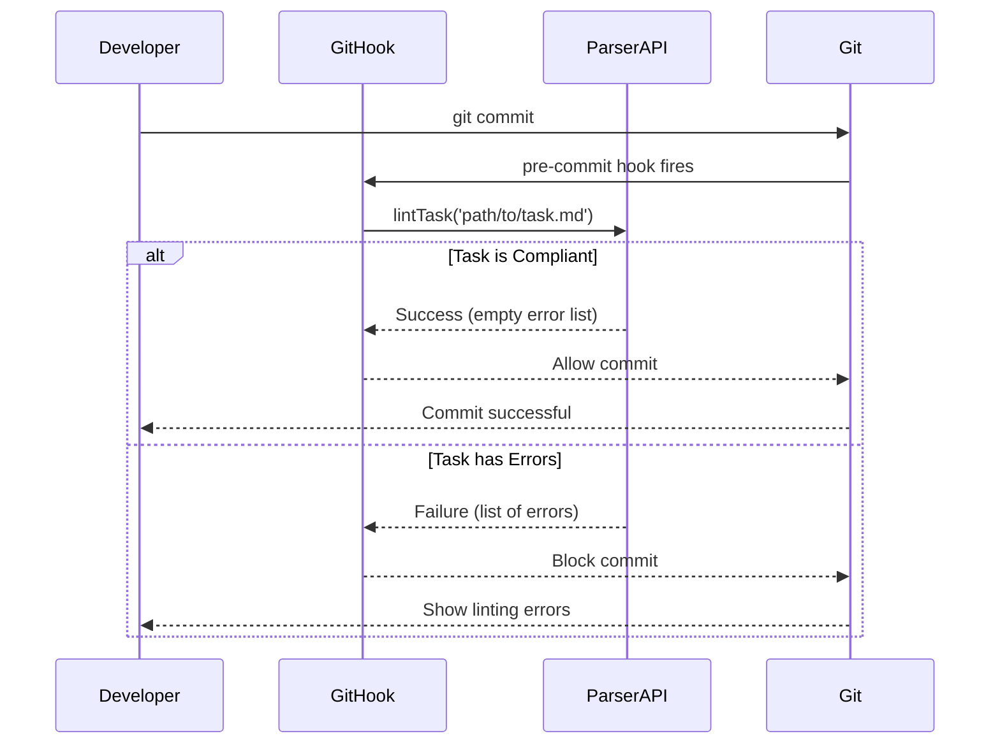
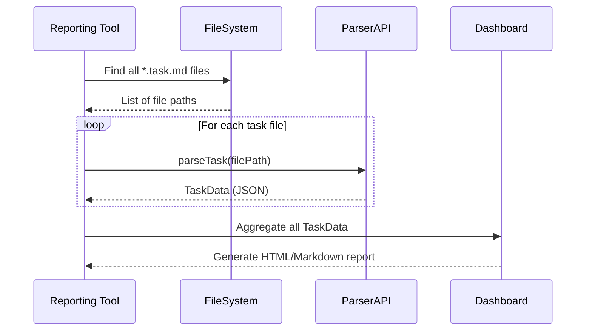
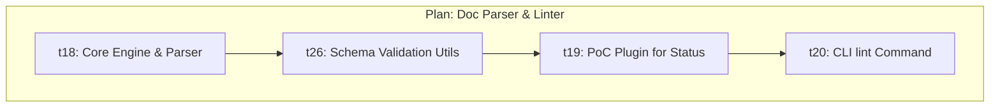
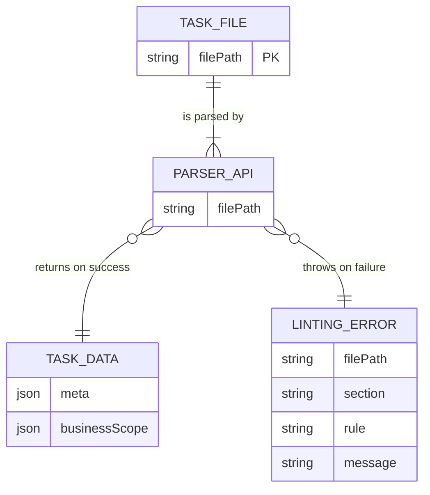
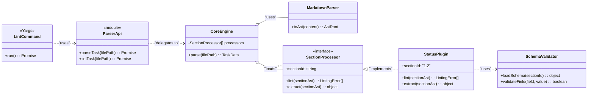
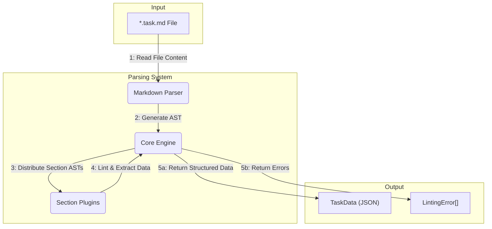
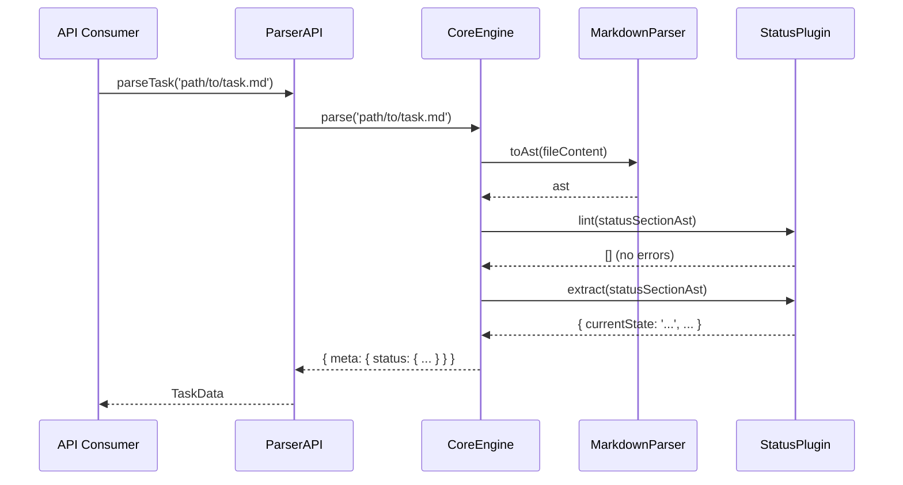

# Documentation Parser & Linter

## 1 Meta & Governance

### 1.2 Status

- **Created:** 2025-07-24 16:20
- **Last Updated:** 2025-07-24 16:20

### 1.3 Priority Drivers

- [TEC-Dev_Productivity_Enhancement](../ddd-2.md#tec-dev_productivity_enhancement)
- [TEC-Prod_Stability_Blocker](../ddd-2.md#tec-prod_stability_blocker)

---

## 2 Business & Scope

### 2.1 Overview

- **Core Function**: A modular, schema-aware parser that provides a reliable API for **extracting structured data** from `*.task.md` files.
- **Key Capability**: Programmatically validates documentation against the canonical schema (linting) and transforms it into a predictable JSON object.
- **Business Value**: Provides the foundational, trustworthy data layer for all documentation-native automation, including status tracking, reporting, and CI/CD integration.

### 2.2 Business Context

To achieve true Documentation-Native Project Management, we need to trust our documentation as a reliable data source. Manual validation is error-prone and doesn't scale. This tool will act as an automated guardian of our documentation's structural integrity. By linting files before they are committed, we ensure that any tool reading them can operate on consistent, predictable data. This is the first and most critical step toward building higher-level project management automation.

#### 2.2.1 User Journeys

##### 2.2.1.1 Journey: Developer Commits a Task

A developer attempts to commit changes related to a task.



##### 2.2.1.2 Journey: Reporting Tool Builds a Status Dashboard

An automated reporting tool runs on a schedule to generate a project status dashboard.



#### 2.2.2 User Personas

| Persona             | Goal                                                                                   |
| :------------------ | :------------------------------------------------------------------------------------- |
| **Developer**       | Ensure their documentation is schema-compliant without tedious manual checks.          |
| **Project Manager** | Get an accurate, real-time view of project status based on the single source of truth. |
| **Tool Author**     | Build new tools on a stable, predictable data foundation from the documentation.       |
| **Git Hook Script** | Programmatically enforce documentation quality at the point of contribution.           |

#### 2.2.3 Core Business Rules

- **Linting before Extraction**: Data must be validated against the schema before it can be extracted.
- **API First**: The core logic must be exposed as a reusable, programmatic API. The CLI is a consumer of this API.
- **Fail Fast**: The linter must block any process (like a git commit) if the documentation is not compliant.
- **Schema-Driven**: All validation rules must be derived directly from the `ddd-schema-json` definitions.

#### 2.2.4 User Stories

- As a **Developer**, I want my task documents to be automatically **validated** when I commit, so that I can be confident they are schema-compliant.
- As a **Project Manager**, I want to **programmatically extract** the status and estimates from all tasks via a stable API, so that I can generate an accurate, real-time project status report.
- As a **Tool Author**, I want a reliable **API** to parse any `*.task.md` file into a structured object, so I can build tools on top of the DDD ecosystem.
- As a **Git Hook Script**, I want to call a simple function to **lint and extract** data from a staged file, so I can enforce documentation quality before a commit is finalized.

### 2.3 Success Criteria

- An exported function `parseTask(filePath: string): Promise<TaskData>` is available and returns a structured JSON object of the task's content.
- The `parseTask` function returns a result object containing any validation errors, specifying the section and the rule that failed.
- A proof-of-concept plugin for the `1.2 Status` section correctly extracts its key-value pairs into the `TaskData` object.
- A new CLI command, `ddd lint <file>`, is available and uses the `parseTask` API internally to validate a specific file and report errors.
- The `ddd lint` command, when run without arguments, successfully lints all `*.plan.md` and `*.task.md` files within the `docs/` directory.
- The command prevents linting files outside of the `docs/` directory.

### 2.5 Boundaries & Scope

#### 2.5.1 In Scope

- A core parsing engine that converts markdown to an AST.
- A plugin-based architecture for section-specific processors.
- A programmatic API for linting and extracting data (`lintTask`, `parseTask`).
- A proof-of-concept plugin for the `1.2 Status` section.
- A `ddd lint` CLI command to run the linter on a single file or an entire directory.

#### 2.5.2 Out of Scope

- Plugins for all schema sections (they will be added incrementally in the backlog).
- Automatic fixing of linting errors.
- A user interface for viewing extracted data (this would be a separate tool consuming the API).
- Direct integration with git hooks (the API will be provided, but the hook implementation is a separate task).

### 2.6 Core Business Processes

This plan introduces a new capability and does not modify existing business processes. It enables future processes like automated status reporting.

---

## 3 Planning & Decomposition

### 3.1 Roadmap (In-Focus Items)

| ID  | Child Plan/Task                                                         | Priority  | Priority Drivers                 | Status         | Depends On | Summary                                                             |
| :-- | :---------------------------------------------------------------------- | :-------- | :------------------------------- | :------------- | :--------- | :------------------------------------------------------------------ |
| t18 | [Core Engine & Markdown Parser](./p1-p5.t18-core-engine-parser.task.md) | 🟥 High   | TEC-Dev_Productivity_Enhancement | ✅ Complete    | —          | Sets up the core file discovery and AST generation capabilities.    |
| t26 | [Schema Validation Utils](./p1-p5.t26-schema-validation-utils.task.md)  | 🟥 High   | TEC-Dev_Productivity_Enhancement | 💡 Not Started | t18        | Creates schema-aware validation helpers for plugins.                |
| t19 | [PoC Plugin for `1.2 Status`](./p1-p5.t19-poc-plugin-status.task.md)    | 🟥 High   | TEC-Dev_Productivity_Enhancement | 💡 Not Started | t26        | Implements the first linter/extractor plugin as a proof-of-concept. |
| t20 | [CLI `lint` Command Integration](./p1-p5.t20-cli-lint-command.task.md)  | 🟧 Medium | TEC-Dev_Productivity_Enhancement | 💡 Not Started | t19        | Exposes the new linter functionality via the `ddd` command.         |

### 3.2 Backlog / Icebox

- Plugins for all other schema sections.
- Integration with `ddd commit` hook to auto-lint on commit.
- A command to aggregate extracted data from all tasks into a single report.

### 3.3 Dependencies

| ID  | Dependency On        | Type     | Status         | Affected Plans/Tasks | Notes                                              |
| :-- | :------------------- | :------- | :------------- | :------------------- | :------------------------------------------------- |
| D-1 | `remark` npm package | External | 💡 Not Started | t18                  | Chosen for robust markdown-to-AST parsing.         |
| D-2 | `glob` npm package   | External | 💡 Not Started | t18, t20             | For finding all `*.task.md` and `*.plan.md` files. |
| D-3 | `unist-util-visit`   | External | 💡 Not Started | t19                  | For traversing the AST.                            |
| D-4 | `chalk` npm package  | External | 💡 Not Started | t20                  | For color-coded CLI output.                        |

### 3.4 Decomposition Graph



---

## 4 High-Level Design

### 4.0 Guiding Principles

- **API First**: The core functionality must be exposed via a clean, reusable programmatic interface. The CLI is a consumer of this API.
- **Modularity**: The system must be built as a collection of independent "section processor" plugins, one for each schema section.
- **Schema-Driven**: All validation and extraction logic must be derived from the canonical JSON schema definitions to ensure consistency and maintainability.
- **Extensibility**: Adding a linter/parser for a new section should not require changes to the core engine.

### 4.1 Current Architecture

This is a new component, so there is no current architecture. It will be built within the existing `ddd-tools` project structure, likely under `src/doc-parser/`.

### 4.2 Target Architecture

#### 4.2.1 Data Models



#### 4.2.2 Components



#### 4.2.3 Data Flow



#### 4.2.4 Control Flow



#### 4.2.5 Integration Points

##### 4.2.5.1 Upstream Integrations

- **Input**: The parser is triggered by receiving a file path to a `*.task.md` document.
- **Data**: It consumes the raw Markdown text content from the file system.

##### 4.2.5.2 Downstream Integrations

- **Output**: The parser's primary output is a structured `TaskData` JSON object or an array of `LintingError` objects.
- **Consumers**:
  - **CLI**: The `ddd lint` command will consume the `LintingError[]` array to display results to the user.
  - **Git Hooks**: A `pre-commit` hook will consume the `lintTask` API to validate files.
  - **Future Reporting Tools**: Other tools will consume the `parseTask` API to get `TaskData` for aggregation and reporting.

#### 4.2.6 Exposed API

The primary entry point for this system will be a set of exported functions from the main module (`src/document-parser/index.ts`).

```typescript
/**
 * Represents the structured data extracted from a task file.
 * The structure mirrors the schema families.
 */
export interface TaskData {
  meta: {
    status: {
      currentState: string;
      priority: string;
      progress: number;
      planningEstimate: number;
      // ... and other status fields
    };
    priorityDrivers: string[];
  };
  // ... other families will be added here as plugins are implemented.
}

/**
 * Represents a single validation error found during linting.
 */
export interface LintingError {
  filePath: string;
  section: string; // e.g., "1.2 Status"
  message: string; // e.g., "Required field 'Priority' is missing."
}

/**
 * Represents the result of a parsing operation, which may include
 * both extracted data and any validation errors that were found.
 */
export interface ParseResult {
  data: TaskData | null;
  errors: LintingError[];
}

/**
 * Parses and validates a task file, returning its structured data and any errors.
 * @param filePath The path to the *.task.md file.
 * @returns A promise that resolves with a ParseResult object.
 */
export function parseTask(filePath: string): Promise<ParseResult>;

/**
 * Validates a task file against the schema without extracting data.
 * @param filePath The path to the *.task.md file.
 * @returns A promise that resolves with an array of LintingError objects. The array is empty if the file is valid.
 */
export function lintTask(filePath: string): Promise<LintingError[]>;
```

### 4.3 Tech Stack & Deployment

- **Language**: TypeScript
- **Markdown Parsing**: `remark` and related `unified` ecosystem libraries.
- **File System**: `glob` for file discovery.
- **Testing**: Vitest
- **Deployment**: The API will be an internal module of the `ddd-tools` npm package. The CLI command will be exposed via the existing `ddd` executable.

### 4.4 Non-Functional Requirements

#### 4.4.1 Performance

| ID      | Requirement                                          | Priority  |
| :------ | :--------------------------------------------------- | :-------- |
| PERF-01 | Parsing a single 10kb task file should take < 100ms. | 🟧 Medium |

#### 4.4.2 Security

Not applicable for this local development tool.

#### 4.4.3 Reliability

| ID     | Requirement                                                                           | Priority |
| :----- | :------------------------------------------------------------------------------------ | :------- |
| REL-01 | The linter must correctly identify all violations defined in the PoC `Status` plugin. | 🟥 High  |
| REL-02 | The extractor must not lose or corrupt data from the `Status` section.                | 🟥 High  |

#### 4.4.4 Permission Model

Not applicable.

---

## 5 Maintenance and Monitoring

### 5.2 Target Maintenance and Monitoring

#### 5.2.1 Error Handling

| Error Type          | Trigger                                                   | Action                                                                | User Feedback                                            |
| :------------------ | :-------------------------------------------------------- | :-------------------------------------------------------------------- | :------------------------------------------------------- |
| **File Not Found**  | `parseTask` or `lintTask` is called with an invalid path. | Reject promise with an error.                                         | `ERROR: File not found at [path].`                       |
| **Linting Failure** | A task file violates a schema rule.                       | Reject `parseTask` promise. Resolve `lintTask` with `LintingError[]`. | Structured `LintingError` objects detailing the failure. |
| **Parsing Error**   | The file is malformed markdown.                           | Reject promise with an error.                                         | `ERROR: Failed to parse markdown in [file].`             |

#### 5.2.2 Logging & Monitoring

- **Logging**: The tool will use standard `console.log` for the CLI output. The API itself will not log, but will return errors.
- **Monitoring**: Not applicable for a local CLI tool.

---

## 6 Implementation Guidance

### 6.1 Implementation Plan

This project will be implemented in three phases as outlined in the roadmap:

1.  **Core Engine**: Build the foundational file loading, AST generation, and plugin management logic.
2.  **Status Plugin**: Create the first proof-of-concept plugin for the `1.2 Status` section to prove the architecture.
3.  **CLI Integration**: Wire the engine into a new `ddd lint` command.

---

## 7 Quality & Operations

### 7.1 Testing Strategy / Requirements

The overall testing approach combines unit tests for isolated logic and integration tests for component interactions. A comprehensive End-to-End (E2E) testing strategy, detailed in the child tasks, will validate the final user-facing functionality from the command line.

#### Unit & Integration Tests

| Scenario                                                | Test Type   | Tools / Runner | Notes                                                                       |
| :------------------------------------------------------ | :---------- | :------------- | :-------------------------------------------------------------------------- |
| `parseTask` rejects promise for an invalid file         | Unit        | Vitest         | Ensure the promise is rejected with a `LintingError[]` array.               |
| `lintTask` resolves with errors for an invalid file     | Unit        | Vitest         | Ensure the promise resolves with a non-empty `LintingError[]` array.        |
| `parseTask` resolves with correct data for a valid file | Unit        | Vitest         | Check that the extracted `TaskData` object matches the source file content. |
| CLI `lint` command exits with code 1 on error           | Integration | Vitest + execa | Run `ddd lint invalid-file.task.md` and check the exit code.                |
| CLI `lint` command exits with code 0 on success         | Integration | Vitest + execa | Run `ddd lint valid-file.task.md` and check the exit code.                  |

#### End-to-End (E2E) Testing Strategy

To ensure full coverage and reliability, a suite of E2E tests will validate the entire workflow from the command line. This provides confidence that all components (Core Engine, Parser, Schema Validator, Plugins) are integrated correctly.

| Scenario                                                                                                | Test Type | Tools / Runner | Notes                                                                                                                                                            |
| :------------------------------------------------------------------------------------------------------ | :-------- | :------------- | :--------------------------------------------------------------------------------------------------------------------------------------------------------------- |
| Running `ddd lint` on a perfectly valid task file exits with code 0 and produces no output.             | E2E       | Vitest + execa | Create a `test-fixtures/valid.task.md` that adheres perfectly to the schema for all implemented plugins (e.g., the `1.2 Status` section).                        |
| Running `ddd lint` on a task file with a missing required field reports the correct error and exits 1.  | E2E       | Vitest + execa | Create `test-fixtures/invalid-missing-field.task.md`. Assert that the CLI output contains the expected error message (e.g., "Missing required field: Priority"). |
| Running `ddd lint` on a task file with a field of the wrong type reports the correct error and exits 1. | E2E       | Vitest + execa | Create `test-fixtures/invalid-type.task.md` (e.g., `Progress` is not a number). Assert that the CLI output contains the expected type error message.             |
| Running `ddd lint` on a non-existent file reports a "file not found" error and exits 1.                 | E2E       | Vitest + execa | Run `ddd lint non-existent-file.task.md` and assert the correct error message is printed to stderr.                                                              |

### 7.2 Configuration

This tool will not require any new configuration initially. It will read the schema from the existing `src/ddd-schema-json/` directory.

### 7.3 Alerting & Response

Not applicable.

### 7.4 Deployment Steps

The new API and CLI command will be part of the standard `ddd-tools` package. Deployment is handled by publishing a new version to npm.

---

## 8 Reference

### 8.1 Appendices/Glossary

- **AST**: Abstract Syntax Tree. A tree representation of the source code (in this case, markdown).
- **Linter**: A tool that analyzes source code to flag programming errors, bugs, stylistic errors, and suspicious constructs.
- **Parser**: A tool that takes input data (text) and builds a data structure (like an AST or JSON object).
- **Plugin**: A self-contained module that adds specific functionality to a core system. In our case, a processor for a single schema section.
