# Core Engine & Markdown Parser (Event-Driven, Schema-Aware)

## 1 Meta & Governance

### 1.2 Status

- **Current State:** 💡 Not Started
- **Priority:** 🟥 High
- **Progress:** 0%
- **Planning Estimate:** 8
- **Est. Variance (pts):** 0
- **Created:** 2025-07-24 16:30
- **Implementation Started:**
- **Completed:**
- **Last Updated:** 2025-08-08 11:00

### 1.3 Priority Drivers

- [TEC-Dev_Productivity_Enhancement](../../ddd-2.md#tec-dev_productivity_enhancement)
- [TEC-Prod_Stability_Blocker](../../ddd-2.md#tec-prod_stability_blocker)

---

## 2 Business & Scope

### 2.1 Overview

- **Core Function**: Provide a dependable foundation that reads project documentation and checks whether it follows the agreed structure.
- **Key Capability**: Produce clear pass/fail results with a concise summary of issues so other tools and workflows can act on them automatically.
- **Business Value**: Enables safe automation (pre-commit checks, CI) and accurate status reporting by trusting documentation as data.

### 2.4 Definition of Done

| ID    | Criterion                                                                                                              |
| :---- | :--------------------------------------------------------------------------------------------------------------------- |
| DoD-1 | The engine can review both Plan and Task documents.                                                                    |
| DoD-2 | For a valid document, it confirms compliance and makes the structured result available to other tools.                 |
| DoD-3 | For an invalid document, it lists specific, actionable issues (what and where) that contributors can fix.              |
| DoD-4 | Results include the context needed by consumers (e.g., ruleset version and environment).                               |
| DoD-5 | Clear messages are provided for common problems (e.g., missing file, wrong document type).                             |
| DoD-6 | A typical 10 KB document is processed within the agreed performance target.                                            |
| DoD-7 | Automated tests demonstrate correct behavior for valid and invalid documents, ensuring predictable outcomes over time. |

---

## 3 Planning & Decomposition

This task uses only the Dependencies section. Roadmap and Backlog are not applicable for a Task.

### 3.3 Dependencies

| ID  | Dependency On                               | Type                | Status         | Affected Items | Notes                                          |
| :-- | :------------------------------------------ | :------------------ | :------------- | :------------- | :--------------------------------------------- |
| D-1 | `remark` + unified ecosystem                | External (npm)      | ✅ Available   | T18            | Markdown → AST.                                |
| D-2 | `events` (Node.js built-in)                 | External (built-in) | ✅ Available   | T18            | Event emission.                                |
| D-3 | P6 `SchemaProvider` (Doc Content Validator) | Internal            | ⏳ In Progress | T18, T26, T19  | Provides schemas and `.validate()` API.        |
| D-4 | Project configuration (`ddd.config.json`)   | Internal            | ✅ Available   | T18            | Environment and validation context parameters. |

---

## 4 High-Level Design

### 4.2 Target Architecture

#### 4.2.1 Data Models


#### 4.2.2 Components


#### 4.2.3 Data Flow


#### 4.2.4 Control Flow

```mermaid
sequenceDiagram
    participant Consumer as API Consumer
    participant ParserApi
    participant CoreEngine
    participant MarkdownParser
    participant SchemaProvider
    participant EventEmitter

    Note over CoreEngine,MarkdownParser: Focus (T18 zoom-in): parse/lint path — DOCUMENT_FILE → AST_NODE → SECTION

    alt Data Extraction (parseDocument)
        Consumer->>ParserApi: parseDocument(filePath: string, docType: DocumentType)
        ParserApi->>CoreEngine: parse(filePath: string, docType: DocumentType)
        CoreEngine->>MarkdownParser: toAst(fileContent: string)
        MarkdownParser-->>CoreEngine: AstRoot
        CoreEngine->>MarkdownParser: extractSections(ast: AstRoot)
        MarkdownParser-->>CoreEngine: Section[]
        CoreEngine->>SchemaProvider: getDocumentSchema(docType: DocumentType)
        SchemaProvider-->>CoreEngine: SCHEMA
        CoreEngine->>SchemaProvider: validate(sections: Section[], schema: Schema)
        SchemaProvider-->>CoreEngine: VALIDATION_RESULT
        alt Validation Successful
            CoreEngine->>EventEmitter: emit('parsing.success', VALIDATION_RESULT)
        else Validation Failed
            CoreEngine->>EventEmitter: emit('validation.failed', VALIDATION_RESULT)
        end
        EventEmitter-->>Consumer: Event with VALIDATION_RESULT
    else Validation Only (lintDocument)
        Consumer->>ParserApi: lintDocument(filePath: string, docType: DocumentType)
        ParserApi->>CoreEngine: lint(filePath: string, docType: DocumentType)
        CoreEngine->>MarkdownParser: toAst(fileContent: string)
        MarkdownParser-->>CoreEngine: AstRoot
        CoreEngine->>MarkdownParser: extractSections(ast: AstRoot)
        MarkdownParser-->>CoreEngine: Section[]
        CoreEngine->>SchemaProvider: getDocumentSchema(docType: DocumentType)
        SchemaProvider-->>CoreEngine: SCHEMA
        CoreEngine->>SchemaProvider: validate(sections: Section[], schema: Schema)
        SchemaProvider-->>CoreEngine: VALIDATION_RESULT
        alt Validation Successful
            CoreEngine->>EventEmitter: emit('validation.success', VALIDATION_RESULT)
        else Validation Failed
            CoreEngine->>EventEmitter: emit('validation.failed', VALIDATION_RESULT)
        end
        EventEmitter-->>Consumer: Event with VALIDATION_RESULT
    end
```



#### 4.2.5 Integration Points

##### 4.2.5.1 Upstream Integrations

- **Input**: `filePath: string`, `docType: DocumentType`
- **Data**: Reads markdown content from the file system (`*.task.md`, `*.plan.md`).
- **Schema Integration**: `SchemaProvider.getDocumentSchema(docType): SCHEMA`, then `validate(sections: Section[], schema: Schema): VALIDATION_RESULT`.
- **Context**: `CoreEngine` builds `VALIDATION_CONTEXT` (schemaVersion, environment, provider, config).

##### 4.2.5.2 Downstream Integrations

- **Output**: Events emitted with `VALIDATION_RESULT` payload (includes `VALIDATION_CONTEXT`).
- **Event Types**:
  - `parsing.success`: Success case; result carries `DOCUMENT_DATA`.
  - `validation.success`: Lint-only success; result has no data, includes context.
  - `validation.failed`: Failure; result carries `LINTING_ERROR[]`.
  - `parsing.failed`: Critical error; emits `ERROR`.
- **Consumers**: CLI tools, Git hooks, reporting/analytics systems, integration services.

#### 4.2.6 Exposed API

```typescript
// Zoom-in: T18 exposes a minimal API surface.
// Events carry VALIDATION_RESULT with VALIDATION_CONTEXT as per plan.

export type DocumentType = 'task' | 'plan';

export interface ParserApi {
  parseDocument(filePath: string, docType: DocumentType): Promise<void>;
  lintDocument(filePath: string, docType: DocumentType): Promise<void>;
}

// Event emitter used for publishing results
export interface EventEmitter {
  emit(event: string, payload: unknown): void;
  on(event: string, handler: (payload: unknown) => void): void;
}

// Emitted events (payloads conform to VALIDATION_RESULT per plan)
// - 'parsing.success'    → ValidationResult<DocumentData, LintingError, ValidationContext>
// - 'validation.success' → ValidationResult<never, LintingError, ValidationContext>
// - 'validation.failed'  → ValidationResult<never, LintingError, ValidationContext>
// - 'parsing.failed'     → Error
```

### 4.3 Tech Stack & Deployment

- **Language**: TypeScript
- **Markdown Parsing**: `remark` and related `unified` libraries
- **Events**: Node.js `events`
- **Validation**: P6 `SchemaProvider`
- **Testing**: Vitest

### 4.4 Non-Functional Requirements

#### 4.4.1 Performance

| ID      | Requirement                                          | Priority  |
| :------ | :--------------------------------------------------- | :-------- |
| PERF-01 | Parsing a single 10kb task file should take < 100ms. | 🟧 Medium |

#### 4.4.2 Security

| ID     | Requirement                                                          | Priority |
| :----- | :------------------------------------------------------------------- | :------- |
| SEC-01 | Schemas must not execute any untrusted code from the parsed content. | 🟥 High  |

#### 4.4.3 Reliability

| ID     | Requirement                                                  | Priority |
| :----- | :----------------------------------------------------------- | :------- |
| REL-01 | Non-existent files emit `parsing.failed` with a clear error. | 🟥 High  |
| REL-02 | Invalid `docType` emits `parsing.failed` with guidance.      | 🟥 High  |
| REL-03 | All events include a complete `VALIDATION_CONTEXT`.          | 🟥 High  |

#### 4.4.4 Permission Model

Not applicable.

---

## 5 Maintenance and Monitoring

### 5.2 Target Maintenance and Monitoring

#### 5.2.1 Error Handling

| ID       | Error Type              | Trigger                                                           | Action                                          | Consumer Feedback                                                            |
| :------- | :---------------------- | :---------------------------------------------------------------- | :---------------------------------------------- | :--------------------------------------------------------------------------- |
| ERROR-01 | File Not Found          | `parseDocument` or `lintDocument` is called with an invalid path. | Emit `parsing.failed` with error.               | `ERROR: File not found at [path].`                                           |
| ERROR-02 | Validation Failure      | A document file violates a schema rule.                           | Emit `validation.failed` with `LintingError[]`. | Structured `LintingError` objects detailing the failure.                     |
| ERROR-03 | Parsing Error           | The file is malformed markdown.                                   | Emit `parsing.failed` with error.               | `ERROR: Failed to parse markdown in [file].`                                 |
| ERROR-04 | Schema Validation Error | SchemaProvider fails to validate content against the schema.      | Emit `validation.failed` with error.            | `ERROR: Failed to validate content against schema for document type [type].` |
| ERROR-05 | Document Type Error     | An invalid document type is provided to the API.                  | Emit `parsing.failed` with error.               | `ERROR: Invalid document type [type]. Must be 'task' or 'plan'.`             |
| ERROR-06 | Validation Success      | A document file passes all schema validations.                    | Emit `validation.success` event with context.   | Validation passed with schema version and configuration details.             |

#### 5.2.2 Logging & Monitoring

- Logging: The API itself will not log, but will emit events with results and errors. Logging is handled by event consumers.
- Monitoring: Not applicable for a local CLI tool.

---

## 6 Implementation Guidance

### 6.1 Implementation Log / Steps

- [ ] Update `src/doc-parser/core-engine.ts` to accept `MarkdownParser`, `SchemaProvider`, `EventEmitter` via constructor and implement `parse` and `lint` with event emission.
- [ ] Update/implement `src/doc-parser/markdown-parser.ts` with `toAst()` and `extractSections()`.
- [ ] Implement `ValidationContext` builder (env, schema version, provider) used by `CoreEngine`.
- [ ] Update `src/doc-parser/index.ts` (`ParserApi`) to export `parseDocument` and `lintDocument` delegating to `CoreEngine`.
- [ ] Add/modify unit tests for parser, engine, API, and event emission paths.
- [ ] Ensure performance smoke test for typical file sizes.

#### 6.1.1 Initial Situation

- Previous implementation referenced a plugin manager architecture. This task aligns the engine to the event-driven, schema-aware model defined in the updated P5 plan.

#### 6.1.2 Files Change Log

| Action | File Path                                      | Notes                                           |
| :----- | :--------------------------------------------- | :---------------------------------------------- |
| MODIFY | `src/doc-parser/core-engine.ts`                | Inject deps; implement event-driven parse/lint. |
| MODIFY | `src/doc-parser/markdown-parser.ts`            | Ensure `extractSections` returns `Section[]`.   |
| MODIFY | `src/doc-parser/index.ts`                      | Expose `parseDocument` and `lintDocument`.      |
| ADD    | `src/doc-parser/validation-context.ts`         | Build `ValidationContext` object.               |
| ADD    | `src/__tests__/doc-parser/core-engine.test.ts` | Event emission and error handling tests.        |
| ADD    | `src/__tests__/doc-parser/api.test.ts`         | ParserApi delegation tests.                     |

---

## 7 Quality & Operations

### 7.1 Testing Strategy / Requirements

| AC ID | DoD Link | Scenario                                                                       | Test Type   | Test File                                      |
| :---- | :------- | :----------------------------------------------------------------------------- | :---------- | :--------------------------------------------- |
| AC-1  | DoD-2    | `parseDocument` emits `parsing.success` for valid files (with data + context). | Unit        | `src/__tests__/doc-parser/api.test.ts`         |
| AC-2  | DoD-3    | `lintDocument` emits `validation.success` for valid files.                     | Unit        | `src/__tests__/doc-parser/api.test.ts`         |
| AC-3  | DoD-3    | `lintDocument` emits `validation.failed` for invalid files (collects errors).  | Unit        | `src/__tests__/doc-parser/core-engine.test.ts` |
| AC-4  | DoD-6    | Non-existent file triggers `parsing.failed` with error details.                | Unit        | `src/__tests__/doc-parser/core-engine.test.ts` |
| AC-5  | DoD-5    | All events include `ValidationContext` fields.                                 | Integration | `src/__tests__/doc-parser/integration.test.ts` |
| AC-6  | DoD-4    | `ParserApi` delegates to `CoreEngine` correctly.                               | Unit        | `src/__tests__/doc-parser/api.test.ts`         |

### 7.2 Configuration

- `NODE_ENV`, `DDD_LOG_LEVEL`, and schema provider selection (native/config) inform `VALIDATION_CONTEXT`.

| ID        | Setting Name     | Source                   | Default         | Override Method       | Notes                                                       |
| :-------- | :--------------- | :----------------------- | :-------------- | :-------------------- | :---------------------------------------------------------- |
| CONFIG-01 | `schemaProvider` | SchemaProvider injection | `'native'`      | Constructor parameter | Selects provider (`'native'` or `'config'`).                |
| CONFIG-02 | `eventEmitter`   | EventEmitter injection   | Required        | Constructor parameter | Event emitter instance to publish results.                  |
| CONFIG-03 | `NODE_ENV`       | Environment Variable     | `'development'` | Env var               | `'development'`, `'staging'`, or `'production'`.            |
| CONFIG-04 | `DDD_LOG_LEVEL`  | Environment Variable     | `'info'`        | Env var               | Consumers use this to control logging verbosity (optional). |

### 7.3 Alerting & Response

- Alerting is owned by consumers; this engine communicates outcomes exclusively via events.

### 7.5 Local Test Commands

```bash
npm test -- src/__tests__/doc-parser/
```

---

## 8 Reference

### 8.1 Appendices/Glossary

- **DOCUMENT_FILE**: A documentation file under validation, identified by `filePath` and `docType`.
- **AST_NODE**: Node in the markdown AST (mdast), with `startLine`/`endLine` where applicable.
- **SECTION**: Per-document sliced section extracted from the AST; carries `sectionId`, `familyId`, `sectionPath`.
- **SCHEMA**: The validation ruleset and version used to validate sections for a given `docType`.
- **VALIDATION_CONTEXT**: Metadata included with all events (e.g., `schemaVersion`, environment, provider, config).
- **VALIDATION_RESULT**: Discriminated result used in events; success carries `DOCUMENT_DATA`, failure carries `LINTING_ERROR[]`.
- **LINTING_ERROR**: Structured validation error item with location and message (optionally includes `zodError`).
- **DOCUMENT_DATA**: Structured extraction output organized by families and sections for valid documents.
- **DocumentType**: `'task' | 'plan'`.
- **ParserApi**: Public API exposing `parseDocument` and `lintDocument` that delegates to `CoreEngine`.
- **CoreEngine**: Orchestrates parsing, validation handshake, and event emission.
- **MarkdownParser**: Builds `AstRoot` and extracts `Section[]` from the AST.
- **EventEmitter**: Node.js event emitter used to publish events to consumers.
