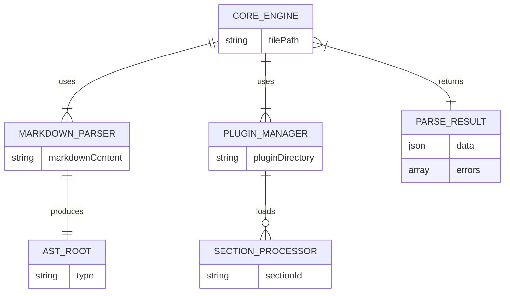
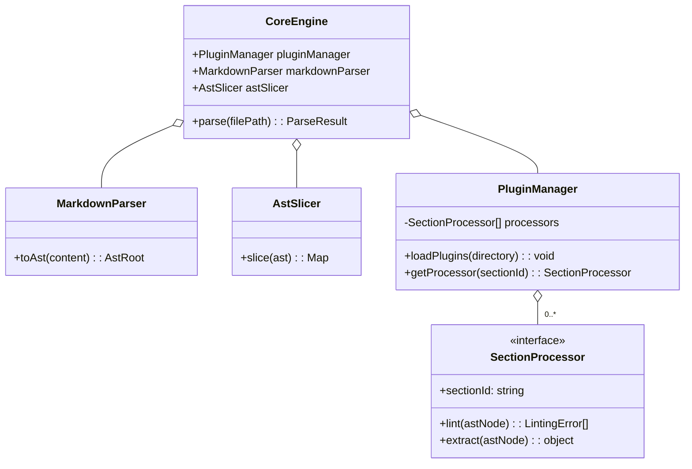
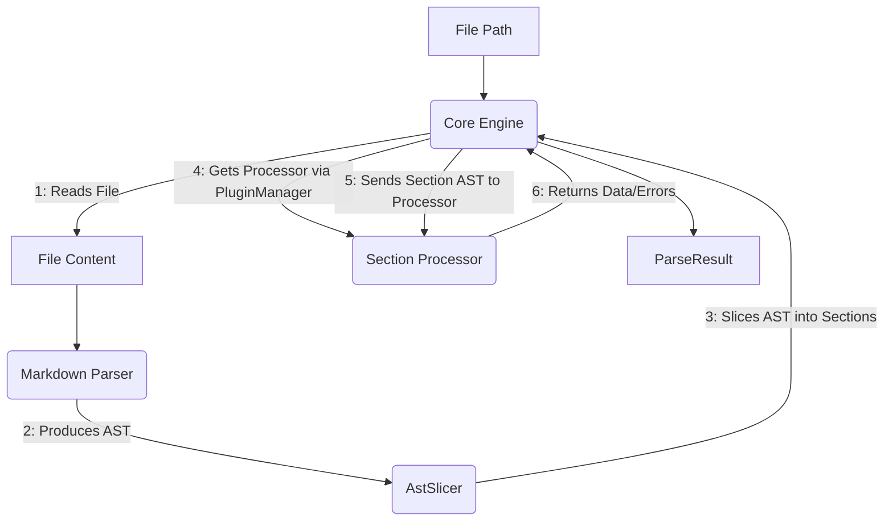
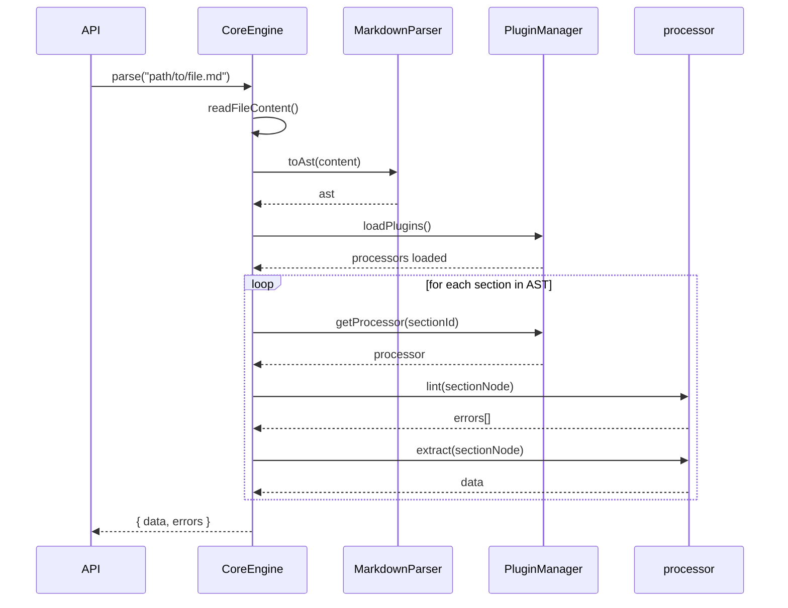

# Core Engine & Markdown Parser

## 1 Meta & Governance

### 1.2 Status

- **Current State:** ✅ Completed
- **Priority:** 🟥 High
- **Progress:** 100%
- **Planning Estimate:** 8
- **Est. Variance (pts):** 0
- **Created:** 2025-07-24 16:30
- **Implementation Started:** 2025-07-30 16:30
- **Completed:** 2025-07-31 22:00
- **Last Updated:** 2025-07-31 22:00

### 1.3 Priority Drivers

- [TEC-Dev_Productivity_Enhancement](../../ddd-2.md#tec-dev_productivity_enhancement)
- [TEC-Prod_Stability_Blocker](../../ddd-2.md#tec-prod_stability_blocker)

---

## 2 Business & Scope

### 2.1 Overview

- **Core Function**: Implements the foundational components for the documentation parser.
- **Key Capability**: This task will deliver a core engine capable of reading a markdown file, converting its content into an Abstract Syntax Tree (AST), and managing a system of plugins for processing specific schema sections.
- **Business Value**: Creates the essential scaffolding upon which all future linting and data extraction functionality will be built. It is the critical first step in enabling automated documentation validation.

### 2.4 Acceptance Criteria

| ID   | Criterion                                                                                                                                                  | Test Reference                |
| :--- | :--------------------------------------------------------------------------------------------------------------------------------------------------------- | :---------------------------- |
| AC-1 | A `MarkdownParser` module exists that can take a string of markdown and return a valid `remark` AST.                                                       | `markdown-parser.test.ts`     |
| AC-2 | A `PluginManager` can dynamically load all `SectionProcessor` modules from a specified directory.                                                          | `plugin-manager.test.ts`      |
| AC-3 | A `CoreEngine` can orchestrate the process: read a file, use the parser to get an AST, and pass section-specific AST nodes to the correct, loaded plugins. | `core-engine.test.ts`         |
| AC-4 | The main `parseTask` API function is defined and correctly calls the `CoreEngine`.                                                                         | `api.test.ts`                 |
| AC-5 | All new modules are created with corresponding unit test files.                                                                                            | N/A                           |
| AC-6 | The `CoreEngine` can correctly identify and isolate the AST nodes belonging to each schema section (e.g., all content under a `## 1.2 Status` heading).    | `core-engine.slicing.test.ts` |

---

## 3 Planning & Decomposition

### 3.3 Dependencies

| ID  | Dependency On | Type           | Status         | Affected Plans/Tasks | Notes                                     |
| :-- | :------------ | :------------- | :------------- | :------------------- | :---------------------------------------- |
| D-1 | `remark`      | External (npm) | 💡 Not Started | This task            | For robust markdown-to-AST parsing.       |
| D-2 | `glob`        | External (npm) | 💡 Not Started | This task            | For discovering plugin files dynamically. |

---

## 4 High-Level Design

### 4.2 Target Architecture

#### 4.2.1 Data Models



#### 4.2.2 Components



#### 4.2.3 Data Flow



#### 4.2.4 Control Flow



#### 4.2.5 Integration Points

##### 4.2.5.1 Upstream Integrations

- **File System**: The engine is triggered by a file path and reads the `*.task.md` file content.

##### 4.2.5.2 Downstream Integrations

- **Section Processors (Plugins)**: The engine provides section-specific AST nodes to the plugins it loads. It expects a `ParseResult` object back from each.

#### 4.2.6 Exposed API

This task focuses on building the internal engine. The public-facing API (`parseTask`, `lintTask`) will be created in `src/doc-parser/index.ts` but its implementation will simply delegate to this `CoreEngine`.

### 4.3 Tech Stack & Deployment

- **Language**: TypeScript
- **Dependencies**: `remark`, `glob`
- **Testing**: Vitest

### 4.4 Non-Functional Requirements

#### 4.4.3 Reliability

| ID     | Requirement                                                              | Priority |
| :----- | :----------------------------------------------------------------------- | :------- |
| REL-01 | The engine must not crash if a plugin fails; it should report the error. | 🟥 High  |
| REL-02 | The AST generated must be a valid `mdast` tree structure.                | 🟥 High  |

---

## 5 Maintenance and Monitoring

### 5.2 Target Maintenance and Monitoring

#### 5.2.1 Error Handling

| Error Type              | Trigger                                            | Action                                                    | User Feedback                                      |
| :---------------------- | :------------------------------------------------- | :-------------------------------------------------------- | :------------------------------------------------- |
| **Plugin Load Failure** | A plugin file has a syntax error.                  | Log the error to the console and skip the invalid plugin. | `WARN: Could not load plugin [file-path]: [error]` |
| **Processor Not Found** | No plugin is found for a given document section.   | Silently ignore the section.                              | None. (Only process sections that have plugins).   |
| **File Read Error**     | The file path is invalid or permissions are wrong. | Throw an error to the caller.                             | `ERROR: Cannot read file at [path].`               |

#### 5.2.2 Logging & Monitoring

- **Logging**: Internal operations will use a `debug` logger (e.g., `debug` npm package) to avoid polluting stdout. Errors and warnings will be logged to `console.error` and `console.warn`.

---

## 6 Implementation Guidance

### 6.1 Implementation Log / Steps

- [x] Create new directory `src/doc-parser`.
- [x] Add `remark`, `remark-parse`, `unified`, and `glob` packages to `package.json`.
- [x] Run `npm install`.
- [x] Create `src/doc-parser/plugin.types.ts` to define the `SectionProcessor` and `LintingError` interfaces.
- [x] Create `src/doc-parser/markdown-parser.ts` with a function that uses `remark` to convert a markdown string to an AST.
- [x] Create `src/doc-parser/plugin-manager.ts` to handle the loading of plugin modules from a directory.
- [x] Create `src/doc-parser/core-engine.ts` to orchestrate the parsing process.
- [x] Create `src/doc-parser/index.ts` to define the public API (`parseTask`, `lintTask`) which will delegate to the Core Engine.
- [x] Create corresponding `.test.ts` files for all new modules.
- [x] **IMPLEMENTATION COMPLETED** - All modules implemented and all 37 tests passing.
- [x] **SAMPLE PLUGIN CREATED** - Status plugin demonstrates the plugin architecture working correctly.
- [x] **INTEGRATION TESTING COMPLETED** - End-to-end system verification successful.
- [x] **ENHANCED INTEGRATION TESTS** - Added comprehensive integration tests with mock plugin support.
- [x] **FIXED AST SLICING TESTS** - Completed AC-6 coverage by implementing proper assertions for AST section slicing functionality.
- [x] **PERFORMANCE TESTING IMPLEMENTED** - Added comprehensive performance tests for large markdown files with benchmarks and memory leak detection.
- [x] **MEMORY TESTING IMPLEMENTED** - Added comprehensive memory testing suite with 8 test categories covering memory usage patterns, leak detection, efficiency validation, and monitoring.

---

## 7 Quality & Operations

### 7.1 Testing Strategy / Requirements

| AC   | Scenario                                                                                                                         | Test Type   | Tools / Runner | Notes                         |
| :--- | :------------------------------------------------------------------------------------------------------------------------------- | :---------- | :------------- | :---------------------------- |
| AC-1 | Given a markdown string, the parser returns a non-empty AST object.                                                              | Unit        | Vitest         | `markdown-parser.test.ts`     |
| AC-2 | The plugin manager correctly identifies and imports all `*.plugin.ts` files from a mock directory.                               | Unit        | Vitest         | `plugin-manager.test.ts`      |
| AC-3 | The core engine correctly calls the parser and attempts to find a processor for each top-level heading in a mock AST.            | Unit        | Vitest         | `core-engine.test.ts`         |
| AC-4 | The `parseTask` function in the API module correctly calls the core engine.                                                      | Unit        | Vitest         | `api.test.ts`                 |
| AC-6 | The engine correctly slices an AST with multiple sections, including edge cases like empty sections or single-section documents. | Unit        | Vitest         | `core-engine.slicing.test.ts` |
| N/A  | Performance testing for large markdown files with benchmarks and memory leak detection.                                          | Performance | Vitest         | `performance.test.ts`         |
| N/A  | Memory testing for memory usage patterns, leak detection, efficiency validation, and monitoring.                                 | Memory      | Vitest         | `memory.test.ts`              |

### 7.2 Configuration

- The path to the plugins directory will be hardcoded initially to `src/doc-parser/plugins/`. This can be made configurable in a future task if needed.

### 7.3 Alerting & Response

- Not applicable for this CLI tool.

### 7.5 Local Test Commands

```bash
npm test -- src/doc-parser/
```

---

## 8 Reference

### 8.1 Appendices/Glossary

- **AST**: Abstract Syntax Tree. A tree representation of the source code (in this case, markdown).
- **Plugin Manager**: A component responsible for discovering, loading, and providing access to plugins.
- **Core Engine**: The central orchestrator that combines the functionality of the parser and plugins to achieve the overall goal.

---
