# P6: Documentation Content Validation System

## 1 Meta & Governance

### 1.2 Status

- **Created:** 2025-08-03 06:08
- **Last Updated:** 2025-08-03 06:08

### 1.3 Priority Drivers

- [TEC-Prod_Stability_Blocker](../ddd-2.md#tec-prod_stability_blocker)
- [TEC-Dev_Productivity_Enhancement](../ddd-2.md#tec-dev_productivity_enhancement)

---

## 2 Business & Scope

### 2.1 Overview

- **Core Function**: Provides a validation engine to ensure the _content_ of `*.plan.md` and `*.task.md` files conforms to the canonical schema.
- **Key Capability**: This system introduces a second tier of validation that operates on the final markdown documents. It uses a dedicated set of Zod schemas to validate the structure of the content within each documentation section.
- **Business Value**: Enforces runtime correctness and consistency of all documentation, ensuring that generated and manually edited documents adhere to the defined structure. This is critical for reliable parsing by automated tools and LLMs.

### 2.2 Business Context

While the **P1: Schema System** plan ensures the `*.json` schema _definitions_ are valid, it does not validate the final `*.md` documentation files that are created based on those definitions. A developer could manually edit a `task.md` file and break the structure expected by our tools.

This plan addresses that gap by creating a system to validate the markdown files themselves. It will parse the markdown and check the structure of each section's content against a set of "implicit" content schemas, ensuring end-to-end document integrity.

### 2.2.3 Core Business Rules

- **Markdown Content Validation**: This system's primary responsibility is to validate the content of `*.md` documentation files, not the `*.json` schema definitions.
- **Zod for Content Structure**: The expected structure for the content of each documentation section will be defined using Zod schemas.
- **Dependency on P1**: This system is dependent on the canonical types and schemas defined and validated in the **P1: Schema System** plan.

### 2.3 Success Criteria

- The system can successfully parse a compliant `task.md` file and validate the content of each section against the corresponding Zod schema.
- The system correctly identifies and reports errors in a `task.md` file with malformed or non-compliant section content.
- The section-level Zod schemas are comprehensive enough to cover all defined sections in the DDD schema.

### 2.5 Boundaries & Scope

#### 2.5.1 In Scope

- Definition of Zod schemas for the implicit content structure of each documentation section.
- A markdown parsing engine capable of extracting section content.
- A validation script that integrates the parser and the Zod schemas.

#### 2.5.2 Out of Scope

- Validation of `*.json` schema definition files (handled by P1).
- Auto-correction of invalid markdown content.
- Real-time validation in an IDE (deferred to future iterations).

---

## 3 Planning & Decomposition

### 3.1 Roadmap (In-Focus Items)

| ID  | Child Plan/Task                                                                  | Priority | Priority Drivers                                                                                                                                       | Status         | Depends On | Summary                                                                   |
| :-- | :------------------------------------------------------------------------------- | :------- | :----------------------------------------------------------------------------------------------------------------------------------------------------- | :------------- | :--------- | :------------------------------------------------------------------------ |
| T1  | [Define Section Content Schemas](./p6.t1-define-section-content-schemas.task.md) | 🟥 High  | [TEC-Prod_Stability_Blocker](../ddd-2.md#tec-prod_stability_blocker)                                                                                   | 💡 Not Started | P1         | Create the Zod schemas that define the expected content for each section. |
| P5  | [Documentation Parser & Linter](./p1.p5-doc-parser.plan.md)                      | 🟥 High  | [TEC-Dev_Productivity_Enhancement](../ddd-2.md#tec-dev_productivity_enhancement), [TEC-Prod_Stability_Blocker](../ddd-2.md#tec-prod_stability_blocker) | 💡 Not Started | T1         | Implements parsing and linting using the content schemas defined in T1.   |

### 3.3 Dependencies

| ID  | Dependency On                                                                   | Type     | Status         | Affected Plans/Tasks | Notes                                                               |
| :-- | :------------------------------------------------------------------------------ | :------- | :------------- | :------------------- | :------------------------------------------------------------------ |
| D-1 | [T28: Define Canonical Schema Interfaces](./p1.t28-define-schema-types.task.md) | Internal | 💡 Not Started | T1                   | The base types for the schema definition itself are a prerequisite. |
| D-3 | `remark` (or similar)                                                           | External | 💡 Not Started | All                  | A robust markdown parser will be required.                          |

---

## 4 High-Level Design

### 4.2 Target Architecture

#### 4.2.2 Components

```mermaid
classDiagram
    direction TB

    class MarkdownFile {
        <<Input>>
        +string content
    }

    class MarkdownParser {
        +parse(file: MarkdownFile): Ast
    }

    class ContentExtractor {
        +extractSectionContent(sectionId: string, ast: Ast): any
    }

    class SectionContentZodSchemas {
        <<Source of Truth for Content Structure>>
        +getSchema(sectionId: string): ZodSchema
    }

    class ContentValidator {
        +validate(sectionId: string, content: any): boolean
    }

    MarkdownFile --> MarkdownParser
    MarkdownParser --> ContentExtractor
    ContentValidator --> SectionContentZodSchemas : "uses"
    ContentValidator --> ContentExtractor : "uses"
```

