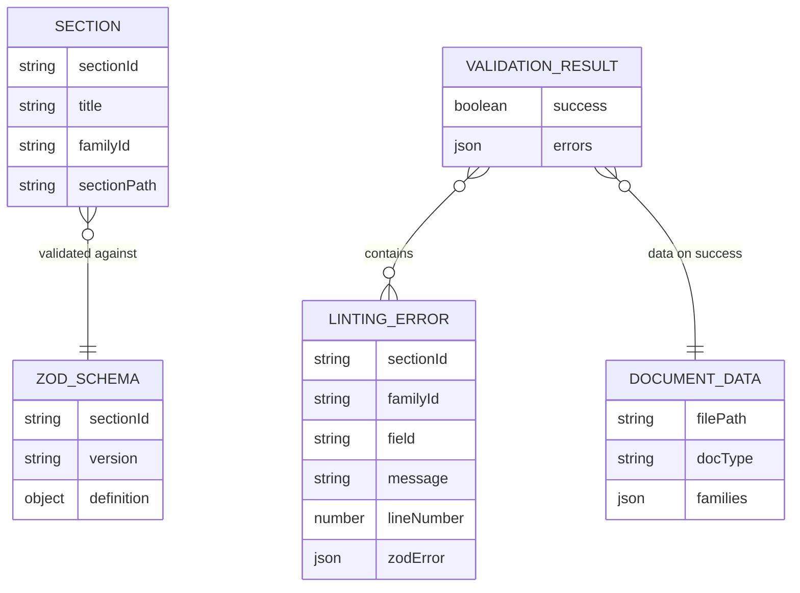
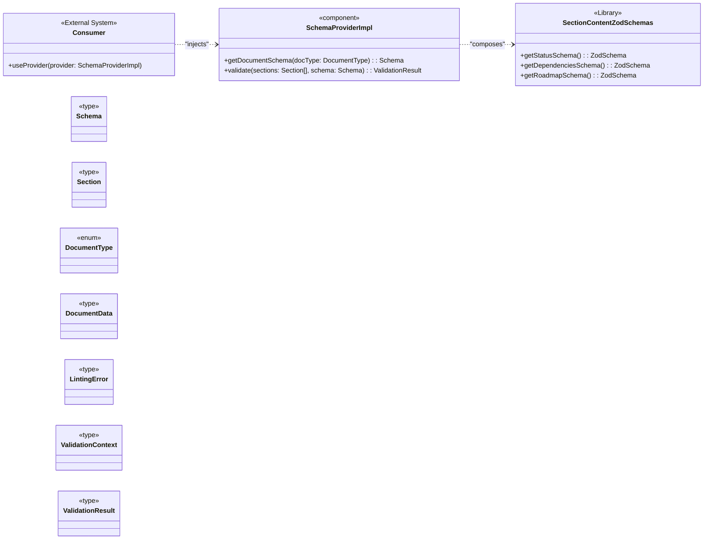
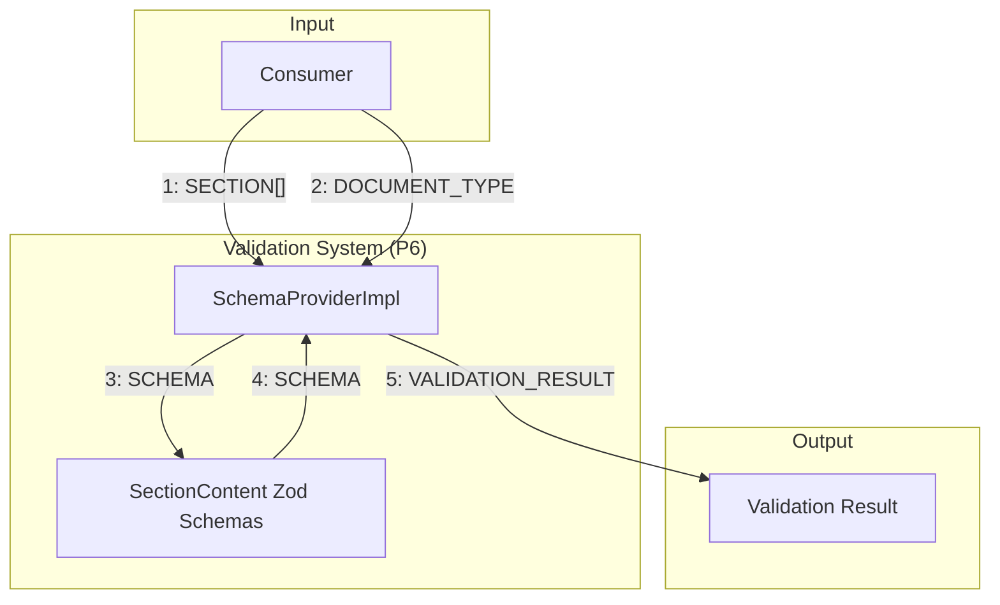
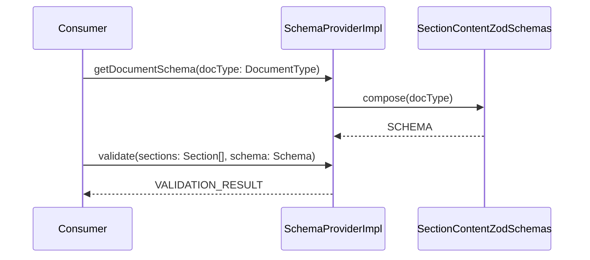

# P6: Documentation Content Validation System

## 1 Meta & Governance

### 1.2 Status

- **Created:** 2025-08-03 06:08
- **Last Updated:** 2025-08-03 06:08

### 1.3 Priority Drivers

- [TEC-Prod_Stability_Blocker](../ddd-2.md#tec-prod_stability_blocker)
- [TEC-Dev_Productivity_Enhancement](../ddd-2.md#tec-dev_productivity_enhancement)

---

## 2 Business & Scope

### 2.1 Overview

- **Core Function**: Provides a validation engine to ensure the _content_ of `*.plan.md` and `*.task.md` files conforms to the canonical schema.
- **Key Capability**: This system introduces a second tier of validation that operates on the final markdown documents. It uses a dedicated set of Zod schemas to validate the structure of the content within each documentation section.
- **Business Value**: Enforces runtime correctness and consistency of all documentation, ensuring that generated and manually edited documents adhere to the defined structure. This is critical for reliable parsing by automated tools and LLMs.

### 2.2 Business Context

Our currently implemented schema definition system generates documentation that specifies the rules for our markdown files. However, it lacks an enforcement mechanism. This plan fills that gap by creating a library of Zod schemas for content validation, ensuring that manually edited documents adhere to the required structure for reliable parsing by automated tools.

### 2.2.3 Core Business Rules

- **Focus on Content Rules**: This system's sole responsibility is to define the validation rules for the _content_ within markdown documentation files. It does not validate the schema definition files themselves.
- **Zod as the Rule Definition Language**: The expected structure for the content of each documentation section will be defined using Zod schemas.
- **Zod as the Source of Truth for Structure**: The Zod schemas produced by this system are the canonical source of truth for the _content structure_ of all documentation sections.
- **Schema Independence**: The validation rules created here must be self-contained and not directly dependent on the file structure of the schema definition system. They represent the abstract rules, not the implementation of the schema storage.

### 2.3 Success Criteria

- A comprehensive library of Zod schemas is created, covering the content structure for all sections defined in the canonical documentation schema.
- Each Zod schema correctly and strictly enforces the documented rules for its corresponding section (e.g., required fields, data types, table structures).
- The created schemas can be successfully imported and used by a consumer to validate compliant and non-compliant content.
- The schema library is organized logically, making it easy to maintain and extend as the documentation methodology evolves.

### 2.5 Boundaries & Scope

#### 2.5.1 In Scope

- Defining and maintaining a comprehensive library of Zod schemas that represent the content rules for every section in the documentation.
- Providing clear, typed exports for all schemas so they can be consumed by other systems.
- Ensuring the schema library is well-organized and maintainable.

#### 2.5.2 Out of Scope

- The implementation of any tool that consumes these schemas, such as a markdown parser or linter.
- The validation of the `*.json` schema _definition_ files.
- Auto-correction of invalid markdown content.
- Real-time validation in an IDE or git-hooks (these are consumers of the schemas, not part of their definition).

---

## 3 Planning & Decomposition

### 3.1 Roadmap (In-Focus Items)

| ID  | Child Plan/Task                                                                      | Priority | Priority Drivers                                                     | Status         | Depends On                                                          | Summary                                                                   |
| :-- | :----------------------------------------------------------------------------------- | :------- | :------------------------------------------------------------------- | :------------- | :------------------------------------------------------------------ | :------------------------------------------------------------------------ |
| T32 | [Define Section Content Schemas](./p1-p6.t32-define-section-content-schemas.task.md) | 🟥 High  | [TEC-Prod_Stability_Blocker](../ddd-2.md#tec-prod_stability_blocker) | 💡 Not Started | [Canonical Schema Interfaces](./p1.t28-define-schema-types.task.md) | Create the Zod schemas that define the expected content for each section. |

### 3.3 Dependencies

| ID  | Dependency On                                                       | Type     | Status         | Affected Plans/Tasks | Notes                                                                                            |
| :-- | :------------------------------------------------------------------ | :------- | :------------- | :------------------- | :----------------------------------------------------------------------------------------------- |
| D-1 | [Canonical Schema Interfaces](./p1.t28-define-schema-types.task.md) | Internal | 💡 Not Started | T32                  | The base types for the schema definition itself are a prerequisite for creating content schemas. |

### 3.4 Decomposition Graph

### 3.5 Downstream Consumers

This plan produces a library of validation schemas. The primary consumer of this library is the **Documentation Parser & Linter** system, which will import these schemas to perform linting and validation on markdown content.

Additionally, this plan will expose a `SchemaProvider` implementation that the parser can inject. It composes per-section Zod schemas into a document-type-aware validator and returns `VALIDATION_RESULT` payloads compatible with the parser’s event contracts.

---

## 4 High-Level Design

### 4.0 Guiding Principles

- **Single Responsibility**: Each Zod schema is responsible for validating the content of exactly one documentation section.
- **Composability**: Complex schemas should be built by composing smaller, reusable schemas to avoid duplication.
- **Strictness**: Schemas should be as strict as possible, enforcing data types, required fields, and formats to guarantee content integrity.
- **Maintainability**: The schema library must be organized in a clear, logical structure that is easy for developers to navigate and extend.

### 4.2 Target Architecture

#### 4.2.1 Data Models

The library defines the rules that validate parsed document sections. This model shows validation artifacts and outcomes, aligned with the parser’s domain types.

#### 4.2.2 Components

The primary component is the schema library. We also provide a `SchemaProvider` implementation to ease consumption by P5.

#### 4.2.3 Data Flow

#### 4.2.4 Control Flow

### 4.3 Tech Stack & Deployment

- **Language**: TypeScript
- **Schema Validation**: Zod
- **Testing**: Vitest
- **Deployment**: The schema library will be an internal module of the `ddd-tools` npm package, exposed for use by other modules within the same package.

### 4.4 Non-Functional Requirements

#### 4.4.1 Performance

| ID      | Requirement                                                                  | Priority  |
| :------ | :--------------------------------------------------------------------------- | :-------- |
| PERF-01 | Schema compilation and type inference should add negligible time to TSC.     | 🟥 High   |
| PERF-02 | Importing the schemas should have a minimal impact on consumer startup.      | 🟧 Medium |
| PERF-03 | Provider validation must process a typical document’s `Section[]` in < 50ms. | 🟧 Medium |

#### 4.4.2 Reliability

| ID     | Requirement                                                            | Priority |
| :----- | :--------------------------------------------------------------------- | :------- |
| REL-01 | Schemas must be 100% aligned with the official documentation rules.    | 🟥 High  |
| REL-02 | A schema change must not break consumers without a major version bump. | 🟥 High  |

#### 4.4.3 Scalability

| ID      | Requirement                                                           | Priority |
| :------ | :-------------------------------------------------------------------- | :------- |
| SCAL-01 | The library structure must support adding new section schemas easily. | 🟥 High  |

---

## 5 Maintenance and Monitoring

### 5.2 Target Maintenance and Monitoring

#### 5.2.1 Error Handling

| Error Type                     | Trigger                                                                  | Action                                       | User Feedback                                                                                 |
| :----------------------------- | :----------------------------------------------------------------------- | :------------------------------------------- | :-------------------------------------------------------------------------------------------- |
| **Schema Validation Failure**  | A consumer calls `schema.parse()` with a non-compliant content object.   | Zod throws a `ZodError`.                     | The `ZodError` object contains detailed information about the validation failure.             |
| **Schema Import Failure**      | A consumer attempts to import a non-existent schema from the library.    | Runtime throws an error.                     | Standard module-not-found error from the runtime environment (e.g., Node.js, bundler).        |
| **Document-Type Rule Miss**    | Provider asked to compose a docType that lacks required section schemas. | Provider throws or returns failed result.    | Clear message listing the missing section schemas for the requested docType.                  |
| **Provider Contract Mismatch** | Provider returns a payload that is not a `VALIDATION_RESULT`.            | Consumer rejects and logs contract mismatch. | Ensure provider outputs follow the `ValidationResult` contract expected by the parser events. |

#### 5.2.2 Logging & Monitoring

- **Logging**: Not applicable. As a static library, this system does not perform logging.
- **Monitoring**: Not applicable.

---

## 6 Implementation Guidance

### 6.1 Implementation Plan

The implementation of this schema library will be carried out in the child task, **[T32: Define Section Content Schemas](./p1-p6.t32-define-section-content-schemas.task.md)**. The strategy is as follows:

1.  **Establish Directory Structure**: Create the folder structure for the schemas, organized by documentation family (e.g., `src/validation-schemas/1-meta-governance/`).
2.  **Develop Schemas Incrementally**: Implement the Zod schemas for each documentation section one by one.
3.  **Unit Test Each Schema**: For each section schema, create a corresponding unit test that validates both compliant and non-compliant example content.
4.  **Create Barrel File**: Create a main entry point (`index.ts`) that exports all section schemas for easy consumption by other tools.
5.  **Provide Provider**: Export a `createSchemaProvider()` that returns a `SchemaProvider` implementation composing the section schemas per document type.

---

## 7 Quality & Operations

### 7.1 Testing Strategy / Requirements

The quality of this library is determined by the correctness and coverage of its schemas. The testing strategy is therefore focused on rigorous unit testing of each individual schema, with test cases mapped to the plan's Success Criteria.

| AC   | Scenario                                                              | Test Type | Tools / Runner | Notes                                                                                     |
| :--- | :-------------------------------------------------------------------- | :-------- | :------------- | :---------------------------------------------------------------------------------------- |
| SC-3 | A schema successfully parses a valid, compliant content object.       | Unit      | Vitest         | For each schema, provide a "golden path" test case with a perfect example of the content. |
| SC-3 | A schema fails to parse an object with missing required fields.       | Unit      | Vitest         | Test that `schema.parse()` throws a `ZodError` and that the error message is informative. |
| SC-3 | A schema fails to parse an object with fields of the incorrect type.  | Unit      | Vitest         | E.g., provide a string where a number is expected and assert that it throws.              |
| SC-2 | A schema fails to parse an object that violates a custom `.refine()`. | Unit      | Vitest         | For any schemas with custom validation rules, ensure those rules are explicitly tested.   |

### 7.2 Configuration

This system is a library and requires no runtime configuration.

### 7.3 Alerting & Response

Not applicable. Error handling is the responsibility of the consumer.

### 7.4 Deployment Steps

Deployment of this library is handled as part of the parent `ddd-tools` npm package. There are no separate deployment steps for this specific module.

---

## 8 Reference

### 8.1 Appendices/Glossary

None at this time.
