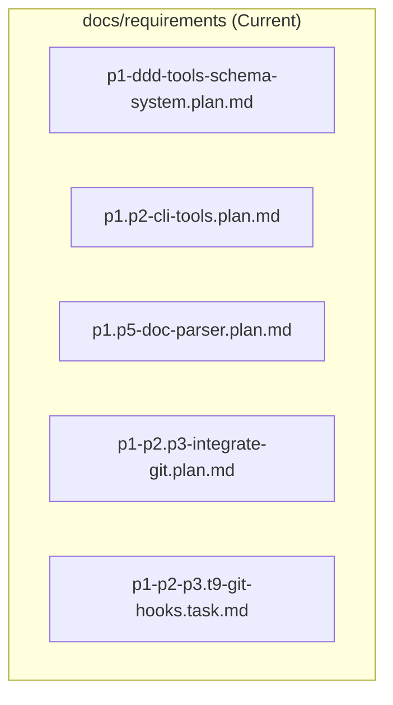
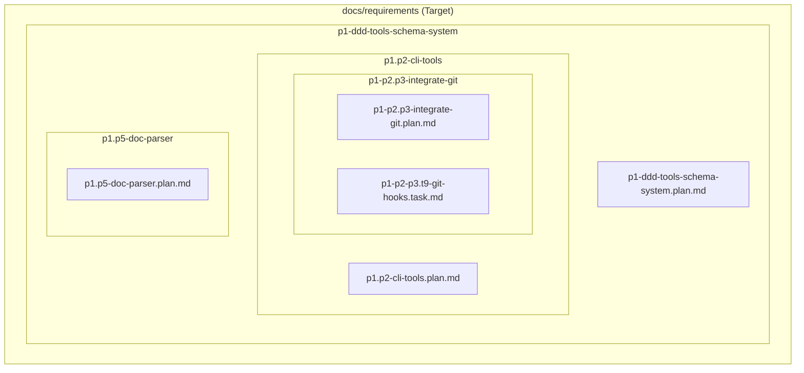

# T33: Implement Hierarchical Directory Structure for Documentation

## 1 Meta & Governance

### 1.2 Status

- **Current State:** 💡 Not Started
- **Priority:** 🟥 High
- **Progress:** 0%
- **Planning Estimate:** 0
- **Est. Variance (pts):** 0
- **Created:** 2025-08-04 09:20
- **Implementation Started:**
- **Completed:**
- **Last Updated:** 2025-08-04 09:20

### 1.3 Priority Drivers

- [TEC-Dev_Productivity_Enhancement](../ddd-2.md#tec-dev_productivity_enhancement)
- [TEC-Tech_Debt_Refactor](../ddd-2.md#tec-tech_debt_refactor)

---

## 2 Business & Scope

### 2.1 Overview

- **Core Function**: To refactor the physical storage of documentation files from a flat list into a hierarchical directory structure that mirrors the logical plan/task relationships.
- **Key Capability**: This will make the project's documentation scalable, easier to navigate, and more intuitive by aligning the file system layout with the DDD parent-child hierarchy.
- **Business Value**: Reduces developer friction, improves maintainability, and eliminates the cognitive overhead of parsing long filenames to understand the project structure. This is a foundational improvement for long-term project health.

### 2.2 Business Context

The DDD methodology has been successfully adopted, leading to a rapid increase in the number of plan and task files in the `docs/requirements` directory. While the file naming convention correctly encodes the hierarchy, the flat directory structure has become unwieldy and difficult to navigate. Finding specific documents requires scanning a long list of files, which introduces unnecessary friction and cognitive load.

This task proposes moving to a nested directory structure where each plan has its own folder, containing both the plan document itself and any child documents (tasks or sub-plan folders). This aligns the physical file layout with the logical project architecture, making the system more intuitive and scalable.

### 2.4 Definition of Done

| ID    | Criterion                                                                                                                               |
| :---- | :-------------------------------------------------------------------------------------------------------------------------------------- |
| DoD-1 | The target hierarchical directory structure is formally defined and agreed upon.                                                        |
| DoD-2 | The core CLI services (`FileManager`, `NamingValidator`, `IdProvider`, `TemplateGenerator`) are updated to be directory-aware.          |
| DoD-3 | The `ddd template` and `ddd init` commands are updated to correctly create files and directories within the new hierarchical structure. |
| DoD-4 | All existing documentation files in `docs/requirements` are successfully migrated to the new directory structure.                       |
| DoD-5 | All tests are updated and passing, ensuring the refactored CLI tools work correctly with the new structure.                             |

---

## 4 High-Level Design

### 4.1 Current Architecture

The current architecture uses a flat directory structure, relying entirely on filenames to convey hierarchy.

### 4.2 Target Architecture

The target architecture uses a nested directory structure that mirrors the logical plan hierarchy. Each plan gets a directory containing its own plan file and its direct children.

---

## 6 Implementation Guidance

### 6.1 Implementation Plan

This task serves as the high-level requirement. The detailed implementation will be broken down into subsequent, more granular tasks. The initial focus will be on:

1.  **Updating Core Services**: Refactoring the CLI services to handle nested paths.
2.  **Updating CLI Commands**: Modifying the `template` and `init` commands to work with the new directory-aware services.
3.  **Creating a Migration Script**: Developing a script to safely move existing files to the new structure.
4.  **Execution**: Running the migration and updating all documentation.
