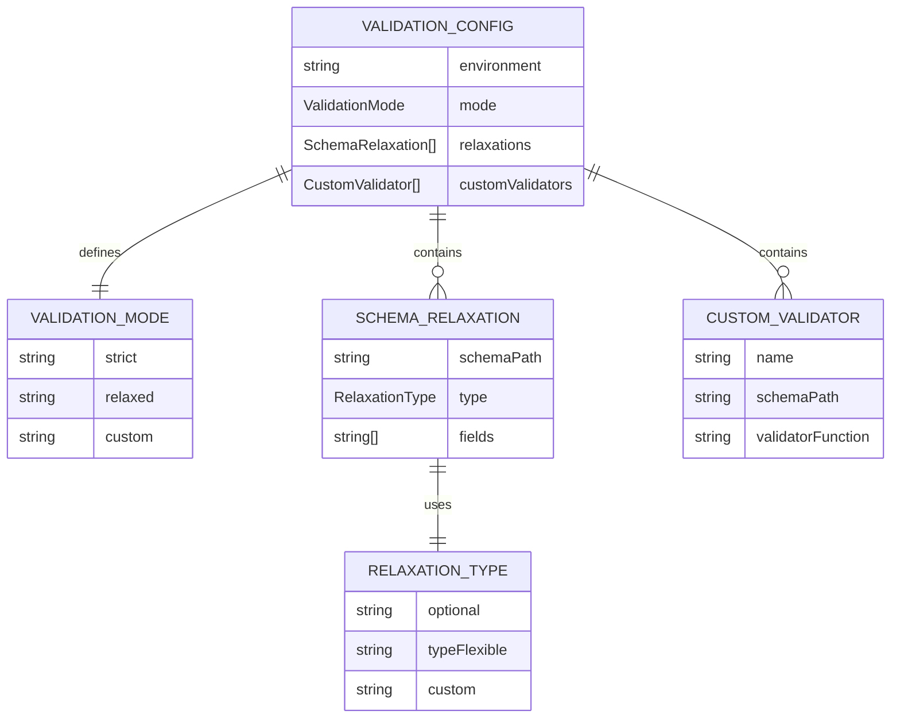
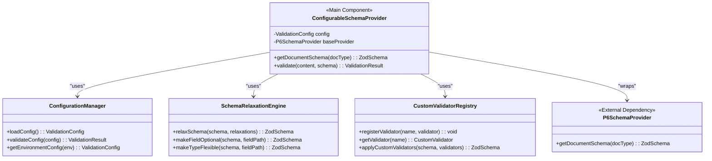
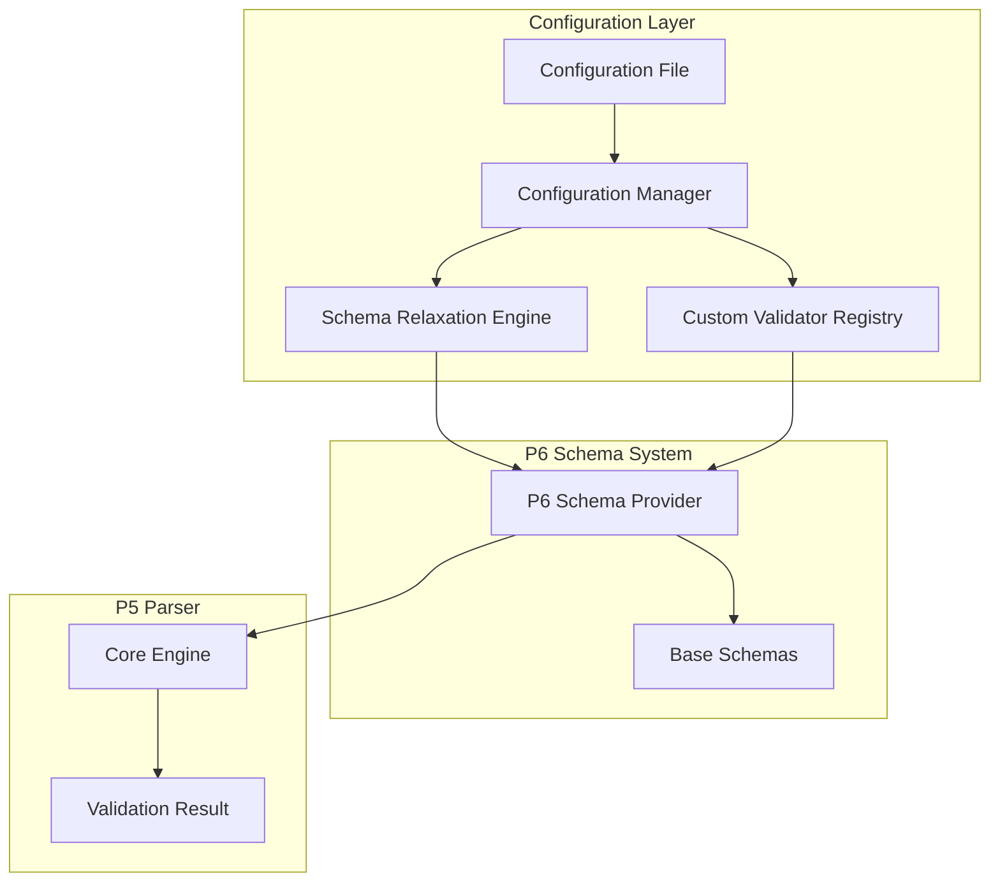

# P8: Configurable Schema Validation Layer

## 1 Meta & Governance

### 1.2 Status

- **Created:** 2025-08-07 13:45
- **Last Updated:** 2025-08-07 13:45

### 1.3 Priority Drivers

- [TEC-Dev_Productivity_Enhancement](../ddd-2.md#tec-dev_productivity_enhancement)
- [TEC-Dev_FutureProofing](../ddd-2.md#tec-dev_futureproofing)

---

## 2 Business & Scope

### 2.1 Overview

- **Core Function**: Provides a configurable abstraction layer between the Documentation Parser (P5) and the Schema Validation System (P6), enabling environment-specific validation rules and brownfield project compatibility.
- **Key Capability**: Allows customization of validation behavior through configuration, including schema relaxation for legacy documentation, custom validation rules, and environment-specific validation strategies.
- **Business Value**: Enables the DDD tooling ecosystem to work with existing documentation systems that may not fully comply with current schema requirements, while maintaining the ability to gradually migrate toward full compliance.

### 2.2 Business Context

While the core DDD methodology provides a robust schema system through P6, real-world projects often have existing documentation that doesn't perfectly align with the canonical schema. This is especially true for brownfield projects where teams are adopting DDD methodology incrementally. The configurable layer addresses this by providing a bridge between the strict schema requirements and the practical needs of teams transitioning to DDD.

This layer enables scenarios such as:

- **Legacy Documentation**: Relaxing validation rules for existing documentation that doesn't meet current standards
- **Project-Specific Rules**: Adding custom validation rules for organization-specific requirements
- **Gradual Migration**: Allowing teams to adopt DDD methodology incrementally while maintaining validation coverage
- **Environment Flexibility**: Different validation strategies for development, staging, and production environments

### 2.2.3 Core Business Rules

- **Schema Provider Interface**: The layer must implement the same interface as P6 to maintain compatibility with P5
- **Configuration-Driven**: All customization must be driven by configuration rather than code changes
- **Backward Compatibility**: The layer must provide the same interface as P6 when no configuration is specified
- **Fail-Safe Defaults**: When configuration is invalid or missing, the system must fall back to strict validation
- **Performance Neutral**: The layer must not introduce significant performance overhead

### 2.3 Success Criteria

- P5 can seamlessly switch between P6 schemas and configurable layer schemas without code changes
- Legacy documentation can be validated with relaxed rules while maintaining error reporting
- Custom validation rules can be added through configuration without modifying core schema definitions
- The layer provides clear error messages when configuration is invalid
- Performance impact is negligible (< 10ms overhead per validation)

### 2.5 Boundaries & Scope

#### 2.5.1 In Scope

- Configuration management for validation behavior
- Schema relaxation strategies for legacy documentation
- Custom validation rule injection
- Environment-specific validation strategies
- Configuration validation and error handling

#### 2.5.2 Out of Scope

- Schema definition (handled by P6)
- Document parsing (handled by P5)
- User interface for configuration management
- Automatic migration of legacy documentation
- Real-time configuration updates (requires restart)

---

## 3 Planning & Decomposition

### 3.1 Roadmap (In-Focus Items)

| ID  | Child Plan/Task                                                       | Priority  | Priority Drivers                                                                 | Status         | Depends On | Summary                                                             |
| :-- | :-------------------------------------------------------------------- | :-------- | :------------------------------------------------------------------------------- | :------------- | :--------- | :------------------------------------------------------------------ |
| T33 | [Configuration Schema Definition](./p1-p8.t33-config-schema.task.md)  | 🟥 High   | [TEC-Dev_Productivity_Enhancement](../ddd-2.md#tec-dev_productivity_enhancement) | 💡 Not Started | P6         | Define the configuration schema for validation customization.       |
| T34 | [Schema Relaxation Engine](./p1-p8.t34-schema-relaxation.task.md)     | 🟥 High   | [TEC-Dev_FutureProofing](../ddd-2.md#tec-dev_futureproofing)                     | 💡 Not Started | T33        | Implement strategies for relaxing validation rules for legacy docs. |
| T35 | [Custom Validator Integration](./p1-p8.t35-custom-validators.task.md) | 🟧 Medium | [TEC-Dev_Productivity_Enhancement](../ddd-2.md#tec-dev_productivity_enhancement) | 💡 Not Started | T33        | Enable injection of custom validation rules through configuration.  |

### 3.3 Dependencies

| ID  | Dependency On                                                      | Type     | Status         | Affected Plans/Tasks | Notes                                                     |
| :-- | :----------------------------------------------------------------- | :------- | :------------- | :------------------- | :-------------------------------------------------------- |
| D-1 | [P6: Doc Content Validator](./p1.p6-doc-content-validator.plan.md) | Internal | ⏳ In Progress | All                  | Provides the base schemas that this layer will customize. |
| D-2 | [P5: Doc Parser](./p1.p5-doc-parser.plan.md)                       | Internal | ⏳ In Progress | All                  | This layer will be consumed by P5's parser.               |

---

## 4 High-Level Design

### 4.0 Guiding Principles

- **Interface Compatibility**: The layer must implement the same interface as P6 to ensure seamless integration with P5
- **Configuration as Code**: All customization should be driven by structured configuration rather than imperative code
- **Progressive Enhancement**: Start with simple configuration options and enhance based on real-world usage
- **Performance First**: Configuration processing must not impact validation performance significantly

### 4.2 Target Architecture

#### 4.2.1 Data Models

#### 4.2.2 Components

#### 4.2.3 Data Flow

### 4.3 Tech Stack & Deployment

- **Language**: TypeScript
- **Configuration**: JSON/YAML configuration files
- **Schema Validation**: Zod (inherited from P6)
- **Testing**: Vitest
- **Deployment**: Internal module of the `ddd-tools` npm package

### 4.4 Non-Functional Requirements

#### 4.4.1 Performance

| ID      | Requirement                                           | Priority |
| :------ | :---------------------------------------------------- | :------- |
| PERF-01 | Configuration loading adds < 5ms overhead             | 🟥 High  |
| PERF-02 | Schema relaxation adds < 10ms overhead per validation | 🟥 High  |

#### 4.4.2 Reliability

| ID     | Requirement                                               | Priority |
| :----- | :-------------------------------------------------------- | :------- |
| REL-01 | Invalid configuration must not break validation           | 🟥 High  |
| REL-02 | Missing configuration must fall back to strict validation | 🟥 High  |

#### 4.4.3 Scalability

| ID      | Requirement                                         | Priority  |
| :------ | :-------------------------------------------------- | :-------- |
| SCAL-01 | Support for 10+ custom validation rules per project | 🟧 Medium |
| SCAL-02 | Support for 5+ different environments per project   | 🟧 Medium |

---

## 5 Maintenance and Monitoring

### 5.2 Target Maintenance and Monitoring

#### 5.2.1 Error Handling

| Error Type                    | Trigger                                                        | Action                                               | User Feedback                                               |
| :---------------------------- | :------------------------------------------------------------- | :--------------------------------------------------- | :---------------------------------------------------------- |
| **Invalid Configuration**     | Configuration file contains invalid JSON or schema violations. | Fall back to strict validation and log warning.      | `WARNING: Invalid configuration, using strict validation.`  |
| **Missing Configuration**     | Configuration file is not found or cannot be read.             | Use default strict validation without configuration. | No user feedback (silent fallback).                         |
| **Schema Relaxation Failure** | Schema relaxation engine fails to modify a schema.             | Use original schema and log error.                   | `ERROR: Failed to relax schema, using original validation.` |

#### 5.2.2 Logging & Monitoring

- **Configuration Loading**: Log when configuration is loaded and which environment is active
- **Schema Relaxation**: Log which relaxations are applied to which schemas
- **Performance Metrics**: Track configuration loading and schema relaxation times
- **Error Tracking**: Log configuration validation errors and fallback decisions

---

## 6 Implementation Guidance

### 6.1 Implementation Plan

This plan will be implemented in three phases:

1. **Configuration Schema (T33)**: Define the structure for validation configuration
2. **Schema Relaxation (T34)**: Implement strategies for relaxing validation rules
3. **Custom Validators (T35)**: Enable injection of custom validation rules

---

## 7 Quality & Operations

### 7.1 Testing Strategy / Requirements

| Scenario                         | Test Type | Tools / Runner | Notes                                                                |
| :------------------------------- | :-------- | :------------- | :------------------------------------------------------------------- |
| **Configuration Loading**        | Unit      | Vitest         | Test loading valid and invalid configuration files.                  |
| **Schema Relaxation**            | Unit      | Vitest         | Test that relaxed schemas are less strict than original schemas.     |
| **Custom Validator Integration** | Unit      | Vitest         | Test that custom validators are properly applied to schemas.         |
| **Fallback Behavior**            | Unit      | Vitest         | Test that invalid configuration falls back to strict validation.     |
| **Performance Impact**           | Unit      | Vitest         | Measure and assert performance overhead is within acceptable limits. |

### 7.2 Configuration

| Setting Name                 | Source               | Override Method              | Notes                                      |
| :--------------------------- | :------------------- | :--------------------------- | :----------------------------------------- |
| `DDD_VALIDATION_CONFIG_PATH` | `ddd.config.json`    | Environment variable         | Path to validation configuration file.     |
| `DDD_VALIDATION_ENVIRONMENT` | Environment variable | `DDD_VALIDATION_ENVIRONMENT` | Environment name (dev, staging, prod).     |
| `DDD_VALIDATION_MODE`        | Configuration file   | Environment variable         | Validation mode (strict, relaxed, custom). |

### 7.3 Alerting & Response

| Error Condition                    | Response Plan                                  | Status         |
| :--------------------------------- | :--------------------------------------------- | :------------- |
| **Configuration Loading Error**    | Log warning and fall back to strict validation | 💡 Not Started |
| **Schema Relaxation Error**        | Log error and use original schema              | 💡 Not Started |
| **Performance Threshold Exceeded** | Log warning about configuration overhead       | 💡 Not Started |

### 7.4 Deployment Steps

1. **Configuration Setup**: Create default configuration files in the project
2. **Environment Configuration**: Set up environment-specific validation rules
3. **Integration Testing**: Verify P5 can use the configurable layer seamlessly
4. **Performance Monitoring**: Monitor validation performance with configuration enabled

---

## 8 Reference

### 8.1 Appendices/Glossary

- **Brownfield Project**: An existing project with legacy documentation that doesn't fully comply with current schema requirements
- **Schema Relaxation**: The process of making validation rules less strict to accommodate legacy documentation
- **Custom Validator**: A project-specific validation rule that extends the base schema validation
- **Validation Mode**: The overall strategy for validation (strict, relaxed, or custom)

---
