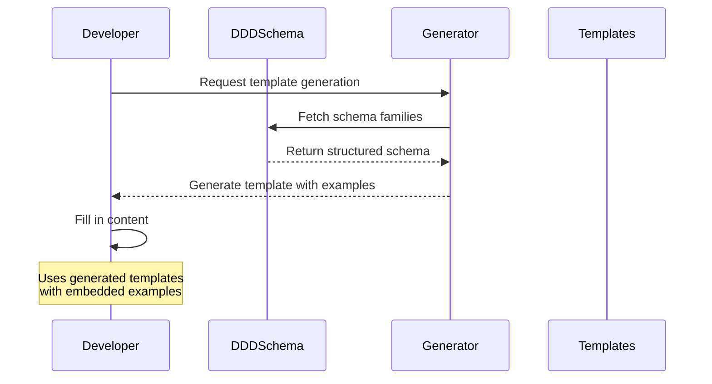
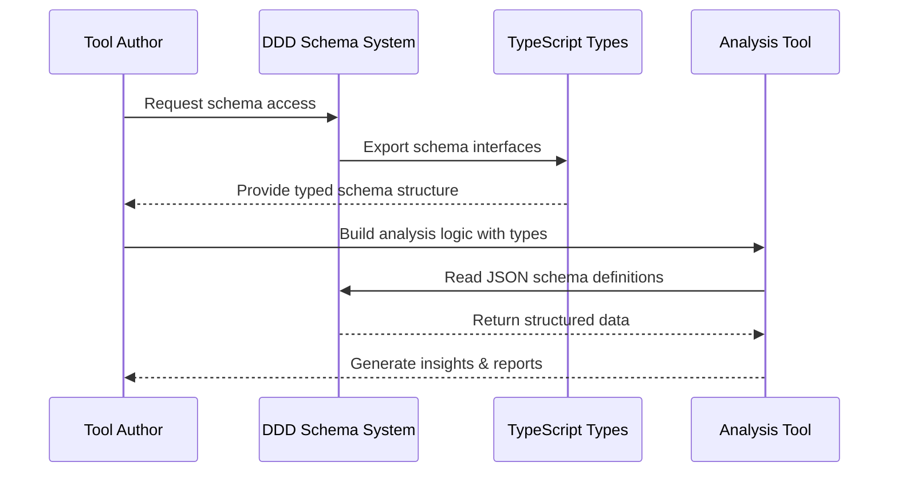
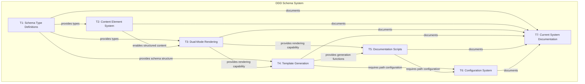
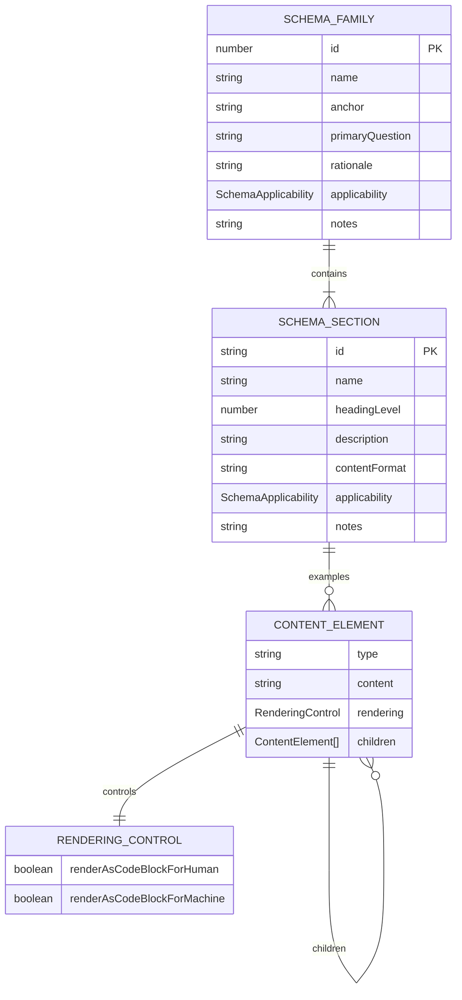
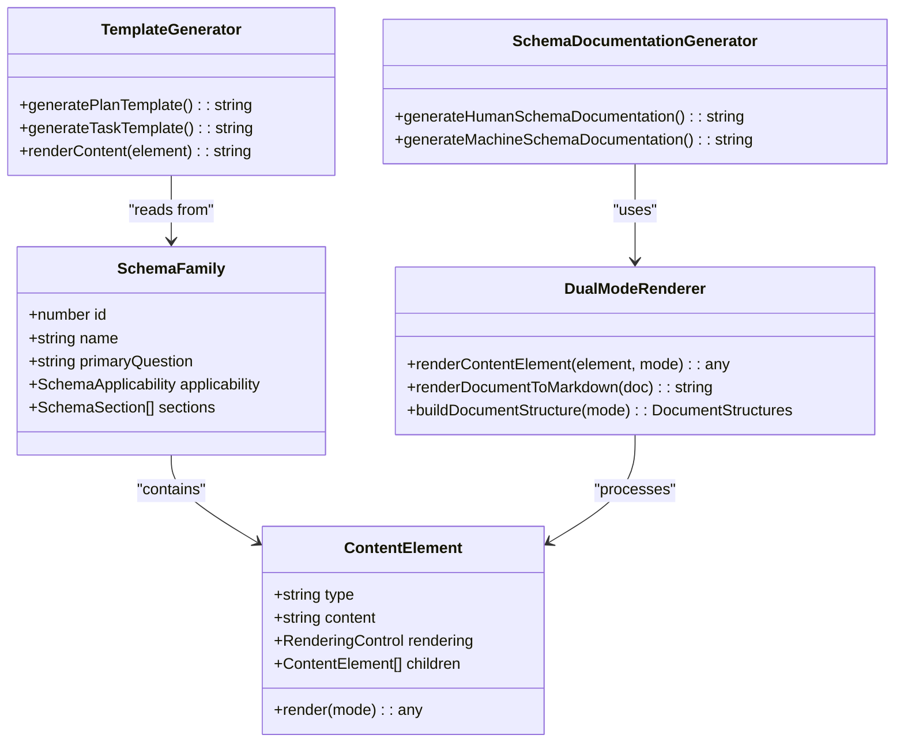
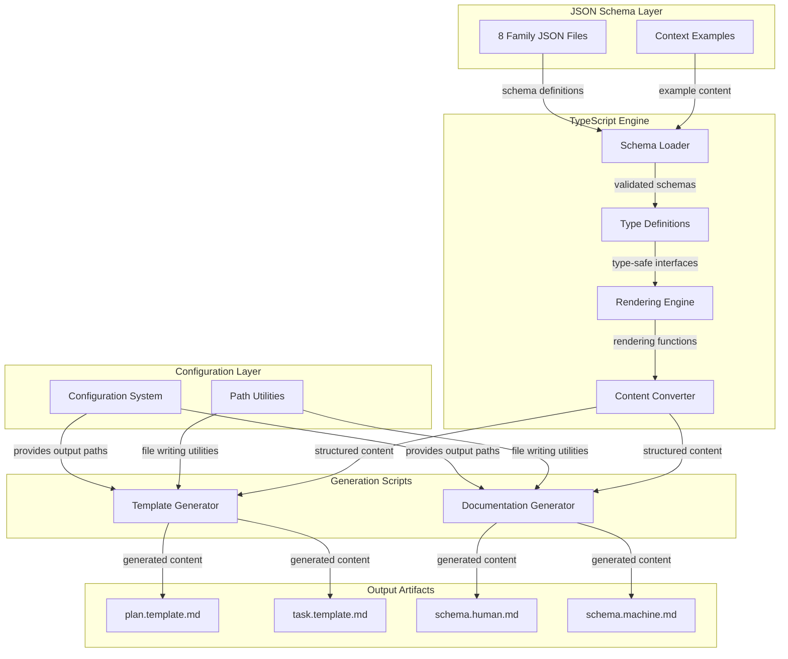
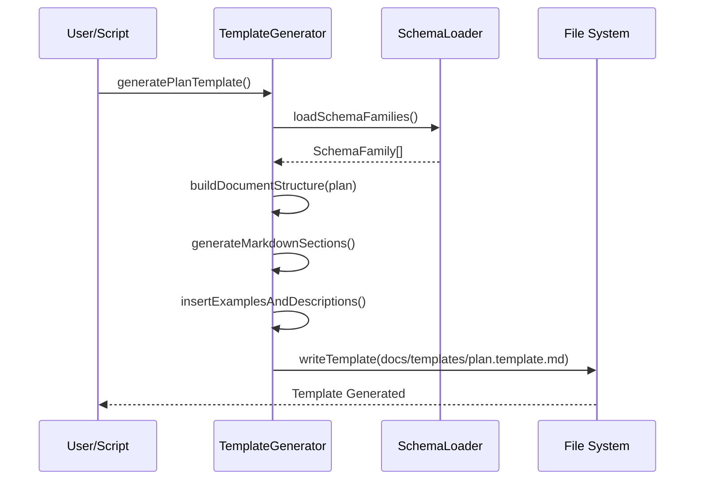
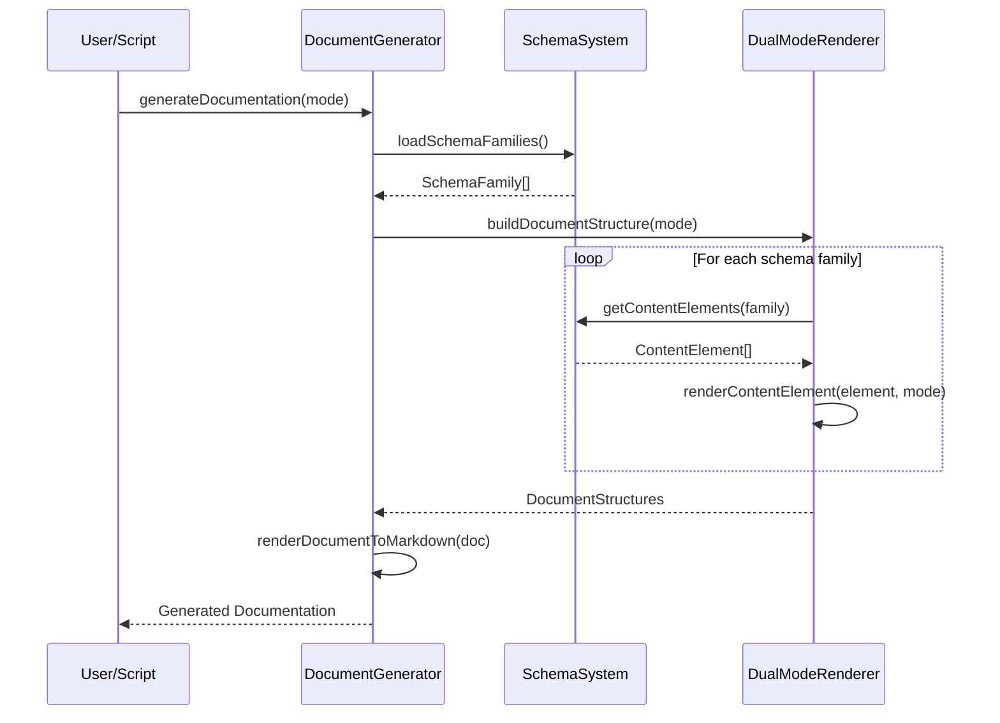
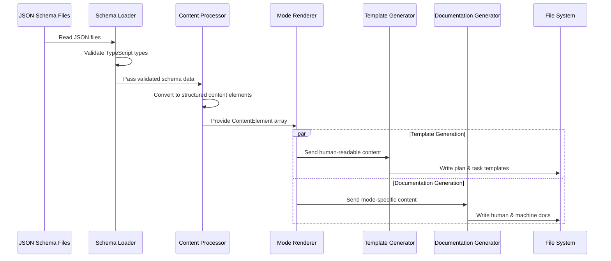

# DDD Tools: Schema Definition & Generation System

## 1 Meta & Governance

### 1.2 Status

- **Created:** 2025-07-20 01:58
- **Last Updated:** 2025-07-20 01:58

### 1.3 Priority Drivers

- TEC-Dev_Productivity_Enhancement
- TEC-Dev_Productivity_Blocker

---

## 2 Business & Scope

### 2.1 Overview

- **Core Function**: Provides the canonical schema definition and automated generation system for Documentation-Driven Development methodology structure.
- **Key Capability**: Transforms JSON-based schema definitions into consistent documentation templates and schema references, ensuring all DDD projects follow identical structural patterns.
- **Business Value**: Eliminates manual template maintenance and enables teams to adopt DDD methodology with guaranteed structural consistency across all documentation.

### 2.2 Business Context

The Documentation-Driven Development methodology requires strict structural consistency across all project documentation to enable automation, validation, and tooling integration. Previously, template maintenance was manual and prone to drift between projects.

This system establishes a schema-as-code approach where the canonical DDD structure is defined once in JSON and automatically generates all downstream artifacts (templates, documentation, examples). This ensures structural consistency while enabling methodology evolution through versioned schema updates.

#### 2.2.1 User Journeys

##### 2.2.1.1 Journey: DDD Methodology Maintainer Updates Structure

A methodology maintainer needs to modify the DDD documentation structure (add new sections, change requirements, update examples).


##### 2.2.1.2 Journey: Developer Creates New DDD Project

A developer needs to start a new project using current DDD methodology structure.



##### 2.2.1.3 Journey: Tool Author Integrates DDD Schema

A tool author wants to build analysis tools that understand DDD documentation structure.



#### 2.2.2 User Personas

| Persona                        | Goal                                                                                     |
| :----------------------------- | :--------------------------------------------------------------------------------------- |
| **DDD Methodology Maintainer** | Evolve and maintain the canonical DDD structure definition with automated consistency.   |
| **Project Developer**          | Create new DDD-compliant projects using current methodology templates and documentation. |
| **Tool Author**                | Build analysis and visualization tools that understand DDD documentation structure.      |
| **LLM Integration**            | Parse and understand DDD structure through machine-optimized schema documentation.       |

#### 2.2.3 Core Business Rules

- **Schema as Single Source of Truth**: All documentation structure must derive from JSON schema definitions - no manual template editing.
- **Automated Generation**: All templates and documentation must be generated programmatically to ensure consistency.
- **Dual-Mode Support**: Must support both human-readable and machine-optimized outputs for different consumption patterns.
- **Type Safety**: All generation must be compile-time type-safe to prevent structural errors.

#### 2.2.4 User Stories

- As a **DDD Methodology Maintainer**, I want to modify schema definitions in JSON so that all templates and documentation update automatically with guaranteed consistency.
- As a **Project Developer**, I want to access current DDD templates so that I can start new projects with the latest methodology structure.
- As an **LLM Integration**, I want machine-optimized schema documentation so that I can understand and validate DDD document structures programmatically.

### 2.3 Success Criteria

- **Automated Template Generation**: plan.template.md and task.template.md are generated automatically from JSON schema with 100% consistency.
- **Dual-Mode Documentation**: Both human-readable and machine-optimized schema documentation are generated automatically from the same source.
- **Type-Safe Generation**: All generation processes compile without TypeScript errors and produce valid markdown output.
- **Schema Coverage**: All 8 information families are properly defined in JSON and correctly rendered in all output formats.

### 2.5 Boundaries & Scope

#### 2.5.1 In Scope

- **JSON Schema Definition System**: Canonical definition of DDD documentation structure using 8 information families.
- **Template Generation Engine**: Automated creation of plan.template.md and task.template.md from schema definitions.
- **Documentation Generation Engine**: Automated creation of schema documentation in human and machine-readable formats.
- **Type-Safe Rendering**: TypeScript-based rendering system ensuring compile-time validation of all generated content.

#### 2.5.2 Out of Scope

- **Project Creation Tools**: Command-line tools for initializing new DDD projects (deferred to future iterations).
- **Validation Tools**: Schema compliance checking for existing documentation (deferred to future iterations).
- **Multi-Language Support**: Schema bindings for languages other than TypeScript (deferred to future iterations).
- **Live Documentation**: Dynamic or interactive documentation features (deferred to future iterations).

### 2.6 Core Business Processes

#### 2.6.1 Process: Schema-Driven Generation

- **Participants**: DDD Methodology Maintainer, Generation System
- **Goal**: Update all DDD artifacts consistently when schema changes
- **Workflow**:
  1. Maintainer modifies JSON schema files in `src/ddd-schema-json/`
  2. System validates TypeScript compilation for type safety
  3. Maintainer runs `npm run generate-templates` to update templates
  4. Maintainer runs `npm run generate-schema-doc` to update documentation
  5. All downstream artifacts are updated with guaranteed consistency

---

## 3 Planning & Decomposition

### 3.1 Roadmap (In-Focus Items)

| ID  | Child Plan/Task              | Priority  | Priority Drivers                 | Status      | Depends On | Summary                                                       |
| :-- | :--------------------------- | :-------- | :------------------------------- | :---------- | :--------- | :------------------------------------------------------------ |
| T1  | Schema Type Definitions      | 🟥 High   | TEC-Dev_Productivity_Enhancement | ✅ Complete | —          | Core TypeScript interfaces for schema families                |
| T2  | Content Element System       | 🟥 High   | TEC-Dev_Productivity_Enhancement | ✅ Complete | T1         | Structured content with rendering controls                    |
| T3  | Dual-Mode Rendering          | 🟥 High   | TEC-Dev_Productivity_Enhancement | ✅ Complete | T1, T2     | Human and machine readable output generation                  |
| T4  | Template Generation          | 🟧 Medium | TEC-Dev_Productivity_Enhancement | ✅ Complete | T1, T3     | Plan and Task template generation with examples               |
| T5  | Documentation Scripts        | 🟧 Medium | TEC-Dev_Productivity_Enhancement | ✅ Complete | T3, T4     | Automation scripts for schema documentation                   |
| T6  | Configuration System         | 🟧 Medium | TEC-Dev_Productivity_Enhancement | ✅ Complete | T4, T5     | Configurable paths with environment variable support          |
| T7  | Current System Documentation | 🟥 High   | TEC-Dev_Productivity_Enhancement | ✅ Complete | T1-T6      | Complete documentation of existing capabilities as foundation |

### 3.2 Backlog / Icebox

- **CLI Tools**: Command-line interface for project initialization and schema validation
- **Template Customization**: Support for project-specific template variations
- **Schema Versioning**: Semantic versioning and migration tools for schema evolution
- **IDE Integration**: VSCode extensions for real-time DDD compliance checking

### 3.3 Dependencies

| ID  | Dependency On   | Type     | Status      | Affected Plans/Tasks | Notes                                                     |
| :-- | :-------------- | :------- | :---------- | :------------------- | :-------------------------------------------------------- |
| D-1 | TypeScript 5.0+ | External | ✅ Complete | All generation       | Required for type safety and modern language features.    |
| D-2 | Node.js 18+     | External | ✅ Complete | All scripts          | Required for script execution and file system operations. |

### 3.4 Decomposition Graph



---

## 4 High-Level Design

### 4.0 Guiding Principles

- **Schema as Source of Truth**: All structure and content templates derive from JSON schema definitions with zero manual override capability.
- **Type-Safe Generation**: All rendering and generation must be compile-time validated through TypeScript type system.
- **Dual-Mode Architecture**: System must support both human-optimized and machine-optimized output formats from the same source.
- **Automated Consistency**: No manual template maintenance - all artifacts generated programmatically to ensure structural consistency.

### 4.1 Current Architecture

#### 4.1.1 Data Models

**Core Schema Structure:**

```typescript
interface SchemaFamily {
  id: number;
  name: string;
  anchor: string;
  primaryQuestion: string;
  rationale: string;
  applicability: SchemaApplicability;
  notes: string;
  sections: SchemaSection[];
}

interface SchemaSection {
  id: string;
  name: string;
  headingLevel: number;
  description?: string;
  applicability: SchemaApplicability;
  examples?: SchemaExample[];
}

interface ContentElement {
  type: 'text' | 'list' | 'table' | 'codeblock' | 'mermaid';
  rendering: RenderingControl;
  children?: ContentElement[];
}
```

**Configuration System:**

```typescript
interface GenerationConfig {
  schema: {
    sourceDir: string;
    outputDirs: {
      src: string;
      docs: string;
    };
  };
  templates: {
    outputDirs: {
      src: string;
      docs: string;
    };
  };
}
```

**Entity Relationships:**



**Rendering Control:**

```typescript
interface ContentElement {
  type: 'text' | 'list' | 'table' | 'codeblock' | 'mermaid';
  rendering: RenderingControl;
}

interface RenderingControl {
  renderAsCodeBlockForHuman: boolean;
  renderAsCodeBlockForMachine: boolean;
}
```

#### 4.1.2 Components

**Component Architecture:**



**System Components:**



#### 4.1.4 Control Flow

**Template Generation Process:**



**Documentation Generation Workflow:**



**Data Processing Flow:**



#### 4.1.5 Integration Points

**Input Interfaces:**

- JSON schema files (`src/ddd-schema-json/*.json`)
- TypeScript type definitions (`src/types.ts`)

**Output Interfaces:**

- Markdown templates (`docs/templates/*.template.md`)
- Schema documentation (`src/generated-schema-docs/*.md`)
- Generated documentation copied to `docs/` directory

#### 4.1.6 Exposed API

**Public Functions (exported from index.ts):**

```typescript
// Template generation
export function generatePlanTemplate(): string;
export function generateTaskTemplate(): string;

// Documentation generation
export function generateHumanSchemaDocumentation(): string;
export function generateMachineSchemaDocumentation(): string;

// Schema access
export const fullSchema: SchemaFamily[];
```

### 4.2 Target Architecture

**Current architecture is the target architecture.** The system is designed for its current scope and implements the intended schema-driven generation approach effectively.

### 4.3 Tech Stack & Deployment

**Runtime Environment:**

- **Node.js 18+**: Script execution and file system operations
- **TypeScript 5.0+**: Type safety and modern language features

**Development Dependencies:**

- **Jest**: Unit testing framework
- **tsx**: TypeScript execution for development scripts

**Deployment:**

- **Local Development**: Scripts run locally via npm commands
- **File System Output**: Generated files written directly to project directories
- **Version Control**: All generated artifacts committed to repository for consistency

### 4.4 Non-Functional Requirements

#### 4.4.1 Performance

| Requirement                   | Target                    | Current Status |
| :---------------------------- | :------------------------ | :------------- |
| Template Generation Time      | < 1 second                | ✅ Met         |
| Documentation Generation Time | < 2 seconds               | ✅ Met         |
| Memory Usage                  | < 100MB during generation | ✅ Met         |

#### 4.4.2 Reliability

| Requirement            | Target                                     | Current Status |
| :--------------------- | :----------------------------------------- | :------------- |
| Type Safety            | 100% compile-time validation               | ✅ Met         |
| Generation Consistency | Identical output for identical input       | ✅ Met         |
| Error Handling         | Graceful failure with clear error messages | ✅ Met         |

#### 4.4.3 Scalability

| Requirement           | Target                             | Current Status      |
| :-------------------- | :--------------------------------- | :------------------ |
| Schema Family Support | 8+ families                        | ✅ Met (8 families) |
| Section Nesting       | 5+ levels deep                     | ✅ Met              |
| Example Complexity    | Multiple content types per section | ✅ Met              |

#### 4.4.4 Permission Model

**Not applicable** - this is a local development tool with no user authentication or access control requirements.

---

## 5 Maintenance and Monitoring

### 5.1 Current Maintenance and Monitoring

#### 5.1.1 Error Handling

| Error Type                       | Trigger                                   | Action                            | User Feedback                                                 |
| :------------------------------- | :---------------------------------------- | :-------------------------------- | :------------------------------------------------------------ |
| **TypeScript Compilation Error** | Invalid schema structure or type mismatch | Abort generation with exit code 1 | Clear compilation error message with file and line references |
| **JSON Schema Validation Error** | Malformed JSON in schema files            | Abort generation with exit code 1 | JSON parsing error with specific file and location            |
| **File System Error**            | Cannot write to output directories        | Abort generation with exit code 1 | Clear file system error with path and permissions information |

#### 5.1.2 Logging & Monitoring

- **Console Output**: Structured progress messages during generation processes
- **Error Reporting**: Detailed error messages with context for debugging
- **Success Confirmation**: Clear confirmation messages with output file paths
- **No External Monitoring**: System runs locally with immediate feedback

### 5.2 Target Maintenance and Monitoring

**Current monitoring approach is appropriate for the system scope.** No external monitoring or complex error handling is needed for a local development tool.

---

## 6 Implementation Guidance

### 6.1 Implementation Plan

**The system was implemented using a phased approach:**

| Phase                                 | Scope / Deliverables                    | Key Artifacts                | Exit Criteria                                   |
| :------------------------------------ | :-------------------------------------- | :--------------------------- | :---------------------------------------------- |
| **Phase 1: Core Schema**              | TypeScript types and schema structure   | `types.ts`, core interfaces  | All schema families defined with type safety    |
| **Phase 2: Content System**           | Content elements and rendering controls | Content element interfaces   | Rich content structures with dual-mode support  |
| **Phase 3: Rendering Engine**         | Human and machine output generation     | Rendering functions          | Both output modes generate correctly            |
| **Phase 4: Template Generation**      | Plan and Task template creation         | Template generator functions | Templates include proper examples and structure |
| **Phase 5: Documentation Automation** | Scripts and build integration           | Generation scripts           | Documentation builds automatically              |

**Current system implementation details:**

1. **Schema Definition**: JSON files created for each information family with complete section definitions
2. **Type System**: TypeScript interfaces created to ensure compile-time validation
3. **Rendering Engine**: Flexible rendering system built to support multiple output modes
4. **Generation Scripts**: Automated scripts created for template and documentation generation

### 6.2 Prompts (LLM reuse)

**For extending the schema system:**

```markdown
Add a new section to family [X] that [describes functionality]. Follow the existing pattern in src/ddd-schema-json/[X]-[name].json and ensure the section includes:

- Proper applicability matrix for plan/task
- Descriptive examples with rendering controls
- Clear content format specification
```

**For troubleshooting generation:**

```markdown
Debug the generation system by:

1. Running TypeScript compilation: npm run build
2. Checking JSON syntax in src/ddd-schema-json/
3. Verifying output directories exist and are writable
4. Running generation scripts individually to isolate issues
```

---

## 7 Quality & Operations

### 7.1 Testing Strategy / Requirements

| Scenario                                               | Test Type         | Tools / Runner             | Status         |
| :----------------------------------------------------- | :---------------- | :------------------------- | :------------- |
| **TypeScript types compile without errors**            | Unit              | TypeScript compiler        | ✅ Complete    |
| **JSON schema files load correctly**                   | Unit              | Jest + JSON validation     | 💡 Not Started |
| **Dual-mode rendering produces expected output**       | Unit              | Jest + snapshot testing    | 💡 Not Started |
| **Template generation includes all required sections** | Integration       | Jest + template validation | 💡 Not Started |
| **Documentation generation completes successfully**    | Integration       | Jest + file system mocking | 💡 Not Started |
| **Generated markdown syntax is valid**                 | Output Validation | Manual review              | ✅ Complete    |
| **Schema coverage includes all 8 families**            | System            | Automated verification     | ✅ Complete    |

### 7.2 Configuration

| Setting Name                | Source                                 | Override Method                                  | Notes                                                       |
| :-------------------------- | :------------------------------------- | :----------------------------------------------- | :---------------------------------------------------------- |
| `DDD_SCHEMA_SOURCE_DIR`     | `src/ddd-schema-json/` (default)       | `DDD_SCHEMA_SOURCE_DIR` environment variable     | Location of JSON schema source files                        |
| `DDD_SCHEMA_SRC_OUTPUT`     | `src/generated-schema-docs/` (default) | `DDD_SCHEMA_SRC_OUTPUT` environment variable     | Output directory for generated schema docs in src           |
| `DDD_SCHEMA_DOCS_OUTPUT`    | `docs/` (default)                      | `DDD_SCHEMA_DOCS_OUTPUT` environment variable    | Output directory for generated schema docs in docs          |
| `DDD_TEMPLATES_SRC_OUTPUT`  | `src/templates/` (default)             | `DDD_TEMPLATES_SRC_OUTPUT` environment variable  | Output directory for generated templates in src             |
| `DDD_TEMPLATES_DOCS_OUTPUT` | `docs/templates/` (default)            | `DDD_TEMPLATES_DOCS_OUTPUT` environment variable | Output directory for generated templates in docs            |
| `NODE_ENV`                  | Environment Variable                   | Not overrideable                                 | Development vs production mode (currently development only) |

### 7.3 Alerting & Response

| Error Condition                  | Response Plan                                         | Status      |
| :------------------------------- | :---------------------------------------------------- | :---------- |
| **Generation Script Failure**    | Abort with non-zero exit code and clear error message | ✅ Complete |
| **TypeScript Compilation Error** | Display compiler errors and abort generation          | ✅ Complete |
| **File System Permission Error** | Log specific path and permission requirements         | ✅ Complete |

### 7.4 Deployment Steps

**For normal development:**

1. Make changes to JSON schema files in `src/ddd-schema-json/`
2. Run `npm run generate-templates` to update templates
3. Run `npm run generate-schema-doc` to update documentation
4. Commit all generated files to version control

**For custom output paths:**

```bash
# Custom development environment
DDD_TEMPLATES_DOCS_OUTPUT=/dev/docs npm run generate-templates

# Production deployment with custom paths
NODE_ENV=production DDD_SCHEMA_DOCS_OUTPUT=/prod/docs npm run generate-schema-doc

# Multiple custom paths
DDD_SCHEMA_SRC_OUTPUT=/custom/src DDD_TEMPLATES_DOCS_OUTPUT=/custom/templates npm run generate-templates
```

**For major schema changes:**

1. Update JSON schema files with new structure
2. Update TypeScript types if needed
3. Test compilation: `npm run build`
4. Regenerate all artifacts
5. Review generated output for correctness
6. Update this documentation if architecture changes

---

## 8 Reference

### 8.1 Appendices/Glossary

**Glossary:**

- **Schema Family**: One of 8 major categories of information in DDD documents (Meta, Business, Planning, Design, Maintenance, Implementation, Quality, Reference)
- **Applicability Matrix**: Defines which sections are required/optional/omitted for Plans vs Tasks
- **Rendering Control**: Configuration determining how examples appear in human vs machine-readable output
- **Dual-Mode**: System capability to generate both human-optimized and machine-optimized documentation from the same source

**Key File References:**

- `src/index.ts`: Main generation engine and exported API
- `src/config.ts`: Centralized configuration with environment variable support
- `src/path-utils.ts`: Shared utilities for directory creation and file writing
- `src/ddd-schema-json/`: JSON schema definitions (single source of truth)
- `src/types.ts`: TypeScript type definitions for schema structure
- `src/generate-templates.ts`: Template generation script with configurable paths
- `src/generate-schema-doc.ts`: Schema documentation generation script with configurable paths
- `package.json`: Available scripts and dependencies

---
