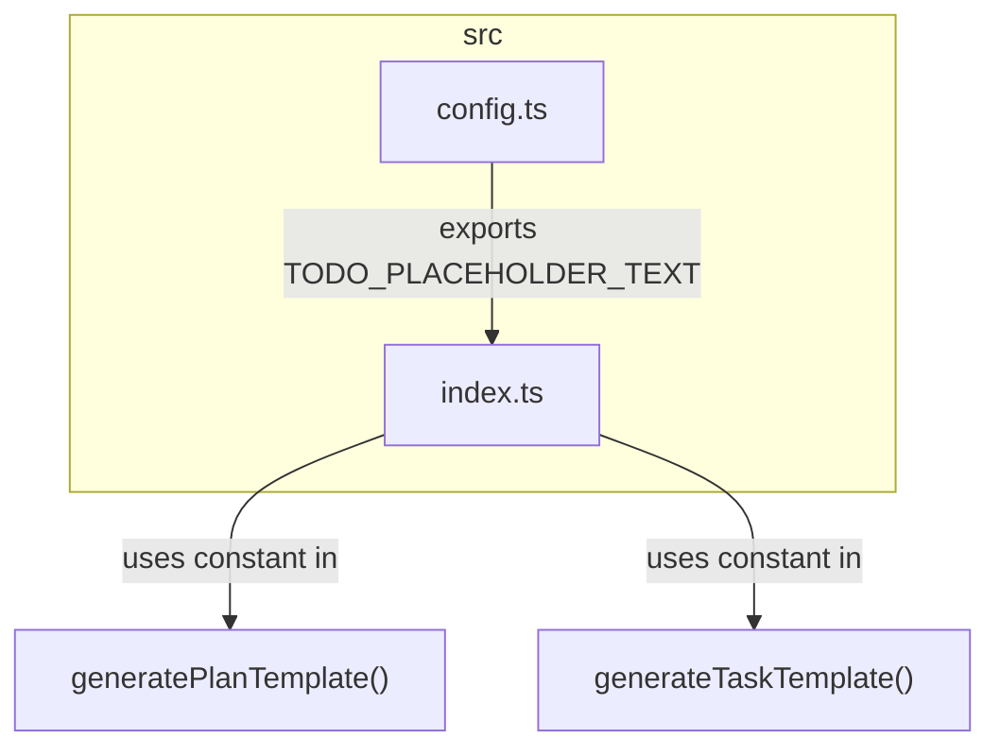
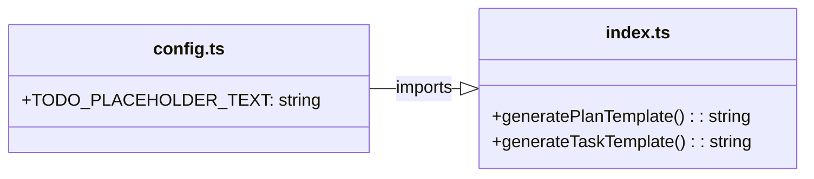
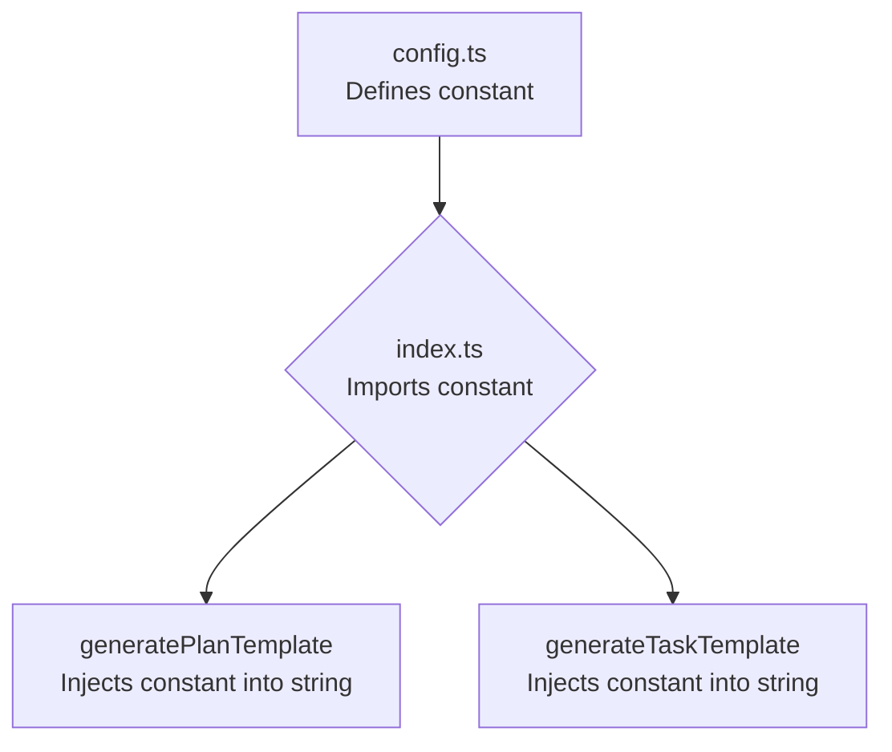
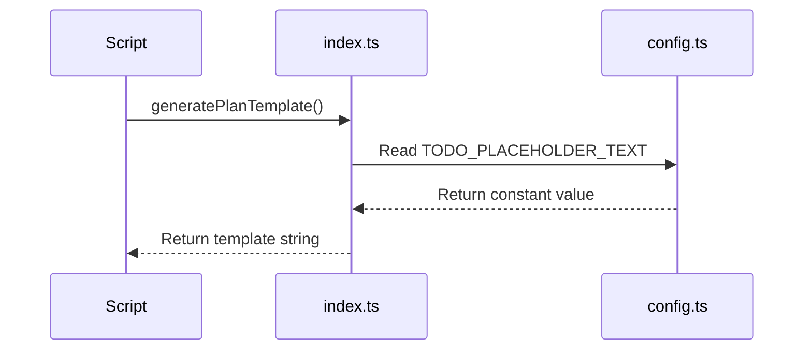

# Task: Refactor Placeholder Text to a Constant

## 1 Meta & Governance

### 1.2 Status

- **Current State:** ✅ Done
- **Priority:** 🟧 Medium
- **Progress:** 100%
- **Planning Estimate:** 1
- **Est. Variance (pts):** 0
- **Created:** 2025-07-20 16:55
- **Implementation Started:** 2025-07-20 17:15
- **Completed:** 2025-07-20 17:23
- **Last Updated:** 2025-07-20 16:55

### 1.3 Priority Drivers

- [TEC-Tech_Debt_Refactor](../ddd-2.md#tec-tech_debt_refactor)
- [TEC-Dev_Productivity_Enhancement](../ddd-2.md#tec-dev_productivity_enhancement)

---

## 2 Business & Scope

### 2.1 Overview

- **Core Function**: Replace the hardcoded placeholder text in template generators with a centralized constant.
- **Key Capability**: Establishes a single source of truth for the placeholder text, making it easily identifiable for parsers and simple to update in the future.
- **Business Value**: Improves the maintainability and machine-readability of the documentation templates, reducing technical debt and supporting future automation efforts.

#### 2.2.3 Core Business Rules

- A single, exported constant must be used for the placeholder text.
- The constant must be used in both the `generatePlanTemplate` and `generateTaskTemplate` functions.
- The placeholder text must be an easily identifiable string, such as `TODO__ADD_CONTENT_HERE`.

### 2.4 Acceptance Criteria

| ID   | Criterion                                                                                        | Test Reference      |
| :--- | :----------------------------------------------------------------------------------------------- | :------------------ |
| AC-1 | A `src/config.ts` file is created and contains an exported `TODO_PLACEHOLDER_TEXT` constant.     | `src/config.ts`     |
| AC-2 | `src/index.ts` imports the `TODO_PLACEHOLDER_TEXT` constant from `src/config.ts`.                | `src/index.ts`      |
| AC-3 | The `generatePlanTemplate` function in `src/index.ts` uses the `TODO_PLACEHOLDER_TEXT` constant. | `src/index.ts`      |
| AC-4 | The `generateTaskTemplate` function in `src/index.ts` uses the `TODO_PLACEHOLDER_TEXT` constant. | `src/index.ts`      |
| AC-5 | Running the template generation produces files with the new placeholder text.                    | Manual Verification |

---

## 3 Planning & Decomposition

### 3.3 Dependencies

| ID  | Dependency On  | Type     | Status      | Affected Plans/Tasks | Notes                                                               |
| :-- | :------------- | :------- | :---------- | :------------------- | :------------------------------------------------------------------ |
| D-1 | `src/index.ts` | Internal | ✅ Complete | This task            | The file containing the template generation logic to be refactored. |

---

## 4 High-Level Design

### 4.2 Target Architecture

The target architecture introduces a dedicated `src/config.ts` file to store shared constants. The existing `src/index.ts` will be refactored to import the placeholder constant from this new configuration file, decoupling configuration from implementation logic.

#### 4.2.1 Data Models



#### 4.2.2 Components

The two components involved are the `config.ts` module, which provides the constant, and the `index.ts` module, which consumes it.



#### 4.2.3 Data Flow

The data flow is unidirectional. The `TODO_PLACEHOLDER_TEXT` constant is defined in `config.ts`, imported by `index.ts`, and then embedded into the string output of the template generation functions.



#### 4.2.4 Control Flow

The control flow is initiated when an external script calls either `generatePlanTemplate()` or `generateTaskTemplate()`. During the execution of these functions, the `TODO_PLACEHOLDER_TEXT` constant is read from the imported module and used.



#### 4.2.5 Integration Points

This task involves internal module integration only. There are no external upstream or downstream integration points.

##### 4.2.5.1 Upstream Integrations

Not applicable.

##### 4.2.5.2 Downstream Integrations

Not applicable.

#### 4.2.6 Exposed API

No changes are made to the exposed API. The function signatures for `generatePlanTemplate` and `generateTaskTemplate` remain the same.

### 4.3 Tech Stack & Deployment

- **Language**: TypeScript
- **Runtime**: Node.js

### 4.4 Non-Functional Requirements

This is a minor internal refactoring with no impact on user-facing non-functional requirements.

#### 4.4.1 Performance

Not applicable. The change from a hardcoded string to a constant has no measurable impact on performance.

#### 4.4.2 Security

Not applicable. This change has no security implications.

#### 4.4.3 Reliability

Not applicable. This change does not affect the reliability of the system.

#### 4.4.4 Permission Model

Not applicable.

---

## 5 Maintenance and Monitoring

### 5.1 Current Maintenance and Monitoring

Not applicable. This task was a simple, one-time refactoring with no ongoing maintenance or monitoring requirements.

### 5.2 Target Maintenance and Monitoring

Not applicable. As a completed refactoring task, there is no "target" state for maintenance. The error handling is managed by the standard TypeScript compilation process.

#### 5.2.1 Error Handling

| Error Type                  | Trigger                                                                       | Action                        | User Feedback                                                   |
| :-------------------------- | :---------------------------------------------------------------------------- | :---------------------------- | :-------------------------------------------------------------- |
| **Import Resolution Error** | The `TODO_PLACEHOLDER_TEXT` constant cannot be imported from `src/config.ts`. | TypeScript compilation fails. | Standard `tsc` error message indicating a failed module import. |

#### 5.2.2 Logging & Monitoring

No specific logging or monitoring is required for this change. The use of the constant is validated at compile time.

---

## 6 Implementation Guidance

### 6.1 Implementation Log / Steps

- [x] Add and export the `TODO_PLACEHOLDER_TEXT` constant in the existing `src/config.ts` file.
- [x] Import the new constant into `src/index.ts`.
- [x] Replace the two hardcoded placeholder strings in `src/index.ts` with the imported constant.
- [x] Run `npm run generate-templates` to verify the changes are correctly applied to the output files.

#### 6.1.1 Initial Situation

The project contained a `src/config.ts` file that exported configuration variables. The placeholder text `[TODO: Add content for this section]` was hardcoded in two places within the `generatePlanTemplate` and `generateTaskTemplate` functions in `src/index.ts`.

#### 6.1.2 Files Change Log

| File Modified   | Change Description                                                        |
| :-------------- | :------------------------------------------------------------------------ |
| `src/config.ts` | Added the exported `TODO_PLACEHOLDER_TEXT` constant.                      |
| `src/index.ts`  | Imported the new constant and replaced the hardcoded placeholder strings. |

### 6.2 Prompts (LLM reuse)

```markdown
Analyze the file `src/index.ts`. Identify any hardcoded strings that are used as placeholders in the generated templates. Refactor the code to replace these strings with a single, exported constant from `src/config.ts`.
```

---

## 7 Quality & Operations

### 7.1 Testing Strategy / Requirements

| AC   | Scenario                                                                | Test Type | Tools / Runner               | Notes                                         |
| :--- | :---------------------------------------------------------------------- | :-------- | :--------------------------- | :-------------------------------------------- |
| AC-1 | The `TODO_PLACEHOLDER_TEXT` constant is correctly defined and exported. | Manual    | Code Review                  | Inspect `src/config.ts`.                      |
| AC-2 | The constant is correctly imported in `src/index.ts`.                   | Manual    | Code Review                  | Inspect `src/index.ts`.                       |
| AC-3 | `generatePlanTemplate` uses the constant.                               | Manual    | Code Review                  | Inspect `src/index.ts`.                       |
| AC-4 | `generateTaskTemplate` uses the constant.                               | Manual    | Code Review                  | Inspect `src/index.ts`.                       |
| AC-5 | Generated templates contain the correct placeholder text.               | Manual    | `npm run generate-templates` | Inspect the output files in `docs/templates`. |

### 7.2 Configuration

The only configuration relevant to this task is the value of the placeholder text itself, defined in `src/config.ts`.

| Setting Name            | Value                | Notes                             |
| :---------------------- | :------------------- | :-------------------------------- |
| `TODO_PLACEHOLDER_TEXT` | `_ADD_CONTENT_HERE_` | The string used for placeholders. |

### 7.3 Alerting & Response

Not applicable. This refactoring task does not introduce any conditions that would require alerting.

### 7.5 Local Test Commands

```bash
# After changes are made, run the generation script
npm run generate-templates

# Manually inspect the output files in docs/templates/
cat docs/templates/plan.template.md
cat docs/templates/task.template.md
```

---

## 8 Reference

### 8.1 Appendices/Glossary

**Glossary:**

- **Constant**: A value that cannot be altered by the program during normal execution.
- **Refactoring**: The process of restructuring existing computer code without changing its external behavior.

---
