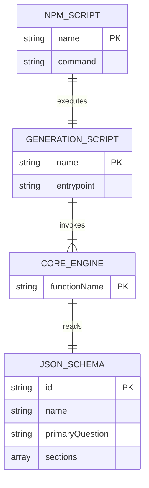
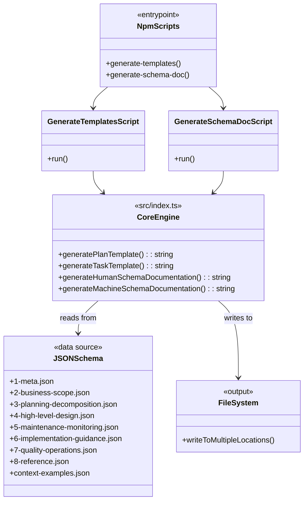
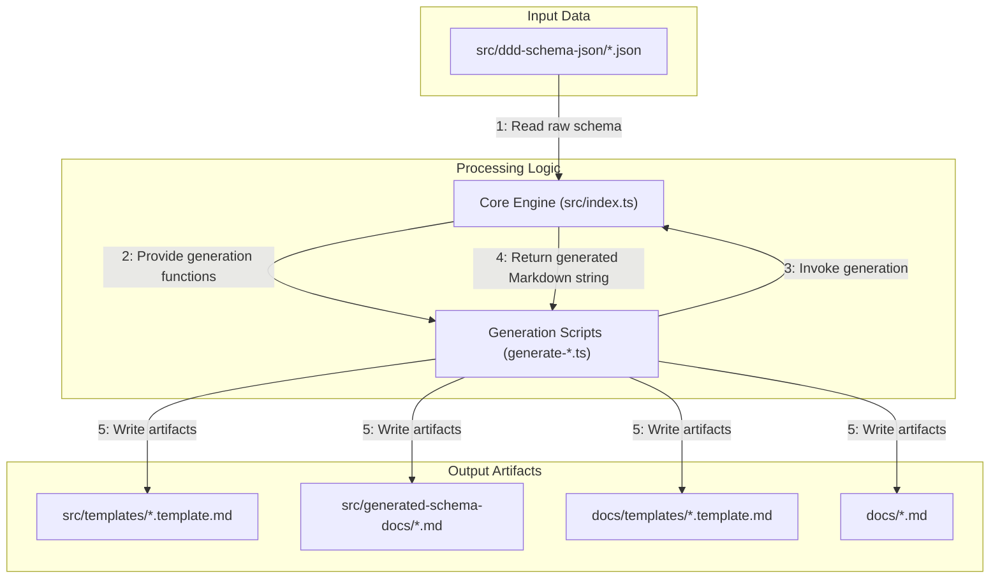
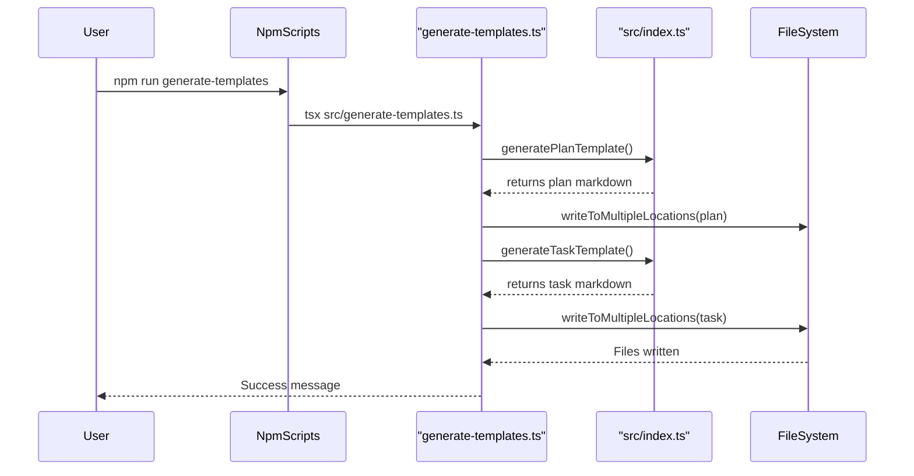

# Task: Schema-Driven Generation Scripts

## 1 Meta & Governance

### 1.2 Status

- **Current State:** ✅ Done
- **Priority:** 🟥 High
- **Progress:** 100%
- **Planning Estimate:** 5
- **Est. Variance (pts):** 0
- **Created:** 2025-07-19
- **Implementation Started:** 2025-07-19
- **Completed:** 2025-07-21
- **Last Updated:** 2025-07-25 03:46

### 1.3 Priority Drivers

- [TEC-Dev_Productivity_Enhancement](../ddd-2.md#tec-dev_productivity_enhancement)
- [TEC-Dev_Productivity_Blocker](../ddd-2.md#tec-dev_productivity_blocker)

---

## 2 Business & Scope

### 2.1 Overview

- **Core Function**: Implements the core scripts that automatically generate DDD templates (`plan.template.md`, `task.template.md`) and schema documentation (`ddd-2-schema.human.md`, `ddd-2-schema.machine.md`) from a set of canonical JSON schema definitions.
- **Key Capability**: Creates a robust, type-safe generation engine that reads from `src/ddd-schema-json/`, processes the data through a shared core logic in `src/index.ts`, and writes the final markdown artifacts to the filesystem.
- **Business Value**: Establishes the foundational automation for the DDD methodology, eliminating manual template maintenance, ensuring structural consistency, and enabling scalable evolution of the documentation standards.

### 2.4 Acceptance Criteria

| ID   | Criterion                                                                                                                     | Test Reference                |
| :--- | :---------------------------------------------------------------------------------------------------------------------------- | :---------------------------- |
| AC-1 | A script exists (`generate-templates.ts`) that successfully generates `plan.template.md` and `task.template.md`.              | `npm run generate-templates`  |
| AC-2 | A script exists (`generate-schema-doc.ts`) that successfully generates `ddd-2-schema.human.md` and `ddd-2-schema.machine.md`. | `npm run generate-schema-doc` |
| AC-3 | Both scripts are executable via `npm` scripts defined in `package.json`.                                                      | `package.json`                |
| AC-4 | The core generation logic is centralized in `src/index.ts` and is type-safe.                                                  | `tsc`                         |
| AC-5 | The scripts correctly read all 8 schema families from `src/ddd-schema-json/`.                                                 | Manual Code Review            |
| AC-6 | Generated files are written to the correct output directories as specified in the configuration.                              | Manual Verification           |

---

## 3 Planning & Decomposition

### 3.3 Dependencies

| ID  | Dependency On          | Type     | Status      | Affected Plans/Tasks | Notes                                          |
| :-- | :--------------------- | :------- | :---------- | :------------------- | :--------------------------------------------- |
| D-1 | TypeScript 5.0+        | External | ✅ Complete | -                    | Required for type safety.                      |
| D-2 | Node.js 18+            | External | ✅ Complete | -                    | Required for script execution.                 |
| D-3 | `tsx` package          | External | ✅ Complete | -                    | Used for direct execution of TS scripts.       |
| D-4 | Canonical JSON Schemas | Internal | ✅ Complete | -                    | `src/ddd-schema-json/*` files must be defined. |

---

## 4 High-Level Design

### 4.2 Target Architecture

The system is architected around a central, type-safe rendering engine (`src/index.ts`) that consumes canonical JSON schema definitions. Two separate entry-point scripts (`generate-templates.ts` and `generate-schema-doc.ts`) invoke this engine to produce different sets of artifacts. Configuration is handled by a dedicated module (`src/config.ts`) to allow for flexible output paths.

#### 4.2.1 Data Models



#### 4.2.2 Components



#### 4.2.3 Data Flow



#### 4.2.4 Control Flow



---

## 5 Maintenance and Monitoring

### 5.2 Target Maintenance and Monitoring

#### 5.2.1 Error Handling

| Error Type                       | Trigger                                                                       | Action                                      | User Feedback                                               |
| :------------------------------- | :---------------------------------------------------------------------------- | :------------------------------------------ | :---------------------------------------------------------- |
| **TypeScript Compilation Error** | Invalid schema structure or type mismatch in `src/index.ts` or related files. | Abort generation with a non-zero exit code. | Standard `tsc` error message showing file and line number.  |
| **JSON Schema Validation Error** | Malformed or invalid JSON in `src/ddd-schema-json/` files.                    | Abort generation with a non-zero exit code. | JSON parsing error from the script runner.                  |
| **File System Error**            | Cannot write to output directories (e.g., `src/templates`, `docs/`).          | Abort generation with a non-zero exit code. | File system error indicating the path and permission issue. |

#### 5.2.2 Logging & Monitoring

- **Console Output**: The scripts provide real-time progress updates to the console, indicating which artifact is currently being generated.
- **Success Confirmation**: Upon successful completion, a confirmation message is logged, listing the types of artifacts generated.
- **Error Reporting**: All errors are logged directly to the console with stack traces to facilitate debugging. No external monitoring is required as this is a local development tool.

---

## 6 Implementation Guidance

### 6.1 Implementation Log / Steps

- [x] **2025-07-19**: Created the initial JSON schema files, the core rendering engine (`src/index.ts`), and the first versions of the generation scripts (`generate-schema-doc.ts`, `generate-templates.ts`). (Ref: git commit `d1257ed`)
- [x] **2025-07-19**: Defined the initial TypeScript types in `src/types.ts` to support the schema. (Part of initial commits)
- [x] **2025-07-20**: Implemented the configuration and path utilities (`src/config.ts`, `src/path-utils.ts`) to make output directories configurable. (Ref: git commit `bf50e93`)
- [x] **2025-07-20**: Added the `generate-templates` and `generate-schema-doc` commands to `scripts` in `package.json`. (Ref: git commit `e90dbc6`)
- [x] **2025-07-20**: Refactored and fixed issues within the template generation, such as resolving Mermaid diagram syntax and moving placeholders to constants. (Ref: git commits `f2d202d`, `2b561f2`)
- [x] **2025-07-21**: Performed final code cleanup and refactoring, such as fixing import smells. (Ref: git commit `5f38c76`)
- [x] **2025-07-21**: Task considered complete after final testing and verification of generated artifacts.

### 6.1.1 Initial Situation

The project required a way to enforce documentation consistency based on a canonical schema. All templates and schema documents were maintained manually, leading to drift and errors. An automated, schema-driven generation system was needed.

### 6.1.2 Files Change Log

- **CREATED**: `src/index.ts`
- **CREATED**: `src/generate-templates.ts`
- **CREATED**: `src/generate-schema-doc.ts`
- **CREATED**: `src/config.ts`
- **CREATED**: `src/path-utils.ts`
- **CREATED**: `src/types.ts`
- **CREATED**: `src/ddd-schema-json/*` (all 8 families + examples)
- **MODIFIED**: `package.json` (added scripts)

---

## 7 Quality & Operations

### 7.5 Local Test Commands

```bash
# To generate the plan and task templates
npm run generate-templates

# To generate the human-readable and machine-readable schema documentation
npm run generate-schema-doc
```
