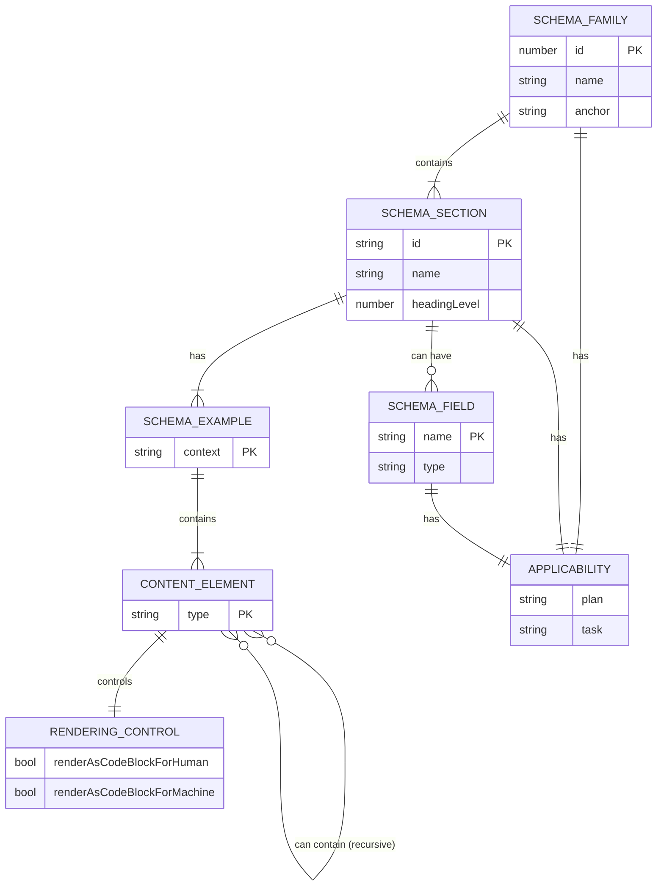

# T28: Define Canonical Schema Interfaces

## 1 Meta & Governance

### 1.2 Status

- **Current State:** 💡 Not Started
- **Priority:** 🟥 High
- **Progress:** 0%
- **Planning Estimate:** 3
- **Est. Variance (pts):** 0
- **Created:** 2025-08-02 09:08
- **Implementation Started:**
- **Completed:**
- **Last Updated:** 2025-08-02 09:08

### 1.3 Priority Drivers

- [TEC-Prod_Stability_Blocker](../ddd-2.md#tec-prod_stability_blocker)

---

## 2 Business & Scope

### 2.1 Overview

- **Core Function**: This task is to create the canonical Zod schemas that define the structure of the `src/ddd-schema-json/*.json` files.
- **Key Capability**: It will produce a `*.ts` file exporting Zod schemas. These schemas are the **validators** and serve as the source of truth for the structure. TypeScript types are then **inferred** from these Zod schemas for developer reference and type-safety.
- **Business Value**: Establishes a self-validating foundation for the schema system. The Zod schemas prevent structural errors in the schema definitions, while the inferred TypeScript types improve developer experience and provide type-safety for downstream systems (like the Tier 2 content validator).

### 2.4 Acceptance Criteria

| ID   | Criterion                                                                                                                         | Test Reference |
| :--- | :-------------------------------------------------------------------------------------------------------------------------------- | :------------- |
| AC-1 | The `src/schema` directory contains the `schema.zod.ts` file with the Zod schema definitions.                                     | N/A            |
| AC-2 | Zod schemas are defined for `SchemaFamily`, `SchemaSection`, `SchemaField`, and all other nested objects found in the JSON files. | N/A            |
| AC-3 | The Zod schemas are detailed enough to allow a validator to check the correctness of the `*.json` schema files.                   | N/A            |
| AC-4 | The Zod schemas are exported from the file.                                                                                       | N/A            |
| AC-5 | The `src/schema` directory contains the `schema.types.ts` file, exporting types inferred from the Zod schemas.                    | N/A            |
| AC-6 | The `src/schema` directory contains the `ddd-schema-json` sub-directory with all the JSON content files.                          | N/A            |

---

## 3 Planning & Decomposition

### 3.3 Dependencies

| ID  | Dependency On | Type     | Status      | Notes                                  |
| :-- | :------------ | :------- | :---------- | :------------------------------------- |
| D-1 | `zod`         | External | ✅ Complete | The Zod library for schema definition. |

---

## 4 High-Level Design

### 4.2 Target Architecture

#### 4.2.1 Data Models

The following diagram illustrates the relationships between the core data entities that define our schema structure.



#### 4.2.2 Components

None. This task defines data structures (types and schemas) and does not create any runtime components.

#### 4.2.3 Data Flow

None. This task is concerned with type definitions, not data processing or flow.

#### 4.2.4 Control Flow

None. This task does not involve any runtime control flow.

#### 4.2.5 Integration Points

None. The schemas defined in this task will be used by other components, but this task itself does not integrate with any other systems.

#### 4.2.6 Exposed API

None. This task does not create or expose any API.

### 4.3 Tech Stack & Deployment

- **TypeScript**: Used for defining the Zod schemas and the inferred types.
- **Zod**: The library used for schema definition and validation.
- **Deployment**: Not applicable. The output of this task is a set of TypeScript files that will be committed to the repository and used at development/build time, not deployed as a runtime asset.

### 4.4 Non-Functional Requirements

The primary non-functional requirement is the **correctness** and **completeness** of the schema definitions. Performance, security, and reliability of a runtime system are not applicable here.

---

## 5 Maintenance and Monitoring

### 5.2 Target Maintenance and Monitoring

#### 5.2.1 Error Handling

Error handling for this task is managed at development time by the TypeScript compiler and Zod. If the defined Zod schemas are invalid or inconsistent, the TypeScript compilation will fail. This provides immediate feedback without the need for runtime error handling mechanisms.

#### 5.2.2 Logging & Monitoring

Not applicable. This task produces static type definition files and has no runtime component that would require logging or monitoring.

---

## 6 Implementation Guidance

### 6.1 Implementation Log / Steps

- [ ] Create the directory `src/schema` if it doesn't exist.
- [ ] Move the `src/ddd-schema-json` directory to `src/schema/ddd-schema-json`.
- [ ] Create the file `src/schema/schema.zod.ts`.
- [ ] Define and export the `SchemaFamilySchema` Zod object.
- [ ] Define and export all sub-schemas required by `SchemaFamilySchema`.
- [ ] Review the `src/schema/ddd-schema-json/*.json` files to ensure all properties are accounted for in the Zod schemas.
- [ ] Create the file `src/schema/schema.types.ts` and export the inferred types from the Zod schemas.

### 6.1.1 Initial Situation

Currently, the project lacks a canonical, type-safe definition for the schema `*.json` files. There is no automated validation to prevent structural errors in these files, making the downstream generation process brittle and prone to failure if the JSON is edited incorrectly.

### 6.1.2 Files Change Log

This section will be populated during implementation.

- **Created**: `src/schema/schema.zod.ts`
- **Created**: `src/schema/schema.types.ts`
- **Moved**: `src/ddd-schema-json/` to `src/schema/`

### 6.2 Prompts (LLM reuse)

**For generating Zod schemas from JSON:**

````
Given the following JSON object, create a Zod schema that validates its structure. Ensure all properties are included and use appropriate Zod types (e.g., `z.string()`, `z.number()`, `z.object()`, `z.array()`, `z.optional()`).

JSON:
```json
[Paste JSON object here]
````

---

## 7 Quality & Operations

### 7.1 Testing Strategy / Requirements

While this task primarily produces type definitions, the Zod schemas themselves are executable validators and should be unit-tested.

| ID  | Scenario                                              | Test Type | Tools / Runner | Notes                                                              |
| :-- | :---------------------------------------------------- | :-------- | :------------- | :----------------------------------------------------------------- |
| T-1 | A valid `SchemaFamily` JSON object passes validation. | Unit      | Vitest + Zod   | Use a sample object that matches the structure of a `*.json` file. |
| T-2 | An invalid `SchemaFamily` object fails validation.    | Unit      | Vitest + Zod   | Test for missing required fields, incorrect types, etc.            |

### 7.2 Configuration

None. This task does not introduce any new runtime configuration.

### 7.3 Alerting & Response

Not applicable. Validation errors are caught at compile-time or during the execution of the validation script, providing immediate feedback to the developer. No runtime alerting is required.

### 7.5 Local Test Commands

The following command will execute the unit tests for the Zod schemas:

```bash
npm test src/schema/schema.zod.test.ts
```

---

## 8 Reference

### 8.1 Appendices/Glossary

- **Zod**: The TypeScript-first schema declaration and validation library used to define the canonical schema structure. [Official Documentation](https://zod.dev/)
