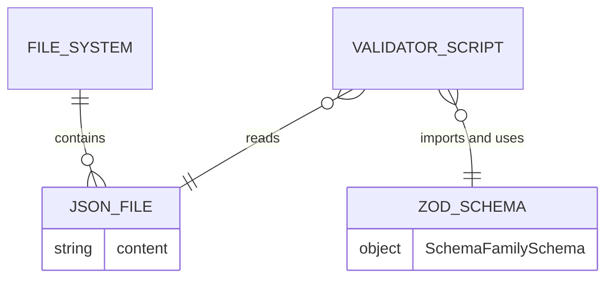
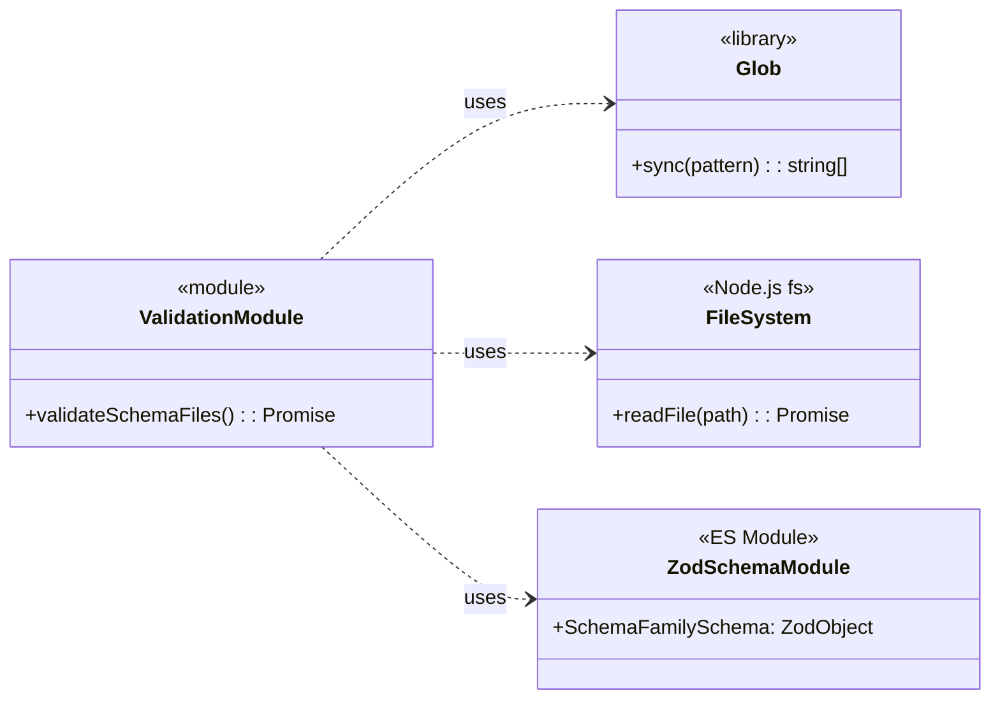
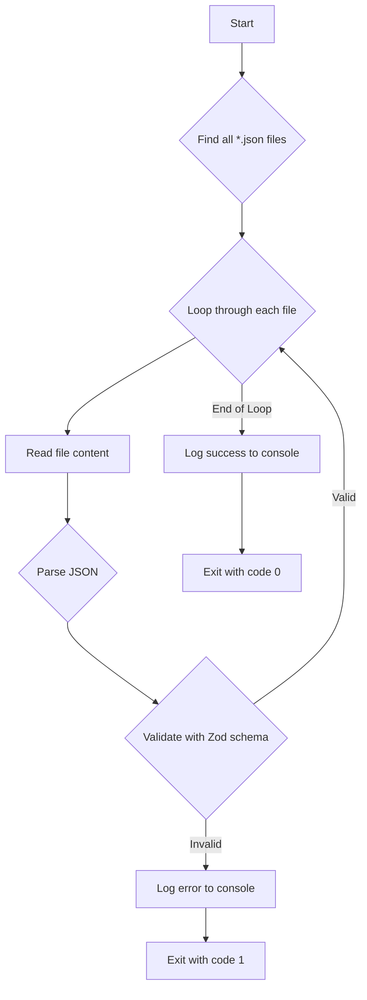
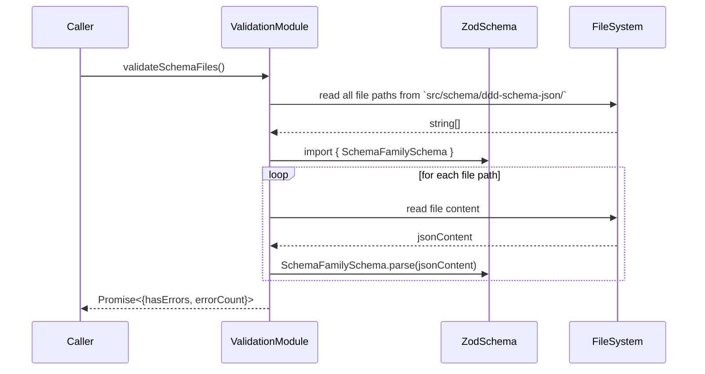

# T29: Integrate Family Schema Validation into Workflow

## 1 Meta & Governance

### 1.2 Status

- **Current State:** ✅ Complete
- **Priority:** 🟥 High
- **Progress:** 100%
- **Planning Estimate:** 2
- **Est. Variance (pts):** 0
- **Created:** 2025-08-02 09:16
- **Implementation Started:** 2025-08-03 18:00
- **Completed:** 2025-08-03 18:07
- **Last Updated:** 2025-08-03 21:44

### 1.3 Priority Drivers

- [TEC-Dev_Productivity_Blocker](../ddd-2.md#tec-dev_productivity_blocker)
- [TEC-Prod_Stability_Blocker](../ddd-2.md#tec-prod_stability_blocker)

---

## 2 Business & Scope

### 2.1 Overview

- **Core Function**: This task is to create a validation **module** that **uses the Zod schemas** (produced by `p1.t28`) to ensure the structural integrity of the documentation family definitions.
- **Key Capability**: The module exports a core validation function that can be imported and used by other parts of the system (like tests or future CLI tools). The logic iterates through all `*.json` files in `src/schema/ddd-schema-json/`, imports the corresponding Zod schema from `src/schema/schema.zod.ts`, and calls `.parse()` on the file content. This provides a simple, robust, and reusable way to enforce schema correctness.
- **Business Value**: By integrating this validation into the development workflow (e.g., pre-commit hooks, CI), we prevent structurally invalid schema definitions from ever entering the codebase. This is a critical quality gate that ensures the stability of downstream document generators (`ddd-2-schema.machine.md`, etc.).

### 2.4 Acceptance Criteria

| ID   | Criterion                                                                                                                      | Test Reference          |
| :--- | :----------------------------------------------------------------------------------------------------------------------------- | :---------------------- |
| AC-1 | A module exists at `src/schema/validate-family-schemas.ts` that exports a validation function.                                 | `family-schema.test.ts` |
| AC-2 | The module imports the `SchemaFamilySchema` from `src/schema/schema.zod.ts`.                                                   | `family-schema.test.ts` |
| AC-3 | The exported function successfully validates all `*.json` files in `src/schema/ddd-schema-json/` and returns a success status. | `family-schema.test.ts` |
| AC-4 | The exported function fails when a `*.json` file is invalid and returns a failure status.                                      | `family-schema.test.ts` |
| AC-5 | An `npm` script `validate:schema:family` is created in `package.json` to execute the validation logic.                         | N/A                     |

---

## 3 Planning & Decomposition

### 3.3 Dependencies

| ID  | Dependency On                     | Type     | Status      | Notes                                                                  |
| :-- | :-------------------------------- | :------- | :---------- | :--------------------------------------------------------------------- |
| D-1 | Task `p1.t28-define-schema-types` | Internal | ✅ Complete | This task produces the `SchemaFamilySchema` Zod object for validation. |

---

## 4 High-Level Design

### 4.2 Target Architecture

#### 4.2.1 Data Models

This script consumes raw JSON data from the file system and validates it against the `SchemaFamilySchema` defined in another module.



#### 4.2.2 Components

The implementation is a pure, reusable **module** containing the core validation logic. It is designed to be imported and consumed by other parts of the system, such as test suites or future CLI tools.



#### 4.2.3 Data Flow

The data flow is linear: find files, read content, parse, and report results to the console.



#### 4.2.4 Control Flow

This diagram shows the sequence of operations when the module's exported function is called by a consumer (e.g., a test suite).



#### 4.2.5 Integration Points

- **Upstream**:
  - **File System**: Reads `*.json` files from `src/schema/ddd-schema-json/`.
  - **ES Module**: Imports `SchemaFamilySchema` from `src/schema/schema.zod.ts`.
- **Downstream / Consumers**:
  - **Testing Framework**: The module is imported and executed directly by the test suite (`Vitest`).
  - **Future CLI Tools**: The module is designed to be consumed by future CLI scripts or other tools that need to perform schema validation.

#### 4.2.6 Exposed API

The module exposes a programmatic API. A command-line interface is not part of this module but can be built by a consumer.

**Programmatic API (from `src/schema/validate-family-schemas.ts`):**

```typescript
export async function validateSchemaFiles(): Promise<{ hasErrors: boolean; errorCount: number }>;
```

### 4.3 Tech Stack & Deployment

- **Language**: TypeScript
- **Execution**: `tsx` (or `ts-node`) for direct execution of TypeScript files.
- **Validation Library**: `zod` (as defined in T28).
- **File System**: `glob` for file path discovery and Node.js `fs/promises` for file reading.
- **Deployment**: This is a development tool, not a deployed service. It will be part of the project's `devDependencies` and run in local development and CI environments.

### 4.4 Non-Functional Requirements

| ID     | Requirement                                                                                              | Priority  |
| :----- | :------------------------------------------------------------------------------------------------------- | :-------- |
| NFR-01 | **Correctness**: The script MUST fail if even one `*.json` file is invalid according to the Zod schema.  | 🟥 High   |
| NFR-02 | **Usability**: On failure, the error message MUST be clear, identifying the file and the Zod error path. | 🟥 High   |
| NFR-03 | **Performance**: The script should complete in under 5 seconds on a standard development machine.        | 🟧 Medium |

---

## 5 Maintenance and Monitoring

### 5.2 Target Maintenance and Monitoring

#### 5.2.1 Error Handling

The script's error handling is straightforward and focuses on providing clear feedback to the developer running it.

| Error Type               | Trigger                                           | Action                                                                | Console Output                                                            |
| :----------------------- | :------------------------------------------------ | :-------------------------------------------------------------------- | :------------------------------------------------------------------------ |
| **Zod Validation Error** | `SchemaFamilySchema.parse()` throws an exception. | Catch the Zod error, format it for readability, and exit with code 1. | `ERROR: Validation failed for [file path]:\n[Formatted Zod error issues]` |
| **File System Error**    | `fs.readFile` or `glob.sync` fails.               | Catch the exception, print the error message, and exit with code 1.   | `ERROR: Could not read file [file path]:\n[Error message]`                |
| **JSON Parsing Error**   | `JSON.parse()` fails on malformed JSON.           | Catch the exception, print the error message, and exit with code 1.   | `ERROR: Could not parse JSON in [file path]:\n[SyntaxError message]`      |

#### 5.2.2 Logging & Monitoring

- **Logging**: All output is directed to `console.log` (for success messages) and `console.error` (for failures). The logging should be human-readable and provide sufficient context for debugging.
- **Monitoring**: No external monitoring is required. The script's success or failure is monitored by the calling process (e.g., a CI pipeline runner) via its exit code.

---

## 6 Implementation Guidance

### 6.1 Implementation Log / Steps

- [x] Create the initial script file.
- [x] Implement the core validation logic using `glob`, `fs`, and `zod`.
- [x] **Architectural Refactor**: Evolve the script into a reusable module by exporting the core `validateSchemaFiles` function.
- [x] **CLI Wrapper Removal**: Remove the CLI entry-point block to create a pure, reusable module.
- [x] Create unit tests that directly import and test the `validateSchemaFiles` function.
- [x] **Behavior-Driven Tests**: Implement comprehensive test scenarios using mocking for success, Zod errors, JSON syntax errors, file read errors, and empty directories.
- [x] **Relocate Module**: Move the file from `src/scripts/` to `src/schema/` to better reflect its architectural role.

### 6.1.1 Initial Situation

The project currently has the raw `*.json` files that define the documentation schema families (`src/schema/ddd-schema-json/`) and a separate `schema.zod.ts` file (from T28) that defines the canonical Zod validator. However, there is no automated process to enforce that the JSON files actually conform to the Zod schema. A developer could introduce a breaking change into a JSON file without any immediate feedback, leading to downstream failures in the document generation process.

### 6.1.2 Files Change Log

- **Created**: `src/schema/validate-family-schemas.ts` (Originally in `src/scripts/`)
- **Created**: `src/__tests__/scripts/family-schema.test.ts`
- **Modified**: `package.json` (to add `devDependencies` and the `npm` script)
- **Refactored**: Evolved from a simple script into a pure, reusable module with an exported API. The CLI entry point was removed.
- **Rewritten**: Test suite to use behavior-driven testing by directly importing and testing the exported module function.

### 6.2 Prompts (LLM reuse)

**For generating the module structure:**

```
Create a TypeScript module that exports an async function `validateSchemaFiles`.

This function should use `glob` and Node.js `fs` to find and validate all `*.json` files in `src/schema/ddd-schema-json/` against the `SchemaFamilySchema` from `src/schema/schema.zod.ts`.

The function should not exit the process. Instead, it should return a promise that resolves to an object like `{ hasErrors: boolean, errorCount: number }`. It should log progress and errors to the console.
```

---

## 7 Quality & Operations

### 7.1 Testing Strategy / Requirements

The testing strategy focuses on behavior-driven unit tests that import the `validateSchemaFiles` function and validate its return value and side effects (console logs) under various mocked conditions.

| AC ID | Scenario                                                     | Test Type | Tools / Mocks              | Notes                                                                                                 |
| :---- | :----------------------------------------------------------- | :-------- | :------------------------- | :---------------------------------------------------------------------------------------------------- |
| AC-3  | Module processes a valid JSON file.                          | Unit      | `vi.mock` for `glob`, `fs` | Assert that `validateSchemaFiles` returns `{ hasErrors: false, ... }`.                                |
| AC-4  | Module processes an invalid JSON file (violates Zod schema). | Unit      | `vi.mock` for `glob`, `fs` | Assert that `validateSchemaFiles` returns `{ hasErrors: true, ... }` and logs a Zod error.            |
| AC-4  | Module handles a malformed JSON file (syntax error).         | Unit      | `vi.mock` for `glob`, `fs` | Assert that `validateSchemaFiles` returns `{ hasErrors: true, ... }` and logs a syntax error.         |
| AC-4  | Module handles a file system read error.                     | Unit      | `vi.mock` for `glob`, `fs` | Assert that `validateSchemaFiles` returns `{ hasErrors: true, ... }` and logs a file system error.    |
| AC-3  | Module handles an empty directory of schemas.                | Unit      | `vi.mock` for `glob`       | Assert that `validateSchemaFiles` returns `{ hasErrors: false, ... }` and logs a "not found" message. |

### 7.2 Configuration

This script requires no runtime configuration. The path to the schema definitions (`src/schema/ddd-schema-json/`) is hardcoded, as it is a core architectural constant of this project.

### 7.3 Alerting & Response

| Condition                 | Alerting Mechanism                                | Response Plan                                                                                                                              |
| :------------------------ | :------------------------------------------------ | :----------------------------------------------------------------------------------------------------------------------------------------- |
| **Script fails locally**  | A non-zero exit code and a `console.error` log.   | The developer must inspect the log and fix the invalid JSON file before committing.                                                        |
| **Script fails in CI/CD** | A failed pipeline step and a `console.error` log. | The developer must inspect the CI log, fix the invalid JSON file, and push the changes. The PR cannot be merged until the pipeline passes. |

### 7.5 Local Test Commands

The following command will run the validation script:

```bash
npm run validate:schema:family
```

The following command will run the associated unit tests:

```bash
npm test src/__tests__/scripts/family-schema.test.ts
```

---

## 8 Reference

### 8.1 Appendices/Glossary

- **Zod**: The TypeScript-first schema declaration and validation library used to define and enforce the schema structure. [Official Documentation](https://zod.dev/)
- **glob**: A library to match files using patterns, used here to discover all the JSON schema definition files.
- **tsx**: A tool for executing TypeScript and ESM files directly, used to run the validation script without a separate compilation step.
