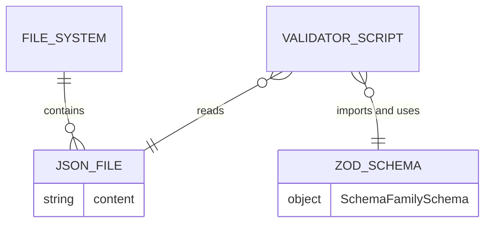
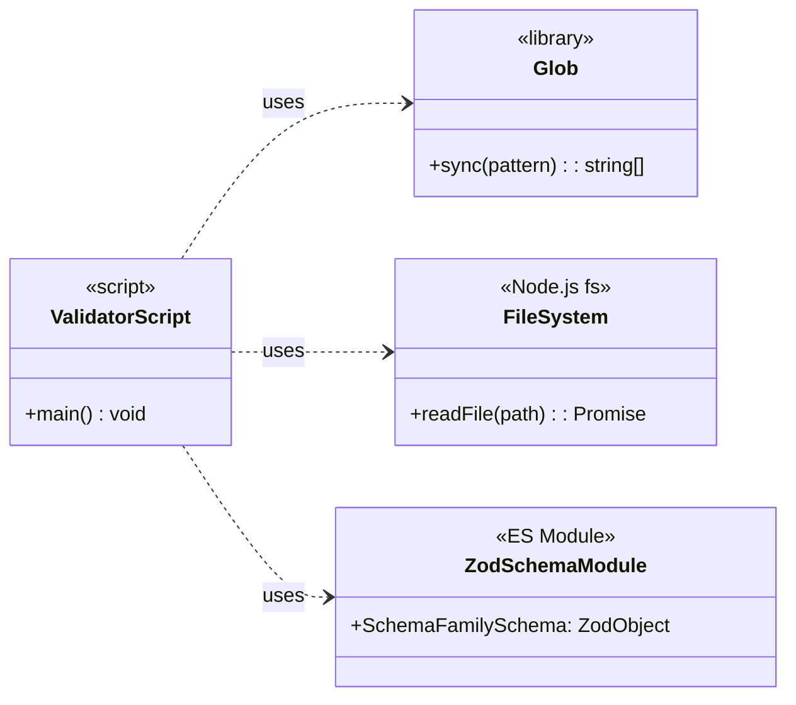
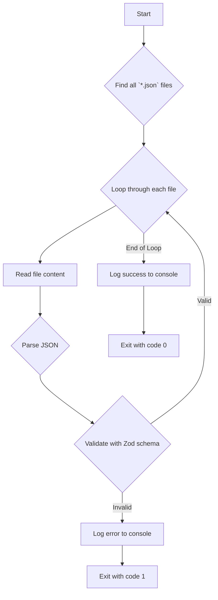
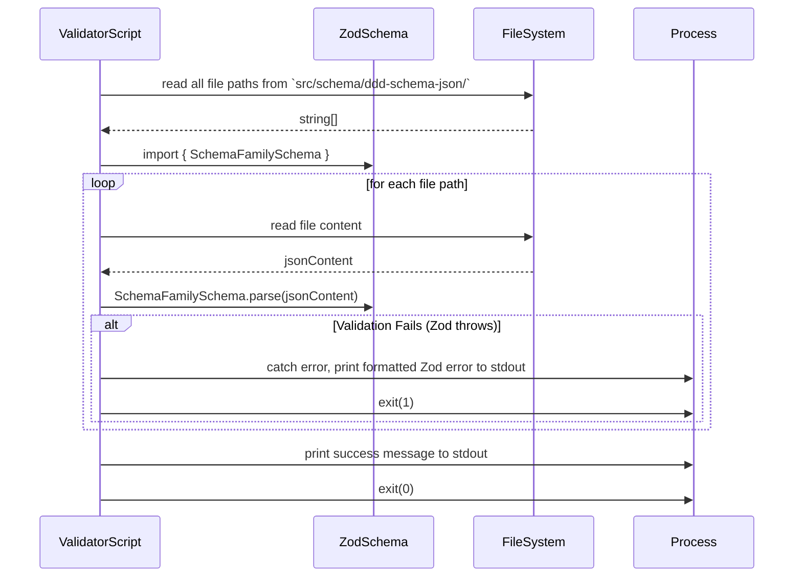

# T29: Integrate Family Schema Validation into Workflow

## 1 Meta & Governance

### 1.2 Status

- **Current State:** 💡 Not Started
- **Priority:** 🟥 High
- **Progress:** 0%
- **Planning Estimate:** 2
- **Est. Variance (pts):** 0
- **Created:** 2025-08-02 09:16
- **Implementation Started:**
- **Completed:**
- **Last Updated:** 2025-08-03 08:45

### 1.3 Priority Drivers

- [TEC-Dev_Productivity_Blocker](../ddd-2.md#tec-dev_productivity_blocker)
- [TEC-Prod_Stability_Blocker](../ddd-2.md#tec-prod_stability_blocker)

---

## 2 Business & Scope

### 2.1 Overview

- **Core Function**: This task is to create a validation script that **uses the Zod schemas** (produced by `p1.t28`) to ensure the structural integrity of the documentation family definitions.
- **Key Capability**: The script will iterate through all `*.json` files in `src/schema/ddd-schema-json/`, import the corresponding Zod schema from `src/schema/schema.zod.ts`, and call `.parse()` on the file content. This provides a simple, robust way to enforce schema correctness.
- **Business Value**: By integrating this validation into the development workflow (e.g., pre-commit hooks, CI), we prevent structurally invalid schema definitions from ever entering the codebase. This is a critical quality gate that ensures the stability of downstream document generators (`ddd-2-schema.machine.md`, etc.).

### 2.4 Acceptance Criteria

| ID   | Criterion                                                                                                                                    | Test Reference          |
| :--- | :------------------------------------------------------------------------------------------------------------------------------------------- | :---------------------- |
| AC-1 | A script exists at `src/scripts/validate-family-schemas.ts`.                                                                                 | `family-schema.test.ts` |
| AC-2 | The script imports the `SchemaFamilySchema` from `src/schema/schema.zod.ts`.                                                                 | `family-schema.test.ts` |
| AC-3 | The script successfully validates all `*.json` files in `src/schema/ddd-schema-json/` against the `SchemaFamilySchema`, exiting with code 0. | `family-schema.test.ts` |
| AC-4 | The script fails (non-zero exit code) when a `*.json` file is invalid, printing a clear Zod error message.                                   | `family-schema.test.ts` |
| AC-5 | An `npm` script `validate:schema:family` is created in `package.json` to execute the script.                                                 | N/A                     |

---

## 3 Planning & Decomposition

### 3.3 Dependencies

| ID  | Dependency On                     | Type     | Status         | Notes                                                                  |
| :-- | :-------------------------------- | :------- | :------------- | :--------------------------------------------------------------------- |
| D-1 | Task `p1.t28-define-schema-types` | Internal | 💡 Not Started | This task produces the `SchemaFamilySchema` Zod object for validation. |

---

## 4 High-Level Design

### 4.2 Target Architecture

#### 4.2.1 Data Models

This script consumes raw JSON data from the file system and validates it against the `SchemaFamilySchema` defined in another module.



#### 4.2.2 Components

The script is composed of several logical parts that work together to perform the validation.



#### 4.2.3 Data Flow

The data flow is linear: find files, read content, parse, and report results to the console.



#### 4.2.4 Control Flow

This diagram shows the internal sequence of operations within the validation script itself, independent of how it is executed.



#### 4.2.5 Integration Points

- **Upstream**:
  - **File System**: Reads `*.json` files from `src/schema/ddd-schema-json/`.
  - **ES Module**: Imports `SchemaFamilySchema` from `src/schema/schema.zod.ts`.
- **Downstream**:
  - **Execution Environment**: The script communicates its result via `process.stdout` (for messages) and `process.exit` codes (for success/failure).
- **Execution Integrations**:
  - **NPM Script**: The primary way to run the script is via an `npm` command (`npm run validate:schema:family`).
  - **CI/CD Pipeline**: The npm script can be added as a quality gate step in CI pipelines (e.g., GitHub Actions).
  - **Pre-commit Hook**: The npm script can be integrated into a pre-commit hook (e.g., using `husky`) to prevent committing invalid schema definitions.

#### 4.2.6 Exposed API

This is a command-line script and does not expose a programmatic API. Its public interface is the `npm` script command.

- **Command**: `npm run validate:schema:family`
- **Arguments**: None
- **Options**: None

### 4.3 Tech Stack & Deployment

- **Language**: TypeScript
- **Execution**: `tsx` (or `ts-node`) for direct execution of TypeScript files.
- **Validation Library**: `zod` (as defined in T28).
- **File System**: `glob` for file path discovery and Node.js `fs/promises` for file reading.
- **Deployment**: This is a development tool, not a deployed service. It will be part of the project's `devDependencies` and run in local development and CI environments.

### 4.4 Non-Functional Requirements

| ID     | Requirement                                                                                              | Priority  |
| :----- | :------------------------------------------------------------------------------------------------------- | :-------- |
| NFR-01 | **Correctness**: The script MUST fail if even one `*.json` file is invalid according to the Zod schema.  | 🟥 High   |
| NFR-02 | **Usability**: On failure, the error message MUST be clear, identifying the file and the Zod error path. | 🟥 High   |
| NFR-03 | **Performance**: The script should complete in under 5 seconds on a standard development machine.        | 🟧 Medium |

---

## 5 Maintenance and Monitoring

### 5.2 Target Maintenance and Monitoring

#### 5.2.1 Error Handling

The script's error handling is straightforward and focuses on providing clear feedback to the developer running it.

| Error Type               | Trigger                                           | Action                                                                | Console Output                                                            |
| :----------------------- | :------------------------------------------------ | :-------------------------------------------------------------------- | :------------------------------------------------------------------------ |
| **Zod Validation Error** | `SchemaFamilySchema.parse()` throws an exception. | Catch the Zod error, format it for readability, and exit with code 1. | `ERROR: Validation failed for [file path]:\n[Formatted Zod error issues]` |
| **File System Error**    | `fs.readFile` or `glob.sync` fails.               | Catch the exception, print the error message, and exit with code 1.   | `ERROR: Could not read file [file path]:\n[Error message]`                |
| **JSON Parsing Error**   | `JSON.parse()` fails on malformed JSON.           | Catch the exception, print the error message, and exit with code 1.   | `ERROR: Could not parse JSON in [file path]:\n[SyntaxError message]`      |

#### 5.2.2 Logging & Monitoring

- **Logging**: All output is directed to `console.log` (for success messages) and `console.error` (for failures). The logging should be human-readable and provide sufficient context for debugging.
- **Monitoring**: No external monitoring is required. The script's success or failure is monitored by the calling process (e.g., a CI pipeline runner) via its exit code.

---

## 6 Implementation Guidance

### 6.1 Implementation Log / Steps

- [ ] Create the script file at `src/scripts/validate-family-schemas.ts`.
- [ ] Implement the core validation logic using `glob` and `fs` to read files and `zod` to parse them.
- [ ] Ensure the script provides clear error messages and exits with the correct status code.
- [ ] Add the `validate:schema:family` command to the `scripts` section of `package.json`.
- [ ] Add `glob` and `tsx` to `devDependencies`.
- [ ] Create unit tests for the script in `src/__tests__/scripts/family-schema.test.ts`.

### 6.1.1 Initial Situation

The project currently has the raw `*.json` files that define the documentation schema families (`src/schema/ddd-schema-json/`) and a separate `schema.zod.ts` file (from T28) that defines the canonical Zod validator. However, there is no automated process to enforce that the JSON files actually conform to the Zod schema. A developer could introduce a breaking change into a JSON file without any immediate feedback, leading to downstream failures in the document generation process.

### 6.1.2 Files Change Log

- **Created**: `src/scripts/validate-family-schemas.ts`
- **Created**: `src/__tests__/scripts/family-schema.test.ts`
- **Modified**: `package.json` (to add `devDependencies` and the `npm` script)

### 6.2 Prompts (LLM reuse)

**For generating the initial script structure:**

```
Create a TypeScript script using `glob` and Node.js `fs` that finds all `*.json` files in a specified directory (`src/schema/ddd-schema-json/`).

For each file, it should:
1. Read the file content.
2. Parse it as JSON.
3. Import a `SchemaFamilySchema` object from `src/schema/schema.zod.ts`.
4. Call `SchemaFamilySchema.parse()` on the JSON object inside a try/catch block.
5. If it fails, log the file path and the error to the console and set an error flag.
6. After checking all files, exit with code 1 if the error flag is set, otherwise exit with code 0.
```

---

## 7 Quality & Operations

### 7.1 Testing Strategy / Requirements

The testing strategy focuses on unit testing the script's logic in isolation, without actual file system interaction.

| AC ID | Scenario                                                     | Test Type | Tools / Mocks                          | Notes                                                                      |
| :---- | :----------------------------------------------------------- | :-------- | :------------------------------------- | :------------------------------------------------------------------------- |
| AC-3  | Script processes a valid JSON file.                          | Unit      | `vi.spyOn` for `glob`, `fs`, `process` | Assert that `console.log` is called and `process.exit` is called with 0.   |
| AC-4  | Script processes an invalid JSON file (violates Zod schema). | Unit      | `vi.spyOn` for `glob`, `fs`, `process` | Assert that `console.error` is called and `process.exit` is called with 1. |
| AC-4  | Script handles a malformed JSON file (syntax error).         | Unit      | `vi.spyOn` for `glob`, `fs`, `process` | Assert that `console.error` is called and `process.exit` is called with 1. |
| AC-4  | Script handles a file system read error.                     | Unit      | `vi.spyOn` for `glob`, `fs`, `process` | Assert that `console.error` is called and `process.exit` is called with 1. |

### 7.2 Configuration

This script requires no runtime configuration. The path to the schema definitions (`src/schema/ddd-schema-json/`) is hardcoded, as it is a core architectural constant of this project.

### 7.3 Alerting & Response

| Condition                 | Alerting Mechanism                                | Response Plan                                                                                                                              |
| :------------------------ | :------------------------------------------------ | :----------------------------------------------------------------------------------------------------------------------------------------- |
| **Script fails locally**  | A non-zero exit code and a `console.error` log.   | The developer must inspect the log and fix the invalid JSON file before committing.                                                        |
| **Script fails in CI/CD** | A failed pipeline step and a `console.error` log. | The developer must inspect the CI log, fix the invalid JSON file, and push the changes. The PR cannot be merged until the pipeline passes. |

### 7.5 Local Test Commands

The following command will run the validation script:

```bash
npm run validate:schema:family
```

The following command will run the associated unit tests:

```bash
npm test src/__tests__/scripts/family-schema.test.ts
```

---

## 8 Reference

### 8.1 Appendices/Glossary

- **Zod**: The TypeScript-first schema declaration and validation library used to define and enforce the schema structure. [Official Documentation](https://zod.dev/)
- **glob**: A library to match files using patterns, used here to discover all the JSON schema definition files.
- **tsx**: A tool for executing TypeScript and ESM files directly, used to run the validation script without a separate compilation step.
