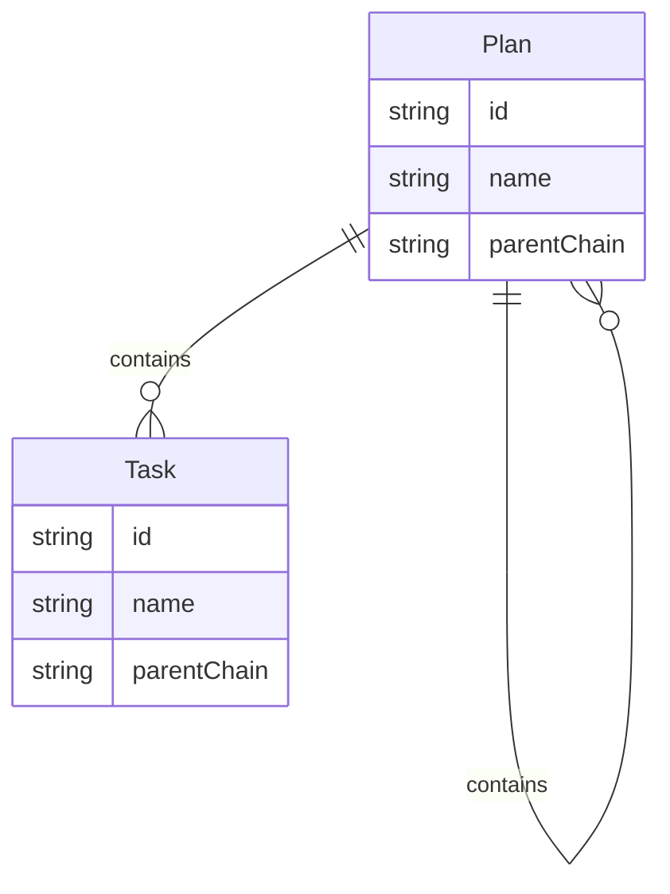
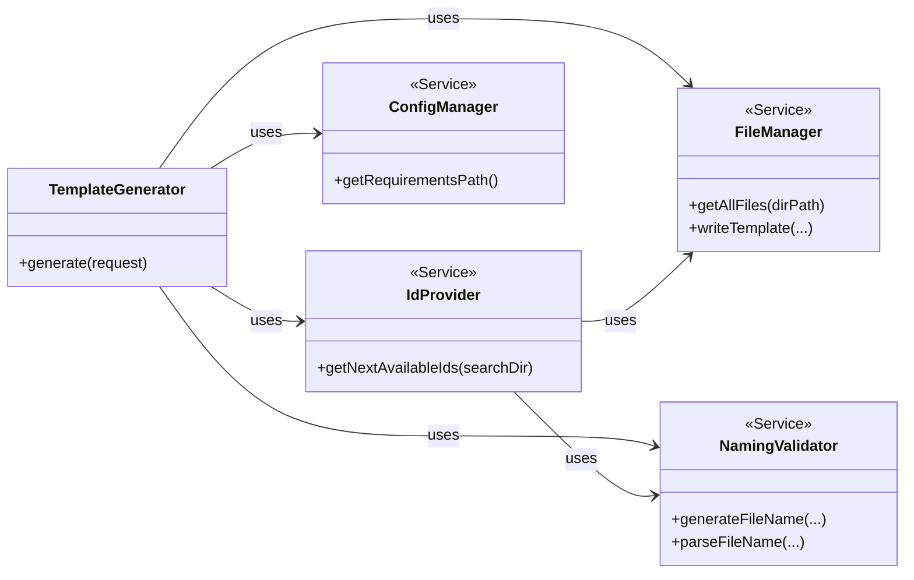
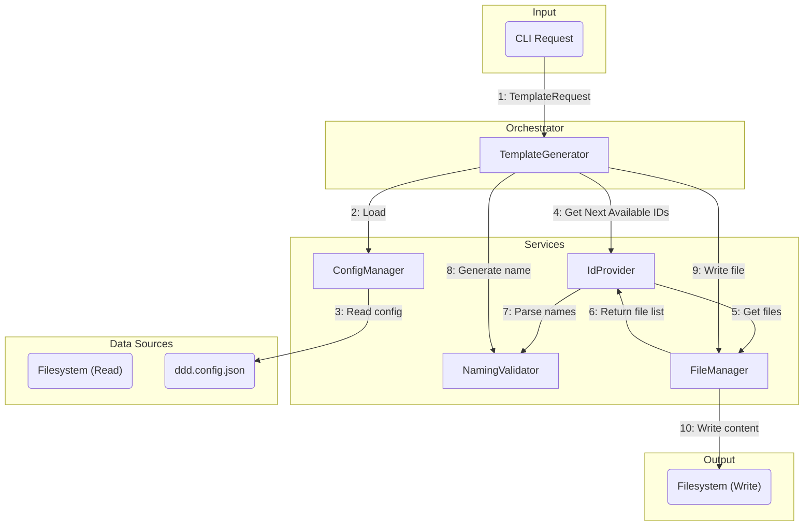
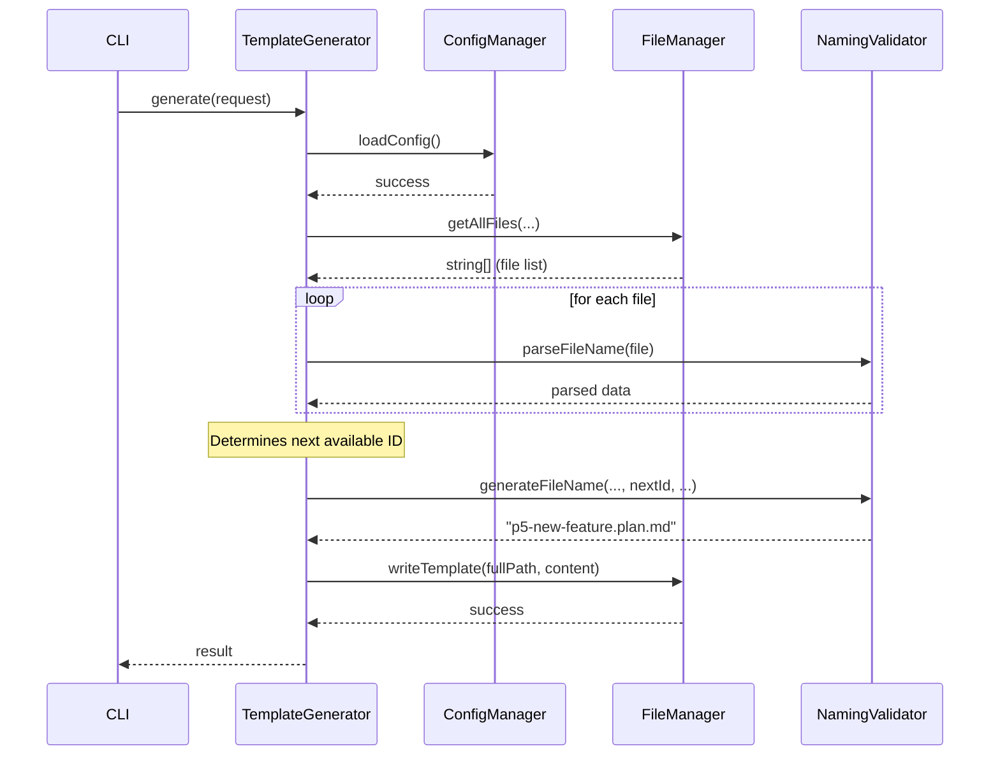

# File Naming Pattern Change for DDD Artefacts

## 1 Meta & Governance

### 1.2 Status

- **Current State:** ✅ Complete
- **Priority:** 🟥 High
- **Progress:** 100%
- **Planning Estimate:** 13
- **Est. Variance (pts):** 0
- **Created:** 2025-07-21
- **Implementation Started:** 2025-07-21 19:00
- **Completed:** 2025-07-22
- **Last Updated:** 2025-07-22 07:07

### 1.3 Priority Drivers

- [TEC-Debt_Maintainability](..//ddd-2.md#tec-debt_maintainability)
- [TEC-Testability](../ddd-2.md#tec-testability)
- [TEC-Dev_FutureProofing](../ddd-2.md#tec-dev_futureproofing)
- [TEC-Dev_ParsingSimplicity](../ddd-2.md#tec-dev_parsingsimplicity)

---

## 2 Business & Scope

### 2.1 Overview

- Implements a new, parsing-friendly file naming convention for all DDD artefacts (plans and tasks).
- Enables robust, future-proof, and maintainable parsing and generation logic for CLI and tooling.
- Ensures all code, tests, and documentation consistently use the new pattern.
- Reduces ambiguity and complexity in parent/child relationships and ID extraction.

#### 2.2.3 Core Business Rules

- Only plan artefacts can be parents; tasks are always leaf nodes.
- New naming pattern must be strictly enforced for all artefacts:
  - Plans: `[parent-chain].[p{id}-{name}].plan.md`
  - Tasks: `[parent-chain].[t{id}-{name}].task.md`
- Parent chain is a dash-joined list of plan IDs; dot separates parent chain from current artefact.
- For tasks, a parent plan is mandatory; top-level tasks are not allowed.
- When specifying a parent, the **full, exact filename** of the parent artefact must be used, and the file must exist. Shorthand names are not permitted.
- All parsing, generation, and validation logic must use the new pattern.

### 2.4 Acceptance Criteria

| ID   | Criterion                                                                    | Test Reference                                   |
| :--- | :--------------------------------------------------------------------------- | :----------------------------------------------- |
| AC-1 | All new artefacts use the new naming pattern.                                | `naming-validator.test.ts`                       |
| AC-2 | CLI and services generate correct file names for all parent/child scenarios. | `template-generator.test.ts`, `template.test.ts` |
| AC-3 | An error is thrown if a task is created without a parent plan.               | `template.test.ts`                               |
| AC-4 | All documentation and schema examples use the new pattern.                   | `ddd-2.md`, `context-examples.json`              |
| AC-5 | The legacy naming pattern is fully removed from the codebase.                | Manual Code Review                               |
| AC-6 | Test coverage is sufficient for all edge cases.                              | `npm test -- --coverage`                         |

---

## 3 Planning & Decomposition

### 3.3 Dependencies

| ID  | Dependency On                                                 | Type          | Status      | Affected Plans/Tasks | Notes                                                               |
| :-- | :------------------------------------------------------------ | :------------ | :---------- | :------------------- | :------------------------------------------------------------------ |
| D-1 | `ddd-2.md`                                                    | Documentation | ✅ Complete | This task            | The core naming convention was updated.                             |
| D-2 | `ddd-schema-json`                                             | Schema        | ✅ Complete | This task            | Examples were updated to use the new pattern.                       |
| D-3 | CLI services (`naming-validator`, `template-generator`, etc.) | Code          | ✅ Complete | This task            | Core logic was refactored to support the new pattern.               |
| D-4 | CLI tests                                                     | Tests         | ✅ Complete | This task            | Tests were updated and expanded to cover new logic and edge cases.  |
| D-5 | Existing artefact files in `/docs`                            | Filesystem    | ✅ Complete | This task            | All existing `.plan.md` and `.task.md` files were manually renamed. |

---

## 4 High-Level Design

### 4.2 Target Architecture

- CLI and services will use the new naming pattern for all artefact generation and parsing.
- NamingValidator and related utilities will be refactored for dot/dash parsing logic.
- Tests will enforce correct naming and error handling for all scenarios.

#### 4.2.1 Data Models



#### 4.2.2 Components

The architecture is refactored to improve separation of concerns. `TemplateGenerator` acts as the central orchestrator, while `NamingValidator` is a pure, stateless service.



#### 4.2.3 Data Flow

The refactored data flow clarifies responsibilities. `TemplateGenerator` orchestrates the entire process, fetching data and delegating pure logic to `NamingValidator`.



#### 4.2.4 Control Flow

The control flow is now driven by the `TemplateGenerator`, which coordinates the other services.



#### 4.2.5 Integration Points

This section defines the boundaries of the system, detailing how it receives input and what it produces as output.

##### 4.2.5.1 Upstream Integrations

- **CLI Commands**: The system is triggered by user input via CLI commands (e.g., `template plan <name> --parent <full-parent-filename>`). The `--parent` argument must be the full, exact filename of an existing plan.
- **Configuration File**: The system reads the `ddd.config.json` file to determine the `requirementsPath` for artefact generation.

##### 4.2.5.2 Downstream Integrations

- **Filesystem**: The primary output is the creation and renaming of `.plan.md` and `.task.md` files within the project's filesystem.
- **Test Runner**: The system integrates with the Jest test runner, which validates the correctness of the generated file names and directory structures.

#### 4.2.6 Exposed API

| Service               | Method                | Description                                                                                                                   |
| --------------------- | --------------------- | ----------------------------------------------------------------------------------------------------------------------------- |
| **NamingValidator**   | `generateFileName`    | **(Pure Function)** Generates a file name string based on explicit inputs (type, name, nextId, parentChain). Has no I/O.      |
|                       | `parseFileName`       | **(Pure Function)** Extracts `parentChain`, `id`, `name`, and `type` from a file name string. Has no I/O.                     |
|                       | `validateName`        | **(Pure Function)** Checks if a document name matches the allowed character set. Has no I/O.                                  |
| **IdProvider**        | `getNextAvailableIds` | Scans the file system (via `FileManager`) to find all existing IDs and determines the next available integer for plans/tasks. |
| **TemplateGenerator** | `generate`            | Orchestrates the entire process, using the other services to validate, get IDs, generate names, and write files.              |
|                       | `(Internal)`          | Now handles logic for checking file conflicts before writing.                                                                 |

### 4.3 Tech Stack & Deployment

- Node.js, TypeScript
- Jest for testing
- Mermaid for diagrams
- Markdown for documentation

### 4.4 Non-Functional Requirements

- **Maintainability**: The new naming pattern must be simple and result in robust, easily maintainable parsing logic.
- **Reliability**: The parsing logic must be unambiguous, ensuring parent/child relationships are always resolved correctly.
- **Testability**: The implementation must be structured to allow for comprehensive unit and integration testing of all edge cases.

#### 4.4.1 Performance

| ID      | Requirement                       | Priority |
| :------ | :-------------------------------- | :------- |
| PERF-01 | Artefact name parsing/generation. | 🟥 High  |

#### 4.4.2 Security

| ID     | Requirement                                          | Priority |
| :----- | :--------------------------------------------------- | :------- |
| SEC-01 | Prevent arbitrary file writes outside the docs path. | 🟥 High  |

#### 4.4.3 Reliability

| ID     | Requirement                                      | Priority |
| :----- | :----------------------------------------------- | :------- |
| REL-01 | All generated artefacts must be named correctly. | 🟥 High  |

#### 4.4.4 Permission Model

Not applicable for this task.

---

## 5 Maintenance and Monitoring

### 5.1 Current Maintenance and Monitoring

The legacy naming pattern had no automated monitoring. Maintenance was manual and error-prone, which was the primary driver for this task.

### 5.2 Target Maintenance and Monitoring

- Manual and automated review of artefact directory for compliance
- Test suite to catch regressions

#### 5.2.1 Error Handling

| Error Type                | Trigger                               | Action         | User Feedback                                             |
| :------------------------ | :------------------------------------ | :------------- | :-------------------------------------------------------- |
| **Invalid Artefact Name** | `NamingValidator.validateName` fails. | Throw `Error`. | "Invalid characters in name. Use letters, numbers, dash." |
| **Task Without Parent**   | `template task` run with no parent.   | Throw `Error`. | "Tasks must have a parent plan."                          |
| **File Conflict**         | Generated filename already exists.    | Throw `Error`. | "File already exists: [filename]"                         |

#### 5.2.2 Logging & Monitoring

- Log all artefact generation and errors
- Monitor test results for failures

---

## 6 Implementation Guidance

### 6.1 Implementation Plan

- [x] Update documentation (ddd-2.md)
- [x] Update schema JSONs (context-examples, planning-decomposition)
- [x] Update and expand tests for new pattern
- [x] Refactor NamingValidator and related services
- [x] Update CLI and TemplateGenerator logic
- [x] Rename existing artefact files in /docs
- [x] Final review and test coverage

### 6.1 Implementation Log / Steps

- Task initiated and migration plan created.
- Documentation and schema updated.
- Test cases updated for new pattern.
- **Implementation Complete:** Core services (`NamingValidator`, `TemplateGenerator`, `FileManager`) have been refactored to support the new hierarchical naming pattern. The logic for `getNextAvailableIds` became more complex than anticipated, requiring a full directory scan to ensure ID uniqueness across the entire project, which is now correctly implemented.
- All existing artefacts have been renamed.
- Final review and testing passed.

#### 6.1.1 Initial Situation

- Legacy naming pattern in use, causing parsing complexity and ambiguity

#### 6.1.2 Files Change Log

- `docs/ddd-2.md`
- `src/ddd-schema-json/context-examples.json`
- `src/ddd-schema-json/3-planning-decomposition.json`
- `src/**tests**/cli/services/naming-validator.test.ts`
- `src/**tests**/cli/services/template-generator.test.ts`
- `src/**tests**/cli/commands/template.test.ts`
- `src/cli/services/naming-validator.ts`
- `src/cli/services/template-generator.ts`
- `src/cli/services/file-manager.ts`
- All artefact files in `/docs` were renamed to the new convention.

### 6.2 Prompts (LLM reuse)

Not applicable for this task.

---

## 7 Quality & Operations

### 7.1 Testing Strategy / Requirements

| AC ID | Scenario                                        | Test Type   | Tools / Runner | Notes                                                           |
| :---- | :---------------------------------------------- | :---------- | :------------- | :-------------------------------------------------------------- |
| AC-1  | Generate a top-level plan.                      | Integration | Jest           | Verifies `p1-new-plan.plan.md` is created.                      |
| AC-1  | Generate a sub-plan.                            | Integration | Jest           | Verifies `p1.p2-sub-plan.plan.md` is created.                   |
| AC-1  | Generate a task with a parent.                  | Integration | Jest           | Verifies `p1.t1-new-task.task.md` is created.                   |
| AC-2  | Generate a task with no parent specified.       | Integration | Jest           | Verifies that the CLI throws a "Task must have a parent" error. |
| AC-6  | Generate a plan with dashes in the name.        | Integration | Jest           | Verifies `p1-plan-with-dashes.plan.md` is created correctly.    |
| AC-6  | Attempt to generate a plan that already exists. | Integration | Jest           | Verifies that the CLI throws a "File already exists" error.     |
| AC-5  | Attempt to use a legacy name format.            | Unit        | Jest           | `NamingValidator.parseFileName` should fail for old patterns.   |

### 7.2 Configuration

- ddd.config.json: requirementsPath must be correct

### 7.3 Alerting & Response

- Test failures or artefact misnaming should trigger review

### 7.5 Local Test Commands

```sh
npm test
npm test -- --coverage
```

---

## 8 Reference

- See updated naming convention in docs/ddd-2.md
