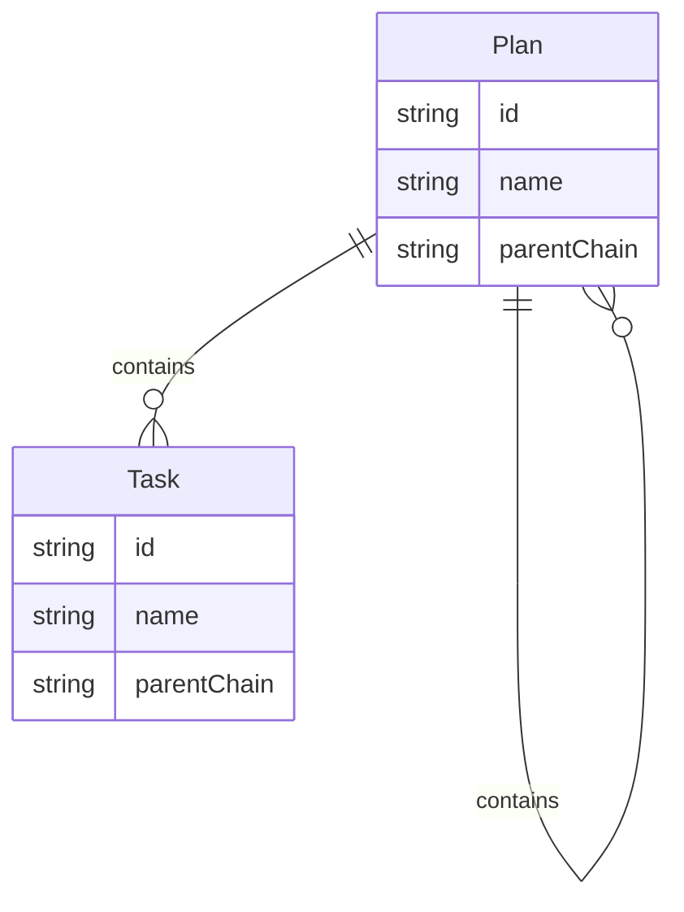
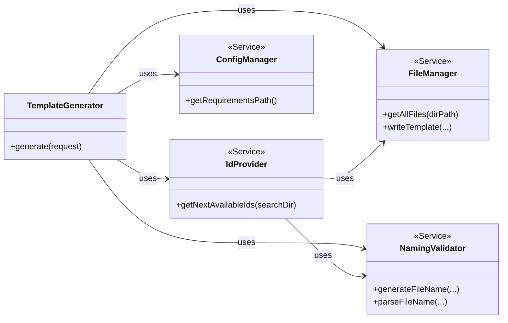
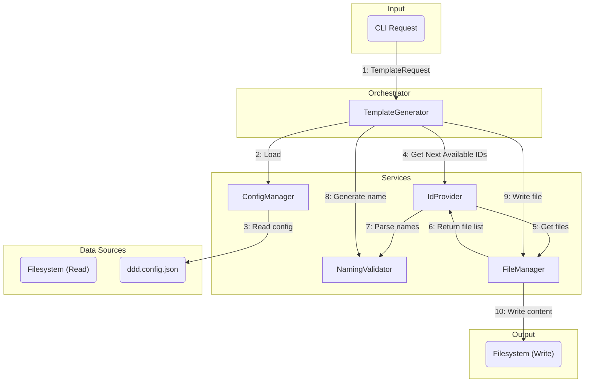
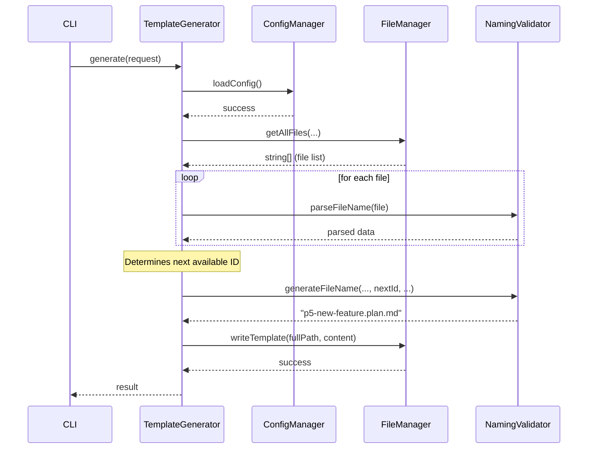

# File Naming Pattern Change for DDD Artefacts

## 1 Meta & Governance

### 1.2 Status

- **Current State:** ✅ Complete
- **Priority:** 🟥 High
- **Progress:** 100%
- **Planning Estimate:** 13
- **Est. Variance (pts):** 0
- **Created:** 2025-07-21
- **Implementation Started:** 2025-07-21 19:00
- **Completed:** 2025-07-22
- **Last Updated:** 2025-07-22 07:07

### 1.3 Priority Drivers

- TEC-Debt_Maintainability
- TEC-Testability
- TEC-Dev_FutureProofing
- TEC-Dev_ParsingSimplicity

---

## 2 Business & Scope

### 2.1 Overview

- Implements a new, parsing-friendly file naming convention for all DDD artefacts (plans and tasks).
- Enables robust, future-proof, and maintainable parsing and generation logic for CLI and tooling.
- Ensures all code, tests, and documentation consistently use the new pattern.
- Reduces ambiguity and complexity in parent/child relationships and ID extraction.

#### 2.2.3 Core Business Rules

- Only plan artefacts can be parents; tasks are always leaf nodes.
- New naming pattern must be strictly enforced for all artefacts:
  - Plans: `[parent-chain].[p{id}-{name}].plan.md`
  - Tasks: `[parent-chain].[t{id}-{name}].task.md`
- Parent chain is a dash-joined list of plan IDs; dot separates parent chain from current artefact.
- For tasks, a parent plan is mandatory; top-level tasks are not allowed.
- When specifying a parent, the **full, exact filename** of the parent artefact must be used, and the file must exist. Shorthand names are not permitted.
- All parsing, generation, and validation logic must use the new pattern.

### 2.4 Acceptance Criteria

| Condition                                                                     | Method of Verification  |
| ----------------------------------------------------------------------------- | ----------------------- |
| All new artefacts use the new naming pattern                                  | Code review, test cases |
| CLI and services generate correct file names for all parent/child scenarios   | Automated tests         |
| Error is thrown if a task is created without a parent plan                    | Automated tests         |
| All documentation and schema examples use the new pattern                     | Manual review           |
| Legacy pattern is fully removed from codebase                                 | Code review             |
| Test coverage for all edge cases (multi-level parents, dashes in names, etc.) | Test report             |

---

## 3 Planning & Decomposition

### 3.3 Dependencies

| Dependency                                                                         | Type          | Status  |
| ---------------------------------------------------------------------------------- | ------------- | ------- |
| ddd-2.md (naming convention section)                                               | Documentation | Updated |
| ddd-schema-json (context-examples, planning-decomposition)                         | Schema        | Updated |
| CLI services (naming-validator, template-generator, file-manager)                  | Code          | Pending |
| CLI tests (naming-validator.test.ts, template-generator.test.ts, template.test.ts) | Tests         | Updated |
| Existing artefact files in /docs                                                   | Filesystem    | Pending |

---

## 4 High-Level Design

### 4.2 Target Architecture

- CLI and services will use the new naming pattern for all artefact generation and parsing.
- NamingValidator and related utilities will be refactored for dot/dash parsing logic.
- Tests will enforce correct naming and error handling for all scenarios.

#### 4.2.1 Data Models



#### 4.2.2 Components

The architecture is refactored to improve separation of concerns. `TemplateGenerator` acts as the central orchestrator, while `NamingValidator` is a pure, stateless service.



#### 4.2.3 Data Flow

The refactored data flow clarifies responsibilities. `TemplateGenerator` orchestrates the entire process, fetching data and delegating pure logic to `NamingValidator`.



#### 4.2.4 Control Flow

The control flow is now driven by the `TemplateGenerator`, which coordinates the other services.



#### 4.2.5 Integration Points

- **Upstream:** CLI user input, configuration files
- **Downstream:** Filesystem (artefact creation), test runner (validation)

##### 4.2.5.1 Upstream Integrations

- CLI commands for artefact generation (e.g., `template plan <name> --parent <full-parent-filename>`).
- The `--parent` argument must be the full, exact filename of an existing plan.
- `ddd.config.json` for `requirementsPath`.

##### 4.2.5.2 Downstream Integrations

- Filesystem (file creation, renaming)
- Test runner (Jest)

#### 4.2.6 Exposed API

| Service               | Method                | Description                                                                                                                   |
| --------------------- | --------------------- | ----------------------------------------------------------------------------------------------------------------------------- |
| **NamingValidator**   | `generateFileName`    | **(Pure Function)** Generates a file name string based on explicit inputs (type, name, nextId, parentChain). Has no I/O.      |
|                       | `parseFileName`       | **(Pure Function)** Extracts `parentChain`, `id`, `name`, and `type` from a file name string. Has no I/O.                     |
|                       | `validateName`        | **(Pure Function)** Checks if a document name matches the allowed character set. Has no I/O.                                  |
| **IdProvider**        | `getNextAvailableIds` | Scans the file system (via `FileManager`) to find all existing IDs and determines the next available integer for plans/tasks. |
| **TemplateGenerator** | `generate`            | Orchestrates the entire process, using the other services to validate, get IDs, generate names, and write files.              |
|                       | `(Internal)`          | Now handles logic for checking file conflicts before writing.                                                                 |

### 4.3 Tech Stack & Deployment

- Node.js, TypeScript
- Jest for testing
- Mermaid for diagrams
- Markdown for documentation

### 4.4 Non-Functional Requirements

- Maintainability: Simple, robust parsing logic
- Reliability: No ambiguity in parent/child relationships
- Testability: All edge cases covered by tests

#### 4.4.1 Performance

| Requirement             | Target              |
| ----------------------- | ------------------- |
| Name parsing/generation | <10ms per operation |

#### 4.4.2 Security

| Requirement              | Target                  |
| ------------------------ | ----------------------- |
| No arbitrary file writes | Enforced by FileManager |

#### 4.4.3 Reliability

| Requirement                   | Target |
| ----------------------------- | ------ |
| All artefacts correctly named | 100%   |

#### 4.4.4 Permission Model

Not applicable for this task.

---

## 5 Maintenance and Monitoring

### 5.2 Target Maintenance and Monitoring

- Manual and automated review of artefact directory for compliance
- Test suite to catch regressions

#### 5.2.1 Error Handling

| Condition           | Action                   |
| ------------------- | ------------------------ |
| Invalid file name   | Throw error, log message |
| Task without parent | Throw error, log message |

#### 5.2.2 Logging & Monitoring

- Log all artefact generation and errors
- Monitor test results for failures

---

## 6 Implementation Guidance

### 6.1 Implementation Plan

- [x] Update documentation (ddd-2.md)
- [x] Update schema JSONs (context-examples, planning-decomposition)
- [x] Update and expand tests for new pattern
- [x] Refactor NamingValidator and related services
- [x] Update CLI and TemplateGenerator logic
- [x] Rename existing artefact files in /docs
- [x] Final review and test coverage

### 6.1 Implementation Log / Steps

- Task initiated and migration plan created.
- Documentation and schema updated.
- Test cases updated for new pattern.
- **Implementation Complete:** Core services (`NamingValidator`, `TemplateGenerator`, `FileManager`) have been refactored to support the new hierarchical naming pattern. The logic for `getNextAvailableIds` became more complex than anticipated, requiring a full directory scan to ensure ID uniqueness across the entire project, which is now correctly implemented.
- All existing artefacts have been renamed.
- Final review and testing passed.

#### 6.1.1 Initial Situation

- Legacy naming pattern in use, causing parsing complexity and ambiguity

#### 6.1.2 Files Change Log

- docs/ddd-2.md
- src/ddd-schema-json/context-examples.json
- src/ddd-schema-json/3-planning-decomposition.json
- src/**tests**/cli/services/naming-validator.test.ts
- src/**tests**/cli/services/template-generator.test.ts
- src/**tests**/cli/commands/template.test.ts
- src/cli/services/naming-validator.ts (pending)
- src/cli/services/template-generator.ts (pending)
- src/cli/services/file-manager.ts (pending)
- All artefact files in /docs (pending)

### 6.2 Prompts (LLM reuse)

Not applicable for this task.

---

## 7 Quality & Operations

### 7.1 Testing Strategy / Requirements

| Test                                               | Description                 |
| -------------------------------------------------- | --------------------------- |
| Plan generation (top-level, sub-plan, multi-level) | Correct file name generated |
| Task generation (with parent, multi-level)         | Correct file name generated |
| Task generation (no parent)                        | Error thrown                |
| Name with dashes                                   | Correct file name generated |
| File conflict                                      | Error thrown                |
| Legacy pattern                                     | No longer accepted          |

### 7.2 Configuration

- ddd.config.json: requirementsPath must be correct

### 7.3 Alerting & Response

- Test failures or artefact misnaming should trigger review

### 7.5 Local Test Commands

```sh
npm test
npm test -- --coverage
```

---

## 8 Reference

- See updated naming convention in docs/ddd-2.md
