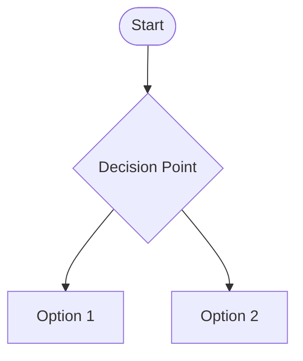
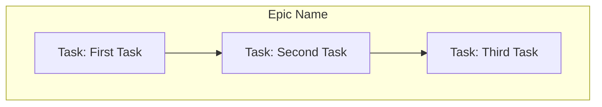
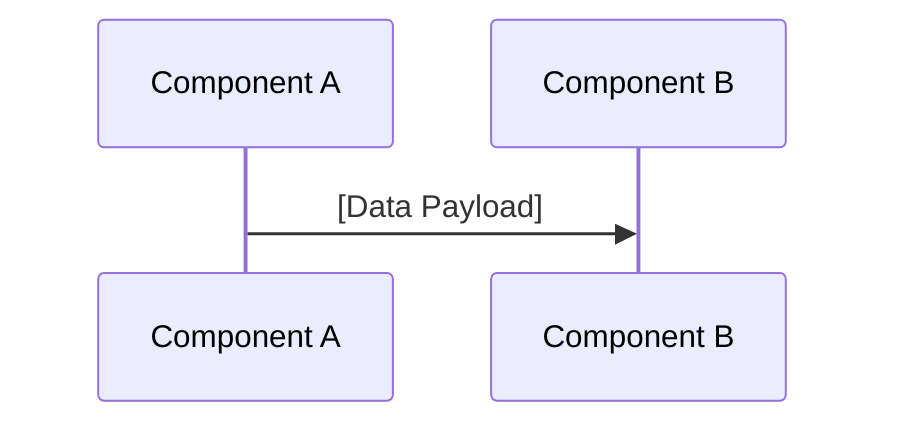
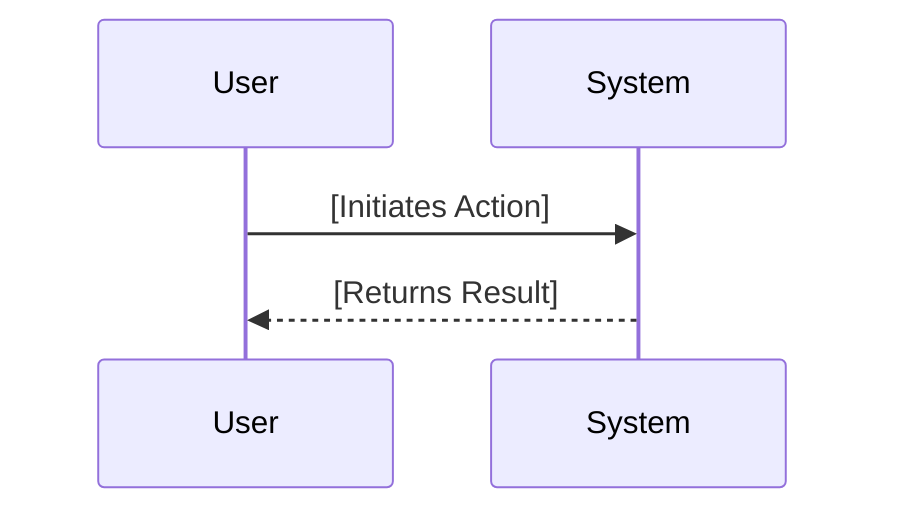
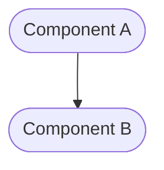
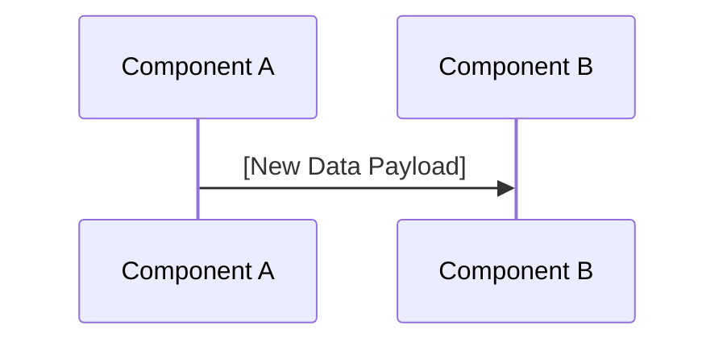
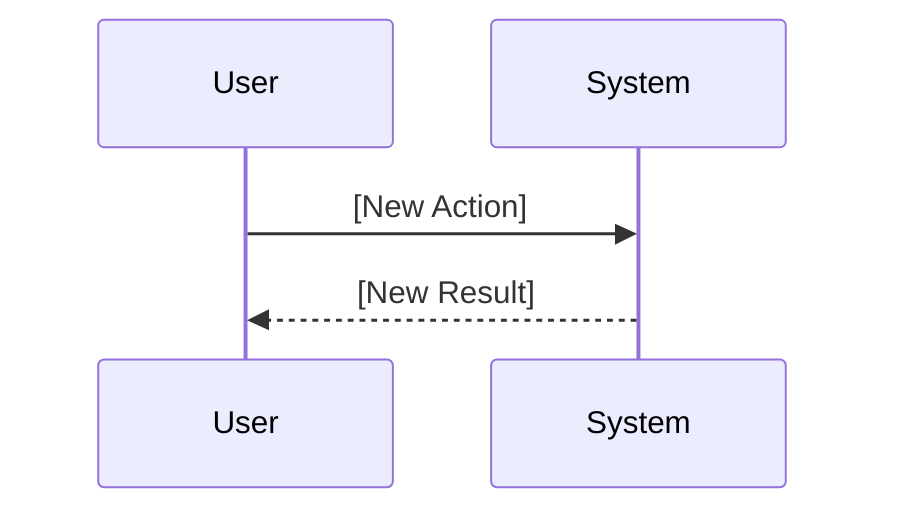
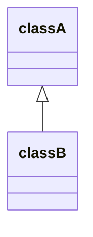
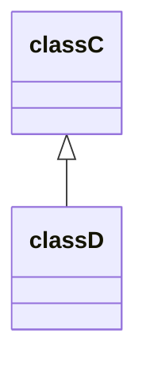

# Epic: [Epic Name]

<!-- This document defines a complete feature, including its business justification, architectural design, and implementation plan. It is decomposed into a series of tasks. -->

---

## ✅ 1 Meta & Governance

### ✅ 1.1 Status Tracking

<!-- Link to the live status document for this epic. -->

[Link to Epic Status File](./[epic-id]-status.md)

### ✅ 1.3 Priority Drivers

<!-- List the stable Driver IDs from the root documentation that justify this epic's priority. -->

- [CBP-Break_Block_Revenue_Legal]
- [TEC-Dev_Productivity_Blocker]

---

## ✅ 2 Business & Scope

### ✅ 2.1 Overview

<!-- Provide a one-to-three sentence summary of the epic's identity, mission, and boundaries. -->

[A concise paragraph explaining the epic's core identity, its primary contribution to the system, and what it is responsible for.]

### ✅ 2.2 Business Context

<!-- Provide the narrative and domain-specific details behind the work. -->

#### ❓ 2.2.1 Key Workflows

<!-- (Optional) Visually map the high-level user journeys or system flows that this epic is responsible for. -->



#### ❓ 2.2.3 Core Business Rules

<!-- (Optional) Enumerate the critical, overarching business rules that govern this epic's behavior. -->

- [Rule 1: A description of a business constraint or requirement.]
- [Rule 2: Another description of a business constraint.]

#### ✅ 2.2.4 User Stories

<!-- List the user-centric goals for this epic. -->

- As a **[Persona]**, I want **[to do something]**, so that **[I can achieve a goal]**.

### ❓ 2.4 Acceptance Criteria

<!-- (Optional) A verifiable, tabular list of conditions that this epic must satisfy to be considered complete. -->

| ID   | Criterion                                   | Test Reference      |
| ---- | ------------------------------------------- | ------------------- |
| AC-1 | [A verifiable statement of behavior.]       | [Link to test file] |
| AC-2 | [Another verifiable statement of behavior.] | [Link to test file] |

---

## ✅ 3 Planning & Decomposition

### ✅ 3.1 Roadmap (In-Focus Items)

<!-- List the tasks that are actively planned for the current implementation cycle. -->

| ID  | Task                               | Priority  | Priority Drivers                                                                                         | Status         | Depends On | Summary                          |
| :-- | :--------------------------------- | :-------- | :------------------------------------------------------------------------------------------------------- | :------------- | :--------- | :------------------------------- |
| T1  | [Example Task 1](path/to/task1.md) | 🟥 High   | [CBP-Break_Block_Revenue_Legal](/docs/documentation-driven-development.md#cbp-break_block_revenue_legal) | 💡 Not Started | —          | A brief description of the task. |
| T2  | [Example Task 2](path/to/task2.md) | 🟧 Medium | [UX-Noticeable_Friction](/docs/documentation-driven-development.md#ux-noticeable_friction)               | 💡 Not Started | T1         | Another brief description.       |

#### Column Definitions

- **ID**: A unique identifier for the task within the epic (e.g., T1, T2).
- **Task**: A descriptive name for the task, linked to its `.task.md` file.
- **Priority**: The priority level of the task (e.g., 🟥 High).
- **Priority Drivers**: Links to the specific business or technical drivers that justify the priority.
- **Status**: The current state of the task (e.g., 💡 Not Started).
- **Depends On**: The ID of any task(s) that must be completed before this one can start.
- **Summary**: A brief, one-sentence description of the task's objective.

### ✅ 3.2 Backlog / Icebox

<!-- List tasks that have been considered but are not scheduled for the current cycle. -->

- [Task: A future feature idea] - [Brief justification for deferral.]

### ✅ 3.3 Dependencies

<!-- List any internal or external dependencies that could block the progress of this epic. -->

| ID  | Dependency On     | Type                | Status  | Notes                             |
| --- | ----------------- | ------------------- | ------- | --------------------------------- |
| D-1 | [Dependency Name] | [Internal/External] | [✅/❌] | [Notes on the dependency status.] |

### ✅ 3.4 Decomposition Graph

<!-- A visual graph of dependencies between the child tasks. -->



---

## ✅ 4 High-Level Design

### ❓ 4.1 Current Architecture

<!-- (Optional) Describe the existing system before the changes in this epic are implemented. -->

#### ✅ 4.1.1 Components

<!-- "As-is" component diagram. -->


#### ✅ 4.1.2 Data Flow

<!-- "As-is" data flow diagram. -->



#### ✅ 4.1.3 Control Flow

<!-- "As-is" sequence of interactions. -->



#### ✅ 4.1.4 Integration Points

<!-- "As-is" key integration points. -->

- **Trigger:** [Description of the current trigger.]
- **Input Data:** [Description of the current input data.]

### ✅ 4.2 Target Architecture

<!-- Describe the proposed "to-be" state of the system after this epic is implemented. -->

#### ✅ 4.2.1 Components

<!-- "To-be" component diagram. -->



#### ✅ 4.2.2 Data Flow

<!-- "To-be" data flow diagram. -->



#### ✅ 4.2.3 Control Flow

<!-- "To-be" sequence of interactions. -->



#### ✅ 4.2.4 Integration Points

<!-- "To-be" key integration points. -->

- **Trigger:** [Description of the new trigger.]
- **Input Data:** [Description of the new input data.]

#### ✅ 4.2.5 Exposed API

<!-- "To-be" exposed API surface. -->

- `[METHOD] /api/endpoint`: [Description of the endpoint.]

### ✅ 4.4 Non-Functional Requirements

#### ✅ 4.4.1 Performance

- [Performance requirement 1]

#### ✅ 4.4.2 Security

- [Security requirement 1]

#### ✅ 4.4.3 Reliability

- [Reliability requirement 1]

---

## ✅ 5 Detailed Design

### ❓ 5.1 Current Detailed Design

<!-- (Optional) Describe the existing internal implementation details. -->

#### ✅ 5.1.1 Data Models

<!-- "As-is" data structures. -->

```mermaid
erDiagram
    [ENTITY_A] {
      string id PK
      string field_name
    }
```

#### ✅ 5.1.2 Class Diagrams

<!-- "As-is" static structure of classes. -->



#### ✅ 5.1.3 Error Handling

<!-- "As-is" error handling strategy. -->

- [Current error handling mechanism.]

#### ✅ 5.1.4 Logging & Monitoring

<!-- "As-is" observability strategy. -->

- [Current logging and monitoring setup.]

### ✅ 5.2 Target Detailed Design

<!-- Describe the proposed "to-be" internal implementation details. -->

#### ✅ 5.2.1 Data Models

<!-- "To-be" data structures. -->

```mermaid
erDiagram
    [ENTITY_A] {
      string id PK
      string new_field_name
    }
```

#### ✅ 5.2.2 Class Diagrams

<!-- "To-be" static structure of classes. -->



#### ✅ 5.2.3 Error Handling

<!-- "To-be" error handling strategy. -->

- [New error handling mechanism.]

#### ✅ 5.2.4 Logging & Monitoring

<!-- "To-be" observability strategy. -->

- [New logging and monitoring setup.]

---

## ✅ 6 Implementation Guidance

### ✅ 6.1 Implementation Plan

<!-- Describe the high-level, potentially phased rollout strategy for the tasks in this epic. -->

1.  **Phase 1: [Name of First Phase]** - [Description of what will be built.]
2.  **Phase 2: [Name of Second Phase]** - [Description of what will be built next.]

### ❓ 6.2 Implementation Log / Steps

<!-- (Optional) A detailed, step-by-step log of the implementation process for this epic's tasks. -->

- [ ] Task 1: [Description of step]
- [ ] Task 2: [Description of step]

---

## ✅ 7 Quality & Operations

### ✅ 7.1 Testing Strategy / Requirements

<!-- Describe the approach for testing this epic. -->

| AC ID | Scenario          | Test Type   |
| ----- | ----------------- | ----------- |
| AC-1  | [Test scenario 1] | Unit        |
| AC-2  | [Test scenario 2] | Integration |

### ✅ 7.2 Configuration

<!-- Detail how the epic is configured in different environments. -->

| Environment | Setting Name     | Value          |
| ----------- | ---------------- | -------------- |
| Development | `[SETTING_NAME]` | `[dev_value]`  |
| Production  | `[SETTING_NAME]` | `[prod_value]` |

### ✅ 7.3 Alerting & Response

<!-- Define how to respond to alerts and operational logs originating from this epic. -->

- **[Error Type]**: [Response plan, e.g., Trigger PagerDuty alert.]

### ✅ 7.4 Deployment Steps

<!-- A checklist for deploying this feature to production. -->

1. [ ] Step 1
2. [ ] Step 2

---

## ❓ 8 Reference

### ❓ 8.1 Appendices/Glossary

<!-- (Optional) Provide any additional information, definitions, or links to external resources. -->

- **[Term]**: [Definition of the term.]
