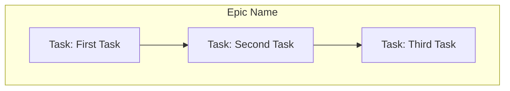
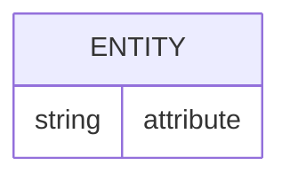
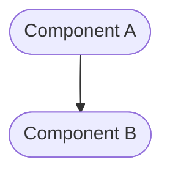
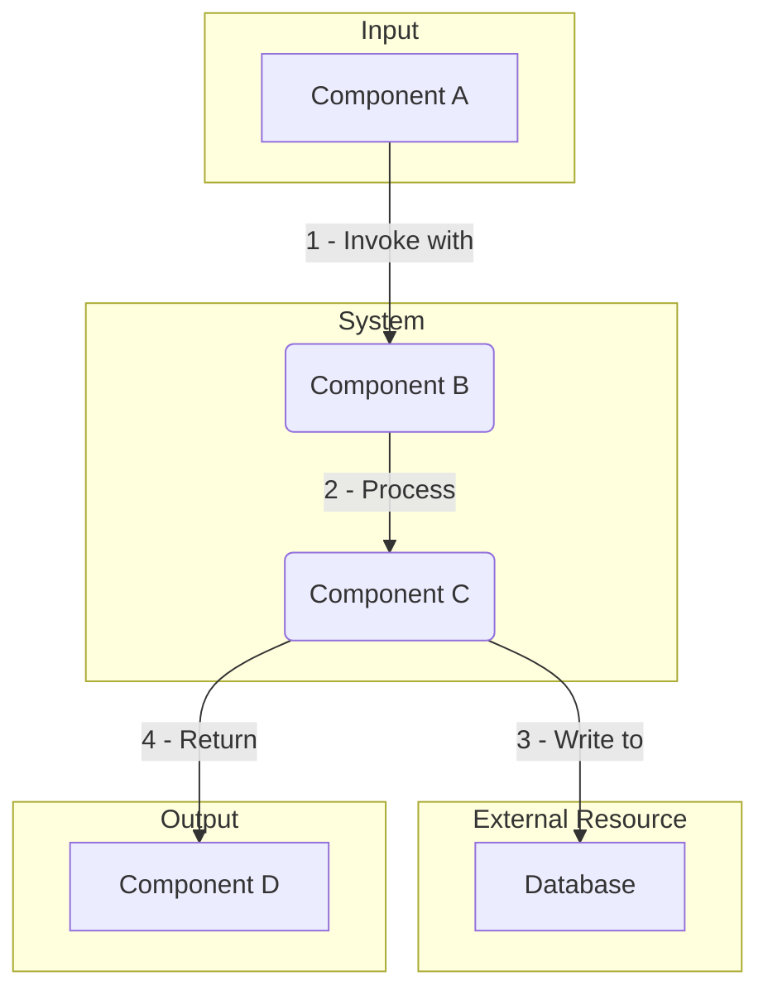
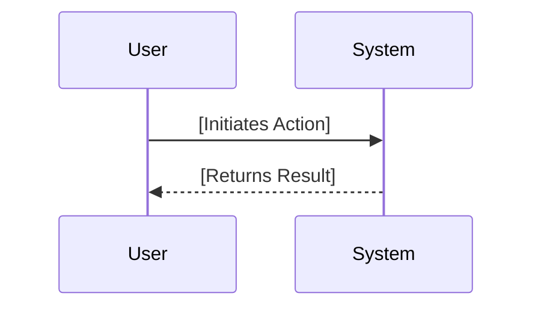
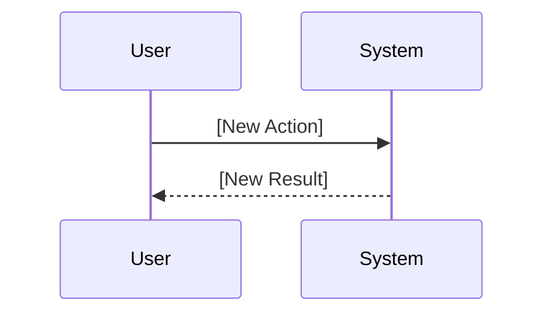

# Epic: [Epic Name]

<!-- This document defines a complete, independent feature, including its business justification, architectural design, and implementation plan. It should be testable on its own, with dependencies on other epics limited to well-defined integration points. -->

---

## ✅ 1 Meta & Governance

### ✅ 1.1 Status Tracking

<!-- Link to the live status document for this epic. -->

[Link to Epic Status File](./[epic-id]-status.md)

### ✅ 1.3 Priority Drivers

<!-- List the stable Driver IDs from the root documentation that justify this epic's priority. -->

- [CBP-Break_Block_Revenue_Legal]
- [TEC-Dev_Productivity_Blocker]

---

## ✅ 2 Business & Scope

### ✅ 2.1 Overview

<!-- Provide a concise, bulleted list outlining the epic's identity, mission, and boundaries. -->

- **Core Function**: [A brief description of the epic's primary responsibility.]
- **Key Capability**: [A specific function or capability the epic provides.]
- **Business Value**: [The value this epic delivers to the business or user.]

### ✅ 2.2 Business Context

<!-- Provide the narrative and domain-specific details behind the work. -->

#### ❓ 2.2.1 Key Workflows

<!-- (Optional) Visually map the high-level user journeys or system flows that this epic is responsible for. -->


#### ❓ 2.2.3 Core Business Rules

<!-- (Optional) Enumerate the critical, overarching business rules that govern this epic's behavior. -->

- [Rule 1: A description of a business constraint or requirement.]
- [Rule 2: Another description of a business constraint.]

#### ✅ 2.2.4 User Stories

<!-- List the user-centric goals for this epic. -->

- As a **[Persona]**, I want **[to do something]**, so that **[I can achieve a goal]**.

### ❓ 2.4 Acceptance Criteria

<!-- (Optional) A verifiable, tabular list of conditions that this epic must satisfy to be considered complete. -->

| ID   | Criterion                                   | Test Reference      |
| ---- | ------------------------------------------- | ------------------- |
| AC-1 | [A verifiable statement of behavior.]       | [Link to test file] |
| AC-2 | [Another verifiable statement of behavior.] | [Link to test file] |

---

## ✅ 3 Planning & Decomposition

### ✅ 3.1 Roadmap (In-Focus Items)

<!-- List the tasks that are actively planned for the current implementation cycle. -->

| ID  | Task                               | Priority  | Priority Drivers                                                                                         | Status         | Depends On | Summary                          |
| :-- | :--------------------------------- | :-------- | :------------------------------------------------------------------------------------------------------- | :------------- | :--------- | :------------------------------- |
| T1  | [Example Task 1](path/to/task1.md) | 🟥 High   | [CBP-Break_Block_Revenue_Legal](/docs/documentation-driven-development.md#cbp-break_block_revenue_legal) | 💡 Not Started | —          | A brief description of the task. |
| T2  | [Example Task 2](path/to/task2.md) | 🟧 Medium | [UX-Noticeable_Friction](/docs/documentation-driven-development.md#ux-noticeable_friction)               | 💡 Not Started | T1         | Another brief description.       |

#### Column Definitions

- **ID**: A unique identifier for the task within the epic (e.g., T1, T2).
- **Task**: A descriptive name for the task, linked to its `.task.md` file.
- **Priority**: The priority level of the task (e.g., 🟥 High).
- **Priority Drivers**: Links to the specific business or technical drivers that justify the priority.
- **Status**: The current state of the task (e.g., 💡 Not Started).
- **Depends On**: The ID of any task(s) that must be completed before this one can start.
- **Summary**: A brief, one-sentence description of the task's objective.

### ✅ 3.2 Backlog / Icebox

<!-- List tasks that have been considered but are not scheduled for the current cycle. -->

- [Task: A future feature idea] - [Brief justification for deferral.]

### ✅ 3.3 Dependencies

<!-- List any internal or external dependencies that could block the progress of this epic. -->

| ID  | Dependency On     | Type                | Status  | Notes                             |
| --- | ----------------- | ------------------- | ------- | --------------------------------- |
| D-1 | [Dependency Name] | [Internal/External] | [✅/❌] | [Notes on the dependency status.] |

### ✅ 3.4 Decomposition Graph

<!-- A visual graph of dependencies between the child tasks. -->



---

## ✅ 4 High-Level Design

### ❓ 4.1 Current Architecture

<!-- (Optional) Describe the existing system before the changes in this epic are implemented. -->

#### ✅ 4.1.1 Data Models

<!-- "As-is" data structures (ER diagrams). -->



#### ✅ 4.1.2 Components

<!-- "As-is" component diagram. -->



#### ✅ 4.1.3 Data Flow

<!-- "As-is" data flow diagram. -->



#### ✅ 4.1.4 Control Flow

<!-- "As-is" sequence of interactions. -->



#### ✅ 4.1.5 Integration Points

<!-- "As-is" key integration points. -->

- **Trigger:** [Description of the current trigger.]
- **Input Data:** [Description of the current input data.]

### ✅ 4.2 Target Architecture

<!-- Describe the proposed "to-be" state of the system after this epic is implemented. -->

#### ✅ 4.2.1 Data Models

<!-- "To-be" data structures (ER diagrams). -->


#### ✅ 4.2.2 Components

<!-- "To-be" component diagram. -->


#### ✅ 4.2.3 Data Flow

<!-- "To-be" data flow diagram. -->


#### ✅ 4.2.4 Control Flow

<!-- "To-be" sequence of interactions. -->



#### ✅ 4.2.5 Integration Points

<!-- "To-be" key integration points. -->

- **Trigger:** [Description of the new trigger.]
- **Input Data:** [Description of the new input data.]

#### ✅ 4.2.6 Exposed API

<!-- "To-be" exposed API surface. -->

- `[METHOD] /api/endpoint`: [Description of the endpoint.]

### ✅ 4.4 Non-Functional Requirements

#### ✅ 4.4.1 Performance

| ID      | Requirement                                                       | Priority  |
| :------ | :---------------------------------------------------------------- | :-------- |
| PERF-01 | API endpoints must respond in < 200ms (95th percentile).          | 🟥 High   |
| PERF-02 | The system must support 100 concurrent users without degradation. | 🟧 Medium |

#### ✅ 4.4.2 Security

| ID     | Requirement                                                              | Priority |
| :----- | :----------------------------------------------------------------------- | :------- |
| SEC-01 | All sensitive user data must be encrypted at rest using AES-256.         | 🟥 High  |
| SEC-02 | Access to admin endpoints must be restricted to users with 'Admin' role. | 🟥 High  |

#### ✅ 4.4.3 Reliability

| ID     | Requirement                                               | Priority |
| :----- | :-------------------------------------------------------- | :------- |
| REL-01 | The service must maintain 99.9% uptime, measured monthly. | 🟥 High  |
| REL-02 | All database transactions must be atomic and durable.     | 🟥 High  |

---

## ✅ 5 Maintenance and Monitoring

### ❓ 5.1 Current Maintenance and Monitoring

<!-- (Optional) Describe the existing internal implementation details. -->

#### ✅ 5.1.1 Error Handling

<!-- "As-is" error handling strategy. -->

- [Current error handling mechanism.]

#### ✅ 5.1.2 Logging & Monitoring

<!-- "As-is" observability strategy. -->

- [Current logging and monitoring setup.]

### ✅ 5.2 Target Maintenance and Monitoring

<!-- Describe the proposed "to-be" internal implementation details. -->

#### ✅ 5.2.1 Error Handling

<!-- "To-be" error handling strategy. -->

| Error Type       | Trigger                 | Action         | User Feedback                    |
| :--------------- | :---------------------- | :------------- | :------------------------------- |
| **[Error Type]** | [Trigger for the error] | [Action taken] | `[User-facing feedback message]` |

#### ✅ 5.2.2 Logging & Monitoring

<!-- "To-be" observability strategy. -->

- [New logging and monitoring setup.]

---

## ✅ 6 Implementation Guidance

### ✅ 6.1 Implementation Plan

<!-- Describe the high-level, potentially phased rollout strategy for the tasks in this epic. -->

1.  **Phase 1: [Name of First Phase]** - [Description of what will be built.]
2.  **Phase 2: [Name of Second Phase]** - [Description of what will be built next.]

### ❓ 6.2 Implementation Log / Steps

<!-- (Optional) A detailed, step-by-step log of the implementation process for this epic's tasks. -->

- [ ] Task 1: [Description of step]
- [ ] Task 2: [Description of step]

---

## ✅ 7 Quality & Operations

### ✅ 7.1 Testing Strategy / Requirements

<!-- Describe the approach for testing this epic, mapping scenarios to Acceptance Criteria. -->

| AC ID | Scenario                                                     | Test Type   | Tools / Runner | Notes                                        |
| :---- | :----------------------------------------------------------- | :---------- | :------------- | :------------------------------------------- |
| AC-1  | [A scenario that validates the first acceptance criterion.]  | Unit        | Jest           | [Notes on how to set up or run this test.]   |
| AC-2  | [A scenario that validates the second acceptance criterion.] | Integration | Jest, MSW      | [Notes on mocking or external dependencies.] |

### ✅ 7.2 Configuration

<!-- Detail how the epic is configured, including environment variables and configuration files. -->

| Setting Name     | Module Dependency | Source          | Override Method            | Notes                         |
| :--------------- | :---------------- | :-------------- | :------------------------- | :---------------------------- |
| `[SETTING_NAME]` | `[module-id]`     | `[config-file]` | `[ENV_VAR_NAME]` (Env Var) | [Description of the setting.] |

### ✅ 7.3 Alerting & Response

<!-- Define how to respond to alerts and operational logs originating from this epic. -->

| Error Condition             | Relevant Modules | Response Plan                                                                              | Status         |
| :-------------------------- | :--------------- | :----------------------------------------------------------------------------------------- | :------------- |
| **[A specific error type]** | `[module-id]`    | [A step-by-step plan for developers or on-call engineers to follow when this alert fires.] | 💡 Not Started |
| **[Another error type]**    | `[module-id]`    | [Another response plan.]                                                                   | 💡 Not Started |

### ✅ 7.5 Local Test Commands

<!-- CLI commands to run tests locally for this epic. -->

```bash
yarn jest [path/to/this/epic/test.ts]
```

---

## ❓ 8 Reference

### ❓ 8.1 Appendices/Glossary

<!-- (Optional) Provide any additional information, definitions, or links to external resources. -->

- **[Term]**: [Definition of the term.]
