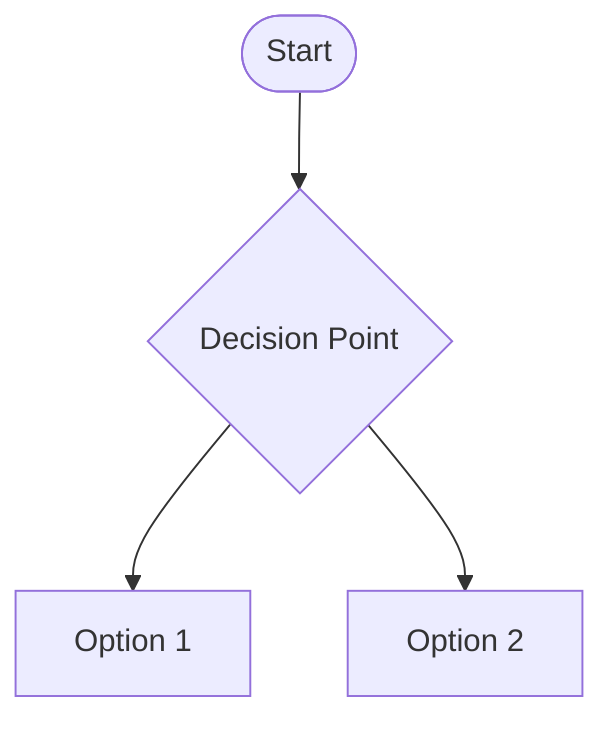
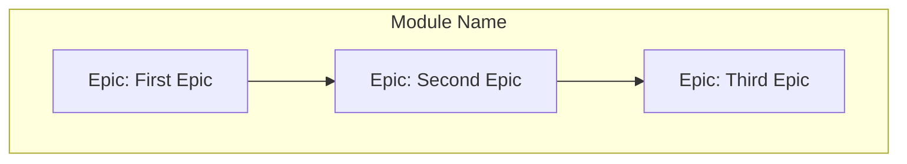
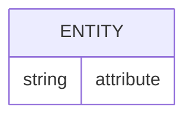
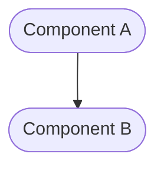
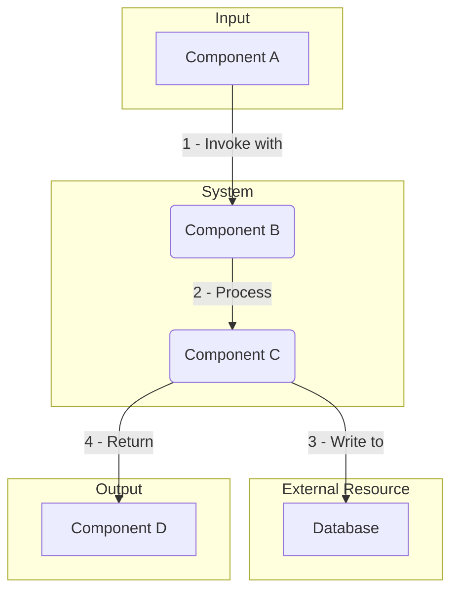
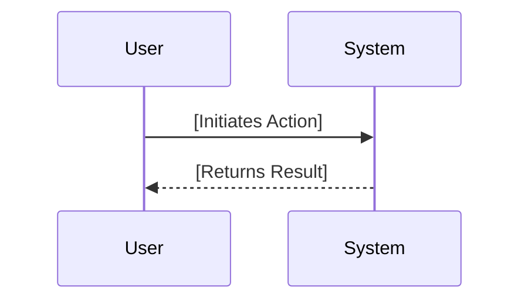
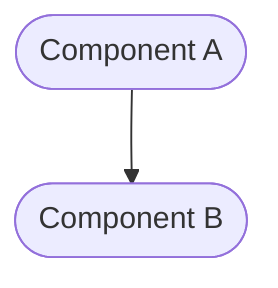
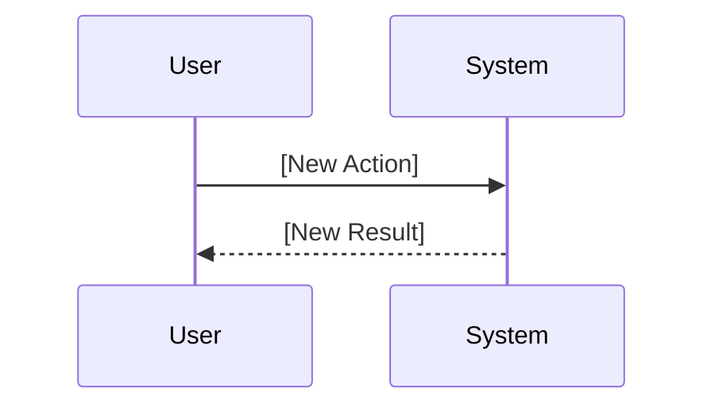

# Module: [Module Name]

<!-- This document defines a functional area of the project. It outlines the business goals, architecture, and decomposition of work for a collection of related epics. -->

---

## ✅ 1 Meta & Governance

### ✅ 1.1 Status Tracking

<!-- Link to the live status document for this module. -->

[Link to Module Status File](./[module-id]-status.md)

### ✅ 1.3 Priority Drivers

<!-- List the stable Driver IDs from the root documentation that justify this module's priority. -->

- [CBP-Break_Block_Revenue_Legal]
- [TEC-Dev_Productivity_Blocker]

---

## ✅ 2 Business & Scope

### ✅ 2.1 Overview

<!-- Provide a concise, bulleted list outlining the module's identity, mission, and boundaries. -->

- **Core Function**: [A brief description of the module's primary responsibility.]
- **Key Capability**: [A specific function or capability the module provides.]
- **Business Value**: [The value this module delivers to the business or user.]

### ✅ 2.2 Business Context

<!-- Provide the narrative and domain-specific details behind the work. This section may be omitted if the project-level context is sufficient. -->

#### ✅ 2.2.1 Key Workflows

<!-- Visually map the high-level user journeys or system flows that this module is responsible for. -->

#### ✅ 2.2.2 User Personas

<!-- Define the target user(s) for this module. -->

| Persona            | Goal                                   |
| ------------------ | -------------------------------------- |
| **[Persona Name]** | [Primary goal related to this module.] |

#### ✅ 2.2.3 Core Business Rules

<!-- Enumerate the critical, overarching business rules that govern this module's behavior. -->

- [Rule 1: A description of a business constraint or requirement.]
- [Rule 2: Another description of a business constraint.]

#### ❓ 2.2.4 User Stories

<!-- (Optional) List user-centric goals for this module. -->

- As a **[Persona]**, I want **[to do something]**, so that **[I can achieve a goal]**.

### ❓ 2.3 Success Criteria

<!-- Define the measurable outcomes that indicate this module is complete for its current phase. -->

- [Success Criterion 1: A specific, measurable achievement.]
- [Success Criterion 2: Another specific, measurable achievement.]

---

## ✅ 3 Planning & Decomposition

### ✅ 3.1 Roadmap (In-Focus Items)

<!-- List the epics that are actively planned for the current implementation cycle. Each epic listed below should represent an independent feature set with its own tests. Dependencies between epics should be limited to the integration layer. -->

| ID  | Epic                                            | Priority  | Priority Drivers | Status         | Depends On | Summary                                                    |
| :-- | :---------------------------------------------- | :-------- | :--------------- | :------------- | :--------- | :--------------------------------------------------------- |
| E1  | [Name of First Epic](./[epic-id]/epic-plan.md)  | 🟥 High   | - [Driver-ID]    | 💡 Not Started | —          | A brief, one-sentence description of the epic's objective. |
| E2  | [Name of Second Epic](./[epic-id]/epic-plan.md) | 🟧 Medium | - [Driver-ID]    | 💡 Not Started | E1         | A brief, one-sentence description of the epic's objective. |

### ✅ 3.2 Backlog / Icebox

<!-- List epics that have been considered but are not scheduled for the current cycle. -->

- [Epic: A future feature idea] - [Brief justification for deferral.]

### ✅ 3.3 Dependencies

<!-- List any internal or external dependencies that could block the progress of this module. -->

| ID  | Dependency On     | Type                | Status  | Notes                             |
| --- | ----------------- | ------------------- | ------- | --------------------------------- |
| D-1 | [Dependency Name] | [Internal/External] | [✅/❌] | [Notes on the dependency status.] |

### ❓ 3.4 Decomposition Graph

<!-- (Optional) A visual graph of dependencies between the child epics. -->

---

## ✅ 4 High-Level Design

### ❓ 4.0 Guiding Principles

<!-- Document any high-level architectural rules or constraints that apply to all epics within this module. -->

- [Principle 1: e.g., All UI components must be stateless.]
- [Principle 2: e.g., All services must be idempotent.]

### ✅ 4.1 Current Architecture

<!-- Describe the existing system before the changes in this module are implemented. Optional for "greenfield" work. -->

#### ✅ 4.1.1 Data Models

<!-- "As-is" data structures (ER diagrams). -->

#### ✅ 4.1.2 Components

<!-- Provide a diagram of the main "as-is" components and their relationships. -->

#### ✅ 4.1.3 Data Flow

<!-- Diagram the "as-is" data flow between components. -->

#### ✅ 4.1.4 Control Flow

<!-- Diagram the "as-is" sequence of interactions. -->

#### ✅ 4.1.5 Integration Points

##### ✅ 4.1.5.1 Upstream Integrations

<!-- Define how this module is currently triggered and what data it receives. -->

- **Trigger:** [Description of the current trigger.]
- **Input Data:** [Description of the current input data.]

##### ✅ 4.1.5.2 Downstream Integrations

<!-- Define what currently happens when this module completes and what data it sends out. -->

- **Completion Trigger:** [Description of the current completion trigger.]
- **Output Data:** [Description of the current output data.]

### ✅ 4.2 Target Architecture

<!-- Describe the proposed "to-be" state of the system after this module is implemented. -->

#### ✅ 4.2.1 Data Models

<!-- "To-be" data structures (ER diagrams). -->

#### ✅ 4.2.2 Components

<!-- Provide a diagram of the main "to-be" components and their relationships. -->

#### ✅ 4.2.3 Data Flow

<!-- Diagram the "to-be" data flow between components. -->

#### ✅ 4.2.4 Control Flow

<!-- Diagram the "to-be" sequence of interactions. -->

#### ✅ 4.2.5 Integration Points

##### ✅ 4.2.5.1 Upstream Integrations

<!-- Define how this module will be triggered and what data it will receive. -->

- **Trigger:** [Description of the new trigger.]
- **Input Data:** [Description of the new input data.]

##### ✅ 4.2.5.2 Downstream Integrations

<!-- Define what will happen when this module completes and what data it will send out. -->

- **Completion Trigger:** [Description of the new completion trigger.]
- **Output Data:** [Description of the new output data.]

#### ✅ 4.2.6 Exposed API

<!-- Summarize the API surface this module will expose to consumers. -->

- `[METHOD] /api/endpoint`: [Description of the endpoint.]

### ❓ 4.3 Tech Stack & Deployment

<!-- (Optional) Document the key technologies and deployment strategy for this module if it differs from the project level. -->

- **Language**: [e.g., TypeScript]
- **Framework**: [e.g., Next.js]
- **Deployment**: [e.g., Vercel]

---

## ✅ 4.4 Non-Functional Requirements

#### ✅ 4.4.1 Performance

| ID      | Requirement                                                       | Priority  |
| :------ | :---------------------------------------------------------------- | :-------- |
| PERF-01 | API endpoints must respond in < 200ms (95th percentile).          | 🟥 High   |
| PERF-02 | The system must support 100 concurrent users without degradation. | 🟧 Medium |

#### ✅ 4.4.2 Security

| ID     | Requirement                                                              | Priority |
| :----- | :----------------------------------------------------------------------- | :------- |
| SEC-01 | All sensitive user data must be encrypted at rest using AES-256.         | 🟥 High  |
| SEC-02 | Access to admin endpoints must be restricted to users with 'Admin' role. | 🟥 High  |

#### ✅ 4.4.3 Reliability

| ID     | Requirement                                               | Priority |
| :----- | :-------------------------------------------------------- | :------- |
| REL-01 | The service must maintain 99.9% uptime, measured monthly. | 🟥 High  |
| REL-02 | All database transactions must be atomic and durable.     | 🟥 High  |

## ✅ 5 Maintenance and Monitoring

### ✅ 5.1 Current Maintenance and Monitoring

<!-- Describe the existing internal implementation details. Optional for "greenfield" work. -->

#### ✅ 5.1.1 Error Handling

<!-- Describe the "as-is" error handling strategy. -->

- [Description of the current error handling mechanism.]

#### ✅ 5.1.2 Logging & Monitoring

<!-- Describe the "as-is" observability strategy. -->

- [Description of the current logging and monitoring setup.]

### ✅ 5.2 Target Maintenance and Monitoring

<!-- Describe the proposed "to-be" internal implementation details. -->

#### ✅ 5.2.1 Error Handling

<!-- Describe the "to-be" error handling strategy. -->

| Error Type       | Trigger                 | Action         | User Feedback                    |
| :--------------- | :---------------------- | :------------- | :------------------------------- |
| **[Error Type]** | [Trigger for the error] | [Action taken] | `[User-facing feedback message]` |

#### ✅ 5.2.2 Logging & Monitoring

<!-- Describe the "to-be" observability strategy. -->

- [Description of the new logging and monitoring setup.]

---

## ✅ 6 Implementation Guidance

### ✅ 6.1 Implementation Plan

<!-- Describe the high-level, potentially phased rollout strategy for the epics in this module. -->

| Phase               | Scope / Deliverables                   | Key Artifacts    | Exit Criteria                              |
| ------------------- | -------------------------------------- | ---------------- | ------------------------------------------ |
| **Phase 1: [Name]** | - [Deliverable 1] - [Deliverable 2] | `[file-or-code]` | [A measurable exit criterion for Phase 1.] |
| **Phase 2: [Name]** | - [Deliverable 3]                      | `[another-file]` | [A measurable exit criterion for Phase 2.] |

---

## ✅ 7 Quality & Operations

### ✅ 7.1 Testing Strategy / Requirements

<!-- Describe the approach for testing the handoffs *between* the epics within this module. -->

- [A description of the integration testing strategy for this module.]

### ✅ 7.2 Configuration

<!-- Detail how the module is configured in different environments. -->

| Environment | Setting Name     | Value          |
| ----------- | ---------------- | -------------- |
| Development | `[SETTING_NAME]` | `[dev_value]`  |
| Production  | `[SETTING_NAME]` | `[prod_value]` |

### ✅ 7.3 Alerting & Response

<!-- Define how to respond to alerts and operational logs originating from this module. -->

- **[Error Type]**: [Response plan, e.g., Trigger PagerDuty alert.]

### ✅ 7.4 Deployment Steps

<!-- A checklist for deploying this module to production. -->

1. [ ] Step 1
2. [ ] Step 2

---

## ❓ 8 Reference

### ❓ 8.1 Appendices/Glossary

<!-- Provide any additional information, definitions, or links to external resources. -->

- **[Term]**: [Definition of the term.]
