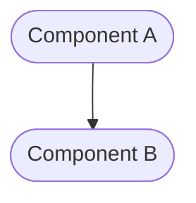

# Project: [Project Name]

<!-- This document is the single source of truth for the entire project. It defines the strategic goals, system-wide architecture, and overall plan. -->

---

## ✅ 1 Meta & Governance

### ✅ 1.1 Status Tracking

<!-- Link to the live status document for this project. -->

[Link to Project Status File](./project-status.md)

### ✅ 1.3 Priority Drivers

<!-- List the stable Driver IDs from the root documentation that justify this project's priority. -->

- [CBP-Break_Block_Revenue_Legal]
- [TEC-Dev_Productivity_Blocker]

---

## ✅ 2 Business & Scope

### ✅ 2.1 Overview

<!-- Provide a concise, bulleted list outlining the project's identity, mission, and value proposition. -->

- **Core Function**: [A brief description of the project's primary responsibility.]
- **Key Capability**: [A specific function or capability the project provides.]
- **Business Value**: [The value this project delivers to the business or user.]

### ✅ 2.2 Business Context

<!-- Provide the narrative and domain-specific details behind the work. -->

#### ✅ 2.2.1 User Journeys

<!-- A container for one or more Journey sections. -->

##### ✅ 2.2.1.1 Journey: [Name of First Journey]

<!-- A self-contained description of a single, specific user journey. -->

[Narrative description of the journey.]

##### ✅ 2.2.1.1 Journey: [Name of Second Journey]

<!-- A self-contained description of a single, specific user journey. -->

[Narrative description of the journey.]

#### ✅ 2.2.2 User Personas

<!-- Define the target user(s) for this project. -->

| Persona            | Goal                                    |
| ------------------ | --------------------------------------- |
| **[Persona Name]** | [Primary goal related to this project.] |

#### ✅ 2.2.3 Core Business Rules

<!-- Enumerate the critical, overarching business rules that govern this project's behavior. -->

- [Rule 1: A description of a business constraint or requirement.]
- [Rule 2: Another description of a business constraint.]

### ✅ 2.3 Success Criteria

<!-- Define the measurable outcomes that indicate this project is complete for its current phase. -->

- [Success Criterion 1: A specific, measurable achievement.]
- [Success Criterion 2: Another specific, measurable achievement.]

### ✅ 2.5 Boundaries & Scope

<!-- A container heading for the explicit definition of the work's boundaries. -->

#### ✅ 2.5.1 In Scope

<!-- A bulleted list of functionalities, features, or outcomes that are explicitly included in the scope of the artefact. -->

- [A feature that is in scope.]

#### ✅ 2.5.2 Out of Scope

<!-- A bulleted list of functionalities, features, or outcomes that are explicitly excluded from the scope of the artefact. -->

- [A feature that is out of scope.]

### ✅ 2.6 Core Business Processes

<!-- A container for one or more Process sections. -->

#### ✅ 2.6.1 Process: [Name of First Process]

<!-- A self-contained description of a single business process. -->

- **Participants**: [e.g., Data Scientist]
- **Goal**: [A clear statement of the process's objective.]
- **Workflow**:
  1. [First step of the process.]
  2. [Second step of the process.]

---

## ✅ 3 Planning & Decomposition

### ✅ 3.1 Roadmap (In-Focus Items)

<!-- List the modules that are actively planned for the current implementation cycle. -->

- [Module: Name of First Module](./[module-id]/[module-id]-module-plan.md)
- [Module: Name of Second Module](./[module-id]/[module-id]-module-plan.md)

### ✅ 3.2 Backlog / Icebox

<!-- List modules that have been considered but are not scheduled for the current cycle. -->

- [Module: A future feature area] - [Brief justification for deferral.]

### ✅ 3.3 Dependencies

<!-- List any internal or external dependencies that could block the progress of this project. -->

| ID  | Dependency On     | Type                | Status  | Notes                             |
| --- | ----------------- | ------------------- | ------- | --------------------------------- |
| D-1 | [Dependency Name] | [Internal/External] | [✅/❌] | [Notes on the dependency status.] |

---

## ✅ 4 High-Level Design

### ❓ 4.0 Guiding Principles

<!-- Document any high-level architectural rules or constraints that apply to the entire project. -->

- [Principle 1: e.g., All services must be idempotent.]
- [Principle 2: e.g., Event-driven architecture.]

### ✅ 4.1 Current Architecture

<!-- Describe the existing system before the changes in this project are implemented. Optional for "greenfield" work. -->

#### ✅ 4.1.1 Components

<!-- Provide a diagram of the main "as-is" components and their relationships. -->

### ✅ 4.2 Target Architecture

<!-- Describe the proposed "to-be" state of the system after this project is implemented. -->

#### ✅ 4.2.1 Components

<!-- Provide a diagram of the main "to-be" components and their relationships. -->

### ✅ 4.3 Tech Stack & Deployment

<!-- Document the key technologies and deployment strategy for this project. -->

- **Language**: [e.g., TypeScript]
- **Framework**: [e.g., Next.js]
- **Deployment**: [e.g., Vercel]

### ❓ 4.4.4 Permission Model

<!-- Defines the access control rules, user roles, and permissions for the system. -->

| Role        | Permissions                                                  | Notes                           |
| ----------- | ------------------------------------------------------------ | ------------------------------- |
| **Admin**   | - Full CRUD access to all documents - Can assign roles    | For system administrators only. |
| **Analyst** | - Read/Write access to assigned documents - Cannot delete | The primary user role.          |

---

## ❓ 5 Maintenance and Monitoring

<!-- (Optional) High-level detailed design elements that apply project-wide. -->

---

## ❓ 6 Implementation Guidance

<!-- (Optional) High-level implementation guidance for the project. -->

---

## ✅ 7 Quality & Operations

### ✅ 7.1 Testing Strategy / Requirements

<!-- Describe the overall approach for testing the project. -->

- [A description of the project-wide testing strategy.]

### ✅ 7.2 Configuration

<!-- Detail how the project is configured in different environments. -->

| Setting Name     | Module Dependency | Source                | Override Method            | Notes                           |
| ---------------- | ----------------- | --------------------- | -------------------------- | ------------------------------- |
| `[SETTING_NAME]` | `[Module ID]`     | `[e.g., config.json]` | `[e.g., ENV_VAR]`          | `[Description of the setting.]` |
| `[SETTING_NAME]` | `(All)`           | `[e.g., env var]`     | `[e.g., Not overrideable]` | `[Another description.]`        |

### ✅ 7.3 Alerting & Response

<!-- Define how to respond to alerts and operational logs originating from this project. -->

| Error Condition     | Relevant Modules | Response Plan                         | Status         |
| ------------------- | ---------------- | ------------------------------------- | -------------- |
| **[Error Name]**    | `[Module ID]`    | [A description of the response plan.] | 💡 Not Started |
| **[Another Error]** | `(All)`          | [Another description.]                | 💡 Not Started |

### ✅ 7.4 Deployment Steps

<!-- A checklist for deploying this project to production. -->

1. [ ] Step 1
2. [ ] Step 2

---

## ❓ 8 Reference

### ❓ 8.1 Appendices/Glossary

<!-- Provide any additional information, definitions, or links to external resources. -->

- **[Term]**: [Definition of the term.]
