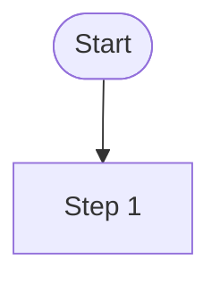
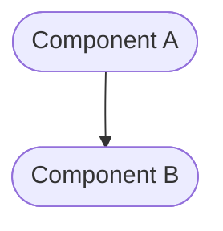
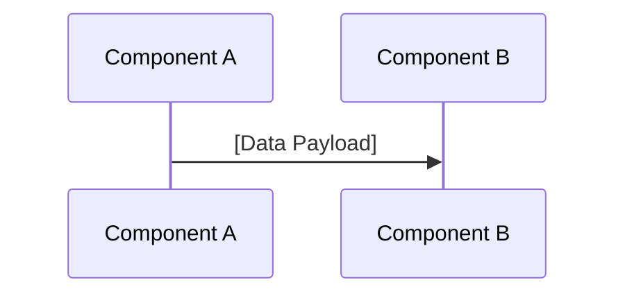
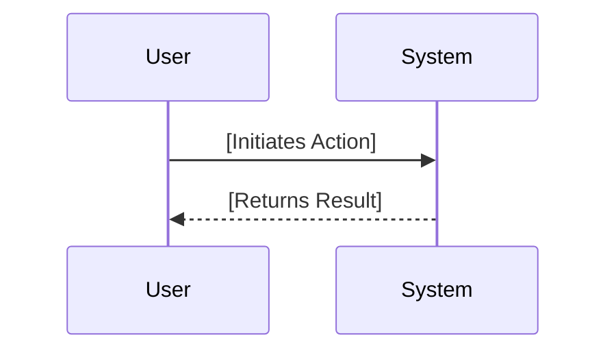
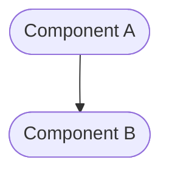
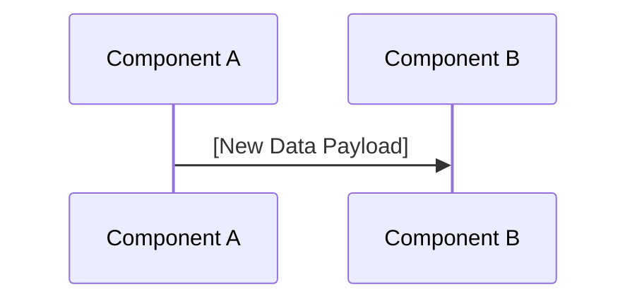
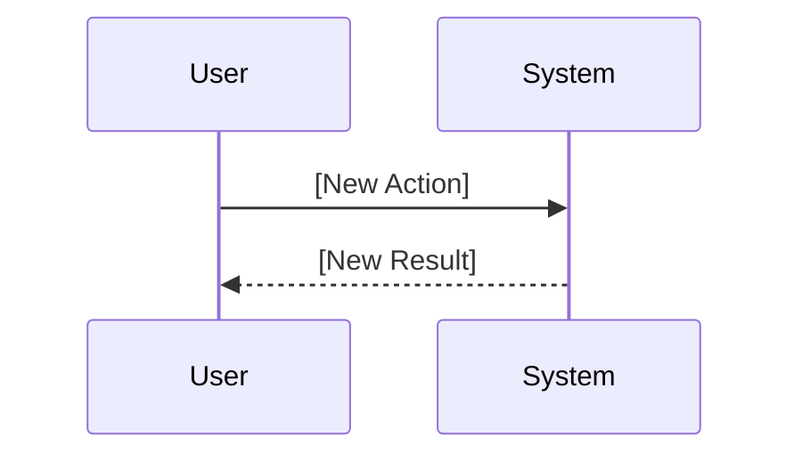

# Task: [Task Title]

<!-- This document provides the detailed implementation requirements for a single, focused unit of work. -->

---

## ✅ 1 Meta & Governance

### ✅ 1.2 Status

<!-- This section is auto-populated and updated by the developer as the task progresses. -->

- **Current State:** 💡 Not Started
- **Priority:** 🟨 Medium
- **Progress:** 0%
- **Assignee**: @[username]
- **Planning Estimate:** 0
- **Est. Variance (pts):** 0
- **Created:** [YYYY-MM-DD]
- **Implementation Started:** [YYYY-MM-DD]
- **Completed:** [YYYY-MM-DD]
- **Last Updated:** [YYYY-MM-DD]

### ✅ 1.3 Priority Drivers

<!-- List the stable Driver IDs that justify this task's priority. These are inherited from the parent Epic unless overridden. -->

- [Driver-ID]

---

## ✅ 2 Business & Scope

### ✅ 2.1 Overview

<!-- Provide a concise, bulleted list outlining what this task delivers and why it matters. -->

- **Core Function**: [A brief description of the task's primary responsibility.]
- **Key Capability**: [A specific function or capability the task provides.]
- **Business Value**: [The value this task delivers to the business or user.]

### ❓ 2.2 Business Context

<!-- (Optional) Add any specific business context needed for this task that is not covered in the epic. -->

#### ❓ 2.2.1 Key Workflows

<!-- (Optional) Visually map the specific user journey or system flow relevant to this task. -->



#### ❓ 2.2.3 Core Business Rules

<!-- (Optional) Enumerate any business rules that directly govern this task's implementation. -->

- [Rule 1: A description of a specific business constraint.]

#### ❓ 2.2.4 User Stories

<!-- (Optional) A user-centric goal for this task. -->

- As a **[Persona]**, I want **[to do something]**, so that **[I can achieve a goal]**.

### ✅ 2.4 Acceptance Criteria

<!-- A verifiable, tabular list of conditions that this task must satisfy to be considered complete. -->

| ID   | Criterion                                   | Test Reference      |
| ---- | ------------------------------------------- | ------------------- |
| AC-1 | [A verifiable statement of behavior.]       | [Link to test file] |
| AC-2 | [Another verifiable statement of behavior.] | [Link to test file] |

---

## ❓ 3 Planning & Decomposition

### ✅ 3.3 Dependencies

<!-- List any internal or external dependencies that could block the progress of this task. -->

| ID  | Dependency On     | Type                | Status  | Notes                             |
| --- | ----------------- | ------------------- | ------- | --------------------------------- |
| D-1 | [Dependency Name] | [Internal/External] | [✅/❌] | [Notes on the dependency status.] |

---

## ✅ 4 High-Level Design

### ❓ 4.1 Current Architecture

<!-- (Optional) Describe the existing system before the changes in this task are implemented. -->

#### ✅ 4.1.1 Components

<!-- "As-is" component diagram. -->



#### ✅ 4.1.2 Data Flow

<!-- "As-is" data flow diagram. -->



#### ✅ 4.1.3 Control Flow

<!-- "As-is" sequence of interactions. -->



#### ✅ 4.1.4 Integration Points

<!-- "As-is" key integration points. -->

- **Trigger:** [Description of the current trigger.]
- **Input Data:** [Description of the current input data.]

### ✅ 4.2 Target Architecture

<!-- Describe the proposed "to-be" state of the system after this task is implemented. -->

#### ✅ 4.2.1 Components

<!-- "To-be" component diagram. -->



#### ✅ 4.2.2 Data Flow

<!-- "To-be" data flow diagram. -->



#### ✅ 4.2.3 Control Flow

<!-- "To-be" sequence of interactions. -->



#### ✅ 4.2.4 Integration Points

<!-- "To-be" key integration points. -->

- **Trigger:** [Description of the new trigger.]
- **Input Data:** [Description of the new input data.]

#### ✅ 4.2.5 Exposed API

<!-- "To-be" exposed API surface. -->

- `[METHOD] /api/endpoint`: [Description of the endpoint.]

### ✅ 4.4 Non-Functional Requirements

#### ✅ 4.4.1 Performance

- [Performance requirement 1]

#### ✅ 4.4.2 Security

- [Security requirement 1]

#### ✅ 4.4.3 Reliability

- [Reliability requirement 1]

---

## ✅ 5 Maintenance and Monitoring

### ❓ 5.1 Current Maintenance and Monitoring

<!-- (Optional) Describe the existing internal implementation details. -->

#### ✅ 5.1.1 Error Handling

<!-- "As-is" error handling strategy. -->

- [Current error handling mechanism.]

#### ✅ 5.1.2 Logging & Monitoring

<!-- "As-is" observability strategy. -->

- [Current logging and monitoring setup.]

### ✅ 5.2 Target Maintenance and Monitoring

<!-- Describe the proposed "to-be" internal implementation details. -->

#### ✅ 5.2.1 Error Handling

<!-- "To-be" error handling strategy. -->

| Error Type       | Trigger                 | Action         | User Feedback                    |
| :--------------- | :---------------------- | :------------- | :------------------------------- |
| **[Error Type]** | [Trigger for the error] | [Action taken] | `[User-facing feedback message]` |

#### ✅ 5.2.2 Logging & Monitoring

<!-- "To-be" observability strategy. -->

- [New logging and monitoring setup.]

---

## ✅ 6 Implementation Guidance

### ✅ 6.1 Implementation Plan

<!-- A direct, "one-shot" overview of the technical approach for this work item. -->

[A brief description of the technical approach for this task.]

### ✅ 6.2 Implementation Log / Steps

<!-- A detailed, step-by-step log of the implementation process for this task. -->

#### ✅ 6.2.1 Initial Situation

<!-- Table capturing the objective baseline before work begins. -->

| Aspect       | Current Code/State | Gap vs. Task Goal | Key Files to Change |
| ------------ | ------------------ | ----------------- | ------------------- |
| **[Aspect]** | [Description]      | [Description]     | `[path/to/file]`    |

#### ✅ 6.2.2 Files Change Log

<!-- Table tracking file modifications as the task progresses. -->

| File / Path      | Change Type (ADD/MOD/DEL) | Summary of Change |
| ---------------- | ------------------------- | ----------------- |
| `[path/to/file]` | [MOD]                     | [Description]     |

### ❓ 6.3 Prompts (LLM reuse)

<!-- (Optional) A collection of prompts that can be used with an LLM to assist in the implementation. -->

````md
**Generate a Jest test for this function:**

```typescript
export const add = (a: number, b: number): number => a + b;
```
````

---

## ✅ 7 Quality & Operations

### ✅ 7.1 Testing Strategy / Requirements

<!-- The approach to testing and specific testing requirements for this task. -->

| AC ID | Scenario          | Test Type   | Tools / Runner |
| ----- | ----------------- | ----------- | -------------- |
| AC-1  | [Test scenario 1] | Unit        | Jest           |
| AC-2  | [Test scenario 2] | Integration | Jest + MSW     |

### ✅ 7.2 Configuration

<!-- How the system is configured in different environments for this task. -->

| Environment | Setting Name     | Value          |
| ----------- | ---------------- | -------------- |
| Development | `[SETTING_NAME]` | `[dev_value]`  |
| Production  | `[SETTING_NAME]` | `[prod_value]` |

### ✅ 7.3 Alerting & Response

<!-- How to respond to alerts and operational logs originating from this task. -->

- **[Error Type]**: [Response plan, e.g., Trigger PagerDuty alert.]

### ✅ 7.5 Local Test Commands

<!-- CLI commands to run tests locally. -->

```bash
yarn jest [path/to/this/task/test.ts]
```

---

## ❓ 8 Reference

### ❓ 8.1 Appendices/Glossary

<!-- (Optional) Provide any additional information, definitions, or links to external resources. -->

- **[Term]**: [Definition of the term.]
