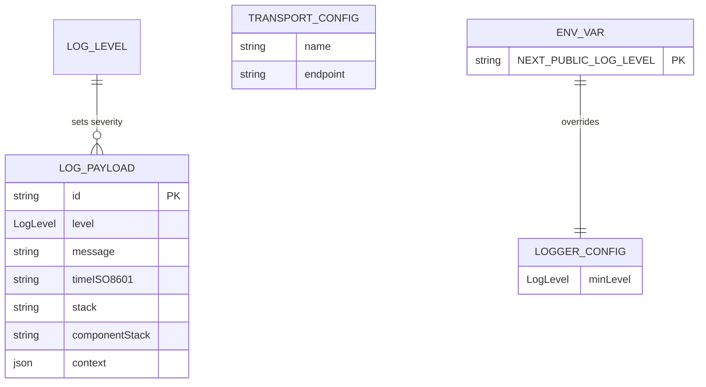
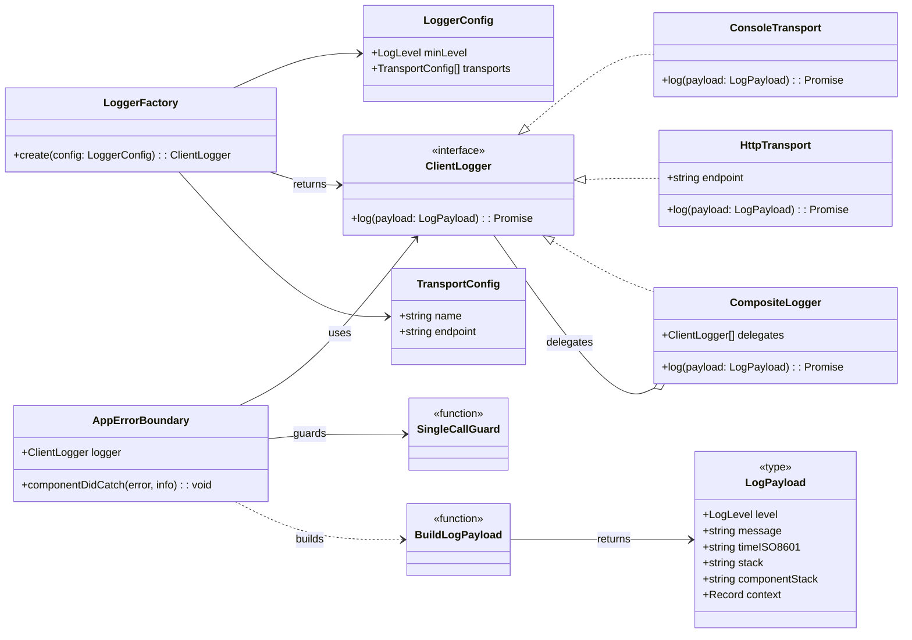
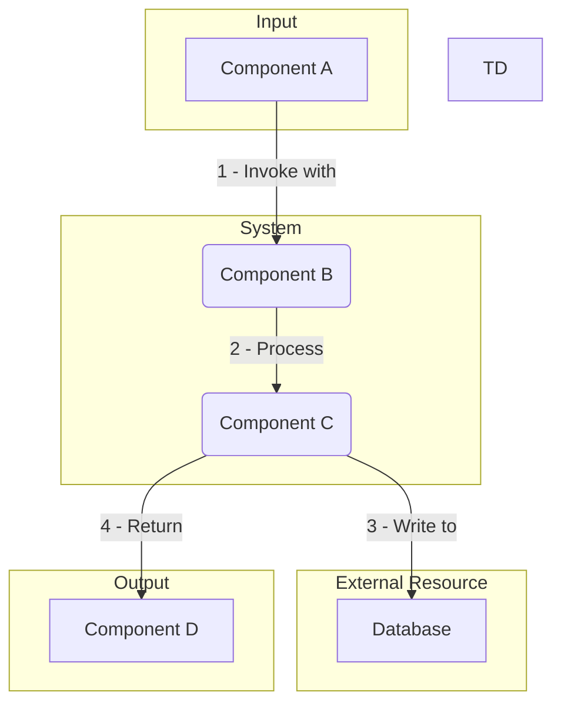
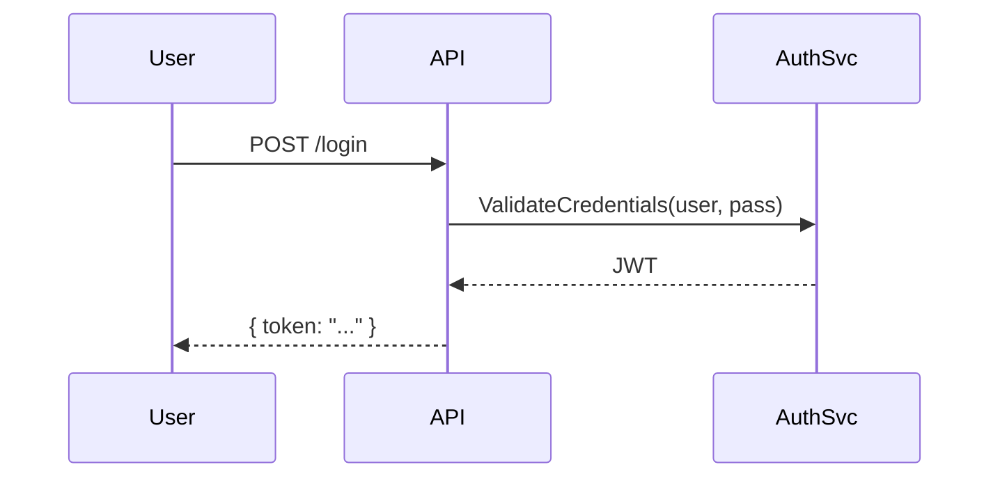

# [Task Name]

## 1 Meta & Governance

### 1.2 Status

<!-- A section containing key status metrics for the document. The specific fields vary depending on whether it's a Plan or Task, with Tasks providing more detailed implementation tracking. -->

<!--
EXAMPLE:
- **Current State:** 💡 Not Started
- **Priority:** 🟨 Medium
- **Progress:** 0%
- **Planning Estimate:** 0
- **Est. Variance (pts):** 0
- **Created:** [YYYY-MM-DD HH:MM]
- **Implementation Started:** [YYYY-MM-DD HH:MM]
- **Completed:** [YYYY-MM-DD HH:MM]
- **Last Updated:** [YYYY-MM-DD HH:MM]
-->
TODO__ADD_CONTENT_HERE


### 1.3 Priority Drivers

<!-- A bulleted list of stable Driver IDs that justify the priority of the artefact. -->

<!--
EXAMPLE:
- CBP-Break_Block_Revenue_Legal
- TEC-Prod_Stability_Blocker
-->
TODO__ADD_CONTENT_HERE


---

## 2 Business & Scope

### 2.1 Overview

<!-- Provide a concise, bulleted list outlining what this artefact delivers and why it matters. -->

<!--
EXAMPLE:
- **Core Function**: Implements a robust, multi-level logging system for the document processing pipeline.
- **Key Capability**: Ensures both operational errors and business events are captured, categorized, and routed to monitoring tools.
- **Business Value**: Enables proactive issue resolution and performance analysis.
-->
TODO__ADD_CONTENT_HERE


#### 2.2.3 Core Business Rules

<!-- Enumerate domain rules that apply to this artefact. -->

<!--
EXAMPLE:
- All personally identifiable information (PII) must be logged at the `DEBUG` level or lower.
- Any log with a `FATAL` level must trigger an immediate PagerDuty alert.
- Log retention period is 90 days for `INFO` and 1 year for `ERROR` and above.
-->
TODO__ADD_CONTENT_HERE


### 2.4 Acceptance Criteria

<!-- A verifiable, tabular list of conditions that a Task must satisfy to be considered complete. -->

<!--
EXAMPLE:
| ID | Criterion | Test Reference |
| :--- | :--- | :--- |
| AC-1 | Logger correctly filters messages below `minLevel`. | `logger.test.ts` |
| AC-2 | `FATAL` level logs trigger a PagerDuty alert. | `alerting.int.test` |
| AC-3 | Log output is valid JSON. | `formatter.test.ts` |
-->
TODO__ADD_CONTENT_HERE


---

## 3 Planning & Decomposition

### 3.3 Dependencies

<!-- An explicit list of internal or external dependencies that must be resolved before this Plan/Task can be completed. -->

<!--
EXAMPLE:
| ID | Dependency On | Type | Status | Affected Plans/Tasks | Notes |
| :--- | :--- | :--- | :--- | :--- | :--- |
| D-1 | `shared-ui-library` v2.1+ | External | ❌ Blocked | `p1-frontend` | Awaiting release from Platform team. |
| D-2 | Plan `p2-user-profiles` | Internal | ✅ Complete | `p3-reporting` | User schema is now finalized. |
-->
TODO__ADD_CONTENT_HERE


---

## 4 High-Level Design

### 4.2 Target Architecture

TODO__ADD_CONTENT_HERE


#### 4.2.1 Data Models

<!-- The structure of data at a high level, often represented as an Entity-Relationship Diagram. This section defines the core data entities and their relationships before detailing the components that manage them. -->

<!--
EXAMPLE:

-->
TODO__ADD_CONTENT_HERE


#### 4.2.2 Components

<!-- A diagram illustrating the main components and their relationships. The term "component" is used broadly and does not necessarily map to a class; it represents a logical block of functionality. -->

<!--
EXAMPLE:

-->
TODO__ADD_CONTENT_HERE


#### 4.2.3 Data Flow

<!-- A diagram showing how data moves between components, with numbered steps to indicate the sequence of actions. -->

<!--
EXAMPLE:

-->
TODO__ADD_CONTENT_HERE


#### 4.2.4 Control Flow

<!-- A diagram showing the sequence of interactions between components. -->

<!--
EXAMPLE:

-->
TODO__ADD_CONTENT_HERE


#### 4.2.5 Integration Points

<!-- A container for defining all systems, services, or APIs that this component interacts with, broken down into `Upstream` and `Downstream` sections. -->

TODO__ADD_CONTENT_HERE


##### 4.2.5.1 Upstream Integrations

<!-- Defines how this artefact is triggered and what data it receives from other systems. -->

<!--
EXAMPLE:
- **Trigger**: User action via UI button click.
- **Input Data**: Receives `documentId` and `userId` from the client.
-->
TODO__ADD_CONTENT_HERE


##### 4.2.5.2 Downstream Integrations

<!-- Defines what happens when this artefact completes its work and what data it sends to other systems. -->

<!--
EXAMPLE:
- **Completion Trigger**: Emits a `DOCUMENT_PROCESSED` event to the message queue.
- **Output Data**: The event payload includes `documentId` and `status: 'COMPLETED'`.
-->
TODO__ADD_CONTENT_HERE


#### 4.2.6 Exposed API

<!-- The API surface this component exposes to consumers. -->

<!--
EXAMPLE:
```yaml
paths:
  /users/{userId}:
    get:
      summary: Get user by ID
      parameters:
        - name: userId
          in: path
          required: true
          schema:
            type: string
```
-->
TODO__ADD_CONTENT_HERE


### 4.3 Tech Stack & Deployment

<!-- A list of the primary technologies, frameworks, or libraries foundational to this artefact, along with the deployment strategy. -->

<!--
EXAMPLE:
- **Language**: TypeScript
- **Framework**: Next.js
- **Deployment**: Vercel
-->
TODO__ADD_CONTENT_HERE


### 4.4 Non-Functional Requirements

<!-- A container for the high-level, non-functional requirements (NFRs) or quality attributes that the system must meet. This section defines what the requirements are, while the `7. Quality & Operations` family describes how they will be tested and monitored. -->

TODO__ADD_CONTENT_HERE


#### 4.4.1 Performance

<!-- Defines the performance-related NFRs, such as response times, throughput, and resource utilization, in a prioritized table. -->

<!--
EXAMPLE:
| ID | Requirement | Priority |
| :--- | :--- | :--- |
| PERF-01 | API endpoints must respond in < 200ms (95th percentile). | 🟥 High |
| PERF-02 | The system must support 100 concurrent users without degradation. | 🟧 Medium |
-->
TODO__ADD_CONTENT_HERE


#### 4.4.2 Security

<!-- Defines the security-related NFRs, such as data encryption, access control, and vulnerability standards, in a prioritized table. -->

<!--
EXAMPLE:
| ID | Requirement | Priority |
| :--- | :--- | :--- |
| SEC-01 | All sensitive user data must be encrypted at rest using AES-256. | 🟥 High |
| SEC-02 | Access to admin endpoints must be restricted to users with 'Admin' role. | 🟥 High |
-->
TODO__ADD_CONTENT_HERE


#### 4.4.3 Reliability

<!-- Defines the reliability-related NFRs, such as uptime, data integrity, and disaster recovery, in a prioritized table. -->

<!--
EXAMPLE:
| ID | Requirement | Priority |
| :--- | :--- | :--- |
| REL-01 | The service must maintain 99.9% uptime, measured monthly. | 🟥 High |
| REL-02 | All database transactions must be atomic and durable. | 🟥 High |
-->
TODO__ADD_CONTENT_HERE


#### 4.4.4 Permission Model

<!-- Defines the access control rules, user roles, and permissions for the system. This section should clearly outline who can access what and perform which actions. The mechanism for assigning these roles in each environment should be detailed in the `7.2 Configuration` section. -->

<!--
EXAMPLE:
| Role | Permissions | Notes |
| :--- | :--- | :--- |
| **Admin** | - Full CRUD access to all documents<br>- Can assign roles | For system administrators only. |
| **Analyst** | - Read/Write access to assigned documents<br>- Cannot delete | The primary user role. |
| **Viewer** | - Read-only access to completed documents | For stakeholders or external users. |
-->
TODO__ADD_CONTENT_HERE


---

## 5 Maintenance and Monitoring

### 5.2 Target Maintenance and Monitoring

TODO__ADD_CONTENT_HERE


#### 5.2.1 Error Handling

<!-- The strategy for managing and communicating errors, often best represented as a table detailing the condition, trigger, action, and feedback. -->

<!--
EXAMPLE:
| Error Type | Trigger | Action | User Feedback |
| :--- | :--- | :--- | :--- |
| **File System Error** | Cannot read a required file or directory. | Abort with exit code 1. | `ERROR: Cannot access [path]. Please check permissions.` |
| **Schema Validation Error** | A document violates the canonical schema. | Abort with exit code 1. | `ERROR: Schema validation failed in [file]: [validation_details].` |
| **API/Network Error** | External API is unreachable or returns > 299. | Abort with exit code 1. | `ERROR: Failed to transmit status to [endpoint]: [HTTP_status_or_error].` |
-->
TODO__ADD_CONTENT_HERE


#### 5.2.2 Logging & Monitoring

<!-- The strategy for system observability. -->

<!--
EXAMPLE:
- **Metrics**: Prometheus endpoint `/metrics` will be exposed.
- **Logs**: Structured JSON logs sent to stdout for collection by Fluentd.
- **Tracing**: OpenTelemetry SDK will be used for distributed tracing.
-->
TODO__ADD_CONTENT_HERE


---

## 6 Implementation Guidance

### 6.1 Implementation Plan

<!-- A detailed, step-by-step log of the implementation process for a Task. -->

TODO__ADD_CONTENT_HERE


### 6.1 Implementation Log / Steps

<!-- A detailed, step-by-step log of the implementation process for a Task. This is often updated as the task progresses. -->

<!--
EXAMPLE:
- [x] Create `logger/types.ts` with core interfaces.
- [x] Implement `ConsoleTransport`.
- [ ] Implement `HttpTransport`.
- [ ] Write unit tests for transports.
-->
TODO__ADD_CONTENT_HERE


#### 6.1.1 Initial Situation

TODO__ADD_CONTENT_HERE


#### 6.1.2 Files Change Log

TODO__ADD_CONTENT_HERE


### 6.2 Prompts (LLM reuse)

<!-- A collection of prompts that can be used with an LLM to assist in the implementation. -->

<!--
EXAMPLE:
Generate a Jest test for this function:
```md
export const add = (a: number, b: number): number => a + b;
```
-->
TODO__ADD_CONTENT_HERE


---

## 7 Quality & Operations

### 7.1 Testing Strategy / Requirements

<!-- The overall strategy for testing, and a list of specific tests that must pass, often mapping to Acceptance Criteria. -->

<!--
EXAMPLE:
| AC | Scenario | Test Type | Tools / Runner | Notes |
| :--- | :--- | :--- | :--- | :--- |
| 1 | Default dev logger = console only | Unit | Jest + RTL (spy on console) | Set `process.env.NODE_ENV='development'` |
| 2 | Prod logger fan-out to console + HTTP, minLevel respected | Unit | Jest + fetch-mock + console spy | `NODE_ENV='production'` |
| 7 | Successful POST to `/api/log/client` | Integration | Jest + MSW | Assert JSON body and 2xx handling |
-->
TODO__ADD_CONTENT_HERE


### 7.2 Configuration

<!-- How the system is configured in different environments (e.g., production, development). -->

<!--
EXAMPLE:
| Setting Name | Plan Dependency | Source | Override Method | Notes |
| :--- | :--- | :--- | :--- | :--- |
| `analyzerApiEndpoint` | `p1-analyzer` | `ddd.config.json` | `DDD_ANALYZER_API_ENDPOINT` (Environment Var) | (Required) The URL of the external service for status reporting. |
| `logLevel` | (All) | `ddd.config.json` | `DDD_LOG_LEVEL` (Environment Variable) | `info` (default), `debug`, `warn`, `error`. Controls logging verbosity. |
| `NODE_ENV` | (All) | Environment Variable | Not overrideable | `development` or `production`. Determines the operational mode. |
-->
TODO__ADD_CONTENT_HERE


### 7.3 Alerting & Response

<!-- How to respond to alerts and operational logs, especially errors, and how they are integrated with alerting systems. -->

<!--
EXAMPLE:
| Error Condition | Relevant Plans | Response Plan | Status |
| :--- | :--- | :--- | :--- |
| **Internal Script Failure** | All | Abort the `git commit` with a non-zero exit code. Print the error stack trace directly to the console. | 💡 Not Started |
| **External API Non-2xx Response** | `p1-analyzer` | Abort the `git commit` with a non-zero exit code. Log the API's error response to the console. | 💡 Not Started |
| **CI/CD Pipeline Failure** | All | Fail the corresponding pipeline step. The tool's non-zero exit code will be surfaced in the CI/CD interface. | 💡 Not Started |
-->
TODO__ADD_CONTENT_HERE


### 7.5 Local Test Commands

<!-- CLI commands to run tests locally. -->

TODO__ADD_CONTENT_HERE


---

## 8 Reference

### 8.1 Appendices/Glossary

<!-- A place for glossaries, appendices, or links to external resources. -->

<!--
EXAMPLE:
**Glossary:**
- **PII**: Personally Identifiable Information.
- **SSO**: Single Sign-On.
-->
TODO__ADD_CONTENT_HERE


---
