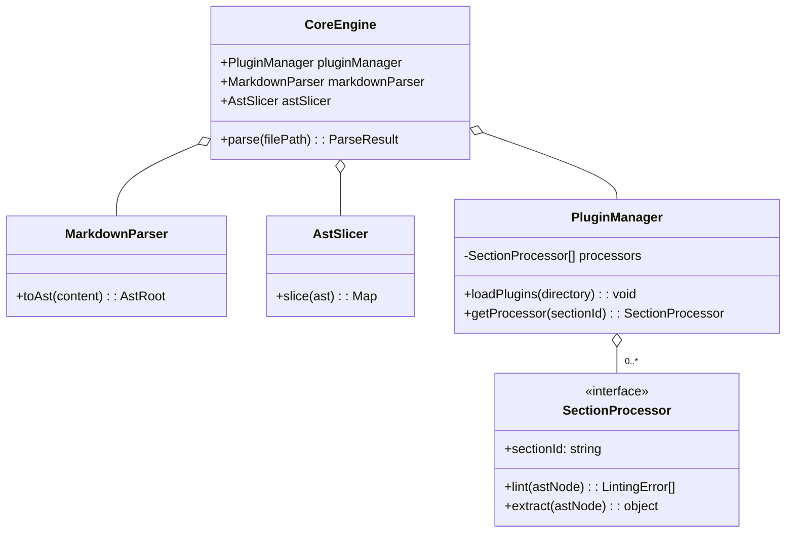
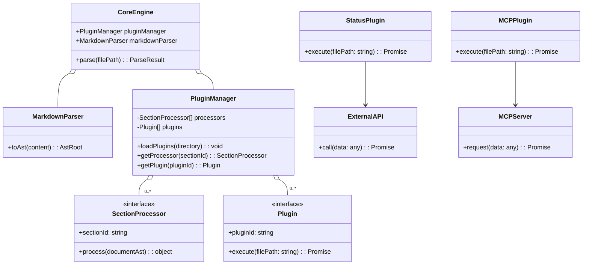
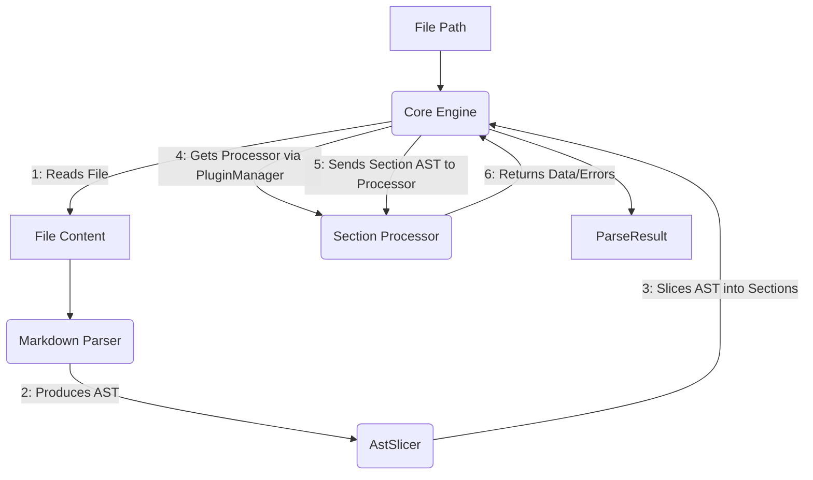
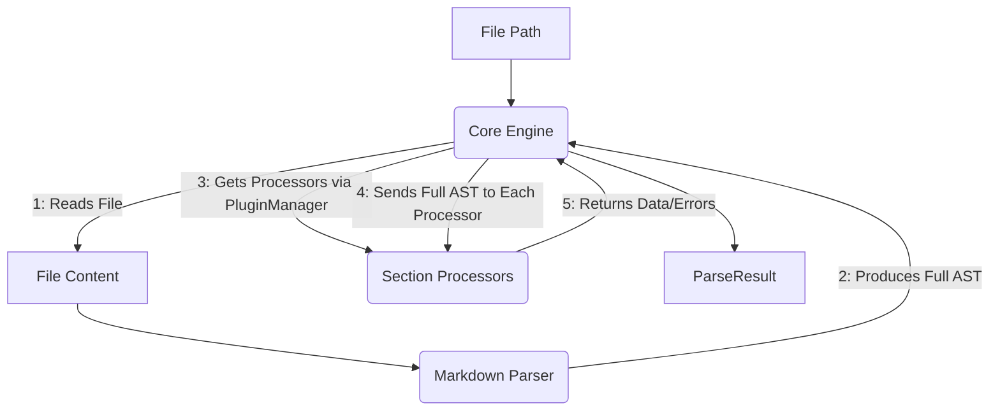
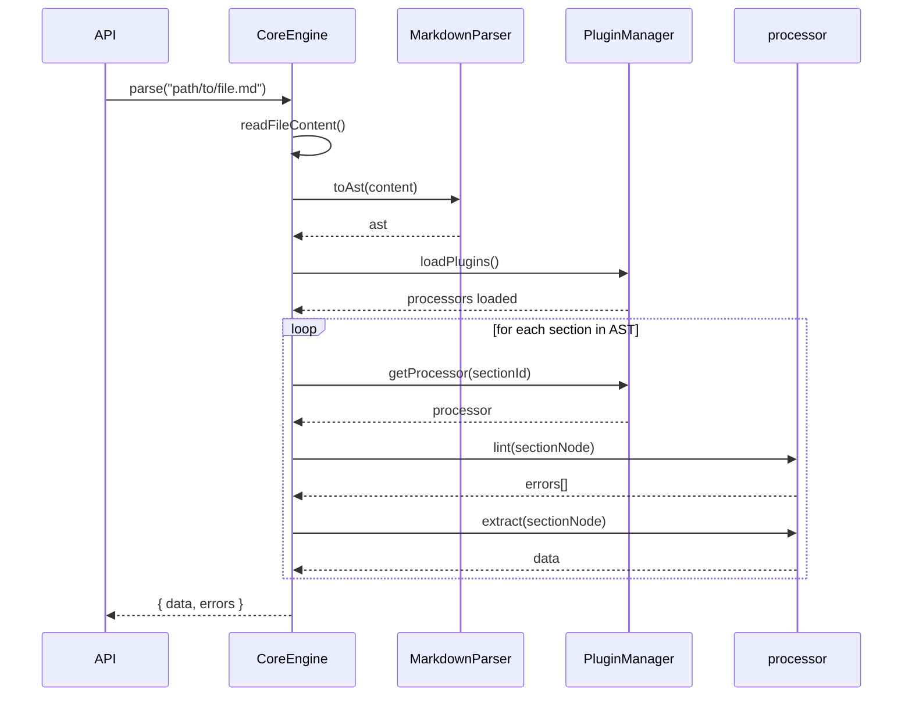
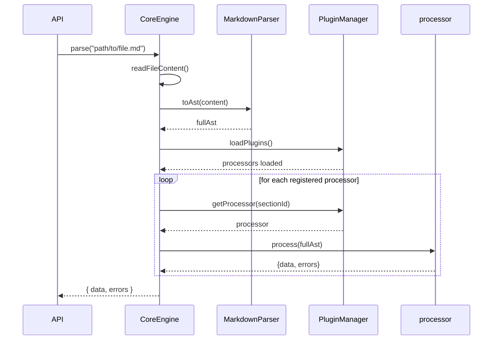
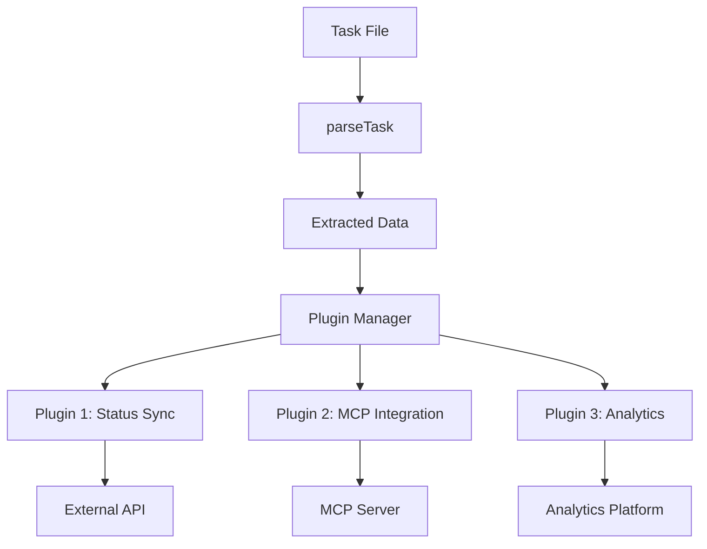
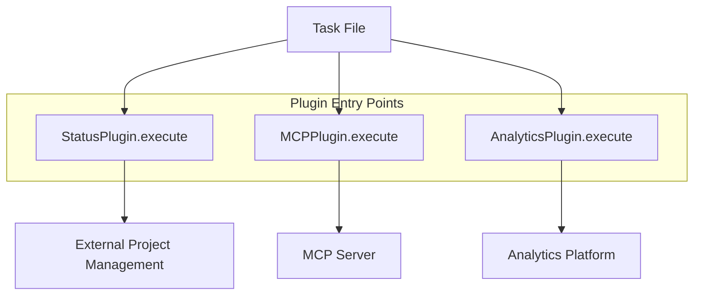
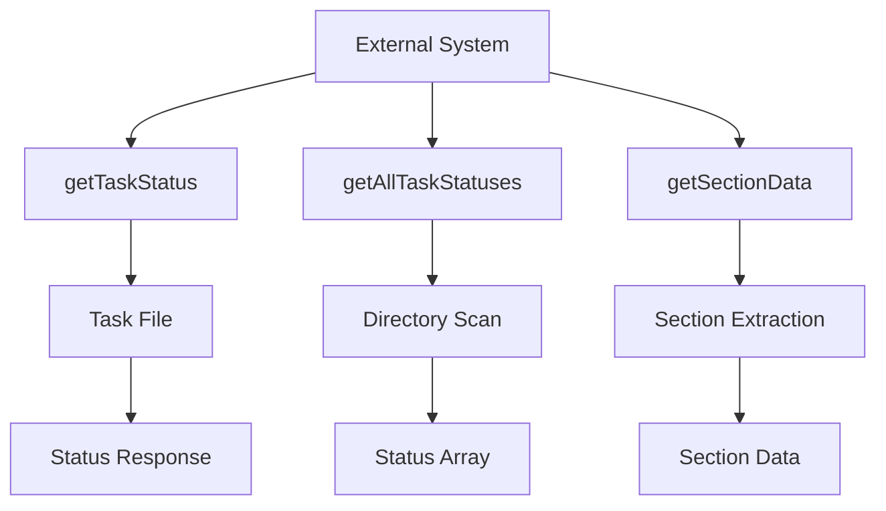
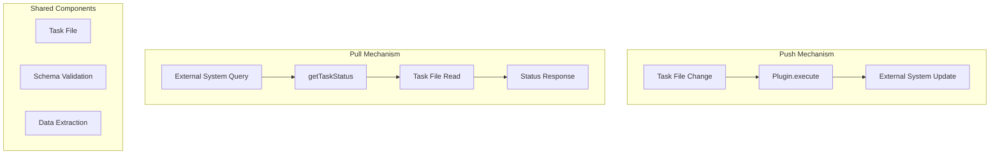

# Architecture Change Impact Analysis

## Proposed Change: SectionProcessor Interface Redesign

This document analyzes how the proposed `SectionProcessor` interface redesign would impact the architecture defined in `p1-p5.t18-core-engine-parser.task.md`.

## Current Architecture (t18) vs Proposed Architecture

### **Current Architecture (t18)**

#### **SectionProcessor Interface**

```typescript
interface SectionProcessor {
  sectionId: string;
  lint(sectionAst: Root): LintingError[];
  extract(sectionAst: Root): any;
  getTargetPath(): string;
}
```

#### **CoreEngine Responsibilities**

1. **File Reading**: Reads the complete markdown file
2. **AST Generation**: Converts markdown to AST using MarkdownParser
3. **AST Slicing**: Uses AstSlicer to slice AST into sections
4. **Plugin Orchestration**: For each section:
   - Gets appropriate processor from PluginManager
   - Calls `lint(sectionAst)` on processor
   - Calls `extract(sectionAst)` on processor
   - Aggregates results

#### **Data Flow**

```
File → CoreEngine → MarkdownParser → AST → AstSlicer → Section ASTs → Plugins
```

### **Proposed Architecture (After Redesign)**

#### **SectionProcessor Interface**

```typescript
interface SectionProcessor {
  sectionId: string;
  process(documentAst: Root): { data: any; errors: LintingError[] };
  getTargetPath(): string;
}
```

#### **CoreEngine Responsibilities**

1. **File Reading**: Reads the complete markdown file
2. **AST Generation**: Converts markdown to AST using MarkdownParser
3. **Plugin Orchestration**: For each registered processor:
   - Calls `process(fullDocumentAst)` on processor
   - Aggregates results

#### **Data Flow**

```
File → CoreEngine → MarkdownParser → Full AST → Plugins (self-contained)
```

## Detailed Impact Analysis

### **Components That Would Change**

| Component            | Current Role                      | Proposed Role                | Impact Level |
| -------------------- | --------------------------------- | ---------------------------- | ------------ |
| **CoreEngine**       | Orchestrates slicing + processing | Orchestrates processing only | 🔴 High      |
| **AstSlicer**        | Slices AST into sections          | **REMOVED**                  | 🔴 High      |
| **PluginManager**    | Provides processors               | Provides processors          | 🟡 Medium    |
| **SectionProcessor** | Processes pre-sliced AST          | Processes full document AST  | 🔴 High      |
| **MarkdownParser**   | Converts to AST                   | Converts to AST              | ✅ None      |

### **Architecture Diagrams - Before vs After**

#### **Current Class Diagram (t18)**



#### **Proposed Class Diagram**



### **Data Flow Comparison**

#### **Current Data Flow (t18)**



#### **Proposed Data Flow**



### **Control Flow Comparison**

#### **Current Control Flow (t18)**



#### **Proposed Control Flow**



## Benefits of the Proposed Change

### **1. Simplified Architecture**

- **Removes AstSlicer**: No longer needed as plugins handle their own section extraction
- **Simplifies CoreEngine**: Fewer responsibilities, cleaner code
- **Reduces Dependencies**: One less component to maintain

### **2. Better Encapsulation**

- **Self-contained Plugins**: Each plugin knows how to find its own section
- **Schema Integration**: Plugins can use schema for both validation and extraction
- **Consistent Processing**: Single method handles both validation and extraction

### **3. Improved Maintainability**

- **Single Source of Truth**: Schema drives both validation and extraction
- **Easier Testing**: Plugins can be tested with full document AST
- **Better Error Handling**: Plugins can provide context-aware errors

### **4. Enhanced Flexibility**

- **Schema-Driven**: Extraction can use field definitions from schema
- **Type Safety**: Better typing for extracted data
- **Future-Proof**: Easier to add new processing capabilities

## Proposed Third Entry Point: Plugin Execution

### **Current Entry Points (index.ts)**

```typescript
// 1. Parse and validate task file
export async function parseTask(filePath: string): Promise<ParseResult>;

// 2. Validate task file only
export async function lintTask(filePath: string): Promise<LintingError[]>;
```

### **Proposed Plugin Entry Points**

```typescript
// 3. Direct plugin execution (plugins become entry points)
export async function executeStatusPlugin(filePath: string): Promise<PluginResult>;
export async function executeMCPPlugin(filePath: string): Promise<PluginResult>;
export async function executeAnalyticsPlugin(filePath: string): Promise<PluginResult>;

// 4. Generic plugin execution
export async function executePlugin(filePath: string, pluginId: string): Promise<PluginResult>;
export async function executePlugins(filePath: string, pluginIds: string[]): Promise<PluginResult[]>;

// 5. Pull mechanism entry points
export async function getTaskStatus(filePath: string): Promise<TaskStatus>;
export async function getAllTaskStatuses(directoryPath: string): Promise<TaskStatus[]>;
export async function getSectionData(filePath: string, sectionId: string): Promise<any>;
```

### **Plugin Interface Design (Push Mechanism)**

```typescript
interface Plugin {
  pluginId: string;
  description: string;
  requiredSections: string[]; // e.g., ['1.2', '2.1']

  /**
   * Execute plugin logic with extracted section data (PUSH)
   * @param sectionData Map of sectionId -> extracted data
   * @returns Plugin execution result
   */
  execute(sectionData: Record<string, any>): Promise<PluginResult>;
}

interface PluginResult {
  pluginId: string;
  success: boolean;
  data?: any;
  error?: string;
}
```

### **Query Interface Design (Pull Mechanism)**

```typescript
interface TaskQueryAPI {
  /**
   * Get current status of a task (PULL)
   * @param filePath Path to the task file
   * @returns Current task status
   */
  getTaskStatus(filePath: string): Promise<TaskStatus>;

  /**
   * Get all tasks in a directory (PULL)
   * @param directoryPath Path to directory containing task files
   * @returns Array of task statuses
   */
  getAllTaskStatuses(directoryPath: string): Promise<TaskStatus[]>;

  /**
   * Get specific section data from a task (PULL)
   * @param filePath Path to the task file
   * @param sectionId Section to extract (e.g., '1.2')
   * @returns Section data
   */
  getSectionData(filePath: string, sectionId: string): Promise<any>;
}

interface TaskStatus {
  filePath: string;
  currentState: string;
  priority: string;
  progress: number;
  lastUpdated: string;
  errors: LintingError[];
}
```

### **Example Plugin Use Cases**

1. **Status Sync Plugin**: Extracts status data and updates external project management tools
2. **MCP Integration Plugin**: Sends task data to MCP server for AI processing
3. **Notification Plugin**: Sends notifications based on status changes
4. **Analytics Plugin**: Sends metrics to analytics platforms

### **Data Flow for Plugin Execution**



### **Plugin as Entry Point Architecture**



### **Data Flow for Pull Mechanism**



### **Combined Push/Pull Architecture**



## Migration Strategy

1. Update `SectionProcessor` interface
2. Create new `process()` method signature
3. Update existing plugins to new interface

### **Phase 2: CoreEngine Simplification**

1. Remove `AstSlicer` dependency
2. Update `CoreEngine` to pass full AST to plugins
3. Simplify orchestration logic

### **Phase 3: Schema Integration**

1. Add schema-driven extraction to plugins
2. Implement unified validation/extraction logic
3. Add type safety improvements

### **Phase 4: Plugin System Implementation**

1. Design and implement `Plugin` interface
2. Add `executePlugins()` entry point to `index.ts`
3. Create example plugins (Status Sync, MCP Integration)
4. Update `PluginManager` to handle both processors and plugins

## Conclusion

The proposed architecture change would significantly simplify the system while improving encapsulation and maintainability. The removal of `AstSlicer` and the redesign of the `SectionProcessor` interface would create a cleaner, more self-contained architecture that better leverages the schema system.

**Recommendation**: Implement this architecture change in a future task to improve the overall system design.
