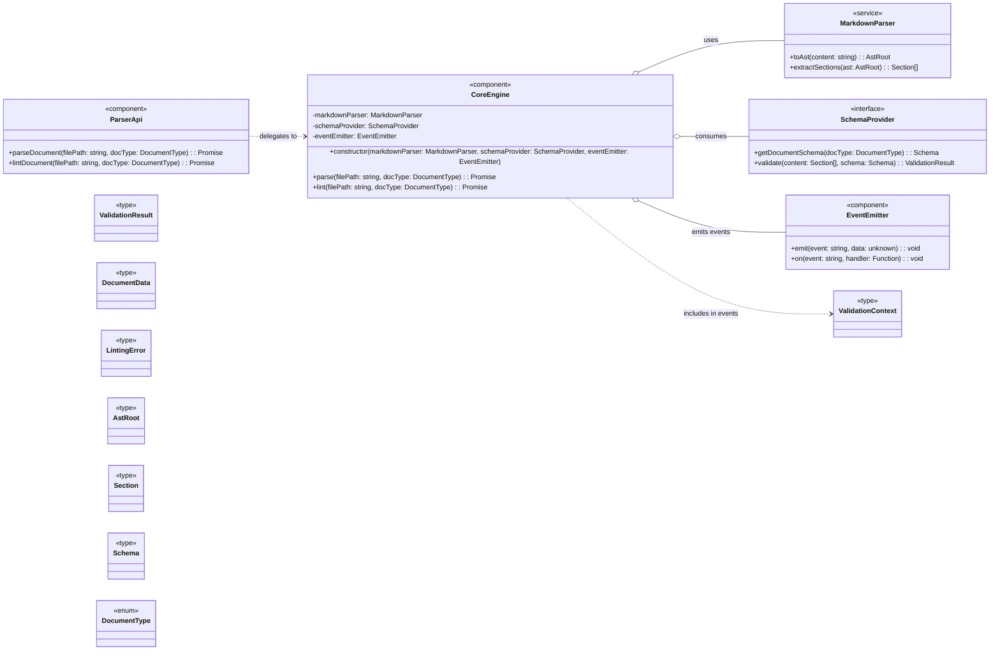

# Internal Guide: Component and Class Diagrams (Section 4.2.2)

Purpose: Generic standards for designing and documenting component/class diagrams in our Target Architecture sections. Applies across projects using the DDD tools.

## 1. Scope

- Use for static structure of runtime components (modules, services, interfaces) and their relationships.
- Do not model domain data here (keep that in the Data Model). Reference types with stereotypes instead.
- Do not model runtime message details (keep payload schemas in Event/Contract guides).

## 2. Notation & Stereotypes (Mermaid `classDiagram`)

- Components/services/modules: `<<component>>` or `<<service>>`
- Interfaces: `<<interface>>` (use `..|>` for realization)
- Data/value types referenced from the data model: `<<type>>`, `<<enum>>`, `<<value>>`
- Inheritance: `<|--` Dependency: `..>` Aggregation/has-a: `o--` Composition: `*--`
- Operations: `+method(arg: Type): ReturnType` (public API only)

## 3. Separation of Concerns

- This diagram shows: components, their responsibilities, and wiring (DI).
- It must NOT define domain entities or event payloads. Reference them as `<<type>>`.
- Event types and schemas live in the Event Contracts guide; only the dependency on an emitter belongs here.

## 4. Dependency Injection & Relationships

- Prefer constructor DI for swappable dependencies (e.g., `SchemaProvider`, `EventEmitter`).
- Use `..>` for "delegates to" or compile-time dependencies.
- Use `o--` for owned runtime dependencies injected into a component.
- Use `..|>` when a class implements an interface.

## 5. API Surface Conventions

- Names: PascalCase for types/classes; camelCase for methods; verbs for actions.
- Types: Always return explicit types. Prefer `Promise<Result>` for async APIs.
- Results: Use a discriminated result type for operations, e.g. `ValidationResult<Payload, Err, Ctx>`.
- Avoid raw `any`; reference concrete `<<type>>` from the Data Model (e.g., `Section[]`, `Schema`).

## 6. Events (how to represent)

- Show only the emitter dependency (`EventEmitter` or equivalent) and which component emits.
- Do not embed event schemas here; reference event names in annotations if needed.
- Payload schemas belong to Event/Contract documentation.

## 7. Consistency Rules

- Type names match those in the Data Model (e.g., `Schema`, `Section`, `DocumentData`).
- No all-caps type names (avoid `SCHEMA`); use PascalCase.
- Collections explicitly typed (e.g., `Section[]`, `Map<Id, Section>` if truly needed).
- Keep method signatures minimal and expressive; prefer composition over exposing internals.

## 8. Checklist

- Components and interfaces only? (no domain entities)
- Dependencies via DI with clear relationship arrows?
- Public API methods have explicit, accurate return types?
- Referenced data types exist in the Data Model and use `<<type>>`?
- Event emission represented as dependency, not payloads?
- Naming/casing consistent across diagrams (Components, Data Model, Contracts)?

## 9. Example Archetype (Doc Parser)

Notes:

- Ensure all `<<type>>` nodes are present in the Data Model (4.2.1).
- The generic `ValidationResult<Payload, Err, Ctx>` is shown to communicate the contract without redefining payloads.

## 10. Authoring Flow (recommended order)

1. Finalize the Data Model (entities/value types).
2. List component responsibilities and identify interfaces.
3. Define public API signatures (inputs/outputs) referencing Data Model types.
4. Map dependencies (DI) and choose relationship arrows.
5. Add stereotypes and ensure naming consistency.
6. Cross-check with Event Contracts for emitted events and payload references.
