# Internal Guide: Data Modeling and Event Contracts

Purpose: Shared standards for modeling data and defining contracts used by our documentation-driven development tools. This guide informs how we author diagrams and types across plans/tasks.

## 1. Data Unit Types Matrix

The following matrix categorizes different types of data units based on their lifecycle, persistence, and purpose:

| Type                     | Lifecycle        | Persistence        | Purpose                    | Examples                                          | Diagram Color    |
| :----------------------- | :--------------- | :----------------- | :------------------------- | :------------------------------------------------ | :--------------- |
| **Persisted Data**       | Long-term        | Database/Files     | Stored business data       | User records, configuration files, cached data    | Blue (#1976D2)   |
| **Contract/Interface**   | Stable           | Schema definitions | API/validation contracts   | Request/response types, validation schemas        | Green (#388E3C)  |
| **Runtime/In-Memory**    | Temporary        | RAM only           | Execution-time structures  | Local variables, temporary objects, registries    | Orange (#F57C00) |
| **Configuration/Static** | Build-time       | Build artifacts    | Compile-time definitions   | Build configs, static constants, type definitions | Purple (#7B1FA2) |
| **Domain/Business**      | Entity lifecycle | Varies             | Core business logic        | Business entities, domain aggregates              | Gold (#FFB300)   |
| **Message/Event**        | Transient        | Message queues     | Inter-system communication | Event payloads, notifications, API messages       | Teal (#00796B)   |

### Usage Guidelines:

- **Persisted Data**: Use for data that survives application restarts
- **Contract/Interface**: Use for data shape definitions and validation rules
- **Runtime/In-Memory**: Use for temporary processing structures
- **Configuration/Static**: Use for build-time or deployment-time constants
- **Domain/Business**: Use for core business entities with clear lifecycle
- **Message/Event**: Use for communication payloads between systems

## 2. Model Layers (what each is for)

- Conceptual Model: domain language, entities, relationships, high-level constraints.
- Logical Data Model (LDM): attributes, keys, cardinalities, normalization (ER/UML Class).
- Physical Model: tables/indexes/serialization; out of scope for our planning docs.
- Contract Model: event/message/API schemas and versioning (separate from LDM).

### 1.1 Detailed Differentiation Criteria

| Criteria             | Persisted        | Contract/Interface      | Runtime/In-Memory | Configuration/Static  | Domain/Business           | Message/Event   |
| :------------------- | :--------------- | :---------------------- | :---------------- | :-------------------- | :------------------------ | :-------------- |
| **Survives Restart** | ✅ Yes           | ✅ Yes (as definitions) | ❌ No             | ✅ Yes (as artifacts) | ✅ Depends on persistence | ❌ No           |
| **Has Identity**     | ✅ Usually       | ❌ No                   | ✅ Sometimes      | ❌ No                 | ✅ Yes                    | ❌ No           |
| **Mutable**          | ✅ Yes           | ❌ No                   | ✅ Yes            | ❌ No                 | ✅ Yes                    | ❌ No           |
| **Versionable**      | ✅ Yes           | ✅ Yes                  | ❌ No             | ✅ Yes                | ✅ Yes                    | ✅ Yes          |
| **Has Lifecycle**    | ✅ Yes           | ❌ No                   | ✅ Limited        | ❌ No                 | ✅ Yes                    | ✅ Limited      |
| **Location**         | DB/Files         | Code/Schema             | Memory            | Build artifacts       | Domain layer              | Message systems |
| **Scope**            | Application-wide | System boundaries       | Function/module   | Deployment-wide       | Business domain           | Communication   |

### 1.2 Classification Examples from Our Codebase

**T35 Schema Provider Examples:**

- `FAMILY_SCHEMA_DEFINITION`: **Configuration/Static** (defined at build time, immutable)
- `FAMILY_ZOD_SCHEMA`: **Contract/Interface** (validation contract definition)
- `SECTION_REGISTRY`: **Runtime/In-Memory** (created and populated during execution)
- `DocumentData`: **Domain/Business** (core business entity)
- `ValidationResult`: **Message/Event** (communication payload)

## 3. What belongs in the Data Model (LDM)

- Entities: stable, identifiable nouns with lifecycle (e.g., `DocumentFile`, `Section`).
- Value Objects: structured values without identity, owned by entities.
- Relationships: cardinality, optionality, integrity constraints.
- Managed Metadata: schemas, versions, configuration that is stored or referenced persistently.

What does not belong in the LDM

- Components/APIs/Services/Functions.
- Control/Process flow.
- Events as actions (use Contract Model instead).
- Purely transient artifacts unless explicitly persisted.

## 4. Event/Contract Model (separate but linked)

- Purpose: Define integration boundaries and runtime payloads.
- Events: names, channels/topics, payload schema, versioning and compatibility.
- Payloads reference LDM types by name (e.g., `DocumentData`, `LintingError`).
- Canonical result shape (generic):

```ts
type ValidationResult<Payload, Err, Ctx> =
  | { success: true; data: Payload; context: Ctx }
  | { success: false; errors: Err[]; context: Ctx };
```

Example (doc-parser): `ValidationResult<DocumentData, LintingError, ValidationContext>`

## 5. Diagram Conventions

### 5.1 Color-Coded Entity Types

Use the following CSS-compatible color codes to distinguish data unit types in ER diagrams:

```mermaid
erDiagram
    PERSISTED_ENTITY {
        string id PK
    }
    CONTRACT_SCHEMA {
        string version PK
    }
    RUNTIME_REGISTRY {
        string key PK
    }
    CONFIG_DEFINITION {
        string name PK
    }
    DOMAIN_AGGREGATE {
        string businessId PK
    }
    MESSAGE_PAYLOAD {
        string eventId PK
    }

    classDef persisted fill:#E3F2FD,stroke:#1976D2,stroke-width:2px,color:#000
    classDef contract fill:#E8F5E8,stroke:#388E3C,stroke-width:2px,color:#000
    classDef runtime fill:#FFF3E0,stroke:#F57C00,stroke-width:2px,color:#000
    classDef config fill:#F3E5F5,stroke:#7B1FA2,stroke-width:2px,color:#000
    classDef domain fill:#FFF8E1,stroke:#FFB300,stroke-width:2px,color:#000
    classDef message fill:#E0F2F1,stroke:#00796B,stroke-width:2px,color:#000

    class PERSISTED_ENTITY persisted
    class CONTRACT_SCHEMA contract
    class RUNTIME_REGISTRY runtime
    class CONFIG_DEFINITION config
    class DOMAIN_AGGREGATE domain
    class MESSAGE_PAYLOAD message
```



### 5.2 Standard ER Diagram Rules

- ER (Mermaid `erDiagram` or UML Class):
  - Entities as PascalCase nouns; primary keys marked clearly.
  - Relationships labeled with verbs; cardinalities shown.
  - Attributes are domain facts, not behavior.
  - Apply color coding based on data unit type (see §5.1).
- Component & Flow Diagrams:
  - Keep runtime interactions here (parsing, validation, event emission).
  - Do not duplicate ER content; reference entity names where needed.

## 6. Core Domain Types (templates + example)

- Templates (use these generic roles in any project):

  - `PrimaryEntity` (entity): the main record (e.g., Document, Order, Ticket).
  - `SubEntity` (entity): a contained/granular record (e.g., Section, LineItem).
  - `DataAggregate` (value/aggregate): structured output shaped by the model.
  - `RuleSet` (managed metadata): schema/specification + versioning.
  - `ValidationContext` (managed metadata): environment, provider/source, config.
  - `DomainError` (value): structured violation/error item.
  - `ValidationResult<Payload, Err, Ctx>` (contract): discriminated result (see §3).

- Example mapping (doc-parser):
  - `PrimaryEntity` → `DocumentFile`
  - `SubEntity` → `Section`
  - `DataAggregate` → `DocumentData`
  - `RuleSet` → `Schema`
  - `ValidationContext` → `ValidationContext`
  - `DomainError` → `LintingError`

Notes

- `AstNode` is a parsing artifact; keep it out of the LDM unless persisted.
- Events (`parsing.success`, `validation.failed`, etc.) live in the Contract Model.

## 7. Checklist (use during reviews)

- Entity or Value? Has identity and lifecycle → Entity; else Value.
- Belongs to LDM? Stored/referenced across operations → yes; transient runtime-only → Contract/Flow.
- Names are nouns (entities) and verbs (relationships)?
- Cardinalities present and correct (||, |{, }|, o{, etc.)?
- **Color coding applied?** Each entity classified and colored per data unit type (see §1 matrix).
- No components/APIs in ER diagrams.
- Contracts reference LDM types instead of redefining data.
- Versioning/compatibility addressed for contracts.

## 8. References (quick pointers)

- Chen: Entity–Relationship Model (1976)
- Codd: Relational Model (1970)
- Date: An Introduction to Database Systems
- Elmasri & Navathe: Fundamentals of Database Systems
- Evans: Domain-Driven Design; Vernon: DDD Distilled
- Fowler: UML Distilled; Patterns of Enterprise Application Architecture
- Hay/Silverston: Data Model Patterns; Data Model Resource Book
- DAMA-DMBOK (governance); Kimball & Ross (dimensional)

---

Scope note: This guide lives in `src/guides/` because it standardizes how our tools define and enforce models across consuming projects. Generated docs and project-specific requirements remain under `docs/`.

## 9. Concept Map


## 10. Learning Path (ordered progression)

Follow these steps to build a solid, practical understanding of data modeling. Each step references sections above.

1. Vocabulary & Scope (see §2)

   - Learn Entities vs Value Objects; Aggregates; Relationships; Managed Metadata.
   - Identify what belongs in a data model vs. implementations.

2. Model Layers & Diagrams (see §1, §4)

   - Understand Conceptual → Logical → Physical models.
   - Learn ER basics and UML Class basics; when to use each.

3. Keys, Constraints, Normalization (Logical modeling)

   - Primary/Foreign/Alternate keys; uniqueness and check constraints.
   - 1NF → 3NF → BCNF; when (and why) to denormalize.

4. Relationships & Cardinality (see §4)

   - One-to-One, One-to-Many, Many-to-Many; optionality and ownership.
   - Modeling associative entities for Many-to-Many.

5. Separation of Concerns (see §3)

   - Distinguish Data Model from Contracts/APIs/Events and from Process/Flow.
   - Define contracts that reference domain types instead of duplicating them.

6. Apply Templates to Your Domain (see §5)

   - Map `PrimaryEntity`, `SubEntity`, `DataAggregate`, `RuleSet`, `DomainError`, `ValidationContext`.
   - Build a minimal ER first; iterate with real use cases.

7. Evolution & Governance

   - Versioning for both data schemas and contracts; migration strategies.
   - Naming conventions, lineage, and documentation standards.

8. Performance & Specializations

   - Dimensional modeling (facts/dimensions) for analytics vs OLTP models.
   - NoSQL patterns (document/column/graph) and when to adapt models.

9. Review & Checklists (see §6)
   - Run the checklist; validate cardinalities, keys, and separation.
   - Cross-check contracts and diagrams for consistency.


